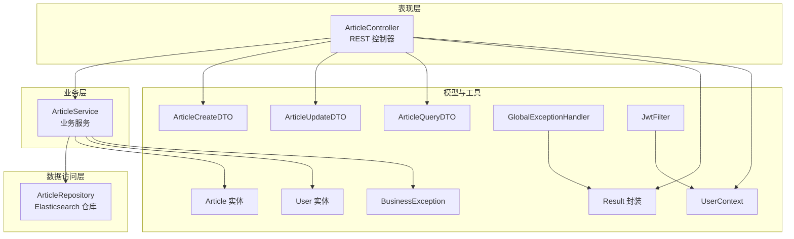
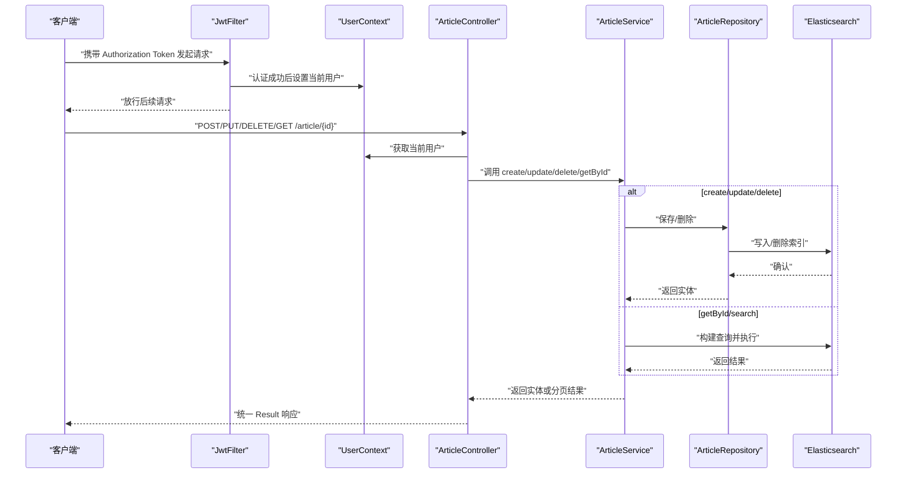
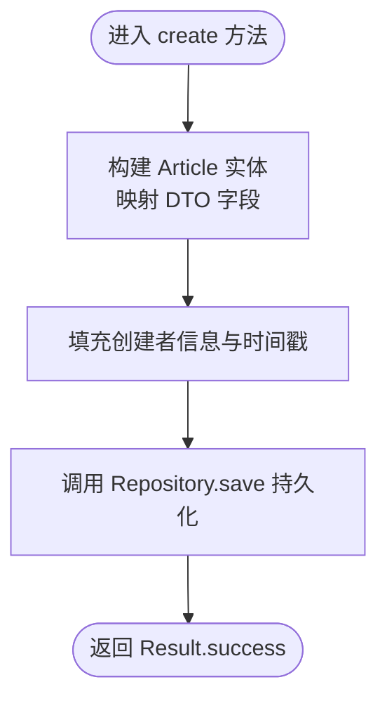
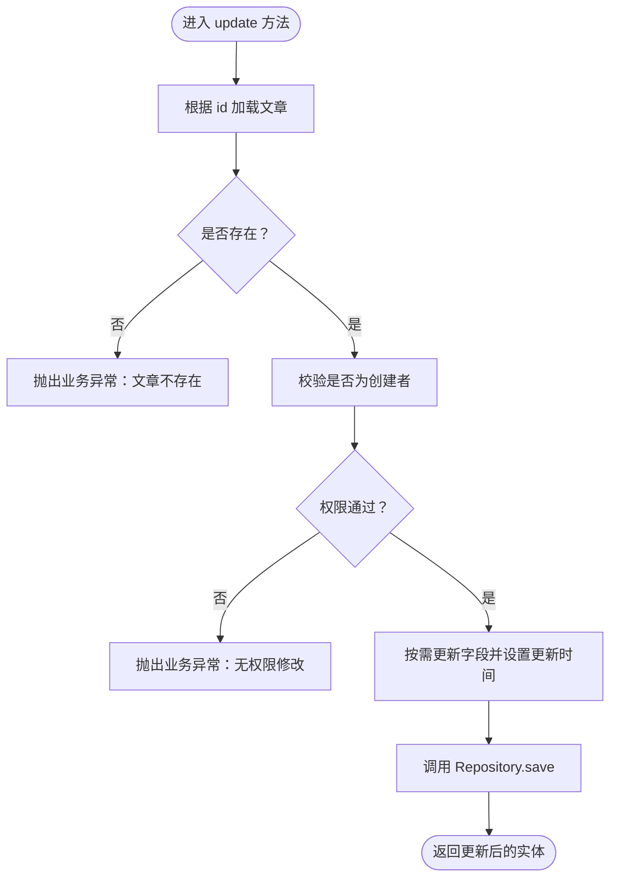
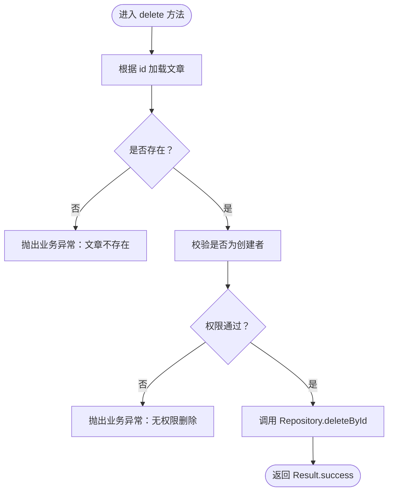
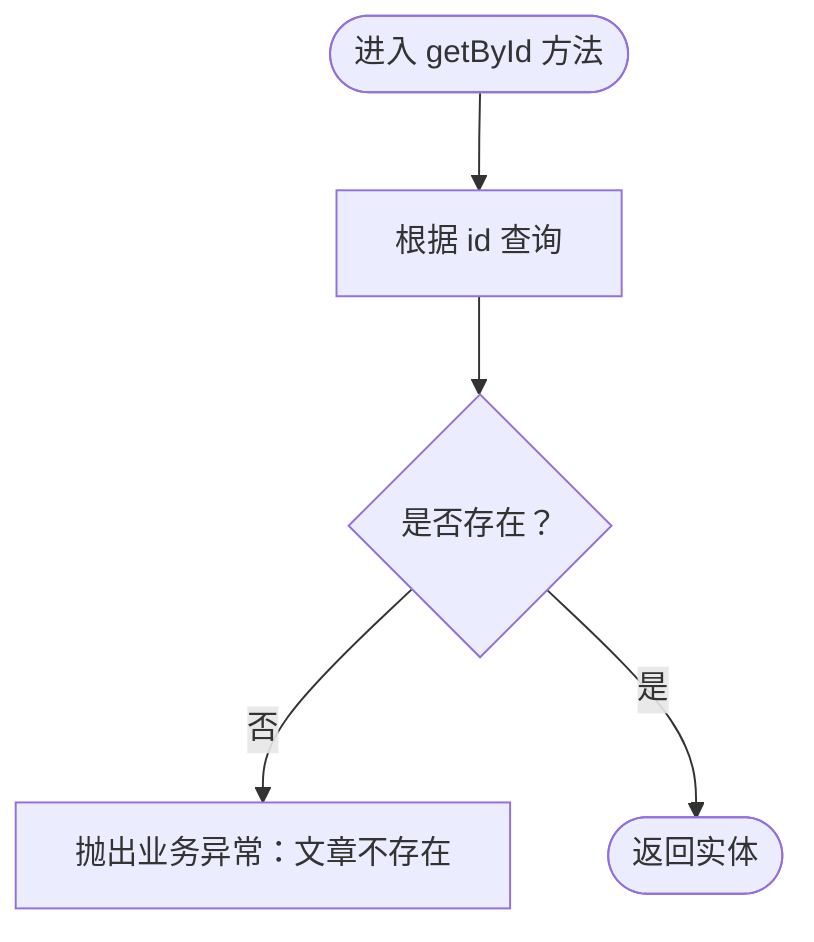
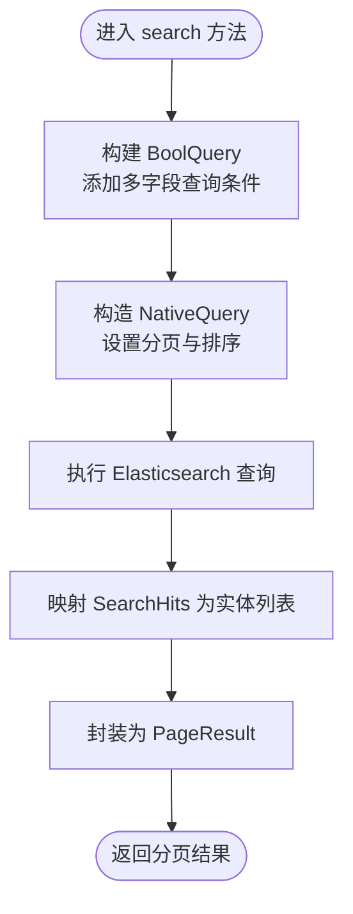
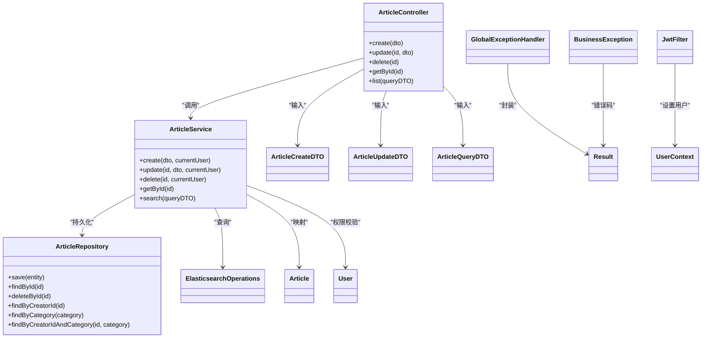

# 文章CRUD操作

<cite>
**本文引用的文件**
- [ArticleController.java](file://src/main/java/com/zhishilu/controller/ArticleController.java)
- [ArticleService.java](file://src/main/java/com/zhishilu/service/ArticleService.java)
- [ArticleRepository.java](file://src/main/java/com/zhishilu/repository/ArticleRepository.java)
- [ArticleCreateDTO.java](file://src/main/java/com/zhishilu/dto/ArticleCreateDTO.java)
- [ArticleUpdateDTO.java](file://src/main/java/com/zhishilu/dto/ArticleUpdateDTO.java)
- [ArticleQueryDTO.java](file://src/main/java/com/zhishilu/dto/ArticleQueryDTO.java)
- [Article.java](file://src/main/java/com/zhishilu/entity/Article.java)
- [User.java](file://src/main/java/com/zhishilu/entity/User.java)
- [Result.java](file://src/main/java/com/zhishilu/common/Result.java)
- [BusinessException.java](file://src/main/java/com/zhishilu/exception/BusinessException.java)
- [GlobalExceptionHandler.java](file://src/main/java/com/zhishilu/exception/GlobalExceptionHandler.java)
- [UserContext.java](file://src/main/java/com/zhishilu/util/UserContext.java)
- [JwtFilter.java](file://src/main/java/com/zhishilu/shiro/JwtFilter.java)
- [application.yml](file://src/main/resources/application.yml)
</cite>

## 目录
1. [简介](#简介)
2. [项目结构](#项目结构)
3. [核心组件](#核心组件)
4. [架构总览](#架构总览)
5. [详细组件分析](#详细组件分析)
6. [依赖关系分析](#依赖关系分析)
7. [性能考虑](#性能考虑)
8. [故障排除指南](#故障排除指南)
9. [结论](#结论)

## 简介
本文件面向“文章CRUD操作”的完整实现，围绕 create、update、delete、getById 四个核心方法进行深入解析。内容涵盖：
- 数据验证规则与权限检查机制
- DTO 到 Entity 的转换流程与字段映射
- 异常处理策略与全局异常拦截
- 与 ArticleRepository 的交互方式及 Elasticsearch 查询实现
- 典型使用场景与异常处理示例（如权限验证失败、数据不存在）

## 项目结构
该模块采用分层架构：Controller 负责 HTTP 请求入口与统一响应封装；Service 层负责业务逻辑与权限校验；Repository 层基于 Spring Data Elasticsearch 进行持久化；DTO/Entity 定义数据模型与约束；Shiro/JWT 提供认证与鉴权。

图表来源
- [ArticleController.java](file://src/main/java/com/zhishilu/controller/ArticleController.java#L22-L87)
- [ArticleService.java](file://src/main/java/com/zhishilu/service/ArticleService.java#L34-L199)
- [ArticleRepository.java](file://src/main/java/com/zhishilu/repository/ArticleRepository.java#L12-L29)
- [ArticleCreateDTO.java](file://src/main/java/com/zhishilu/dto/ArticleCreateDTO.java#L12-L31)
- [ArticleUpdateDTO.java](file://src/main/java/com/zhishilu/dto/ArticleUpdateDTO.java#L11-L23)
- [ArticleQueryDTO.java](file://src/main/java/com/zhishilu/dto/ArticleQueryDTO.java#L8-L45)
- [Article.java](file://src/main/java/com/zhishilu/entity/Article.java#L14-L80)
- [User.java](file://src/main/java/com/zhishilu/entity/User.java#L13-L67)
- [Result.java](file://src/main/java/com/zhishilu/common/Result.java#L8-L70)
- [BusinessException.java](file://src/main/java/com/zhishilu/exception/BusinessException.java#L8-L22)
- [GlobalExceptionHandler.java](file://src/main/java/com/zhishilu/exception/GlobalExceptionHandler.java#L20-L86)
- [UserContext.java](file://src/main/java/com/zhishilu/util/UserContext.java#L8-L32)
- [JwtFilter.java](file://src/main/java/com/zhishilu/shiro/JwtFilter.java#L27-L108)

章节来源
- [ArticleController.java](file://src/main/java/com/zhishilu/controller/ArticleController.java#L1-L88)
- [ArticleService.java](file://src/main/java/com/zhishilu/service/ArticleService.java#L1-L200)
- [ArticleRepository.java](file://src/main/java/com/zhishilu/repository/ArticleRepository.java#L1-L30)

## 核心组件
- ArticleController：提供 /article/{id} 的 CRUD 接口，负责接收请求、调用服务层、返回统一响应。
- ArticleService：实现业务逻辑，包含权限校验、DTO 到 Entity 的映射、Elasticsearch 查询与分页。
- ArticleRepository：基于 Spring Data Elasticsearch 的仓库接口，提供基础查询能力。
- DTO/Entity：定义输入输出的数据结构与约束，确保数据一致性与可搜索性。
- 异常体系：BusinessException 用于业务错误，GlobalExceptionHandler 统一封装异常响应。
- 认证与上下文：JwtFilter 通过 JWT 完成认证，UserContext 存储当前用户信息。

章节来源
- [ArticleController.java](file://src/main/java/com/zhishilu/controller/ArticleController.java#L22-L87)
- [ArticleService.java](file://src/main/java/com/zhishilu/service/ArticleService.java#L34-L199)
- [ArticleRepository.java](file://src/main/java/com/zhishilu/repository/ArticleRepository.java#L12-L29)
- [ArticleCreateDTO.java](file://src/main/java/com/zhishilu/dto/ArticleCreateDTO.java#L12-L31)
- [ArticleUpdateDTO.java](file://src/main/java/com/zhishilu/dto/ArticleUpdateDTO.java#L11-L23)
- [ArticleQueryDTO.java](file://src/main/java/com/zhishilu/dto/ArticleQueryDTO.java#L8-L45)
- [Article.java](file://src/main/java/com/zhishilu/entity/Article.java#L14-L80)
- [User.java](file://src/main/java/com/zhishilu/entity/User.java#L13-L67)
- [Result.java](file://src/main/java/com/zhishilu/common/Result.java#L8-L70)
- [BusinessException.java](file://src/main/java/com/zhishilu/exception/BusinessException.java#L8-L22)
- [GlobalExceptionHandler.java](file://src/main/java/com/zhishilu/exception/GlobalExceptionHandler.java#L20-L86)
- [UserContext.java](file://src/main/java/com/zhishilu/util/UserContext.java#L8-L32)
- [JwtFilter.java](file://src/main/java/com/zhishilu/shiro/JwtFilter.java#L27-L108)

## 架构总览
下图展示从 HTTP 请求到数据库查询的端到端流程，包括权限校验、DTO 映射、Elasticsearch 查询与统一响应封装。

图表来源
- [JwtFilter.java](file://src/main/java/com/zhishilu/shiro/JwtFilter.java#L69-L75)
- [UserContext.java](file://src/main/java/com/zhishilu/util/UserContext.java#L15-L24)
- [ArticleController.java](file://src/main/java/com/zhishilu/controller/ArticleController.java#L32-L66)
- [ArticleService.java](file://src/main/java/com/zhishilu/service/ArticleService.java#L45-L111)
- [ArticleRepository.java](file://src/main/java/com/zhishilu/repository/ArticleRepository.java#L13-L29)

## 详细组件分析

### 1. 创建文章（create）
- 输入：ArticleCreateDTO（含标题、类别、内容、URL、图片、地点等）
- 校验规则：
  - 标题非空且不超过 64 字符
  - 类别非空且不超过 32 字符
  - URL 不超过 64 字符
- 权限与上下文：通过 UserContext 获取当前用户，填充创建者信息（用户名、ID）与时间戳
- 映射与保存：将 DTO 字段映射到 Article 实体，调用 ArticleRepository.save 持久化
- 返回：Result.success 包裹新创建的文章

图表来源
- [ArticleService.java](file://src/main/java/com/zhishilu/service/ArticleService.java#L45-L59)
- [ArticleCreateDTO.java](file://src/main/java/com/zhishilu/dto/ArticleCreateDTO.java#L15-L31)
- [Article.java](file://src/main/java/com/zhishilu/entity/Article.java#L18-L79)

章节来源
- [ArticleController.java](file://src/main/java/com/zhishilu/controller/ArticleController.java#L32-L37)
- [ArticleService.java](file://src/main/java/com/zhishilu/service/ArticleService.java#L45-L59)
- [ArticleCreateDTO.java](file://src/main/java/com/zhishilu/dto/ArticleCreateDTO.java#L12-L31)
- [Article.java](file://src/main/java/com/zhishilu/entity/Article.java#L14-L80)

### 2. 更新文章（update）
- 输入：路径参数 id + ArticleUpdateDTO（标题、内容、URL、图片等）
- 校验规则：
  - 标题不超过 64 字符
  - URL 不超过 64 字符
- 权限检查：仅创建者可修改，否则抛出业务异常（403）
- 数据更新：按需更新字段，统一更新时间戳
- 保存与返回：调用 Repository.save 并返回更新后的实体

图表来源
- [ArticleService.java](file://src/main/java/com/zhishilu/service/ArticleService.java#L64-L88)
- [ArticleUpdateDTO.java](file://src/main/java/com/zhishilu/dto/ArticleUpdateDTO.java#L14-L23)

章节来源
- [ArticleController.java](file://src/main/java/com/zhishilu/controller/ArticleController.java#L42-L47)
- [ArticleService.java](file://src/main/java/com/zhishilu/service/ArticleService.java#L64-L88)
- [ArticleUpdateDTO.java](file://src/main/java/com/zhishilu/dto/ArticleUpdateDTO.java#L11-L23)

### 3. 删除文章（delete）
- 输入：路径参数 id
- 权限检查：仅创建者可删除，否则抛出业务异常（403）
- 删除：根据 id 删除对应文档

图表来源
- [ArticleService.java](file://src/main/java/com/zhishilu/service/ArticleService.java#L93-L103)

章节来源
- [ArticleController.java](file://src/main/java/com/zhishilu/controller/ArticleController.java#L52-L57)
- [ArticleService.java](file://src/main/java/com/zhishilu/service/ArticleService.java#L93-L103)

### 4. 获取文章详情（getById）
- 输入：路径参数 id
- 行为：根据 id 查询文章，不存在则抛出业务异常

图表来源
- [ArticleService.java](file://src/main/java/com/zhishilu/service/ArticleService.java#L108-L111)

章节来源
- [ArticleController.java](file://src/main/java/com/zhishilu/controller/ArticleController.java#L62-L66)
- [ArticleService.java](file://src/main/java/com/zhishilu/service/ArticleService.java#L108-L111)

### 5. DTO 到 Entity 的转换与字段映射
- ArticleCreateDTO → Article：标题、类别、内容、URL、图片、地点、创建者信息、时间戳
- ArticleUpdateDTO → Article：标题、内容、URL、图片（按需更新），统一更新时间戳
- Article 实体字段映射：标题、类别、内容、URL、图片、创建者用户名/ID、地点、创建/更新时间

章节来源
- [ArticleCreateDTO.java](file://src/main/java/com/zhishilu/dto/ArticleCreateDTO.java#L12-L31)
- [ArticleUpdateDTO.java](file://src/main/java/com/zhishilu/dto/ArticleUpdateDTO.java#L11-L23)
- [Article.java](file://src/main/java/com/zhishilu/entity/Article.java#L14-L80)

### 6. 权限检查机制
- 当前用户来自 UserContext（由 JwtFilter 在认证成功后注入）
- 所有修改/删除操作均校验文章的 creatorId 是否等于当前用户 ID
- 不匹配时抛出业务异常（403）

章节来源
- [JwtFilter.java](file://src/main/java/com/zhishilu/shiro/JwtFilter.java#L70-L75)
- [UserContext.java](file://src/main/java/com/zhishilu/util/UserContext.java#L15-L24)
- [ArticleService.java](file://src/main/java/com/zhishilu/service/ArticleService.java#L68-L71)
- [ArticleService.java](file://src/main/java/com/zhishilu/service/ArticleService.java#L97-L100)

### 7. 数据验证规则
- ArticleCreateDTO：
  - 标题：非空且长度 ≤ 64
  - 类别：非空且长度 ≤ 32
  - URL：长度 ≤ 64
- ArticleUpdateDTO：
  - 标题：长度 ≤ 64
  - URL：长度 ≤ 64
- 参数校验异常由全局异常处理器捕获并返回 400

章节来源
- [ArticleCreateDTO.java](file://src/main/java/com/zhishilu/dto/ArticleCreateDTO.java#L15-L26)
- [ArticleUpdateDTO.java](file://src/main/java/com/zhishilu/dto/ArticleUpdateDTO.java#L14-L20)
- [GlobalExceptionHandler.java](file://src/main/java/com/zhishilu/exception/GlobalExceptionHandler.java#L56-L75)

### 8. 与 ArticleRepository 的交互
- ArticleRepository 继承 ElasticsearchRepository，提供基础 CRUD 能力
- 支持自定义查询方法：按创建者 ID、类别、组合条件查询
- create/update/delete 直接调用 save/deleteById；getById 使用 findById

章节来源
- [ArticleRepository.java](file://src/main/java/com/zhishilu/repository/ArticleRepository.java#L12-L29)
- [ArticleService.java](file://src/main/java/com/zhishilu/service/ArticleService.java#L45-L59)
- [ArticleService.java](file://src/main/java/com/zhishilu/service/ArticleService.java#L64-L88)
- [ArticleService.java](file://src/main/java/com/zhishilu/service/ArticleService.java#L93-L103)
- [ArticleService.java](file://src/main/java/com/zhishilu/service/ArticleService.java#L108-L111)

### 9. Elasticsearch 查询与分页
- search 方法基于 BoolQuery 构建多字段查询（标题、类别、内容、用户名、地点）
- 使用 NativeQuery.withPageable 指定排序与分页
- 返回 PageResult 封装的分页结果

图表来源
- [ArticleService.java](file://src/main/java/com/zhishilu/service/ArticleService.java#L116-L168)
- [ArticleQueryDTO.java](file://src/main/java/com/zhishilu/dto/ArticleQueryDTO.java#L8-L45)

章节来源
- [ArticleService.java](file://src/main/java/com/zhishilu/service/ArticleService.java#L116-L168)
- [ArticleQueryDTO.java](file://src/main/java/com/zhishilu/dto/ArticleQueryDTO.java#L8-L45)

## 依赖关系分析
- 控制器依赖服务层，服务层依赖仓库与 ElasticsearchOperations
- DTO/Entity 作为数据契约被控制器与服务层共同使用
- 异常处理器统一处理业务异常、认证异常、授权异常与参数校验异常
- 认证链路通过 JwtFilter 注入 UserContext，供服务层进行权限判断

图表来源
- [ArticleController.java](file://src/main/java/com/zhishilu/controller/ArticleController.java#L22-L87)
- [ArticleService.java](file://src/main/java/com/zhishilu/service/ArticleService.java#L34-L199)
- [ArticleRepository.java](file://src/main/java/com/zhishilu/repository/ArticleRepository.java#L12-L29)
- [ArticleCreateDTO.java](file://src/main/java/com/zhishilu/dto/ArticleCreateDTO.java#L12-L31)
- [ArticleUpdateDTO.java](file://src/main/java/com/zhishilu/dto/ArticleUpdateDTO.java#L11-L23)
- [ArticleQueryDTO.java](file://src/main/java/com/zhishilu/dto/ArticleQueryDTO.java#L8-L45)
- [Article.java](file://src/main/java/com/zhishilu/entity/Article.java#L14-L80)
- [User.java](file://src/main/java/com/zhishilu/entity/User.java#L13-L67)
- [Result.java](file://src/main/java/com/zhishilu/common/Result.java#L8-L70)
- [BusinessException.java](file://src/main/java/com/zhishilu/exception/BusinessException.java#L8-L22)
- [GlobalExceptionHandler.java](file://src/main/java/com/zhishilu/exception/GlobalExceptionHandler.java#L20-L86)
- [UserContext.java](file://src/main/java/com/zhishilu/util/UserContext.java#L8-L32)
- [JwtFilter.java](file://src/main/java/com/zhishilu/shiro/JwtFilter.java#L27-L108)

章节来源
- [ArticleController.java](file://src/main/java/com/zhishilu/controller/ArticleController.java#L1-L88)
- [ArticleService.java](file://src/main/java/com/zhishilu/service/ArticleService.java#L1-L200)
- [ArticleRepository.java](file://src/main/java/com/zhishilu/repository/ArticleRepository.java#L1-L30)
- [GlobalExceptionHandler.java](file://src/main/java/com/zhishilu/exception/GlobalExceptionHandler.java#L1-L87)

## 性能考虑
- Elasticsearch 查询：使用 BoolQuery 组合多条件，避免全表扫描；分页使用倒序排序以提升最新内容检索效率
- DTO 映射：仅在必要字段上进行赋值，减少不必要的对象复制
- 认证链路：JWT 认证在过滤器阶段完成，避免重复校验
- 日志级别：开发环境开启 DEBUG，生产环境建议调整日志级别以降低开销

## 故障排除指南
- 权限验证失败（403）
  - 现象：更新/删除文章时报错“没有权限修改/删除此文章”
  - 原因：当前用户不是文章创建者
  - 处理：确认登录用户与文章 creatorId 一致
- 数据不存在（500）
  - 现象：更新/删除/查询单条文章时报错“文章不存在”
  - 原因：传入的 id 无效或记录已被删除
  - 处理：检查 id 是否正确，确认数据状态
- 参数校验失败（400）
  - 现象：提交 DTO 字段不满足约束导致校验失败
  - 原因：标题/类别/URL 等字段长度或格式不符合要求
  - 处理：根据错误提示修正字段长度或格式
- 未登录（401）
  - 现象：请求未携带有效 Token 或 Token 失效
  - 原因：JwtFilter 认证失败
  - 处理：重新登录获取 Token，确保 Header 中携带正确的 Authorization

章节来源
- [ArticleService.java](file://src/main/java/com/zhishilu/service/ArticleService.java#L68-L71)
- [ArticleService.java](file://src/main/java/com/zhishilu/service/ArticleService.java#L97-L100)
- [ArticleService.java](file://src/main/java/com/zhishilu/service/ArticleService.java#L108-L111)
- [GlobalExceptionHandler.java](file://src/main/java/com/zhishilu/exception/GlobalExceptionHandler.java#L56-L75)
- [JwtFilter.java](file://src/main/java/com/zhishilu/shiro/JwtFilter.java#L78-L85)

## 结论
本文档对文章 CRUD 的核心实现进行了全面拆解，覆盖了数据验证、权限控制、DTO/Entity 映射、Elasticsearch 查询与分页、异常处理与统一响应等关键环节。通过清晰的流程图与依赖关系图，读者可以快速理解各组件职责与协作方式，并据此进行扩展与维护。