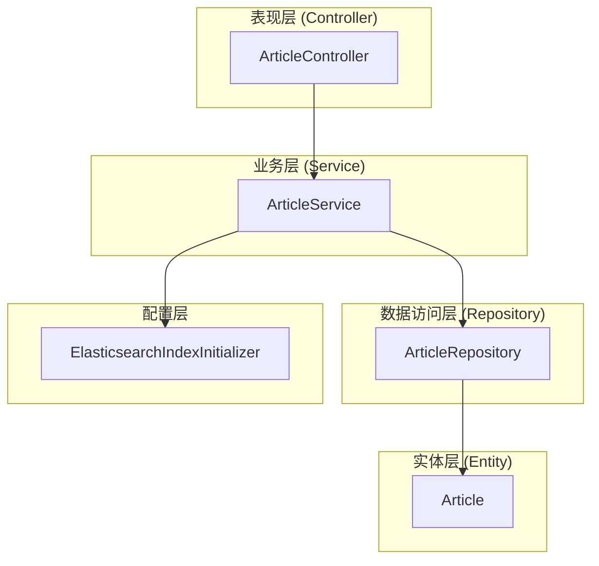
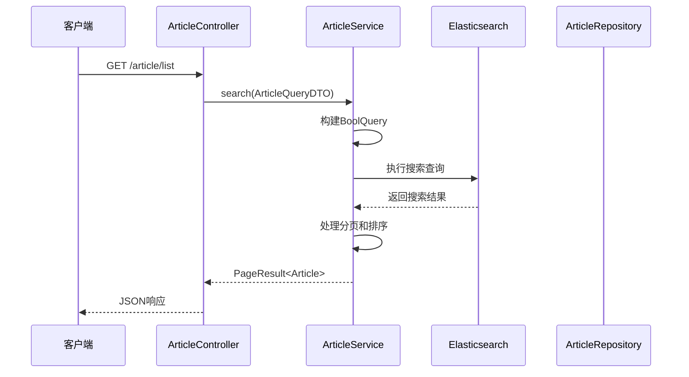
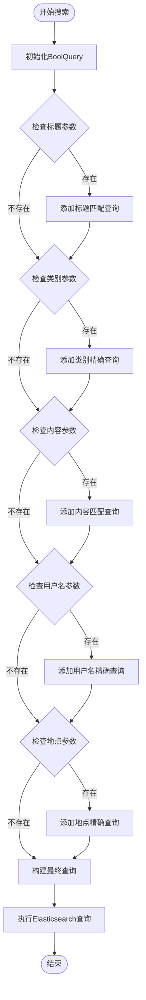
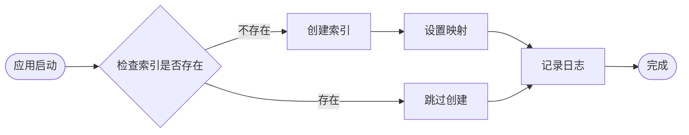
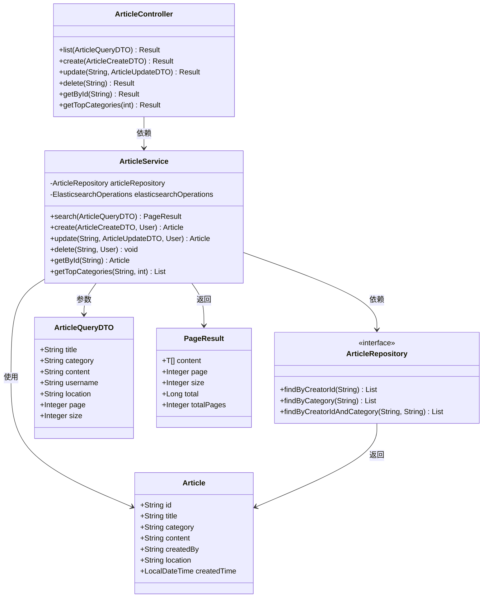

# 文章搜索功能

<cite>
**本文档引用的文件**
- [ArticleQueryDTO.java](file://src/main/java/com/zhishilu/dto/ArticleQueryDTO.java)
- [ArticleService.java](file://src/main/java/com/zhishilu/service/ArticleService.java)
- [ArticleRepository.java](file://src/main/java/com/zhishilu/repository/ArticleRepository.java)
- [ArticleController.java](file://src/main/java/com/zhishilu/controller/ArticleController.java)
- [Article.java](file://src/main/java/com/zhishilu/entity/Article.java)
- [PageResult.java](file://src/main/java/com/zhishilu/common/PageResult.java)
- [ElasticsearchIndexInitializer.java](file://src/main/java/com/zhishilu/config/ElasticsearchIndexInitializer.java)
- [README.md](file://README.md)
- [pom.xml](file://pom.xml)
</cite>

## 目录
1. [简介](#简介)
2. [项目结构](#项目结构)
3. [核心组件](#核心组件)
4. [架构概览](#架构概览)
5. [详细组件分析](#详细组件分析)
6. [依赖关系分析](#依赖关系分析)
7. [性能考虑](#性能考虑)
8. [故障排除指南](#故障排除指南)
9. [结论](#结论)

## 简介

知拾录是一个基于Spring Boot和Elasticsearch的个人知识收藏管理系统。本文档详细说明了文章搜索功能的完整实现，包括多条件组合查询、模糊匹配、精确匹配等不同查询类型的实现逻辑，以及Elasticsearch查询构建过程的技术细节。

该系统支持以下核心搜索功能：
- 标题模糊查询（使用IK分词器进行中文分词）
- 类别精确查询（Keyword字段的精确匹配）
- 正文全文搜索（支持中文分词和模糊匹配）
- 用户名过滤（创建者用户名精确匹配）
- 地点过滤（地理位置精确匹配）
- 分页查询和排序规则

## 项目结构

项目采用标准的Spring Boot三层架构设计，包含以下主要模块：

**图表来源**
- [ArticleController.java](file://src/main/java/com/zhishilu/controller/ArticleController.java#L22-L88)
- [ArticleService.java](file://src/main/java/com/zhishilu/service/ArticleService.java#L34-L200)
- [ArticleRepository.java](file://src/main/java/com/zhishilu/repository/ArticleRepository.java#L12-L30)
- [Article.java](file://src/main/java/com/zhishilu/entity/Article.java#L14-L81)

**章节来源**
- [README.md](file://README.md#L1-L133)
- [pom.xml](file://pom.xml#L1-L129)

## 核心组件

### 查询数据传输对象 (ArticleQueryDTO)

ArticleQueryDTO是文章搜索功能的核心数据传输对象，定义了所有可用的查询参数：

| 字段名 | 类型 | 描述 | 默认值 |
|--------|------|------|--------|
| title | String | 标题搜索关键字 | null |
| category | String | 类别过滤条件 | null |
| content | String | 正文搜索关键字 | null |
| username | String | 创建者用户名 | null |
| location | String | 地点过滤条件 | null |
| page | Integer | 页码（从0开始） | 0 |
| size | Integer | 每页大小 | 10 |

### 搜索服务实现 (ArticleService.search)

搜索方法实现了复杂的多条件组合查询逻辑，使用Elasticsearch的BoolQuery构建器来组合多个查询条件。

**章节来源**
- [ArticleQueryDTO.java](file://src/main/java/com/zhishilu/dto/ArticleQueryDTO.java#L9-L45)
- [ArticleService.java](file://src/main/java/com/zhishilu/service/ArticleService.java#L116-L168)

## 架构概览

文章搜索功能采用经典的MVC架构模式，通过RESTful API提供服务：

**图表来源**
- [ArticleController.java](file://src/main/java/com/zhishilu/controller/ArticleController.java#L71-L75)
- [ArticleService.java](file://src/main/java/com/zhishilu/service/ArticleService.java#L116-L168)

## 详细组件分析

### Elasticsearch查询构建过程

#### BoolQuery组合逻辑

ArticleService.search方法使用Elasticsearch的BoolQuery构建器来组合多个查询条件。BoolQuery支持多种组合操作符：

- `must`: 所有条件都必须满足（AND逻辑）
- `should`: 至少满足一个条件（OR逻辑）
- `must_not`: 条件不满足（NOT逻辑）

**图表来源**
- [ArticleService.java](file://src/main/java/com/zhishilu/service/ArticleService.java#L117-L158)

#### 查询类型详解

##### 标题模糊查询 (Match Query)
- 使用`match`查询实现标题的模糊匹配
- 采用IK分词器进行中文分词处理
- 支持部分关键词匹配和语义相似度查询

##### 类别精确查询 (Term Query)
- 使用`term`查询实现类别字段的精确匹配
- 适用于Keyword类型的字段查询
- 不进行分词处理，确保完全匹配

##### 内容模糊查询 (Match Query)
- 使用`match`查询实现正文内容的全文搜索
- 支持中文分词和多关键词检索
- 可以实现跨字段的联合搜索

##### 用户名过滤 (Term Query)
- 使用`term`查询按创建者用户名过滤
- 精确匹配创建者标识
- 支持用户特定内容的检索

##### 地点过滤 (Term Query)
- 使用`term`查询按地理位置精确匹配
- 支持按地点分类的内容检索
- 适用于地理位置相关的知识管理

**章节来源**
- [ArticleService.java](file://src/main/java/com/zhishilu/service/ArticleService.java#L119-L152)

### 分页查询实现

系统实现了完整的分页查询机制，支持大数据量的高效检索：

#### 分页参数处理
- `page`: 页码，从0开始计数
- `size`: 每页记录数，默认10条
- `sort`: 排序规则，按创建时间降序排列

#### 分页结果封装
PageResult类提供了统一的分页结果封装：

| 字段名 | 类型 | 描述 |
|--------|------|------|
| content | List<T> | 当前页的数据列表 |
| page | Integer | 当前页码 |
| size | Integer | 每页大小 |
| total | Long | 总记录数 |
| totalPages | Integer | 总页数 |

**章节来源**
- [ArticleService.java](file://src/main/java/com/zhishilu/service/ArticleService.java#L154-L168)
- [PageResult.java](file://src/main/java/com/zhishilu/common/PageResult.java#L15-L51)

### 排序规则

系统默认按照创建时间进行排序，确保最新的内容优先显示：

- 排序列：`createdTime`
- 排序方向：降序（DESC）
- 作用：新创建的文章排在前面

这种排序策略符合知识管理系统的使用习惯，用户通常希望看到最新的收藏内容。

### 查询性能优化

#### 字段映射优化
Article实体类的字段映射经过精心设计以优化查询性能：

| 字段名 | 映射类型 | 分析器 | 用途 |
|--------|----------|--------|------|
| title | Text | ik_max_word/ik_smart | 标题全文搜索 |
| category | Keyword | - | 精确类别匹配 |
| content | Text | ik_max_word/ik_smart | 正文全文搜索 |
| createdBy | Keyword | - | 用户名精确匹配 |
| location | Keyword | - | 地点精确匹配 |
| createdTime | Date | - | 时间排序 |

#### 索引初始化
系统启动时自动创建和初始化Elasticsearch索引：

**图表来源**
- [ElasticsearchIndexInitializer.java](file://src/main/java/com/zhishilu/config/ElasticsearchIndexInitializer.java#L24-L38)

**章节来源**
- [Article.java](file://src/main/java/com/zhishilu/entity/Article.java#L24-L79)
- [ElasticsearchIndexInitializer.java](file://src/main/java/com/zhishilu/config/ElasticsearchIndexInitializer.java#L19-L39)

## 依赖关系分析

### 组件依赖图

**图表来源**
- [ArticleController.java](file://src/main/java/com/zhishilu/controller/ArticleController.java#L25-L88)
- [ArticleService.java](file://src/main/java/com/zhishilu/service/ArticleService.java#L34-L200)
- [ArticleRepository.java](file://src/main/java/com/zhishilu/repository/ArticleRepository.java#L12-L30)
- [Article.java](file://src/main/java/com/zhishilu/entity/Article.java#L16-L81)
- [ArticleQueryDTO.java](file://src/main/java/com/zhishilu/dto/ArticleQueryDTO.java#L9-L45)
- [PageResult.java](file://src/main/java/com/zhishilu/common/PageResult.java#L15-L51)

### 外部依赖

系统依赖以下关键外部组件：

| 依赖项 | 版本 | 用途 |
|--------|------|------|
| Spring Boot Starter Data Elasticsearch | 3.2.1 | Elasticsearch集成 |
| Elasticsearch Java Client | 8.11.3 | Elasticsearch客户端 |
| Apache Shiro | 1.13.0 | 认证授权框架 |
| JWT | 0.12.3 | 令牌认证 |
| Lombok | - | 代码简化 |
| IK Analyzer | - | 中文分词 |

**章节来源**
- [pom.xml](file://pom.xml#L21-L88)

## 性能考虑

### 查询性能优化策略

1. **字段类型选择**
   - 使用Keyword类型存储需要精确匹配的字段
   - 使用Text类型配合IK分词器处理全文搜索
   - 合理选择字段类型以平衡查询性能和功能需求

2. **分页查询优化**
   - 限制每页查询数量，避免大数据量一次性返回
   - 使用游标分页或深度分页策略
   - 合理设置查询超时时间

3. **缓存策略**
   - 对热门查询结果进行缓存
   - 缓存用户最常用的搜索条件
   - 实现查询结果的智能缓存失效

4. **索引优化**
   - 合理设置分片和副本数量
   - 定期优化索引性能
   - 监控查询性能指标

### Elasticsearch配置优化

系统使用单分片配置以简化部署，但在生产环境中建议根据数据量调整分片数量：

- **分片数量**: 根据数据量和查询负载调整
- **副本数量**: 提高查询并发能力和数据冗余
- **刷新间隔**: 平衡写入性能和查询实时性

## 故障排除指南

### 常见问题及解决方案

#### 1. Elasticsearch连接失败
**症状**: 应用启动时报连接错误
**原因**: Elasticsearch服务器不可达或认证失败
**解决方案**: 
- 检查application.yml中的ES配置
- 确认Elasticsearch服务正常运行
- 验证用户名密码配置

#### 2. 索引创建失败
**症状**: 启动时索引创建异常
**原因**: 权限不足或索引名称冲突
**解决方案**:
- 检查Elasticsearch用户权限
- 确认索引名称唯一性
- 查看Elasticsearch日志获取详细错误信息

#### 3. 查询结果为空
**症状**: 搜索无结果返回
**原因**: 查询参数格式错误或数据未索引
**解决方案**:
- 验证查询参数格式
- 检查数据是否正确索引
- 使用Elasticsearch Head插件验证索引状态

#### 4. 性能问题
**症状**: 查询响应缓慢
**原因**: 索引过大或查询复杂度过高
**解决方案**:
- 优化查询条件组合
- 调整分片和副本配置
- 实施查询缓存策略

### 调试技巧

1. **启用Elasticsearch日志**
   - 在application.yml中设置日志级别
   - 监控查询执行时间和返回结果

2. **使用Kibana进行调试**
   - 通过Kibana查看索引状态
   - 分析查询性能指标
   - 验证数据映射配置

3. **监控系统资源**
   - 监控Elasticsearch集群健康状态
   - 跟踪查询吞吐量和延迟
   - 分析内存和CPU使用情况

**章节来源**
- [ElasticsearchIndexInitializer.java](file://src/main/java/com/zhishilu/config/ElasticsearchIndexInitializer.java#L24-L38)

## 结论

文章搜索功能通过精心设计的Elasticsearch查询构建和Spring Boot架构实现了高效的多条件组合查询。系统的主要优势包括：

1. **灵活的查询能力**: 支持多种查询类型和组合查询
2. **高性能的搜索**: 通过合理的字段映射和索引配置优化查询性能
3. **良好的扩展性**: 模块化设计便于功能扩展和维护
4. **完善的错误处理**: 提供完整的异常处理和故障排除机制

该实现为个人知识管理系统提供了强大的内容检索能力，能够有效支持大规模知识内容的管理和快速查找。通过持续的性能优化和功能扩展，该系统可以满足不断增长的知识管理需求。