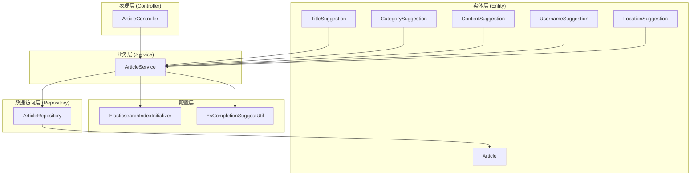
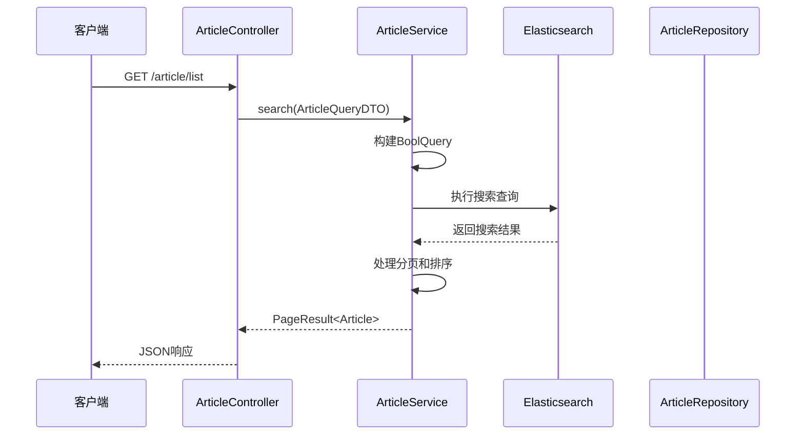
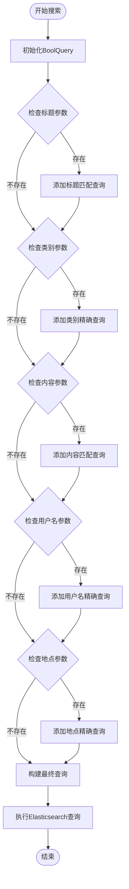
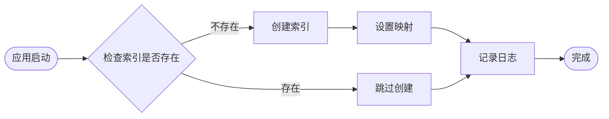
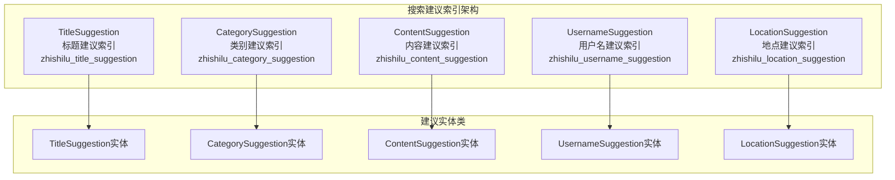
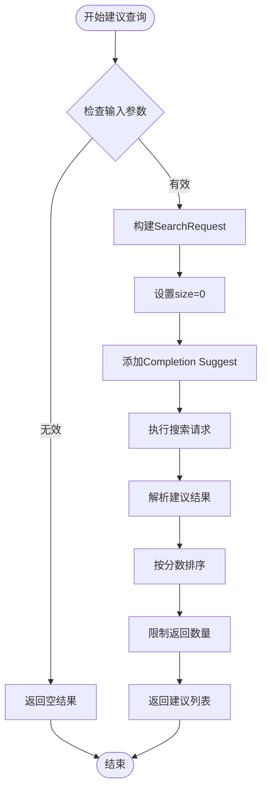
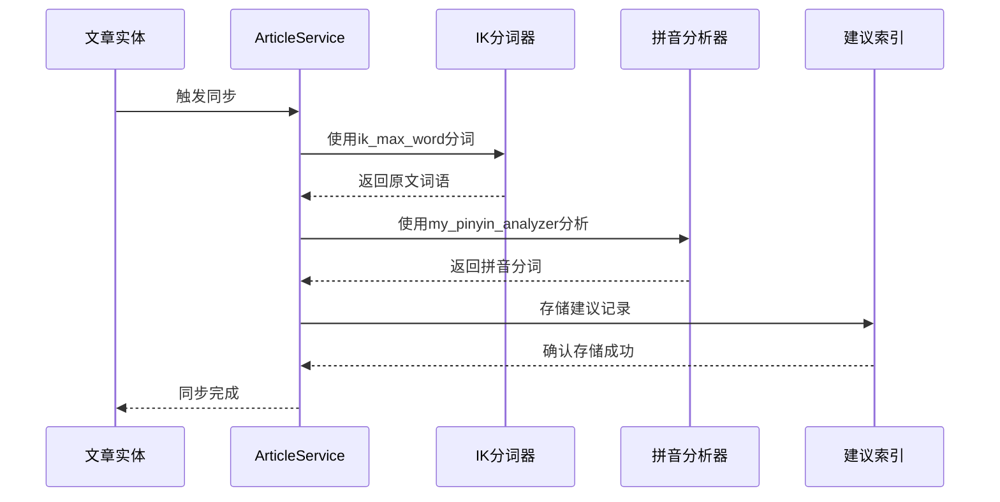
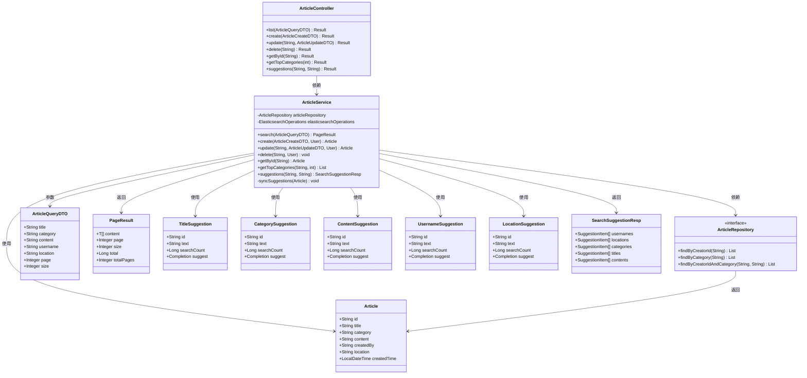

# 文章搜索功能

<cite>
**本文档引用的文件**
- [ArticleQueryDTO.java](file://src/main/java/com/zhishilu/dto/ArticleQueryDTO.java)
- [ArticleService.java](file://src/main/java/com/zhishilu/service/ArticleService.java)
- [ArticleRepository.java](file://src/main/java/com/zhishilu/repository/ArticleRepository.java)
- [ArticleController.java](file://src/main/java/com/zhishilu/controller/ArticleController.java)
- [Article.java](file://src/main/java/com/zhishilu/entity/Article.java)
- [PageResult.java](file://src/main/java/com/zhishilu/common/PageResult.java)
- [ElasticsearchIndexInitializer.java](file://src/main/java/com/zhishilu/config/ElasticsearchIndexInitializer.java)
- [TitleSuggestion.java](file://src/main/java/com/zhishilu/entity/TitleSuggestion.java)
- [CategorySuggestion.java](file://src/main/java/com/zhishilu/entity/CategorySuggestion.java)
- [ContentSuggestion.java](file://src/main/java/com/zhishilu/entity/ContentSuggestion.java)
- [UsernameSuggestion.java](file://src/main/java/com/zhishilu/entity/UsernameSuggestion.java)
- [LocationSuggestion.java](file://src/main/java/com/zhishilu/entity/LocationSuggestion.java)
- [SearchSuggestionResp.java](file://src/main/java/com/zhishilu/resp/SearchSuggestionResp.java)
- [EsCompletionSuggestUtil.java](file://src/main/java/com/zhishilu/util/EsCompletionSuggestUtil.java)
- [title-suggestion-mapping.json](file://src/main/resources/title-suggestion-mapping.json)
- [category-suggestion-mapping.json](file://src/main/resources/category-suggestion-mapping.json)
- [suggestion-settings.json](file://src/main/resources/suggestion-settings.json)
- [README.md](file://README.md)
- [pom.xml](file://pom.xml)
</cite>

## 目录
1. [简介](#简介)
2. [项目结构](#项目结构)
3. [核心组件](#核心组件)
4. [架构概览](#架构概览)
5. [详细组件分析](#详细组件分析)
6. [搜索建议系统](#搜索建议系统)
7. [依赖关系分析](#依赖关系分析)
8. [性能考虑](#性能考虑)
9. [故障排除指南](#故障排除指南)
10. [结论](#结论)

## 简介

知拾录是一个基于Spring Boot和Elasticsearch的个人知识收藏管理系统。本文档详细说明了文章搜索功能的完整实现，包括多条件组合查询、模糊匹配、精确匹配等不同查询类型的实现逻辑，以及Elasticsearch查询构建过程的技术细节。

**更新** 系统现已重构为多实体、多索引架构的搜索建议系统，支持更精细的搜索补全功能。

该系统支持以下核心搜索功能：
- 标题模糊查询（使用IK分词器进行中文分词）
- 类别精确查询（Keyword字段的精确匹配）
- 正文全文搜索（支持中文分词和模糊匹配）
- 用户名过滤（创建者用户名精确匹配）
- 地点过滤（地理位置精确匹配）
- 分页查询和排序规则
- **新增** 智能搜索建议（多实体架构）

## 项目结构

项目采用标准的Spring Boot三层架构设计，包含以下主要模块：


```mermaid
graph TB
subgraph "表现层 (Controller)"
AC[ArticleController]
end
subgraph "业务层 (Service)"
AS[ArticleService]
end
subgraph "数据访问层 (Repository)"
AR[ArticleRepository]
end
subgraph "实体层 (Entity)"
AE[Article]
TS[TitleSuggestion]
CS[CategorySuggestion]
PS[ContentSuggestion]
US[UsernameSuggestion]
LS[LocationSuggestion]
end
subgraph "配置层"
EI[ElasticsearchIndexInitializer]
ESS[EsCompletionSuggestUtil]
end
AC --> AS
AS --> AR
AR --> AE
AS --> EI
AS --> ESS
TS --> AS
CS --> AS
PS --> AS
US --> AS
LS --> AS
```

**图表来源**
- [ArticleController.java](file://src/main/java/com/zhishilu/controller/ArticleController.java#L22-L88)
- [ArticleService.java](file://src/main/java/com/zhishilu/service/ArticleService.java#L34-L200)
- [ArticleRepository.java](file://src/main/java/com/zhishilu/repository/ArticleRepository.java#L12-L30)
- [Article.java](file://src/main/java/com/zhishilu/entity/Article.java#L14-L81)
- [TitleSuggestion.java](file://src/main/java/com/zhishilu/entity/TitleSuggestion.java#L15-L51)
- [CategorySuggestion.java](file://src/main/java/com/zhishilu/entity/CategorySuggestion.java#L15-L48)
- [ContentSuggestion.java](file://src/main/java/com/zhishilu/entity/ContentSuggestion.java#L15-L49)
- [UsernameSuggestion.java](file://src/main/java/com/zhishilu/entity/UsernameSuggestion.java#L15-L49)
- [LocationSuggestion.java](file://src/main/java/com/zhishilu/entity/LocationSuggestion.java#L15-L49)

**章节来源**
- [README.md](file://README.md#L1-L133)
- [pom.xml](file://pom.xml#L1-L129)

## 核心组件

### 查询数据传输对象 (ArticleQueryDTO)

ArticleQueryDTO是文章搜索功能的核心数据传输对象，定义了所有可用的查询参数：

| 字段名 | 类型 | 描述 | 默认值 |
|--------|------|------|--------|
| title | String | 标题搜索关键字 | null |
| category | String | 类别过滤条件 | null |
| content | String | 正文搜索关键字 | null |
| username | String | 创建者用户名 | null |
| location | String | 地点过滤条件 | null |
| page | Integer | 页码（从0开始） | 0 |
| size | Integer | 每页大小 | 10 |

### 搜索服务实现 (ArticleService.search)

搜索方法实现了复杂的多条件组合查询逻辑，使用Elasticsearch的BoolQuery构建器来组合多个查询条件。

**章节来源**
- [ArticleQueryDTO.java](file://src/main/java/com/zhishilu/dto/ArticleQueryDTO.java#L9-L45)
- [ArticleService.java](file://src/main/java/com/zhishilu/service/ArticleService.java#L116-L168)

## 架构概览

文章搜索功能采用经典的MVC架构模式，通过RESTful API提供服务：


```mermaid
sequenceDiagram
participant Client as 客户端
participant Controller as ArticleController
participant Service as ArticleService
participant ES as Elasticsearch
participant Repo as ArticleRepository
Client->>Controller : GET /article/list
Controller->>Service : search(ArticleQueryDTO)
Service->>Service : 构建BoolQuery
Service->>ES : 执行搜索查询
ES-->>Service : 返回搜索结果
Service->>Service : 处理分页和排序
Service-->>Controller : PageResult<Article>
Controller-->>Client : JSON响应
```

**图表来源**
- [ArticleController.java](file://src/main/java/com/zhishilu/controller/ArticleController.java#L71-L75)
- [ArticleService.java](file://src/main/java/com/zhishilu/service/ArticleService.java#L116-L168)

## 详细组件分析

### Elasticsearch查询构建过程

#### BoolQuery组合逻辑

ArticleService.search方法使用Elasticsearch的BoolQuery构建器来组合多个查询条件。BoolQuery支持多种组合操作符：

- `must`: 所有条件都必须满足（AND逻辑）
- `should`: 至少满足一个条件（OR逻辑）
- `must_not`: 条件不满足（NOT逻辑）


```mermaid
flowchart TD
Start([开始搜索]) --> Init["初始化BoolQuery"]
Init --> CheckTitle{"检查标题参数"}
CheckTitle --> |存在| AddTitle["添加标题匹配查询"]
CheckTitle --> |不存在| CheckCategory{"检查类别参数"}
AddTitle --> CheckCategory
CheckCategory --> |存在| AddCategory["添加类别精确查询"]
CheckCategory --> |不存在| CheckContent{"检查内容参数"}
AddCategory --> CheckContent
CheckContent --> |存在| AddContent["添加内容匹配查询"]
CheckContent --> |不存在| CheckUsername{"检查用户名参数"}
AddContent --> CheckUsername
CheckUsername --> |存在| AddUsername["添加用户名精确查询"]
CheckUsername --> |不存在| CheckLocation{"检查地点参数"}
AddUsername --> CheckLocation
CheckLocation --> |存在| AddLocation["添加地点精确查询"]
CheckLocation --> |不存在| BuildQuery["构建最终查询"]
AddLocation --> BuildQuery
BuildQuery --> Execute["执行Elasticsearch查询"]
Execute --> End([结束])
```

**图表来源**
- [ArticleService.java](file://src/main/java/com/zhishilu/service/ArticleService.java#L117-L158)

#### 查询类型详解

##### 标题模糊查询 (Match Query)
- 使用`match`查询实现标题的模糊匹配
- 采用IK分词器进行中文分词处理
- 支持部分关键词匹配和语义相似度查询

##### 类别精确查询 (Term Query)
- 使用`term`查询实现类别字段的精确匹配
- 适用于Keyword类型的字段查询
- 不进行分词处理，确保完全匹配

##### 内容模糊查询 (Match Query)
- 使用`match`查询实现正文内容的全文搜索
- 支持中文分词和多关键词检索
- 可以实现跨字段的联合搜索

##### 用户名过滤 (Term Query)
- 使用`term`查询按创建者用户名过滤
- 精确匹配创建者标识
- 支持用户特定内容的检索

##### 地点过滤 (Term Query)
- 使用`term`查询按地理位置精确匹配
- 支持按地点分类的内容检索
- 适用于地理位置相关的知识管理

**章节来源**
- [ArticleService.java](file://src/main/java/com/zhishilu/service/ArticleService.java#L119-L152)

### 分页查询实现

系统实现了完整的分页查询机制，支持大数据量的高效检索：

#### 分页参数处理
- `page`: 页码，从0开始计数
- `size`: 每页记录数，默认10条
- `sort`: 排序规则，按创建时间降序排列

#### 分页结果封装
PageResult类提供了统一的分页结果封装：

| 字段名 | 类型 | 描述 |
|--------|------|------|
| content | List<T> | 当前页的数据列表 |
| page | Integer | 当前页码 |
| size | Integer | 每页大小 |
| total | Long | 总记录数 |
| totalPages | Integer | 总页数 |

**章节来源**
- [ArticleService.java](file://src/main/java/com/zhishilu/service/ArticleService.java#L154-L168)
- [PageResult.java](file://src/main/java/com/zhishilu/common/PageResult.java#L15-L51)

### 排序规则

系统默认按照创建时间进行排序，确保最新的内容优先显示：

- 排序列：`createdTime`
- 排序方向：降序（DESC）
- 作用：新创建的文章排在前面

这种排序策略符合知识管理系统的使用习惯，用户通常希望看到最新的收藏内容。

### 查询性能优化

#### 字段映射优化
Article实体类的字段映射经过精心设计以优化查询性能：

| 字段名 | 映射类型 | 分析器 | 用途 |
|--------|----------|--------|------|
| title | Text | ik_max_word/ik_smart | 标题全文搜索 |
| category | Keyword | - | 精确类别匹配 |
| content | Text | ik_max_word/ik_smart | 正文全文搜索 |
| createdBy | Keyword | - | 用户名精确匹配 |
| location | Keyword | - | 地点精确匹配 |
| createdTime | Date | - | 时间排序 |

#### 索引初始化
系统启动时自动创建和初始化Elasticsearch索引：


```mermaid
flowchart LR
Start([应用启动]) --> CheckIndex{"检查索引是否存在"}
CheckIndex --> |不存在| CreateIndex["创建索引"]
CheckIndex --> |存在| Skip["跳过创建"]
CreateIndex --> PutMapping["设置映射"]
PutMapping --> LogInfo["记录日志"]
Skip --> LogInfo
LogInfo --> End([完成])
```

**图表来源**
- [ElasticsearchIndexInitializer.java](file://src/main/java/com/zhishilu/config/ElasticsearchIndexInitializer.java#L24-L38)

**章节来源**
- [Article.java](file://src/main/java/com/zhishilu/entity/Article.java#L24-L79)
- [ElasticsearchIndexInitializer.java](file://src/main/java/com/zhishilu/config/ElasticsearchIndexInitializer.java#L19-L39)

## 搜索建议系统

**更新** 新增的多实体、多索引架构的搜索建议系统，提供更智能的搜索体验。

### 多实体架构设计

系统现在使用专门的搜索建议实体类，每个实体对应一个独立的索引：


```mermaid
graph TB
subgraph "搜索建议索引架构"
TS[TitleSuggestion<br/>标题建议索引<br/>zhishilu_title_suggestion]
CS[CategorySuggestion<br/>类别建议索引<br/>zhishilu_category_suggestion]
PS[ContentSuggestion<br/>内容建议索引<br/>zhishilu_content_suggestion]
US[UsernameSuggestion<br/>用户名建议索引<br/>zhishilu_username_suggestion]
LS[LocationSuggestion<br/>地点建议索引<br/>zhishilu_location_suggestion]
end
subgraph "建议实体类"
TE[TitleSuggestion实体]
CE[CategorySuggestion实体]
PE[ContentSuggestion实体]
UE[UsernameSuggestion实体]
LE[LocationSuggestion实体]
end
TS --> TE
CS --> CE
PS --> PE
US --> UE
LS --> LE
```

**图表来源**
- [TitleSuggestion.java](file://src/main/java/com/zhishilu/entity/TitleSuggestion.java#L15-L51)
- [CategorySuggestion.java](file://src/main/java/com/zhishilu/entity/CategorySuggestion.java#L15-L48)
- [ContentSuggestion.java](file://src/main/java/com/zhishilu/entity/ContentSuggestion.java#L15-L49)
- [UsernameSuggestion.java](file://src/main/java/com/zhishilu/entity/UsernameSuggestion.java#L15-L49)
- [LocationSuggestion.java](file://src/main/java/com/zhishilu/entity/LocationSuggestion.java#L15-L49)

### Completion Suggester 实现

使用Elasticsearch的Completion Suggester实现高性能的搜索建议功能：

#### 建议工具类 (EsCompletionSuggestUtil)


```mermaid
flowchart TD
Start([开始建议查询]) --> CheckInput{"检查输入参数"}
CheckInput --> |有效| BuildRequest["构建SearchRequest"]
CheckInput --> |无效| ReturnEmpty["返回空结果"]
BuildRequest --> SetSize["设置size=0"]
SetSize --> AddSuggest["添加Completion Suggest"]
AddSuggest --> Execute["执行搜索请求"]
Execute --> ParseResult["解析建议结果"]
ParseResult --> SortResult["按分数排序"]
SortResult --> LimitResult["限制返回数量"]
LimitResult --> ReturnResult["返回建议列表"]
ReturnEmpty --> End([结束])
ReturnResult --> End
```

**图表来源**
- [EsCompletionSuggestUtil.java](file://src/main/java/com/zhishilu/util/EsCompletionSuggestUtil.java#L40-L80)

#### 建议实体类结构

每个建议实体类都包含以下核心字段：

| 字段名 | 类型 | 描述 | 映射配置 |
|--------|------|------|----------|
| id | String | 唯一标识符 | @Id |
| text | String | 原文词语 | @Field(type = FieldType.Keyword) |
| searchCount | Long | 搜索频率统计 | @Field(type = FieldType.Long) |
| suggest | Completion | 拼音补全字段 | @CompletionField(...) |

#### 智能分词和拼音分析

系统使用自定义的拼音分析器，支持中文和拼音混合输入：

**拼音分析器配置 (suggestion-settings.json)**

```json
{
  "analysis": {
    "analyzer": {
      "my_pinyin_analyzer": {
        "tokenizer": "keyword",
        "filter": ["my_pinyin"]
      }
    },
    "filter": {
      "my_pinyin": {
        "type": "pinyin",
        "keep_first_letter": true,
        "keep_full_pinyin": false,
        "keep_joined_full_pinyin": true,
        "keep_original": true,
        "limit_first_letter_length": 16,
        "remove_duplicated_term": true
      }
    }
  }
}
```

### 建议同步机制

系统实现了异步的建议同步机制，确保搜索建议与文章内容保持同步：


```mermaid
sequenceDiagram
participant Article as 文章实体
participant Service as ArticleService
participant IK as IK分词器
participant Pinyin as 拼音分析器
participant Index as 建议索引
Article->>Service : 触发同步
Service->>IK : 使用ik_max_word分词
IK-->>Service : 返回原文词语
Service->>Pinyin : 使用my_pinyin_analyzer分析
Pinyin-->>Service : 返回拼音分词
Service->>Index : 存储建议记录
Index-->>Service : 确认存储成功
Service-->>Article : 同步完成
```

**图表来源**
- [ArticleService.java](file://src/main/java/com/zhishilu/service/ArticleService.java#L658-L720)

### 建议响应结构

SearchSuggestionResp提供了统一的建议响应结构：

| 字段名 | 类型 | 描述 |
|--------|------|------|
| usernames | List<SuggestionItem> | 用户名建议列表 |
| locations | List<SuggestionItem> | 地点建议列表 |
| categories | List<SuggestionItem> | 类别建议列表 |
| titles | List<SuggestionItem> | 标题建议列表 |
| contents | List<SuggestionItem> | 内容建议列表 |

**章节来源**
- [SearchSuggestionResp.java](file://src/main/java/com/zhishilu/resp/SearchSuggestionResp.java#L7-L59)
- [EsCompletionSuggestUtil.java](file://src/main/java/com/zhishilu/util/EsCompletionSuggestUtil.java#L30-L80)

## 依赖关系分析

### 组件依赖图


```mermaid
classDiagram
class ArticleController {
+list(ArticleQueryDTO) Result
+create(ArticleCreateDTO) Result
+update(String, ArticleUpdateDTO) Result
+delete(String) Result
+getById(String) Result
+getTopCategories(int) Result
+suggestions(String, String) Result
}
class ArticleService {
-ArticleRepository articleRepository
-ElasticsearchOperations elasticsearchOperations
+search(ArticleQueryDTO) PageResult
+create(ArticleCreateDTO, User) Article
+update(String, ArticleUpdateDTO, User) Article
+delete(String, User) void
+getById(String) Article
+getTopCategories(String, int) List
+suggestions(String, String) SearchSuggestionResp
-syncSuggestions(Article) void
}
class ArticleRepository {
<<interface>>
+findByCreatorId(String) List
+findByCategory(String) List
+findByCreatorIdAndCategory(String, String) List
}
class Article {
+String id
+String title
+String category
+String content
+String createdBy
+String location
+LocalDateTime createdTime
}
class ArticleQueryDTO {
+String title
+String category
+String content
+String username
+String location
+Integer page
+Integer size
}
class PageResult {
+T[] content
+Integer page
+Integer size
+Long total
+Integer totalPages
}
class TitleSuggestion {
+String id
+String text
+Long searchCount
+Completion suggest
}
class CategorySuggestion {
+String id
+String text
+Long searchCount
+Completion suggest
}
class ContentSuggestion {
+String id
+String text
+Long searchCount
+Completion suggest
}
class UsernameSuggestion {
+String id
+String text
+Long searchCount
+Completion suggest
}
class LocationSuggestion {
+String id
+String text
+Long searchCount
+Completion suggest
}
class SearchSuggestionResp {
+SuggestionItem[] usernames
+SuggestionItem[] locations
+SuggestionItem[] categories
+SuggestionItem[] titles
+SuggestionItem[] contents
}
ArticleController --> ArticleService : 依赖
ArticleService --> ArticleRepository : 依赖
ArticleService --> Article : 使用
ArticleService --> ArticleQueryDTO : 参数
ArticleService --> PageResult : 返回
ArticleService --> TitleSuggestion : 使用
ArticleService --> CategorySuggestion : 使用
ArticleService --> ContentSuggestion : 使用
ArticleService --> UsernameSuggestion : 使用
ArticleService --> LocationSuggestion : 使用
ArticleService --> SearchSuggestionResp : 返回
ArticleRepository --> Article : 返回
```

**图表来源**
- [ArticleController.java](file://src/main/java/com/zhishilu/controller/ArticleController.java#L25-L88)
- [ArticleService.java](file://src/main/java/com/zhishilu/service/ArticleService.java#L34-L200)
- [ArticleRepository.java](file://src/main/java/com/zhishilu/repository/ArticleRepository.java#L12-L30)
- [Article.java](file://src/main/java/com/zhishilu/entity/Article.java#L16-L81)
- [ArticleQueryDTO.java](file://src/main/java/com/zhishilu/dto/ArticleQueryDTO.java#L9-L45)
- [PageResult.java](file://src/main/java/com/zhishilu/common/PageResult.java#L15-L51)
- [TitleSuggestion.java](file://src/main/java/com/zhishilu/entity/TitleSuggestion.java#L15-L51)
- [CategorySuggestion.java](file://src/main/java/com/zhishilu/entity/CategorySuggestion.java#L15-L48)
- [ContentSuggestion.java](file://src/main/java/com/zhishilu/entity/ContentSuggestion.java#L15-L49)
- [UsernameSuggestion.java](file://src/main/java/com/zhishilu/entity/UsernameSuggestion.java#L15-L49)
- [LocationSuggestion.java](file://src/main/java/com/zhishilu/entity/LocationSuggestion.java#L15-L49)
- [SearchSuggestionResp.java](file://src/main/java/com/zhishilu/resp/SearchSuggestionResp.java#L7-L59)

### 外部依赖

系统依赖以下关键外部组件：

| 依赖项 | 版本 | 用途 |
|--------|------|------|
| Spring Boot Starter Data Elasticsearch | 3.2.1 | Elasticsearch集成 |
| Elasticsearch Java Client | 8.11.3 | Elasticsearch客户端 |
| Apache Shiro | 1.13.0 | 认证授权框架 |
| JWT | 0.12.3 | 令牌认证 |
| Lombok | - | 代码简化 |
| IK Analyzer | - | 中文分词 |
| **新增** 自定义拼音分析器 | - | 搜索建议支持 |

**章节来源**
- [pom.xml](file://pom.xml#L21-L88)

## 性能考虑

### 查询性能优化策略

1. **字段类型选择**
   - 使用Keyword类型存储需要精确匹配的字段
   - 使用Text类型配合IK分词器处理全文搜索
   - **新增** 使用Completion类型处理搜索建议
   - 合理选择字段类型以平衡查询性能和功能需求

2. **分页查询优化**
   - 限制每页查询数量，避免大数据量一次性返回
   - 使用游标分页或深度分页策略
   - 合理设置查询超时时间

3. **缓存策略**
   - 对热门查询结果进行缓存
   - 缓存用户最常用的搜索条件
   - 实现查询结果的智能缓存失效

4. **索引优化**
   - **新增** 为搜索建议建立独立索引
   - 使用Completion Suggester优化建议查询
   - 合理设置分片和副本数量

### Elasticsearch配置优化

系统使用单分片配置以简化部署，但在生产环境中建议根据数据量调整分片数量：

- **分片数量**: 根据数据量和查询负载调整
- **副本数量**: 提高查询并发能力和数据冗余
- **刷新间隔**: 平衡写入性能和查询实时性
- ****新增** 搜索建议索引**: 单独的索引配置，使用自定义拼音分析器

### 搜索建议性能优化

**新增** 多实体架构的性能优势：

1. **并行查询**: 不同类型的建议可以并行查询
2. **独立索引**: 每个建议类型有独立索引，查询互不干扰
3. **精确分词**: 使用专门的拼音分析器，提高建议准确性
4. **异步同步**: 建议同步不影响主流程性能

**章节来源**
- [suggestion-settings.json](file://src/main/resources/suggestion-settings.json#L1-L22)

## 故障排除指南

### 常见问题及解决方案

#### 1. Elasticsearch连接失败
**症状**: 应用启动时报连接错误
**原因**: Elasticsearch服务器不可达或认证失败
**解决方案**: 
- 检查application.yml中的ES配置
- 确认Elasticsearch服务正常运行
- 验证用户名密码配置

#### 2. 索引创建失败
**症状**: 启动时索引创建异常
**原因**: 权限不足或索引名称冲突
**解决方案**:
- 检查Elasticsearch用户权限
- 确认索引名称唯一性
- 查看Elasticsearch日志获取详细错误信息

#### 3. 查询结果为空
**症状**: 搜索无结果返回
**原因**: 查询参数格式错误或数据未索引
**解决方案**:
- 验证查询参数格式
- 检查数据是否正确索引
- 使用Elasticsearch Head插件验证索引状态

#### 4. 性能问题
**症状**: 查询响应缓慢
**原因**: 索引过大或查询复杂度过高
**解决方案**:
- 优化查询条件组合
- 调整分片和副本配置
- 实施查询缓存策略

#### 5. **新增** 搜索建议不准确
**症状**: 建议结果不符合预期
**原因**: 分词器配置不当或数据未正确同步
**解决方案**:
- 检查拼音分析器配置
- 验证建议数据同步机制
- 清空并重新生成建议索引

### 调试技巧

1. **启用Elasticsearch日志**
   - 在application.yml中设置日志级别
   - 监控查询执行时间和返回结果

2. **使用Kibana进行调试**
   - 通过Kibana查看索引状态
   - 分析查询性能指标
   - 验证数据映射配置

3. **监控系统资源**
   - 监控Elasticsearch集群健康状态
   - 跟踪查询吞吐量和延迟
   - 分析内存和CPU使用情况

4. ****新增** 搜索建议调试**
   - 使用Elasticsearch的suggest API测试建议查询
   - 检查建议索引的数据结构
   - 验证分词器的输出结果

**章节来源**
- [ElasticsearchIndexInitializer.java](file://src/main/java/com/zhishilu/config/ElasticsearchIndexInitializer.java#L24-L38)

## 结论

文章搜索功能通过精心设计的Elasticsearch查询构建和Spring Boot架构实现了高效的多条件组合查询。**更新** 系统现已重构为多实体、多索引架构的搜索建议系统，提供了更智能、更精准的搜索体验。

系统的主要优势包括：

1. **灵活的查询能力**: 支持多种查询类型和组合查询
2. **高性能的搜索**: 通过合理的字段映射和索引配置优化查询性能
3. ****新增** 智能搜索建议**: 多实体架构提供更准确的搜索补全功能
4. **良好的扩展性**: 模块化设计便于功能扩展和维护
5. **完善的错误处理**: 提供完整的异常处理和故障排除机制
6. ****新增** 高性能建议系统**: 使用Completion Suggester实现快速建议查询

该实现为个人知识管理系统提供了强大的内容检索能力，能够有效支持大规模知识内容的管理和快速查找。通过持续的性能优化和功能扩展，该系统可以满足不断增长的知识管理需求。

**更新** 多实体、多索引架构的引入标志着系统在搜索功能上的重大升级，为用户提供更加智能和高效的搜索体验。