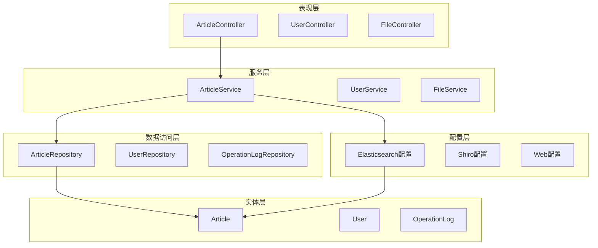
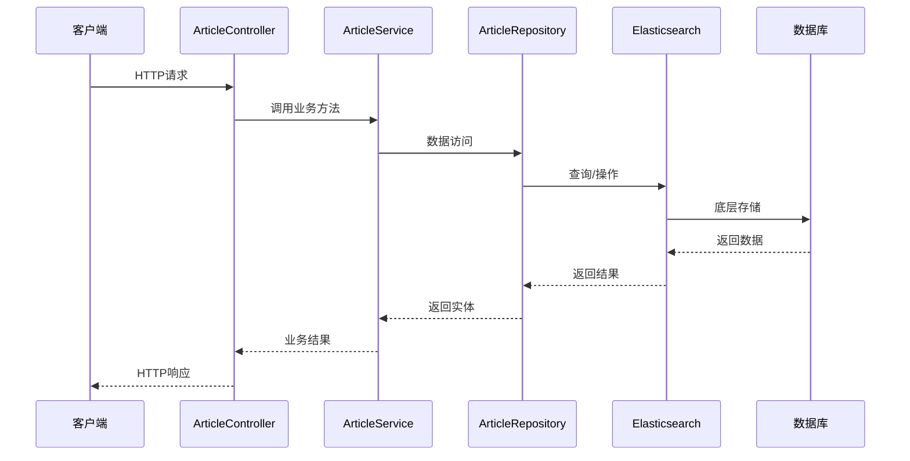
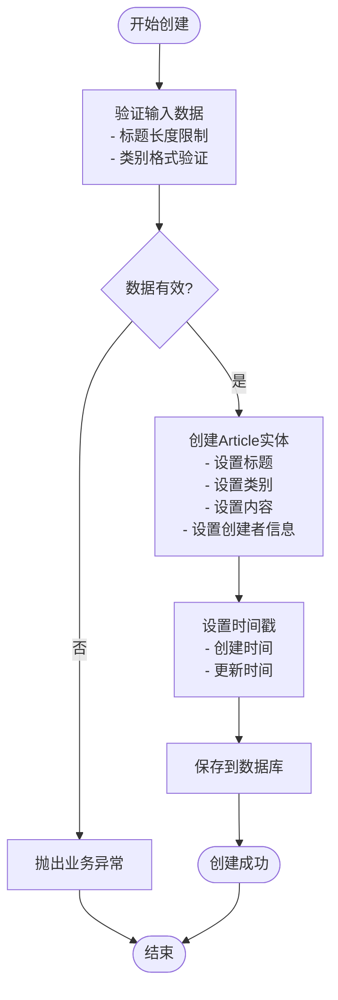
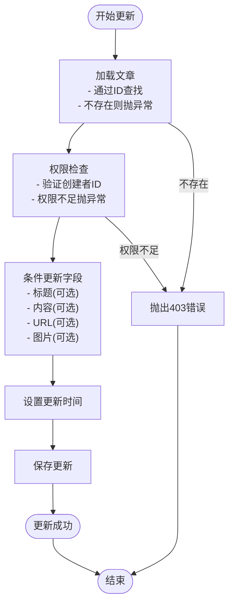
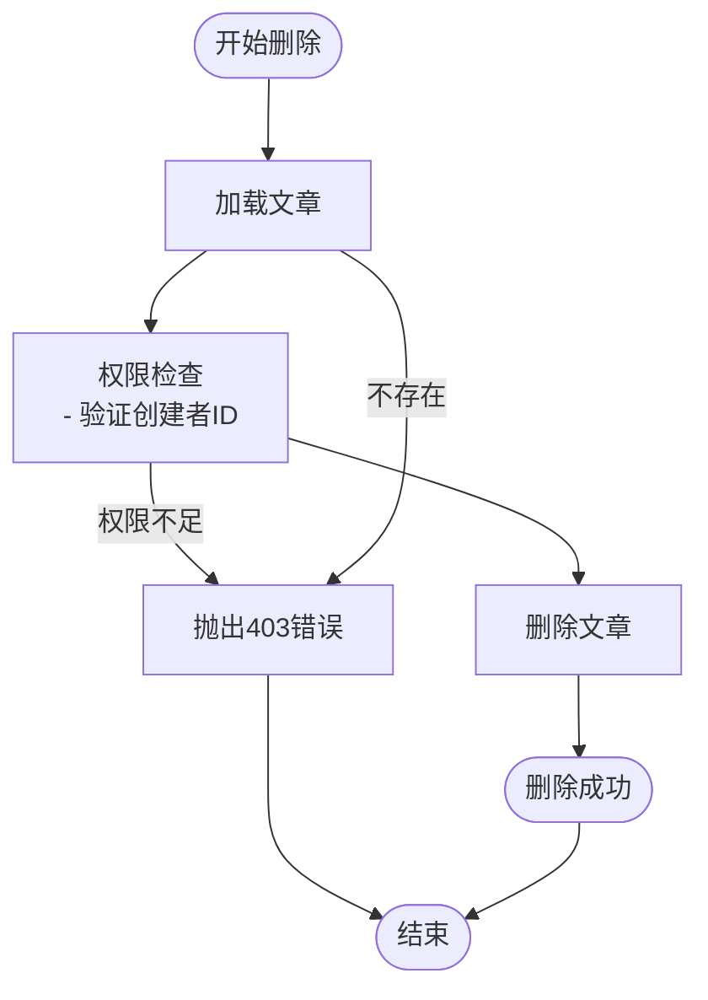
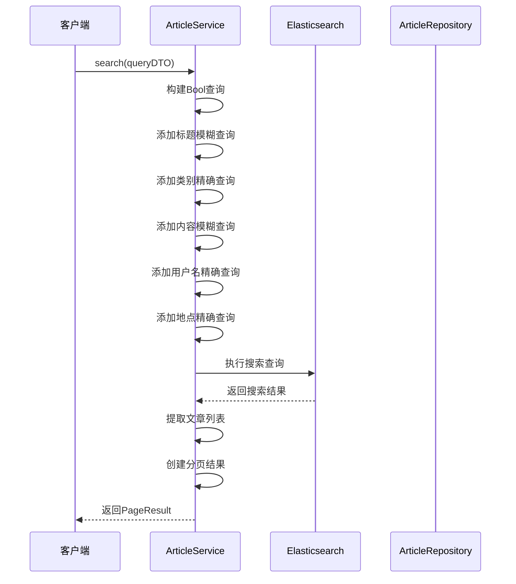
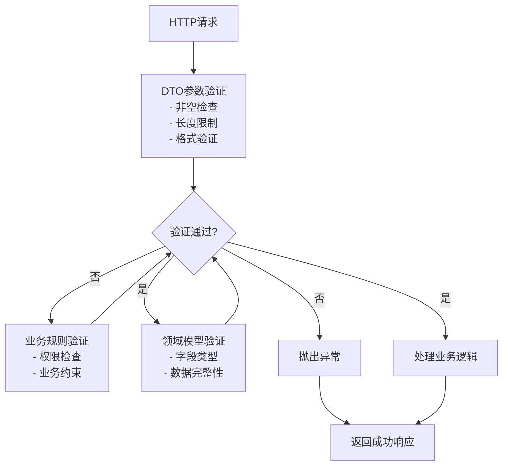

# 文章服务层实现

<cite>
**本文档引用的文件**
- [ArticleService.java](file://src/main/java/com/zhishilu/service/ArticleService.java)
- [ArticleController.java](file://src/main/java/com/zhishilu/controller/ArticleController.java)
- [ArticleRepository.java](file://src/main/java/com/zhishilu/repository/ArticleRepository.java)
- [Article.java](file://src/main/java/com/zhishilu/entity/Article.java)
- [ArticleCreateDTO.java](file://src/main/java/com/zhishilu/dto/ArticleCreateDTO.java)
- [ArticleUpdateDTO.java](file://src/main/java/com/zhishilu/dto/ArticleUpdateDTO.java)
- [ArticleQueryDTO.java](file://src/main/java/com/zhishilu/dto/ArticleQueryDTO.java)
- [PageResult.java](file://src/main/java/com/zhishilu/common/PageResult.java)
- [UserContext.java](file://src/main/java/com/zhishilu/util/UserContext.java)
- [BusinessException.java](file://src/main/java/com/zhishilu/exception/BusinessException.java)
- [Result.java](file://src/main/java/com/zhishilu/common/Result.java)
- [ElasticsearchIndexInitializer.java](file://src/main/java/com/zhishilu/config/ElasticsearchIndexInitializer.java)
- [application.yml](file://src/main/resources/application.yml)
</cite>

## 目录
1. [简介](#简介)
2. [项目结构](#项目结构)
3. [核心组件](#核心组件)
4. [架构概览](#架构概览)
5. [详细组件分析](#详细组件分析)
6. [依赖关系分析](#依赖关系分析)
7. [性能考虑](#性能考虑)
8. [故障排除指南](#故障排除指南)
9. [结论](#结论)

## 简介

知拾录是一个基于Spring Boot和Elasticsearch的个人知识收藏管理系统。本文档详细说明了文章服务层的完整实现，包括ArticleService的所有业务方法，涵盖CRUD操作、数据验证、权限检查、业务规则处理以及Elasticsearch操作的完整流程。

## 项目结构

该项目采用标准的Spring Boot分层架构设计：



**图表来源**
- [ArticleController.java](file://src/main/java/com/zhishilu/controller/ArticleController.java#L22-L87)
- [ArticleService.java](file://src/main/java/com/zhishilu/service/ArticleService.java#L34-L40)
- [ArticleRepository.java](file://src/main/java/com/zhishilu/repository/ArticleRepository.java#L12-L29)

**章节来源**
- [ArticleController.java](file://src/main/java/com/zhishilu/controller/ArticleController.java#L1-L88)
- [ArticleService.java](file://src/main/java/com/zhishilu/service/ArticleService.java#L1-L200)
- [ArticleRepository.java](file://src/main/java/com/zhishilu/repository/ArticleRepository.java#L1-L30)

## 核心组件

### ArticleService - 文章服务层

ArticleService是文章管理的核心服务类，负责处理所有文章相关的业务逻辑。该类使用Lombok注解简化代码，并通过依赖注入管理外部组件。

**主要职责：**
- 文章的创建、更新、删除、查询操作
- 权限验证和业务规则检查
- Elasticsearch集成操作
- 分页查询和搜索功能
- 类别统计和推荐功能

**关键依赖：**
- ArticleRepository：数据访问接口
- ElasticsearchOperations：Elasticsearch操作客户端
- UserContext：用户上下文管理

**章节来源**
- [ArticleService.java](file://src/main/java/com/zhishilu/service/ArticleService.java#L34-L40)

### 数据传输对象(DTO)

项目使用DTO模式进行数据传输，确保API接口的稳定性和安全性：

**ArticleCreateDTO** - 文章创建请求
- 标题：非空，最大64字符
- 类别：非空，最大32字符  
- 内容：可选
- URL：最大64字符
- 图片：字符串列表
- 地点：可选

**ArticleUpdateDTO** - 文章更新请求
- 标题：最大64字符
- 内容：可选
- URL：最大64字符
- 图片：字符串列表

**ArticleQueryDTO** - 文章查询请求
- 标题：模糊查询
- 类别：精确查询
- 内容：模糊查询
- 用户名：精确查询
- 地点：精确查询
- 分页参数：page默认0，size默认10

**章节来源**
- [ArticleCreateDTO.java](file://src/main/java/com/zhishilu/dto/ArticleCreateDTO.java#L12-L31)
- [ArticleUpdateDTO.java](file://src/main/java/com/zhishilu/dto/ArticleUpdateDTO.java#L11-L23)
- [ArticleQueryDTO.java](file://src/main/java/com/zhishilu/dto/ArticleQueryDTO.java#L8-L45)

### 实体模型

**Article实体** - 文章数据模型
- 使用Elasticsearch注解定义字段映射
- 支持IK分词器进行中文分词
- 包含完整的元数据信息

**字段映射特点：**
- 标题和内容使用IK分词器支持中文搜索
- 关键字字段使用Keyword类型支持精确匹配
- 时间字段使用Date类型支持时间范围查询

**章节来源**
- [Article.java](file://src/main/java/com/zhishilu/entity/Article.java#L14-L80)

## 架构概览

系统采用经典的三层架构设计，结合Elasticsearch实现高性能的内容检索：



**图表来源**
- [ArticleController.java](file://src/main/java/com/zhishilu/controller/ArticleController.java#L32-L74)
- [ArticleService.java](file://src/main/java/com/zhishilu/service/ArticleService.java#L45-L168)

## 详细组件分析

### CRUD操作实现

#### 创建文章 (create)

创建文章操作包含完整的数据验证和权限处理：



**图表来源**
- [ArticleService.java](file://src/main/java/com/zhishilu/service/ArticleService.java#L45-L59)
- [ArticleCreateDTO.java](file://src/main/java/com/zhishilu/dto/ArticleCreateDTO.java#L15-L21)

**实现要点：**
- 使用ArticleCreateDTO进行输入验证
- 自动设置创建者信息和时间戳
- 通过ArticleRepository保存到Elasticsearch

**章节来源**
- [ArticleService.java](file://src/main/java/com/zhishilu/service/ArticleService.java#L45-L59)

#### 更新文章 (update)

更新操作包含严格的权限检查和条件更新：



**图表来源**
- [ArticleService.java](file://src/main/java/com/zhishilu/service/ArticleService.java#L64-L88)

**实现要点：**
- 仅允许文章创建者进行修改
- 支持部分字段更新
- 自动更新更新时间

**章节来源**
- [ArticleService.java](file://src/main/java/com/zhishilu/service/ArticleService.java#L64-L88)

#### 删除文章 (delete)

删除操作同样包含权限验证：



**图表来源**
- [ArticleService.java](file://src/main/java/com/zhishilu/service/ArticleService.java#L93-L103)

**实现要点：**
- 严格的身份验证
- 简洁的删除操作

**章节来源**
- [ArticleService.java](file://src/main/java/com/zhishilu/service/ArticleService.java#L93-L103)

#### 获取文章详情 (getById)

基础的查询操作：

**实现要点：**
- 通过ID精确查询
- 不存在时抛出业务异常

**章节来源**
- [ArticleService.java](file://src/main/java/com/zhishilu/service/ArticleService.java#L108-L111)

### 高级搜索功能

#### 分页查询 (search)

Elasticsearch全文搜索引擎实现：



**图表来源**
- [ArticleService.java](file://src/main/java/com/zhishilu/service/ArticleService.java#L116-L168)

**查询条件构建：**
- 标题：使用match查询支持模糊匹配
- 类别：使用term查询支持精确匹配
- 内容：使用match查询支持全文搜索
- 用户名：使用term查询按创建者筛选
- 地点：使用term查询按地点筛选

**分页排序：**
- 按创建时间降序排列
- 支持自定义页码和页面大小

**章节来源**
- [ArticleService.java](file://src/main/java/com/zhishilu/service/ArticleService.java#L116-L168)

#### 类别统计 (getTopCategories)

基于Elasticsearch聚合的统计功能：

**实现要点：**
- 使用terms聚合统计类别出现频率
- 限制返回结果数量
- 返回类别名称和计数

**章节来源**
- [ArticleService.java](file://src/main/java/com/zhishilu/service/ArticleService.java#L173-L198)

### 数据验证策略

系统采用多层次的数据验证机制：



**验证层次：**
- DTO层：参数基本格式验证
- 业务层：权限和业务规则验证
- 领域层：数据完整性和一致性验证

**章节来源**
- [ArticleCreateDTO.java](file://src/main/java/com/zhishilu/dto/ArticleCreateDTO.java#L15-L21)
- [ArticleUpdateDTO.java](file://src/main/java/com/zhishilu/dto/ArticleUpdateDTO.java#L14-L20)

### 权限检查机制

系统实现基于创建者的严格权限控制：

**权限策略：**
- 创建者拥有文章的完全控制权
- 其他用户无法修改或删除他人文章
- 通过creatorId字段进行身份验证

**异常处理：**
- 权限不足时返回403状态码
- 文章不存在时返回相应错误信息

**章节来源**
- [ArticleService.java](file://src/main/java/com/zhishilu/service/ArticleService.java#L68-L71)
- [ArticleService.java](file://src/main/java/com/zhishilu/service/ArticleService.java#L97-L100)

## 依赖关系分析

### 组件依赖图

```mermaid
graph TB
subgraph "外部依赖"
ES[Elasticsearch)
JWT[JWT认证]
SHIRO[Shiro权限]
end
subgraph "核心组件"
AC[ArticleController]
AS[ArticleService]
AR[ArticleRepository]
AE[Article实体]
end
subgraph "工具组件"
UC[UserContext]
BR[BusinessException]
PR[PageResult]
RS[Result]
end
AC --> AS
AS --> AR
AR --> AE
AS --> UC
AS --> BR
AC --> RS
AS --> PR
AC --> JWT
AC --> SHIRO
ES --> AE
```

**图表来源**
- [ArticleController.java](file://src/main/java/com/zhishilu/controller/ArticleController.java#L10-L27)
- [ArticleService.java](file://src/main/java/com/zhishilu/service/ArticleService.java#L39-L40)

### 数据流分析

系统中的数据流向呈现清晰的层次化特征：

**写入流程：**
1. Controller接收HTTP请求
2. Service层进行业务处理和验证
3. Repository层与Elasticsearch交互
4. 数据持久化到Elasticsearch

**读取流程：**
1. Controller接收查询请求
2. Service层构建Elasticsearch查询
3. Repository执行搜索操作
4. 结果封装为PageResult返回

**章节来源**
- [ArticleController.java](file://src/main/java/com/zhishilu/controller/ArticleController.java#L32-L74)
- [ArticleService.java](file://src/main/java/com/zhishilu/service/ArticleService.java#L116-L168)

## 性能考虑

### Elasticsearch优化策略

**索引配置：**
- 单分片单副本配置适用于开发环境
- IK分词器优化中文搜索体验
- 合理的字段映射提升查询性能

**查询优化：**
- 使用布尔查询组合多个条件
- 精确查询使用term而非match
- 聚合查询避免全表扫描

**缓存策略：**
- 针对高频查询结果进行缓存
- 合理设置缓存过期时间
- 避免缓存穿透和缓存雪崩

### 分页查询优化

**分页策略：**
- 使用from/size模式支持深度分页
- 对于超大偏移量考虑使用search_after
- 合理设置每页大小限制

**排序优化：**
- 基于keyword字段的排序性能更佳
- 复合排序时注意字段选择
- 避免在高基数字段上进行排序

## 故障排除指南

### 常见异常处理

**业务异常 (BusinessException)**
- 500：通用业务错误
- 403：权限不足
- 404：资源不存在

**异常处理策略：**
- 统一的异常转换为标准响应格式
- 详细的错误信息便于调试
- 区分业务异常和系统异常

**章节来源**
- [BusinessException.java](file://src/main/java/com/zhishilu/exception/BusinessException.java#L8-L22)
- [Result.java](file://src/main/java/com/zhishilu/common/Result.java#L43-L69)

### Elasticsearch连接问题

**连接配置：**
- 检查application.yml中的ES连接参数
- 验证用户名密码正确性
- 确认网络连通性和防火墙设置

**索引初始化：**
- 确保Article、User、OperationLog索引存在
- 检查索引映射是否正确
- 验证分片和副本配置

**章节来源**
- [application.yml](file://src/main/resources/application.yml#L13-L18)
- [ElasticsearchIndexInitializer.java](file://src/main/java/com/zhishilu/config/ElasticsearchIndexInitializer.java#L23-L38)

### 权限验证问题

**用户上下文：**
- 确保JWT过滤器正确解析用户信息
- 检查UserContext的线程安全
- 验证Shiro权限配置

**权限检查：**
- 确认creatorId字段正确设置
- 验证用户身份认证流程
- 检查权限拦截器配置

**章节来源**
- [UserContext.java](file://src/main/java/com/zhishilu/util/UserContext.java#L8-L32)
- [ArticleService.java](file://src/main/java/com/zhishilu/service/ArticleService.java#L68-L71)

## 结论

文章服务层实现了完整的CRUD操作和高级搜索功能，具有以下特点：

**技术优势：**
- 基于Elasticsearch的高性能全文搜索
- 清晰的分层架构和依赖注入
- 完善的数据验证和异常处理机制
- 严格的权限控制和业务规则

**扩展性：**
- 支持灵活的查询条件组合
- 可扩展的聚合统计功能
- 易于添加新的业务规则
- 良好的性能优化基础

**最佳实践：**
- 使用DTO模式确保API稳定性
- 实现统一的异常处理机制
- 注重数据一致性和完整性
- 提供完善的日志和监控

该实现为个人知识管理系统的文章管理提供了坚实的技术基础，能够满足日常的知识收集、管理和检索需求。