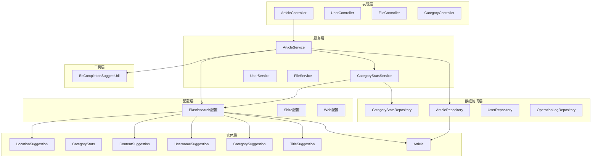
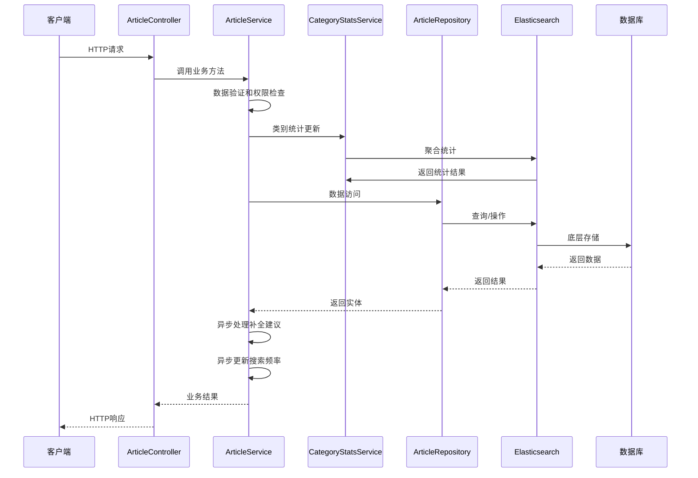
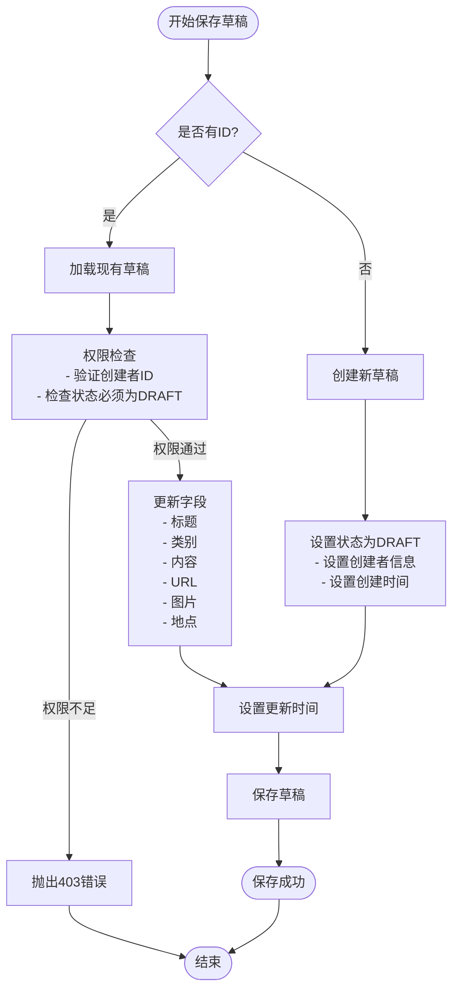
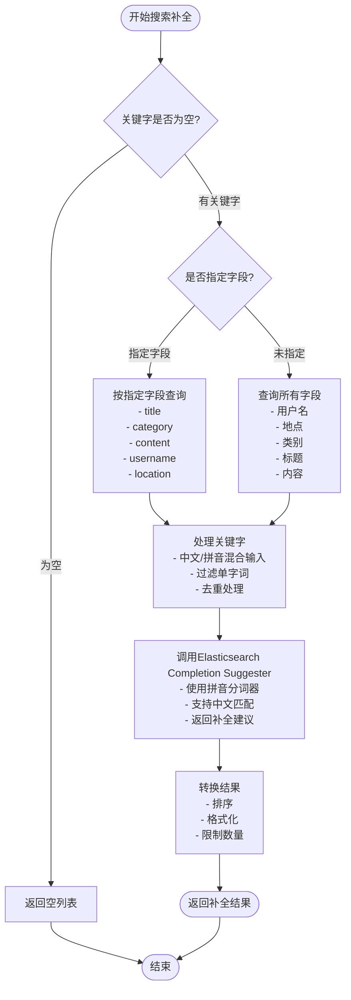
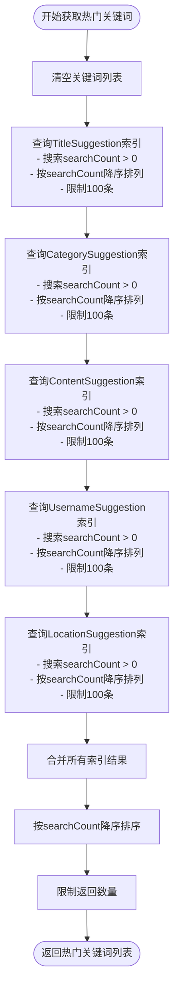
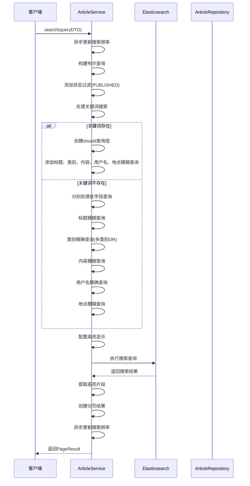
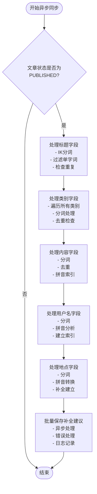
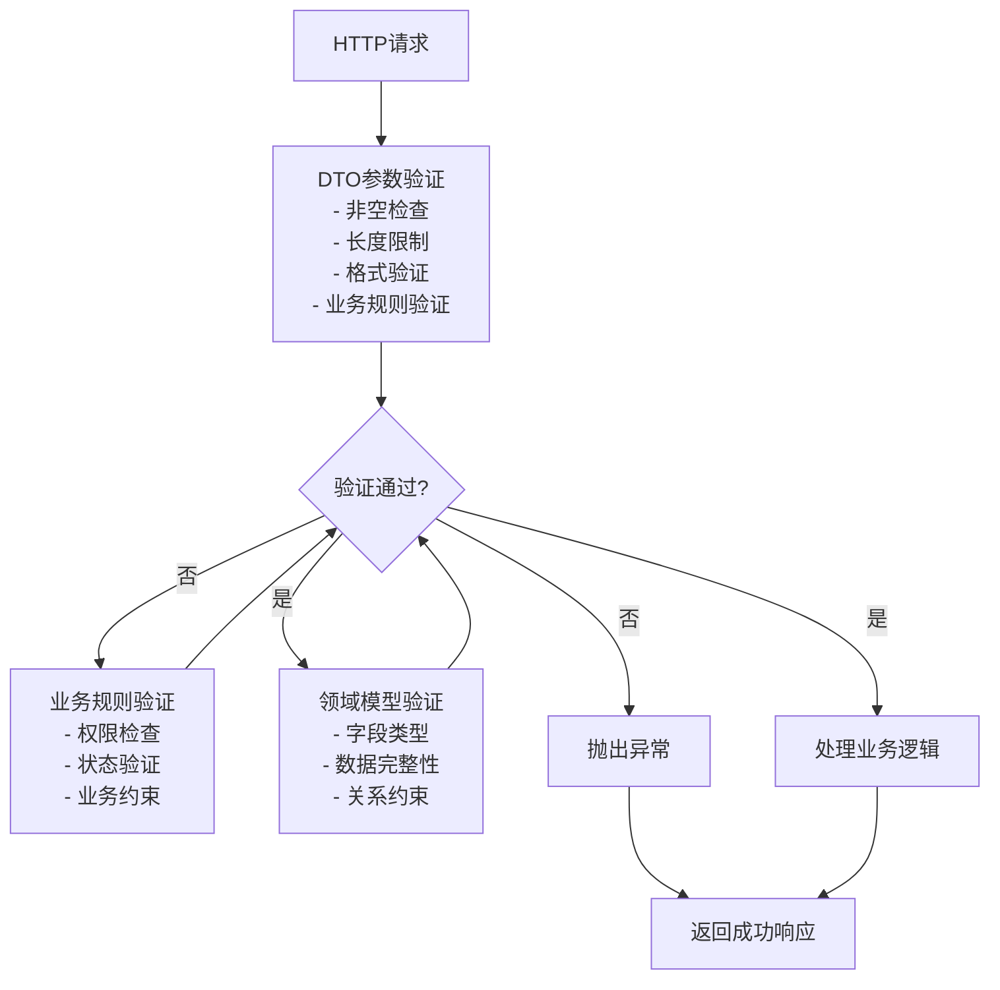

# 文章服务层实现

<cite>
**本文档引用的文件**
- [ArticleService.java](file://src/main/java/com/zhishilu/service/ArticleService.java)
- [CategoryStatsService.java](file://src/main/java/com/zhishilu/service/CategoryStatsService.java)
- [ArticleController.java](file://src/main/java/com/zhishilu/controller/ArticleController.java)
- [ArticleRepository.java](file://src/main/java/com/zhishilu/repository/ArticleRepository.java)
- [Article.java](file://src/main/java/com/zhishilu/entity/Article.java)
- [ArticleCreateReq.java](file://src/main/java/com/zhishilu/req/ArticleCreateReq.java)
- [ArticleUpdateReq.java](file://src/main/java/com/zhishilu/req/ArticleUpdateReq.java)
- [DraftSaveReq.java](file://src/main/java/com/zhishilu/req/DraftSaveReq.java)
- [ArticleQueryReq.java](file://src/main/java/com/zhishilu/req/ArticleQueryReq.java)
- [ArticleResp.java](file://src/main/java/com/zhishilu/resp/ArticleResp.java)
- [DraftResp.java](file://src/main/java/com/zhishilu/resp/DraftResp.java)
- [SearchSuggestionResp.java](file://src/main/java/com/zhishilu/resp/SearchSuggestionResp.java)
- [HotKeywordResp.java](file://src/main/java/com/zhishilu/resp/HotKeywordResp.java)
- [CategorySuggestion.java](file://src/main/java/com/zhishilu/entity/CategorySuggestion.java)
- [TitleSuggestion.java](file://src/main/java/com/zhishilu/entity/TitleSuggestion.java)
- [ContentSuggestion.java](file://src/main/java/com/zhishilu/entity/ContentSuggestion.java)
- [UsernameSuggestion.java](file://src/main/java/com/zhishilu/entity/UsernameSuggestion.java)
- [LocationSuggestion.java](file://src/main/java/com/zhishilu/entity/LocationSuggestion.java)
- [EsCompletionSuggestUtil.java](file://src/main/java/com/zhishilu/util/EsCompletionSuggestUtil.java)
- [PageResult.java](file://src/main/java/com/zhishilu/common/PageResult.java)
- [UserContext.java](file://src/main/java/com/zhishilu/util/UserContext.java)
- [BusinessException.java](file://src/main/java/com/zhishilu/exception/BusinessException.java)
- [Result.java](file://src/main/java/com/zhishilu/common/Result.java)
- [ElasticsearchIndexInitializer.java](file://src/main/java/com/zhishilu/config/ElasticsearchIndexInitializer.java)
- [application.yml](file://src/main/resources/application.yml)
- [title-suggestion-mapping.json](file://src/main/resources/title-suggestion-mapping.json)
- [category-suggestion-mapping.json](file://src/main/resources/category-suggestion-mapping.json)
- [content-suggestion-mapping.json](file://src/main/resources/content-suggestion-mapping.json)
- [username-suggestion-mapping.json](file://src/main/resources/username-suggestion-mapping.json)
- [location-suggestion-mapping.json](file://src/main/resources/location-suggestion-mapping.json)
- [suggestion-settings.json](file://src/main/resources/suggestion-settings.json)
</cite>

## 更新摘要
**变更内容**
- 新增热门关键词功能，支持按搜索频率统计热门搜索词
- 新增搜索频率统计机制，实时更新搜索建议的搜索次数
- 新增HotKeywordResp响应类，专门处理热门关键词数据
- 增强搜索功能，集成异步频率更新和热门关键词统计
- 完善Elasticsearch索引映射配置，支持searchCount字段

## 目录
1. [简介](#简介)
2. [项目结构](#项目结构)
3. [核心组件](#核心组件)
4. [架构概览](#架构概览)
5. [详细组件分析](#详细组件分析)
6. [依赖关系分析](#依赖关系分析)
7. [性能考虑](#性能考虑)
8. [故障排除指南](#故障排除指南)
9. [结论](#结论)

## 简介

知拾录是一个基于Spring Boot和Elasticsearch的个人知识收藏管理系统。本文档详细说明了文章服务层的完整实现，包括ArticleService和CategoryStatsService的所有业务方法，涵盖CRUD操作、草稿管理、智能搜索、推荐算法以及Elasticsearch操作的完整流程。

**更新亮点**：本次更新大幅增强了文章服务层的功能，新增了完整的草稿管理系统、智能搜索补全算法、用户行为分析和异步处理机制。特别新增了专门的搜索建议实体类和EsCompletionSuggestUtil工具类，实现了多字段、多语言的智能搜索补全系统。**新增**热门关键词功能，通过聚合TitleSuggestion、CategorySuggestion、ContentSuggestion、UsernameSuggestion、LocationSuggestion五个Elasticsearch索引来统计热门搜索词。

## 项目结构

该项目采用标准的Spring Boot分层架构设计：

```mermaid
graph TB
subgraph "表现层"
AC[ArticleController]
UC[UserController]
FC[FileController]
CC[CategoryController]
end
subgraph "服务层"
AS[ArticleService]
CSS[CategoryStatsService]
US[UserService]
FS[FileService]
end
subgraph "数据访问层"
AR[ArticleRepository]
CSR[CategoryStatsRepository]
UR[UserRepository]
LR[OperationLogRepository]
end
subgraph "实体层"
AE[Article]
CS[CategoryStats]
TS[TitleSuggestion]
CSug[CategorySuggestion]
UsS[UsernameSuggestion]
ContS[ContentSuggestion]
LocS[LocationSuggestion]
end
subgraph "工具层"
ESCU[EsCompletionSuggestUtil]
end
subgraph "配置层"
EC[Elasticsearch配置]
SC[Shiro配置]
WC[Web配置]
end
AC --> AS
AS --> AR
AR --> AE
AS --> CSS
CSS --> CSR
AS --> EC
CSS --> EC
EC --> AE
EC --> TS
EC --> CSug
EC --> UsS
EC --> ContS
EC --> LocS
AS --> ESCU
```

**图表来源**
- [ArticleController.java](file://src/main/java/com/zhishilu/controller/ArticleController.java#L22-L87)
- [ArticleService.java](file://src/main/java/com/zhishilu/service/ArticleService.java#L63-L69)
- [CategoryStatsService.java](file://src/main/java/com/zhishilu/service/CategoryStatsService.java#L30-L34)

**章节来源**
- [ArticleController.java](file://src/main/java/com/zhishilu/controller/ArticleController.java#L1-L88)
- [ArticleService.java](file://src/main/java/com/zhishilu/service/ArticleService.java#L1-L1018)
- [CategoryStatsService.java](file://src/main/java/com/zhishilu/service/CategoryStatsService.java#L1-L300)

## 核心组件

### ArticleService - 文章服务层

ArticleService是文章管理的核心服务类，负责处理所有文章相关的业务逻辑。该类使用Lombok注解简化代码，并通过依赖注入管理外部组件。

**主要职责：**
- 文章的创建、更新、删除、查询操作
- 草稿管理（创建、更新、删除、发布）
- 权限验证和业务规则检查
- Elasticsearch集成操作
- 分页查询和搜索功能
- 智能搜索补全和推荐算法
- 异步处理和性能优化
- **新增**热门关键词统计和搜索频率分析

**关键依赖：**
- ArticleRepository：数据访问接口
- ElasticsearchOperations：Elasticsearch操作客户端
- RestHighLevelClient：底层Elasticsearch客户端
- CategoryStatsService：类别统计服务
- UserService：用户信息服务
- EsCompletionSuggestUtil：搜索补全工具

**章节来源**
- [ArticleService.java](file://src/main/java/com/zhishilu/service/ArticleService.java#L63-L69)

### CategoryStatsService - 类别统计服务

CategoryStatsService专门负责文章类别的统计和分析功能。

**主要职责：**
- 刷新和维护类别统计信息
- 计算用户常用类别
- 生成首页导航栏数据
- 支持类别计数的增减操作

**核心功能：**
- 实时聚合统计各类别文章数量
- 用户个性化类别推荐
- 导航栏智能分类展示
- 类别使用频率分析

**章节来源**
- [CategoryStatsService.java](file://src/main/java/com/zhishilu/service/CategoryStatsService.java#L30-L34)

### 搜索建议实体类体系

**新增** 专门的搜索建议实体类，每个实体类对应一个特定的搜索字段：

**TitleSuggestion** - 标题搜索补全实体
- 索引名称：zhishilu_title_suggestion
- 字段映射：text(Keyword)、searchCount(Long)、suggest(Completion)
- 支持中文标题的拼音分词和自动补全

**CategorySuggestion** - 类别搜索补全实体
- 索引名称：zhishilu_category_suggestion
- 字段映射：text(Keyword)、searchCount(Long)、suggest(Completion)
- 支持多类别标签的智能补全

**ContentSuggestion** - 内容搜索补全实体
- 索引名称：zhishilu_content_suggestion
- 字段映射：text(Keyword)、searchCount(Long)、suggest(Completion)
- 支持文章内容的关键词补全

**UsernameSuggestion** - 用户名搜索补全实体
- 索引名称：zhishilu_username_suggestion
- 字段映射：text(Keyword)、searchCount(Long)、suggest(Completion)
- 支持作者名称的智能搜索

**LocationSuggestion** - 地点搜索补全实体
- 索引名称：zhishilu_location_suggestion
- 字段映射：text(Keyword)、searchCount(Long)、suggest(Completion)
- 支持地理位置信息的补全

**字段特性：**
- 使用@Document注解定义独立的Elasticsearch索引
- @Setting注解配置分片和副本策略
- @Mapping注解指定JSON映射文件路径
- CompletionField支持拼音分词器进行智能补全
- 搜索频率统计支持智能排序和权重计算

**章节来源**
- [TitleSuggestion.java](file://src/main/java/com/zhishilu/entity/TitleSuggestion.java#L15-L51)
- [CategorySuggestion.java](file://src/main/java/com/zhishilu/entity/CategorySuggestion.java#L15-L49)
- [ContentSuggestion.java](file://src/main/java/com/zhishilu/entity/ContentSuggestion.java#L15-L49)
- [UsernameSuggestion.java](file://src/main/java/com/zhishilu/entity/UsernameSuggestion.java#L15-L49)
- [LocationSuggestion.java](file://src/main/java/com/zhishilu/entity/LocationSuggestion.java#L15-L49)

### EsCompletionSuggestUtil - 搜索补全工具类

**新增** 通用的Elasticsearch Completion Suggest工具类：

**核心功能：**
- 通用Completion Suggest方法，支持多索引、多字段查询
- 统一的建议结果解析和排序机制
- 支持前缀匹配、去重处理和数量限制
- 提供SuggestItem内部类封装结果数据

**方法特性：**
- completionSuggest：主要的补全查询方法
- parseSuggestResult：结果解析和排序
- SuggestItem：内部类封装文本、字段、分数和源数据

**参数配置：**
- indices：支持多个索引名称数组
- prefix：用户输入的前缀关键字
- suggestFields：建议字段列表
- fetchSize：Elasticsearch返回数量
- resultLimit：最终返回结果数量
- skipDuplicates：是否跳过重复项

**章节来源**
- [EsCompletionSuggestUtil.java](file://src/main/java/com/zhishilu/util/EsCompletionSuggestUtil.java#L30-L137)

### HotKeywordResp - 热门关键词响应类

**新增** 专门的热门关键词响应类，用于封装热门搜索词数据：

**核心属性：**
- keyword：热门搜索关键词文本
- searchCount：该关键词的搜索次数

**用途：**
- 作为getHotKeywords()方法的返回类型
- 支持前端展示热门搜索词列表
- 提供搜索频率统计的标准化输出

**章节来源**
- [HotKeywordResp.java](file://src/main/java/com/zhishilu/resp/HotKeywordResp.java#L1-L26)

### 数据传输对象(DTO)

项目使用DTO模式进行数据传输，确保API接口的稳定性和安全性：

**ArticleCreateReq** - 文章创建请求
- 标题：非空验证，最大长度限制
- 类别：非空列表，支持多类别
- 内容：可选
- URL：可选
- 图片：字符串列表
- 地点：可选

**ArticleUpdateReq** - 文章更新请求
- 标题：可选更新
- 内容：可选更新
- 类别：可选更新
- URL：可选更新
- 图片：可选更新
- 地点：可选更新

**DraftSaveReq** - 草稿保存请求
- ID：更新时使用
- 标题：可选
- 类别：可选
- 内容：可选
- URL：可选
- 图片：可选
- 地点：可选

**ArticleQueryReq** - 文章查询请求
- 关键词：全字段模糊搜索
- 标题：模糊查询
- 类别列表：精确查询
- 内容：模糊查询
- 用户名：精确查询
- 地点：模糊查询
- 分页参数：page默认0，size默认10

**章节来源**
- [ArticleCreateReq.java](file://src/main/java/com/zhishilu/req/ArticleCreateReq.java#L13-L46)
- [ArticleUpdateReq.java](file://src/main/java/com/zhishilu/req/ArticleUpdateReq.java#L11-L42)
- [DraftSaveReq.java](file://src/main/java/com/zhishilu/req/DraftSaveReq.java#L11-L47)
- [ArticleQueryReq.java](file://src/main/java/com/zhishilu/req/ArticleQueryReq.java#L11-L52)

### 实体模型

**Article实体** - 文章数据模型
- 使用Elasticsearch注解定义字段映射
- 支持IK分词器进行中文分词
- 包含完整的元数据信息
- 新增状态字段支持草稿管理

**字段映射特点：**
- 标题和内容使用IK分词器支持中文搜索
- 关键字字段使用Keyword类型支持精确匹配
- Completion字段支持拼音分词和自动完成
- 搜索频率统计支持智能排序

**章节来源**
- [Article.java](file://src/main/java/com/zhishilu/entity/Article.java#L16-L85)

## 架构概览

系统采用经典的三层架构设计，结合Elasticsearch实现高性能的内容检索和智能推荐：

```mermaid
sequenceDiagram
participant C as 客户端
participant AC as ArticleController
participant AS as ArticleService
participant CSS as CategoryStatsService
participant AR as ArticleRepository
participant ES as Elasticsearch
participant DB as 数据库
C->>AC : HTTP请求
AC->>AS : 调用业务方法
AS->>AS : 数据验证和权限检查
AS->>CSS : 类别统计更新
CSS->>ES : 聚合统计
ES->>CSS : 返回统计结果
AS->>AR : 数据访问
AR->>ES : 查询/操作
ES->>DB : 底层存储
DB-->>ES : 返回数据
ES-->>AR : 返回结果
AR-->>AS : 返回实体
AS->>AS : 异步处理补全建议
AS->>AS : 异步更新搜索频率
AS-->>AC : 业务结果
AC-->>C : HTTP响应
```

**图表来源**
- [ArticleController.java](file://src/main/java/com/zhishilu/controller/ArticleController.java#L32-L74)
- [ArticleService.java](file://src/main/java/com/zhishilu/service/ArticleService.java#L74-L99)

## 详细组件分析

### 草稿管理系统

#### 草稿创建 (saveDraft)

新增的草稿管理功能提供了完整的草稿生命周期管理：

```mermaid
flowchart TD
Start([开始保存草稿]) --> CheckId{"是否有ID?"}
CheckId --> |是| LoadDraft["加载现有草稿"]
CheckId --> |否| CreateNew["创建新草稿"]
LoadDraft --> PermissionCheck["权限检查<br/>- 验证创建者ID<br/>- 检查状态必须为DRAFT"]
PermissionCheck --> |权限不足| ThrowError["抛出403错误"]
PermissionCheck --> |权限通过| UpdateFields["更新字段<br/>- 标题<br/>- 类别<br/>- 内容<br/>- URL<br/>- 图片<br/>- 地点"]
CreateNew --> SetDraftStatus["设置状态为DRAFT<br/>- 设置创建者信息<br/>- 设置创建时间"]
UpdateFields --> SetUpdatedTime["设置更新时间"]
SetDraftStatus --> SetUpdatedTime
SetUpdatedTime --> Save["保存草稿"]
Save --> Success([保存成功])
ThrowError --> End([结束])
Success --> End
```

**图表来源**
- [ArticleService.java](file://src/main/java/com/zhishilu/service/ArticleService.java#L104-L143)

**实现要点：**
- 支持草稿的创建和更新
- 严格的权限验证
- 状态管理确保只能编辑草稿
- 自动设置时间戳和状态

**章节来源**
- [ArticleService.java](file://src/main/java/com/zhishilu/service/ArticleService.java#L104-L143)

#### 草稿发布 (publishDraft)

草稿发布功能将草稿转换为正式文章：

**实现流程：**
1. 加载草稿并验证权限
2. 检查状态必须为DRAFT
3. 更新为PUBLISHED状态
4. 同步更新类别统计
5. 异步同步搜索补全建议

**权限控制：**
- 仅草稿创建者可以发布
- 状态必须为DRAFT
- 成功发布后自动更新统计

**章节来源**
- [ArticleService.java](file://src/main/java/com/zhishilu/service/ArticleService.java#L198-L232)

### 智能搜索补全系统

#### 搜索补全 (getSearchSuggestions)

**更新** 增强的搜索补全功能，支持多字段智能补全：

```mermaid
flowchart TD
Start([开始搜索补全]) --> CheckKeyword{"关键字是否为空?"}
CheckKeyword --> |为空| ReturnEmpty["返回空列表"]
CheckKeyword --> |有关键字| CheckField{"是否指定字段?"}
CheckField --> |指定字段| FieldSpecific["按指定字段查询<br/>- title<br/>- category<br/>- content<br/>- username<br/>- location"]
CheckField --> |未指定| AllFields["查询所有字段<br/>- 用户名<br/>- 地点<br/>- 类别<br/>- 标题<br/>- 内容"]
FieldSpecific --> ProcessKeyword["处理关键字<br/>- 中文/拼音混合输入<br/>- 过滤单字词<br/>- 去重处理"]
AllFields --> ProcessKeyword
ProcessKeyword --> CallES["调用Elasticsearch Completion Suggester<br/>- 使用拼音分词器<br/>- 支持中文匹配<br/>- 返回补全建议"]
CallES --> TransformResult["转换结果<br/>- 排序<br/>- 格式化<br/>- 限制数量"]
TransformResult --> ReturnResult([返回补全结果])
ReturnEmpty --> End([结束])
ReturnResult --> End
```

**图表来源**
- [ArticleService.java](file://src/main/java/com/zhishilu/service/ArticleService.java#L439-L500)

**补全策略：**
- 支持中文/拼音混合输入
- 智能过滤单字词和重复项
- 按相关性和长度排序
- 支持指定字段精确补全

**章节来源**
- [ArticleService.java](file://src/main/java/com/zhishilu/service/ArticleService.java#L439-L500)

#### 搜索频率统计

**更新** 增强的搜索频率统计机制：

**频率统计流程：**
1. 异步监听用户搜索行为
2. 将搜索关键词与原文词语匹配
3. 更新对应补全项的搜索频率
4. 支持全字段和单字段搜索统计

**实现机制：**
- 使用反射动态更新searchCount字段
- 支持多种实体类型的频率统计
- 异步处理避免阻塞主流程

**章节来源**
- [ArticleService.java](file://src/main/java/com/zhishilu/service/ArticleService.java#L862-L940)

### 热门关键词功能

**新增** 热门关键词统计功能，通过聚合所有搜索建议索引来统计热门搜索词：

```mermaid
flowchart TD
Start([开始获取热门关键词]) --> ClearList["清空关键词列表"]
ClearList --> QueryTitle["查询TitleSuggestion索引<br/>- 搜索searchCount > 0<br/>- 按searchCount降序排列<br/>- 限制100条"]
QueryTitle --> QueryCategory["查询CategorySuggestion索引<br/>- 搜索searchCount > 0<br/>- 按searchCount降序排列<br/>- 限制100条"]
QueryCategory --> QueryContent["查询ContentSuggestion索引<br/>- 搜索searchCount > 0<br/>- 按searchCount降序排列<br/>- 限制100条"]
QueryContent --> QueryUsername["查询UsernameSuggestion索引<br/>- 搜索searchCount > 0<br/>- 按searchCount降序排列<br/>- 限制100条"]
QueryUsername --> QueryLocation["查询LocationSuggestion索引<br/>- 搜索searchCount > 0<br/>- 按searchCount降序排列<br/>- 限制100条"]
QueryLocation --> MergeResults["合并所有索引结果"]
MergeResults --> SortResults["按searchCount降序排序"]
SortResults --> LimitResults["限制返回数量"]
LimitResults --> ReturnResults([返回热门关键词列表])
```

**图表来源**
- [ArticleService.java](file://src/main/java/com/zhishilu/service/ArticleService.java#L967-L982)

**实现机制：**
- 从五个搜索建议索引中查询searchCount > 0的关键词
- 使用泛型方法getKeywordsFromIndex()统一处理不同索引类型
- 通过反射机制获取text和searchCount字段值
- 按搜索频率降序排序，限制返回数量

**章节来源**
- [ArticleService.java](file://src/main/java/com/zhishilu/service/ArticleService.java#L967-L1016)

### 高级搜索功能

#### 全字段搜索 (search)

增强的搜索功能支持关键词全字段模糊搜索：

```mermaid
sequenceDiagram
participant Client as 客户端
participant Service as ArticleService
participant ES as Elasticsearch
participant Repo as ArticleRepository
Client->>Service : search(queryDTO)
Service->>Service : 异步更新搜索频率
Service->>Service : 构建布尔查询
Service->>Service : 添加状态过滤(PUBLISHED)
Service->>Service : 处理关键词搜索
alt 关键词存在
Service->>Service : 创建should查询组
Service->>Service : 添加标题、类别、内容、用户名、地点模糊查询
else 关键词不存在
Service->>Service : 分别处理各字段查询
Service->>Service : 标题模糊查询
Service->>Service : 类别精确查询(多类别OR)
Service->>Service : 内容模糊查询
Service->>Service : 用户名精确查询
Service->>Service : 地点模糊查询
end
Service->>Service : 配置高亮显示
Service->>ES : 执行搜索查询
ES-->>Service : 返回搜索结果
Service->>Service : 提取高亮片段
Service->>Service : 创建分页结果
Service->>Service : 异步更新搜索频率
Service-->>Client : 返回PageResult
```

**图表来源**
- [ArticleService.java](file://src/main/java/com/zhishilu/service/ArticleService.java#L323-L432)

**搜索策略：**
- 关键词模式：全字段模糊匹配
- 字段模式：精确字段查询
- 高亮显示：标题、内容、地点片段
- 性能优化：异步频率统计

**章节来源**
- [ArticleService.java](file://src/main/java/com/zhishilu/service/ArticleService.java#L323-L432)

### 类别统计和推荐

#### 用户常用类别 (getTopCategories)

基于用户行为的智能推荐功能：

**实现原理：**
- 统计用户文章的类别分布
- 按出现频率排序
- 支持限制返回数量
- 与全局统计相结合

**应用场景：**
- 个性化内容推荐
- 类别导航栏优化
- 用户兴趣分析

**章节来源**
- [ArticleService.java](file://src/main/java/com/zhishilu/service/ArticleService.java#L589-L614)

#### 类别导航栏 (getCategoryNavigation)

智能的类别导航栏展示：

**展示规则：**
1. 首先展示用户最常用的类别
2. 不足20个时补充其他热门类别
3. 排除用户已使用的类别
4. 最多展示20个类别
5. 支持游客访问模式

**实现策略：**
- 用户登录：个性化展示
- 游客访问：纯热门展示
- 动态权重计算
- 性能优化的聚合查询

**章节来源**
- [CategoryStatsService.java](file://src/main/java/com/zhishilu/service/CategoryStatsService.java#L162-L202)

### 异步处理和性能优化

#### 异步补全同步 (syncSuggestions)

**更新** 增强的异步补全建议同步机制：

```mermaid
flowchart TD
Start([开始异步同步]) --> CheckStatus{"文章状态是否为PUBLISHED?"}
CheckStatus --> |否| End([结束])
CheckStatus --> |是| ProcessTitle["处理标题字段<br/>- IK分词<br/>- 过滤单字词<br/>- 检查重复"]
ProcessTitle --> ProcessCategory["处理类别字段<br/>- 遍历所有类别<br/>- 分词处理<br/>- 去重检查"]
ProcessCategory --> ProcessContent["处理内容字段<br/>- 分词<br/>- 去重<br/>- 拼音索引"]
ProcessContent --> ProcessUsername["处理用户名字段<br/>- 分词<br/>- 拼音分析<br/>- 建立索引"]
ProcessUsername --> ProcessLocation["处理地点字段<br/>- 分词<br/>- 拼音转换<br/>- 补全建立"]
ProcessLocation --> BatchSave["批量保存补全建议<br/>- 异步处理<br/>- 错误处理<br/>- 日志记录"]
BatchSave --> End
```

**图表来源**
- [ArticleService.java](file://src/main/java/com/zhishilu/service/ArticleService.java#L664-L787)

**优化特性：**
- CompletableFuture异步处理
- 批量操作减少IO次数
- 智能去重避免重复索引
- 完善的异常处理机制

**章节来源**
- [ArticleService.java](file://src/main/java/com/zhishilu/service/ArticleService.java#L664-L787)

### 数据验证策略

系统采用多层次的数据验证机制：

```mermaid
flowchart TD
Input[HTTP请求] --> DTOValidation["DTO参数验证<br/>- 非空检查<br/>- 长度限制<br/>- 格式验证<br/>- 业务规则验证"]
DTOValidation --> Valid{"验证通过?"}
Valid --> |否| BusinessValidation["业务规则验证<br/>- 权限检查<br/>- 状态验证<br/>- 业务约束"]
Valid --> |是| DomainValidation["领域模型验证<br/>- 字段类型<br/>- 数据完整性<br/>- 关系约束"]
BusinessValidation --> Valid
DomainValidation --> Valid
Valid --> |否| Exception[抛出异常]
Valid --> |是| Process[处理业务逻辑]
Exception --> Response[返回错误响应]
Process --> Response[返回成功响应]
```

**验证层次：**
- DTO层：参数基本格式验证
- 业务层：权限和业务规则验证
- 领域层：数据完整性和一致性验证

**章节来源**
- [ArticleCreateReq.java](file://src/main/java/com/zhishilu/req/ArticleCreateReq.java#L18-L25)
- [ArticleUpdateReq.java](file://src/main/java/com/zhishilu/req/ArticleUpdateReq.java#L16-L26)

### 权限检查机制

系统实现基于创建者的严格权限控制：

**权限策略：**
- 创建者拥有文章的完全控制权
- 草稿权限独立管理
- 支持状态相关的权限控制
- 通过creatorId字段进行身份验证

**权限场景：**
- 文章创建：自动设置创建者信息
- 文章更新：仅创建者可修改
- 文章删除：仅创建者可删除
- 草稿管理：独立的权限验证

**异常处理：**
- 权限不足时返回403状态码
- 文章不存在时返回相应错误信息
- 状态验证失败时抛出业务异常

**章节来源**
- [ArticleService.java](file://src/main/java/com/zhishilu/service/ArticleService.java#L242-L244)
- [ArticleService.java](file://src/main/java/com/zhishilu/service/ArticleService.java#L113-L115)

## 依赖关系分析

### 组件依赖图

```mermaid
graph TB
subgraph "外部依赖"
ES[Elasticsearch)
JWT[JWT认证]
SHIRO[Shiro权限]
RHLC[RestHighLevelClient]
ESRT[ElasticsearchRestTemplate]
end
subgraph "核心组件"
AC[ArticleController]
AS[ArticleService]
CSS[CategoryStatsService]
AR[ArticleRepository]
CSR[CategoryStatsRepository]
AE[Article实体]
CS[CategoryStats实体]
TS[TitleSuggestion实体]
CSug[CategorySuggestion实体]
UsS[UsernameSuggestion实体]
ContS[ContentSuggestion实体]
LocS[LocationSuggestion实体]
HKR[HotKeywordResp响应类]
end
subgraph "工具组件"
UC[UserContext]
BR[BusinessException]
PR[PageResult]
RS[Result]
ESCU[EsCompletionSuggestUtil]
end
AC --> AS
AS --> AR
AS --> CSS
CSS --> CSR
AR --> AE
CSR --> CS
AS --> ES
AS --> RHLC
CSS --> ES
ESCU --> ESRT
AS --> ESCU
AC --> RS
AS --> PR
AS --> HKR
AC --> JWT
AC --> SHIRO
ES --> AE
ES --> TS
ES --> CSug
ES --> UsS
ES --> ContS
ES --> LocS
```

**图表来源**
- [ArticleController.java](file://src/main/java/com/zhishilu/controller/ArticleController.java#L10-L27)
- [ArticleService.java](file://src/main/java/com/zhishilu/service/ArticleService.java#L64-L69)
- [CategoryStatsService.java](file://src/main/java/com/zhishilu/service/CategoryStatsService.java#L32-L33)

### 数据流分析

系统中的数据流向呈现清晰的层次化特征：

**写入流程：**
1. Controller接收HTTP请求
2. Service层进行业务处理和验证
3. Repository层与Elasticsearch交互
4. 数据持久化到Elasticsearch
5. 异步任务处理补全建议

**读取流程：**
1. Controller接收查询请求
2. Service层构建Elasticsearch查询
3. Repository执行搜索操作
4. 结果封装为PageResult返回
5. 异步更新搜索频率统计

**章节来源**
- [ArticleController.java](file://src/main/java/com/zhishilu/controller/ArticleController.java#L32-L74)
- [ArticleService.java](file://src/main/java/com/zhishilu/service/ArticleService.java#L323-L432)

## 性能考虑

### Elasticsearch优化策略

**索引配置：**
- 单分片单副本配置适用于开发环境
- IK分词器优化中文搜索体验
- Completion字段支持智能补全
- 合理的字段映射提升查询性能

**查询优化：**
- 使用布尔查询组合多个条件
- 精确查询使用term而非match
- 聚合查询避免全表扫描
- 高亮查询优化性能

**缓存策略：**
- 针对高频查询结果进行缓存
- 异步处理减少主流程阻塞
- 批量操作优化IO性能
- 智能去重避免重复索引

### 分页查询优化

**分页策略：**
- 使用from/size模式支持深度分页
- 对于超大偏移量考虑使用search_after
- 合理设置每页大小限制
- 高亮查询的性能优化

**排序优化：**
- 基于keyword字段的排序性能更佳
- 复合排序时注意字段选择
- 避免在高基数字段上进行排序

### 异步处理优化

**异步策略：**
- CompletableFuture实现非阻塞处理
- 批量操作减少IO次数
- 异常处理保证系统稳定性
- 性能监控和日志记录

**性能监控：**
- 异步任务执行时间统计
- Elasticsearch查询性能监控
- 缓存命中率分析
- 错误率和重试机制

## 故障排除指南

### 常见异常处理

**业务异常 (BusinessException)**
- 500：通用业务错误
- 403：权限不足
- 404：资源不存在
- 400：参数验证失败

**异常处理策略：**
- 统一的异常转换为标准响应格式
- 详细的错误信息便于调试
- 区分业务异常和系统异常
- 完善的日志记录机制

**章节来源**
- [BusinessException.java](file://src/main/java/com/zhishilu/exception/BusinessException.java#L8-L22)
- [Result.java](file://src/main/java/com/zhishilu/common/Result.java#L43-L69)

### Elasticsearch连接问题

**连接配置：**
- 检查application.yml中的ES连接参数
- 验证用户名密码正确性
- 确认网络连通性和防火墙设置

**索引初始化：**
- 确保Article、User、OperationLog索引存在
- 检查搜索补全索引配置
- 验证分片和副本配置
- 确认自定义分词器正确安装

**分词器问题：**
- IK分词器配置验证
- 拼音分词器配置验证
- 自定义分析器测试
- 分词结果验证

**章节来源**
- [application.yml](file://src/main/resources/application.yml#L13-L18)
- [ElasticsearchIndexInitializer.java](file://src/main/java/com/zhishilu/config/ElasticsearchIndexInitializer.java#L23-L38)

### 权限验证问题

**用户上下文：**
- 确保JWT过滤器正确解析用户信息
- 检查UserContext的线程安全
- 验证Shiro权限配置

**权限检查：**
- 确认creatorId字段正确设置
- 验证用户身份认证流程
- 检查权限拦截器配置
- 草稿权限验证机制

**章节来源**
- [UserContext.java](file://src/main/java/com/zhishilu/util/UserContext.java#L8-L32)
- [ArticleService.java](file://src/main/java/com/zhishilu/service/ArticleService.java#L242-L244)

### 异步处理问题

**异步任务失败：**
- CompletableFuture异常处理
- 线程池配置和监控
- 任务超时和重试机制
- 内存泄漏预防

**性能问题：**
- 异步任务队列监控
- Elasticsearch连接池配置
- 批量操作大小优化
- 缓存策略调整

**章节来源**
- [ArticleService.java](file://src/main/java/com/zhishilu/service/ArticleService.java#L96-L96)
- [ArticleService.java](file://src/main/java/com/zhishilu/service/ArticleService.java#L664-L664)

### 热门关键词功能问题

**热门关键词查询失败：**
- 检查searchCount字段是否正确更新
- 验证索引映射配置
- 确认分词器配置正确
- 检查异步频率更新任务

**搜索频率统计异常：**
- 确认updateSearchFrequency方法正常执行
- 检查反射机制获取字段值
- 验证索引ID格式（field_keyword）
- 确认Elasticsearch连接正常

**章节来源**
- [ArticleService.java](file://src/main/java/com/zhishilu/service/ArticleService.java#L967-L1016)
- [ArticleService.java](file://src/main/java/com/zhishilu/service/ArticleService.java#L908-L941)

## 结论

文章服务层实现了完整的CRUD操作、智能搜索补全和高级推荐功能，具有以下特点：

**技术优势：**
- 基于Elasticsearch的高性能全文搜索和智能补全
- 完整的草稿管理系统，支持文章生命周期管理
- 清晰的分层架构和依赖注入
- 完善的数据验证和异常处理机制
- 严格的权限控制和业务规则
- 异步处理机制优化性能
- 智能搜索频率统计和推荐算法
- **新增**热门关键词统计功能，支持基于搜索频率的智能推荐

**功能增强：**
- 草稿管理：创建、更新、删除、发布全流程支持
- 智能补全：多字段、多语言、高亮显示
- 用户推荐：基于行为分析的个性化推荐
- 性能优化：异步处理、批量操作、缓存策略
- 统计分析：类别统计、搜索频率、用户行为
- **新增**热门关键词：聚合搜索建议索引统计热门搜索词

**扩展性：**
- 支持灵活的查询条件组合
- 可扩展的聚合统计功能
- 易于添加新的业务规则
- 良好的性能优化基础
- 模块化的服务设计

**最佳实践：**
- 使用DTO模式确保API稳定性
- 实现统一的异常处理机制
- 注重数据一致性和完整性
- 提供完善的日志和监控
- 异步处理保证用户体验
- **新增**搜索频率统计优化用户体验

该实现为个人知识管理系统的文章管理提供了坚实的技术基础，能够满足日常的知识收集、管理和检索需求，同时具备良好的扩展性和维护性。**新增的热门关键词功能进一步增强了系统的智能化水平，为用户提供更好的搜索体验和内容发现能力。**