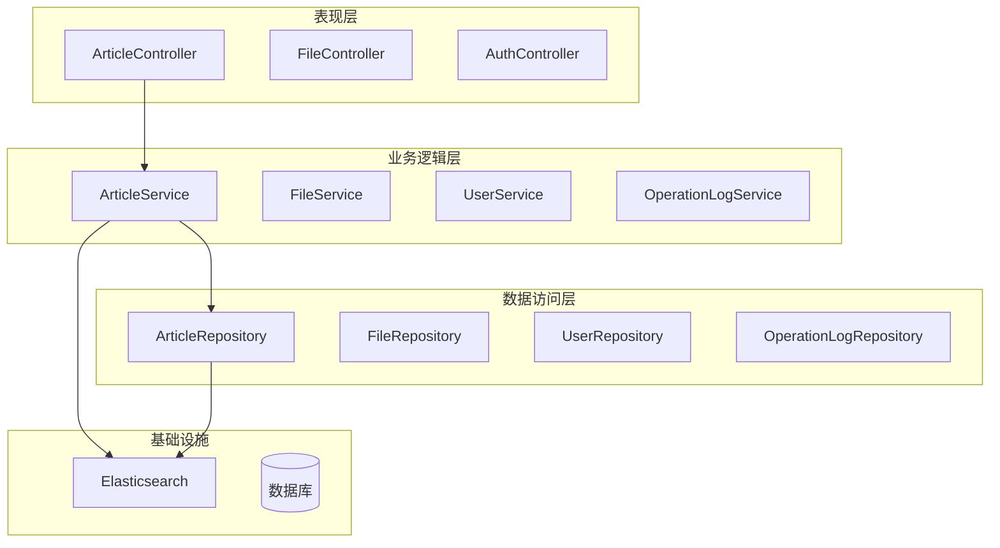
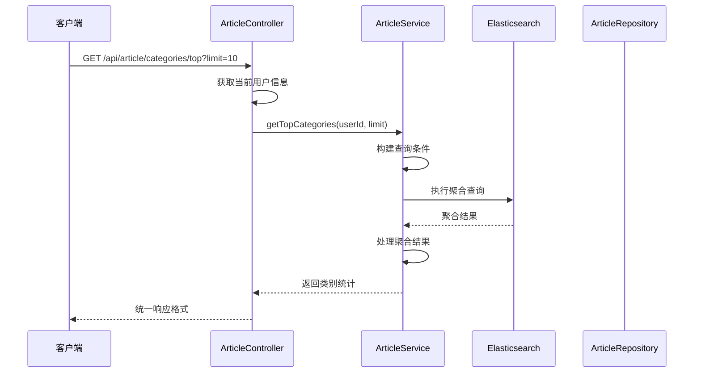
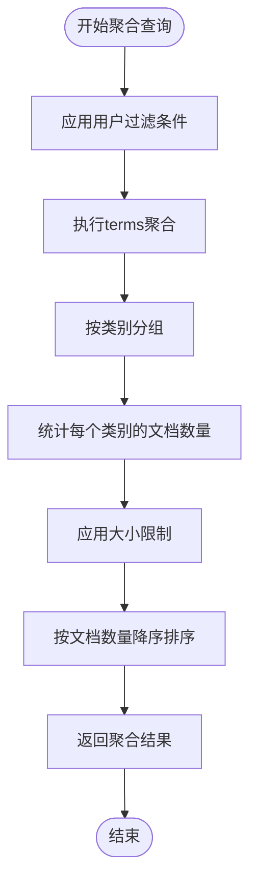
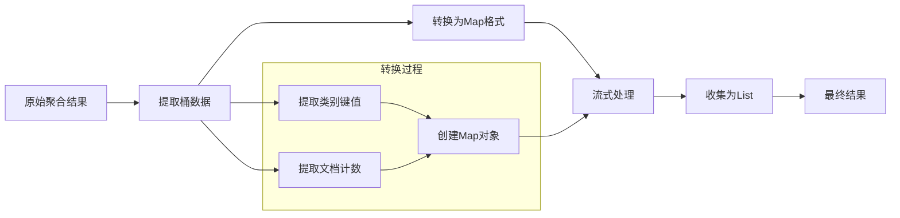
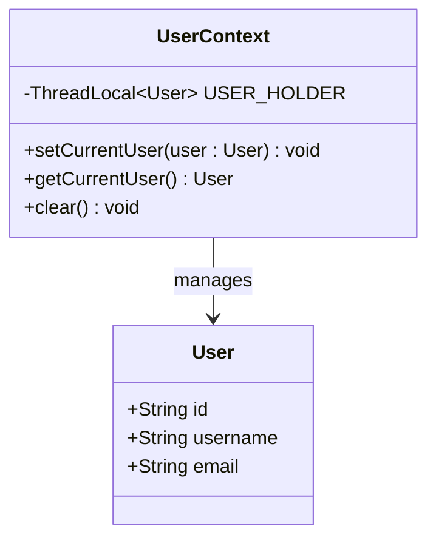
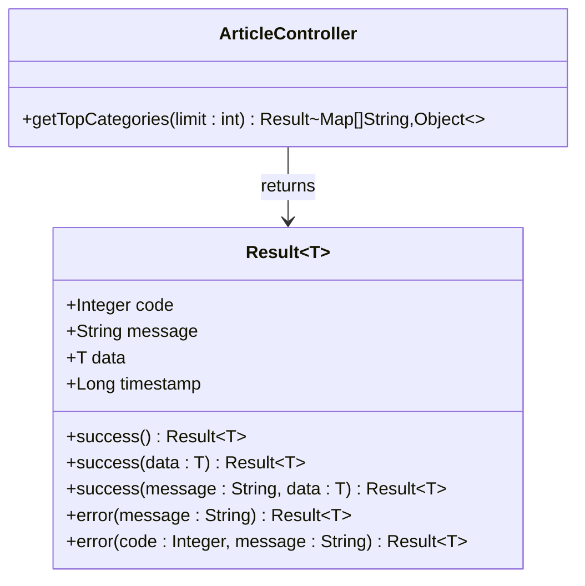
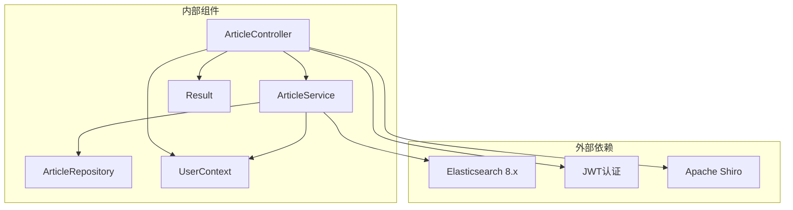
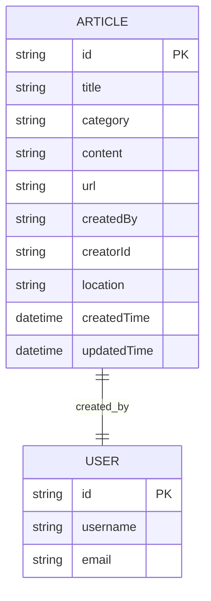
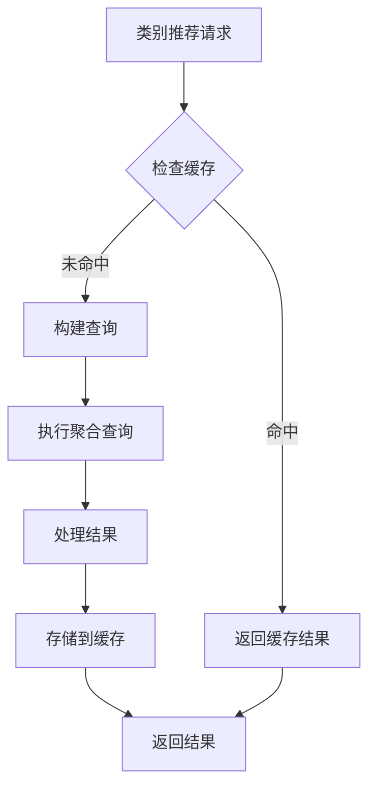

# 类别推荐功能

<cite>
**本文档引用的文件**
- [ArticleController.java](file://src/main/java/com/zhishilu/controller/ArticleController.java)
- [ArticleService.java](file://src/main/java/com/zhishilu/service/ArticleService.java)
- [Article.java](file://src/main/java/com/zhishilu/entity/Article.java)
- [ArticleRepository.java](file://src/main/java/com/zhishilu/repository/ArticleRepository.java)
- [UserContext.java](file://src/main/java/com/zhishilu/util/UserContext.java)
- [Result.java](file://src/main/java/com/zhishilu/common/Result.java)
- [application.yml](file://src/main/resources/application.yml)
</cite>

## 目录
1. [简介](#简介)
2. [项目结构](#项目结构)
3. [核心组件](#核心组件)
4. [架构概览](#架构概览)
5. [详细组件分析](#详细组件分析)
6. [依赖关系分析](#依赖关系分析)
7. [性能考虑](#性能考虑)
8. [故障排除指南](#故障排除指南)
9. [结论](#结论)

## 简介

本项目是一个个人知识收藏管理系统，提供类别推荐功能来帮助用户发现其最常用的类别。该功能基于Elasticsearch的聚合查询实现，能够统计用户的类别使用频率并返回前N个最常用的类别。

类别推荐功能的核心是`getTopCategories`方法，它实现了以下关键功能：
- 基于用户ID过滤数据
- 统计每个类别的出现次数
- 使用Elasticsearch terms聚合进行高效统计
- 返回结构化的推荐结果

## 项目结构

项目采用标准的Spring Boot三层架构设计，主要包含以下模块：



**图表来源**
- [ArticleController.java](file://src/main/java/com/zhishilu/controller/ArticleController.java#L77-L87)
- [ArticleService.java](file://src/main/java/com/zhishilu/service/ArticleService.java#L37-L41)

**章节来源**
- [ArticleController.java](file://src/main/java/com/zhishilu/controller/ArticleController.java#L1-L100)
- [ArticleService.java](file://src/main/java/com/zhishilu/service/ArticleService.java#L1-L50)

## 核心组件

### ArticleController - 接口入口

`ArticleController`提供了RESTful API接口，其中最重要的接口是获取用户最常用类别的端点：

- **端点**: `GET /api/article/categories/top`
- **参数**: `limit` (默认值: 10)
- **返回**: 统一的响应格式，包含类别名称和使用次数

### ArticleService - 业务逻辑核心

`ArticleService`实现了核心的类别统计算法，主要包括：

- **用户过滤**: 通过`creatorId`字段过滤特定用户的文章
- **聚合统计**: 使用Elasticsearch terms聚合统计类别频率
- **结果转换**: 将聚合结果转换为统一的数据格式

### Article实体 - 数据模型

`Article`实体类定义了文章数据的结构，其中与类别推荐相关的关键字段包括：
- `category`: 文章类别（Keyword类型，适合聚合查询）
- `creatorId`: 创建者ID（用于用户过滤）

**章节来源**
- [ArticleController.java](file://src/main/java/com/zhishilu/controller/ArticleController.java#L77-L87)
- [ArticleService.java](file://src/main/java/com/zhishilu/service/ArticleService.java#L170-L199)
- [Article.java](file://src/main/java/com/zhishilu/entity/Article.java#L28-L61)

## 架构概览

类别推荐功能的整体架构采用分层设计，确保了良好的可维护性和扩展性：



**图表来源**
- [ArticleController.java](file://src/main/java/com/zhishilu/controller/ArticleController.java#L80-L86)
- [ArticleService.java](file://src/main/java/com/zhishilu/service/ArticleService.java#L173-L198)

## 详细组件分析

### getTopCategories方法实现详解

#### 查询构建过程

`getTopCategories`方法的核心实现遵循以下步骤：

1. **用户过滤条件构建**
   ```java
   .withQuery(q -> q.term(t -> t.field("creatorId").value(userId)))
   ```
   - 使用term查询精确匹配用户ID
   - 确保只统计当前用户的类别使用情况

2. **聚合查询配置**
   ```java
   .withAggregation("top_categories", a -> a
           .terms(t -> t.field("category").size(limit)))
   ```
   - 定义名为"top_categories"的聚合
   - 对"category"字段执行terms聚合
   - 设置聚合结果数量限制

3. **查询执行优化**
   ```java
   .withMaxResults(0)
   ```
   - 设置最大结果数为0，只返回聚合结果
   - 避免不必要的文档数据传输

#### Elasticsearch聚合查询详解

##### Terms聚合配置

Elasticsearch的terms聚合用于统计字段的不同值及其出现频率：



**图表来源**
- [ArticleService.java](file://src/main/java/com/zhishilu/service/ArticleService.java#L174-L179)

##### 聚合结果处理

聚合查询返回的结果需要经过以下处理步骤：

1. **结果提取**
   ```java
   var aggregations = searchHits.getAggregations();
   var termsAgg = aggregations.get("top_categories");
   ```

2. **桶数据转换**
   ```java
   .buckets().array().stream()
           .map(bucket -> Map.<String, Object>of(
                   "category", bucket.key().stringValue(),
                   "count", bucket.docCount()))
   ```

3. **空值处理**
   ```java
   if (aggregations != null && termsAgg != null) {
       // 处理聚合结果
   } else {
       return List.of();
   }
   ```

#### 数据流处理



**图表来源**
- [ArticleService.java](file://src/main/java/com/zhishilu/service/ArticleService.java#L183-L197)

**章节来源**
- [ArticleService.java](file://src/main/java/com/zhishilu/service/ArticleService.java#L170-L199)

### 用户上下文管理

系统通过`UserContext`工具类管理当前用户信息：



**图表来源**
- [UserContext.java](file://src/main/java/com/zhishilu/util/UserContext.java#L8-L33)

**章节来源**
- [UserContext.java](file://src/main/java/com/zhishilu/util/UserContext.java#L1-L33)

### 统一响应格式

系统使用`Result`类提供统一的API响应格式：



**图表来源**
- [Result.java](file://src/main/java/com/zhishilu/common/Result.java#L8-L71)

**章节来源**
- [Result.java](file://src/main/java/com/zhishilu/common/Result.java#L1-L71)

## 依赖关系分析

### 组件依赖图



**图表来源**
- [ArticleController.java](file://src/main/java/com/zhishilu/controller/ArticleController.java#L1-L100)
- [ArticleService.java](file://src/main/java/com/zhishilu/service/ArticleService.java#L1-L50)

### 数据模型关系



**图表来源**
- [Article.java](file://src/main/java/com/zhishilu/entity/Article.java#L16-L80)

**章节来源**
- [ArticleRepository.java](file://src/main/java/com/zhishilu/repository/ArticleRepository.java#L12-L29)

## 性能考虑

### 查询优化策略

1. **聚合查询优化**
   - 使用`withMaxResults(0)`避免返回文档内容
   - 仅传输必要的聚合结果数据

2. **索引设计优化**
   - `category`字段使用`Keyword`类型，适合聚合查询
   - `creatorId`字段使用`Keyword`类型，支持精确匹配

3. **内存使用优化**
   - 流式处理聚合结果，避免大量中间对象创建
   - 及时清理线程局部变量

### 缓存策略建议

虽然当前实现没有缓存机制，但可以考虑以下优化：



## 故障排除指南

### 常见问题及解决方案

1. **Elasticsearch连接问题**
   - 检查`application.yml`中的ES配置
   - 确认Elasticsearch服务正常运行
   - 验证认证凭据正确性

2. **聚合查询无结果**
   - 确认用户ID存在且正确
   - 检查文章数据中是否存在`creatorId`字段
   - 验证`category`字段是否正确索引

3. **权限相关错误**
   - 确认用户已登录并通过JWT认证
   - 检查Shiro权限配置
   - 验证用户上下文是否正确设置

**章节来源**
- [application.yml](file://src/main/resources/application.yml#L13-L18)

### 调试建议

1. **启用调试日志**
   ```yaml
   logging:
     level:
       org.springframework.data.elasticsearch: DEBUG
   ```

2. **监控查询性能**
   - 使用Elasticsearch的性能分析工具
   - 监控查询响应时间和资源使用

3. **验证数据完整性**
   - 检查文章数据的完整性和一致性
   - 确认索引映射配置正确

## 结论

类别推荐功能通过简洁而高效的实现，为用户提供了个性化的类别推荐能力。该功能的主要优势包括：

1. **实现简洁**: 基于Elasticsearch原生聚合查询，代码简洁易懂
2. **性能优异**: 使用聚合查询和流式处理，避免不必要的数据传输
3. **扩展性强**: 易于调整聚合参数和返回格式
4. **集成良好**: 与系统的认证体系和统一响应格式完美集成

未来可以考虑的改进方向包括：
- 添加缓存机制提升性能
- 支持更复杂的推荐算法
- 提供更多维度的统计信息
- 增加实时推荐功能

该功能为整个知识管理系统提供了重要的个性化体验，有助于用户更好地管理和发现自己的知识内容。