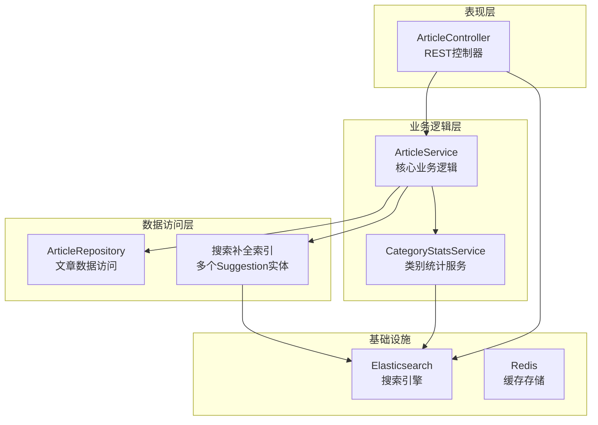
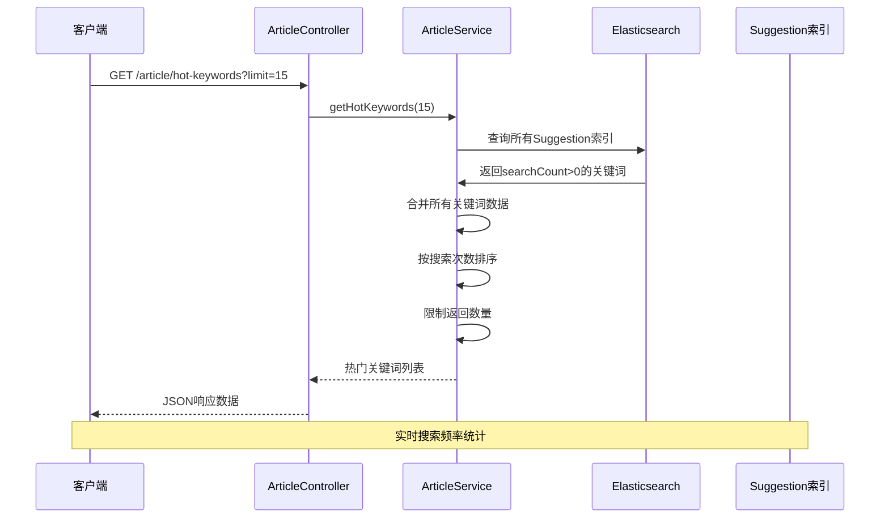
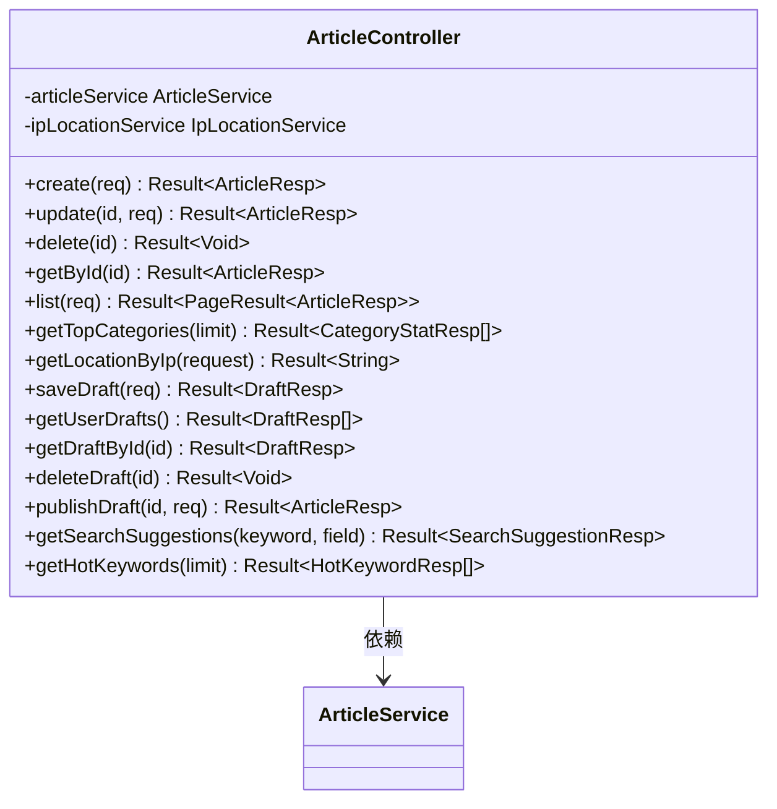
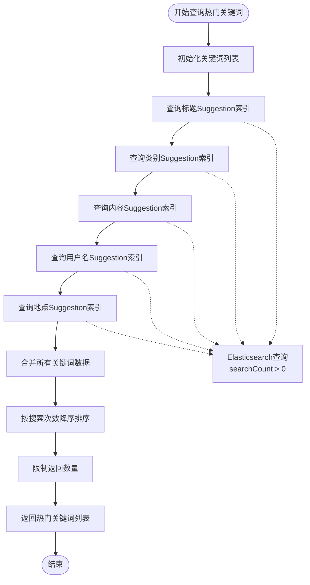
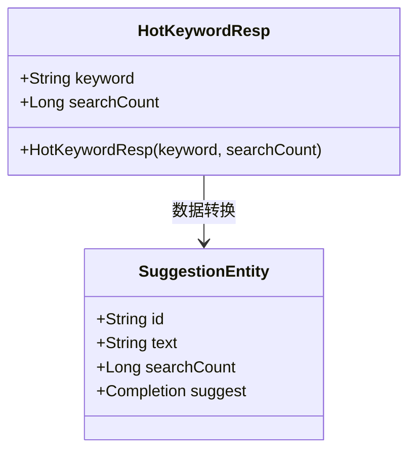
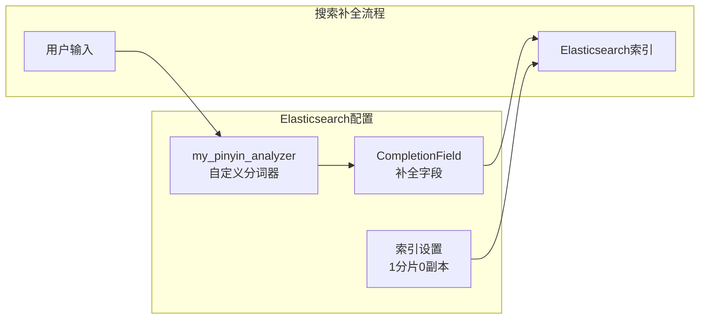
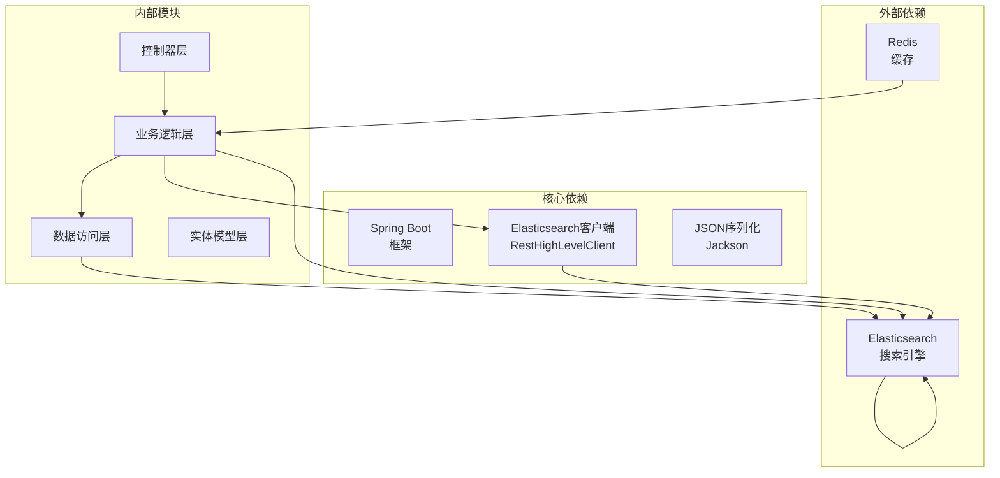

# 热门关键词功能

<cite>
**本文档引用的文件**
- [ArticleController.java](file://src/main/java/com/zhishilu/controller/ArticleController.java)
- [ArticleService.java](file://src/main/java/com/zhishilu/service/ArticleService.java)
- [HotKeywordResp.java](file://src/main/java/com/zhishilu/resp/HotKeywordResp.java)
- [EsCompletionSuggestUtil.java](file://src/main/java/com/zhishilu/util/EsCompletionSuggestUtil.java)
- [TitleSuggestion.java](file://src/main/java/com/zhishilu/entity/TitleSuggestion.java)
- [CategorySuggestion.java](file://src/main/java/com/zhishilu/entity/CategorySuggestion.java)
- [ContentSuggestion.java](file://src/main/java/com/zhishilu/entity/ContentSuggestion.java)
- [UsernameSuggestion.java](file://src/main/java/com/zhishilu/entity/UsernameSuggestion.java)
- [LocationSuggestion.java](file://src/main/java/com/zhishilu/entity/LocationSuggestion.java)
- [application.yml](file://src/main/resources/application.yml)
</cite>

## 目录
1. [简介](#简介)
2. [项目结构](#项目结构)
3. [核心组件](#核心组件)
4. [架构概览](#架构概览)
5. [详细组件分析](#详细组件分析)
6. [依赖关系分析](#依赖关系分析)
7. [性能考虑](#性能考虑)
8. [故障排除指南](#故障排除指南)
9. [结论](#结论)

## 简介

热门关键词功能是知识路系统中的一个重要特性，它能够根据用户的搜索行为统计热门搜索词汇，为用户提供智能化的搜索引导。该功能基于Elasticsearch的搜索频率统计机制，通过分析用户在搜索过程中的行为数据，动态生成热门关键词列表。

该功能的核心价值在于：
- **提升搜索体验**：帮助用户快速找到热门搜索词汇
- **数据驱动优化**：基于真实用户行为优化搜索推荐
- **智能化引导**：为新用户提供搜索方向指导
- **实时性**：能够实时反映最新的搜索趋势

## 项目结构

知识路项目采用标准的Spring Boot三层架构设计，热门关键词功能主要涉及以下层次：

**图表来源**
- [ArticleController.java](file://src/main/java/com/zhishilu/controller/ArticleController.java#L1-L187)
- [ArticleService.java](file://src/main/java/com/zhishilu/service/ArticleService.java#L1-L1018)
- [application.yml](file://src/main/resources/application.yml#L1-L53)

**章节来源**
- [ArticleController.java](file://src/main/java/com/zhishilu/controller/ArticleController.java#L1-L187)
- [ArticleService.java](file://src/main/java/com/zhishilu/service/ArticleService.java#L1-L1018)
- [application.yml](file://src/main/resources/application.yml#L1-L53)

## 核心组件

热门关键词功能由以下几个核心组件构成：

### 1. 控制器层
- **ArticleController**：提供REST API接口，处理热门关键词相关的HTTP请求
- **接口定义**：`GET /article/hot-keywords`，支持limit参数控制返回数量

### 2. 服务层
- **ArticleService**：实现热门关键词的核心业务逻辑
- **方法实现**：`getHotKeywords()`方法负责查询和处理热门关键词数据

### 3. 数据模型层
- **HotKeywordResp**：热门关键词响应数据模型
- **Suggestion实体类**：包含标题、类别、内容、用户名、地点等不同类型的搜索补全实体

### 4. 数据存储层
- **Elasticsearch索引**：存储搜索补全数据和搜索频率统计
- **自定义分词器**：支持中文拼音混合搜索

**章节来源**
- [ArticleController.java](file://src/main/java/com/zhishilu/controller/ArticleController.java#L174-L185)
- [ArticleService.java](file://src/main/java/com/zhishilu/service/ArticleService.java#L964-L1017)
- [HotKeywordResp.java](file://src/main/java/com/zhishilu/resp/HotKeywordResp.java#L1-L26)

## 架构概览

热门关键词功能的整体架构采用分层设计，确保了良好的可维护性和扩展性：

**图表来源**
- [ArticleController.java](file://src/main/java/com/zhishilu/controller/ArticleController.java#L180-L185)
- [ArticleService.java](file://src/main/java/com/zhishilu/service/ArticleService.java#L967-L982)

### 数据流分析

热门关键词功能的数据流具有以下特点：

1. **多源数据聚合**：从5个不同的Suggestion索引中收集数据
2. **实时统计**：基于searchCount字段进行实时频率统计
3. **智能排序**：按照搜索次数降序排列
4. **数量控制**：支持limit参数控制返回结果数量

**章节来源**
- [ArticleService.java](file://src/main/java/com/zhishilu/service/ArticleService.java#L967-L1017)

## 详细组件分析

### ArticleController - 控制器层

ArticleController提供了简洁的REST API接口来访问热门关键词功能：

**图表来源**
- [ArticleController.java](file://src/main/java/com/zhishilu/controller/ArticleController.java#L1-L187)

### ArticleService - 业务逻辑层

ArticleService实现了热门关键词的核心业务逻辑，包括数据查询、处理和排序：

**图表来源**
- [ArticleService.java](file://src/main/java/com/zhishilu/service/ArticleService.java#L967-L1017)

### HotKeywordResp - 数据模型

HotKeywordResp是热门关键词功能的核心数据模型，定义了关键词的基本属性：

**图表来源**
- [HotKeywordResp.java](file://src/main/java/com/zhishilu/resp/HotKeywordResp.java#L1-L26)

### Suggestion实体类体系

系统定义了多种Suggestion实体类来支持不同类型的搜索补全：

| 实体类 | 索引名称 | 字段说明 | 用途 |
|--------|----------|----------|------|
| TitleSuggestion | zhishilu_title_suggestion | text, searchCount, suggest | 标题搜索补全 |
| CategorySuggestion | zhishilu_category_suggestion | text, searchCount, suggest | 类别搜索补全 |
| ContentSuggestion | zhishilu_content_suggestion | text, searchCount, suggest | 内容搜索补全 |
| UsernameSuggestion | zhishilu_username_suggestion | text, searchCount, suggest | 用户名搜索补全 |
| LocationSuggestion | zhishilu_location_suggestion | text, searchCount, suggest | 地点搜索补全 |

**章节来源**
- [TitleSuggestion.java](file://src/main/java/com/zhishilu/entity/TitleSuggestion.java#L1-L51)
- [CategorySuggestion.java](file://src/main/java/com/zhishilu/entity/CategorySuggestion.java#L1-L49)
- [ContentSuggestion.java](file://src/main/java/com/zhishilu/entity/ContentSuggestion.java#L1-L49)
- [UsernameSuggestion.java](file://src/main/java/com/zhishilu/entity/UsernameSuggestion.java#L1-L49)
- [LocationSuggestion.java](file://src/main/java/com/zhishilu/entity/LocationSuggestion.java#L1-L49)

### Elasticsearch配置

系统使用自定义的分词器来支持中文拼音混合搜索：

**图表来源**
- [TitleSuggestion.java](file://src/main/java/com/zhishilu/entity/TitleSuggestion.java#L48-L49)
- [application.yml](file://src/main/resources/application.yml#L13-L18)

**章节来源**
- [EsCompletionSuggestUtil.java](file://src/main/java/com/zhishilu/util/EsCompletionSuggestUtil.java#L1-L137)
- [application.yml](file://src/main/resources/application.yml#L13-L18)

## 依赖关系分析

热门关键词功能的依赖关系体现了清晰的分层架构：

**图表来源**
- [ArticleService.java](file://src/main/java/com/zhishilu/service/ArticleService.java#L65-L70)
- [application.yml](file://src/main/resources/application.yml#L13-L29)

### 关键依赖说明

1. **Elasticsearch依赖**：提供搜索补全和频率统计功能
2. **Spring Boot依赖**：提供Web框架和依赖注入支持
3. **Redis依赖**：提供缓存支持（用于其他功能）
4. **Jackson依赖**：提供JSON序列化支持

**章节来源**
- [ArticleService.java](file://src/main/java/com/zhishilu/service/ArticleService.java#L32-L42)
- [application.yml](file://src/main/resources/application.yml#L13-L29)

## 性能考虑

热门关键词功能在设计时充分考虑了性能优化：

### 1. 查询优化策略

- **范围查询**：使用`rangeQuery("searchCount").gt(0)`避免扫描整个索引
- **分页限制**：设置最大查询数量为100，防止内存溢出
- **排序优化**：在Elasticsearch层面进行降序排序，减少Java端处理

### 2. 缓存策略

- **异步处理**：热门关键词查询不会阻塞主业务流程
- **索引优化**：使用专门的Suggestion索引，避免与主索引竞争

### 3. 内存管理

- **流式处理**：使用Stream API进行数据处理，避免大量中间对象
- **及时释放**：查询完成后及时释放资源

## 故障排除指南

### 常见问题及解决方案

#### 1. 热门关键词为空
**可能原因**：
- Elasticsearch服务未启动
- Suggestion索引未正确创建
- 搜索频率统计未启用

**解决步骤**：
1. 检查Elasticsearch连接配置
2. 验证Suggestion索引是否存在
3. 确认搜索频率统计功能正常工作

#### 2. 查询性能缓慢
**可能原因**：
- 索引数据量过大
- 查询条件过于宽泛
- 系统资源不足

**优化建议**：
1. 定期清理无用的搜索记录
2. 限制查询的时间范围
3. 增加Elasticsearch集群节点

#### 3. 数据不准确
**可能原因**：
- 搜索频率统计逻辑错误
- 数据同步延迟
- 分词器配置不当

**排查方法**：
1. 检查搜索频率更新逻辑
2. 验证数据同步机制
3. 测试分词效果

**章节来源**
- [ArticleService.java](file://src/main/java/com/zhishilu/service/ArticleService.java#L990-L1016)

## 结论

热门关键词功能作为知识路系统的重要组成部分，展现了现代搜索系统的最佳实践。该功能通过以下优势为用户创造价值：

### 技术优势
- **实时性**：基于真实的用户搜索行为，提供即时的热门关键词
- **智能化**：支持多字段搜索补全，提升搜索准确性
- **可扩展性**：模块化设计，易于扩展新的搜索维度

### 业务价值
- **用户体验提升**：帮助用户快速找到相关内容
- **搜索效率提高**：减少用户搜索时间和成本
- **数据洞察**：为企业决策提供有价值的搜索数据分析

### 发展前景
随着用户规模的增长和搜索需求的多样化，热门关键词功能还有很大的优化空间：
- **机器学习集成**：引入推荐算法提升关键词相关性
- **个性化定制**：根据不同用户群体提供定制化的热门关键词
- **多语言支持**：扩展对多语言搜索的支持

该功能的成功实施为知识路系统的整体搜索体验奠定了坚实的基础，是构建智能知识管理平台的关键技术支撑。