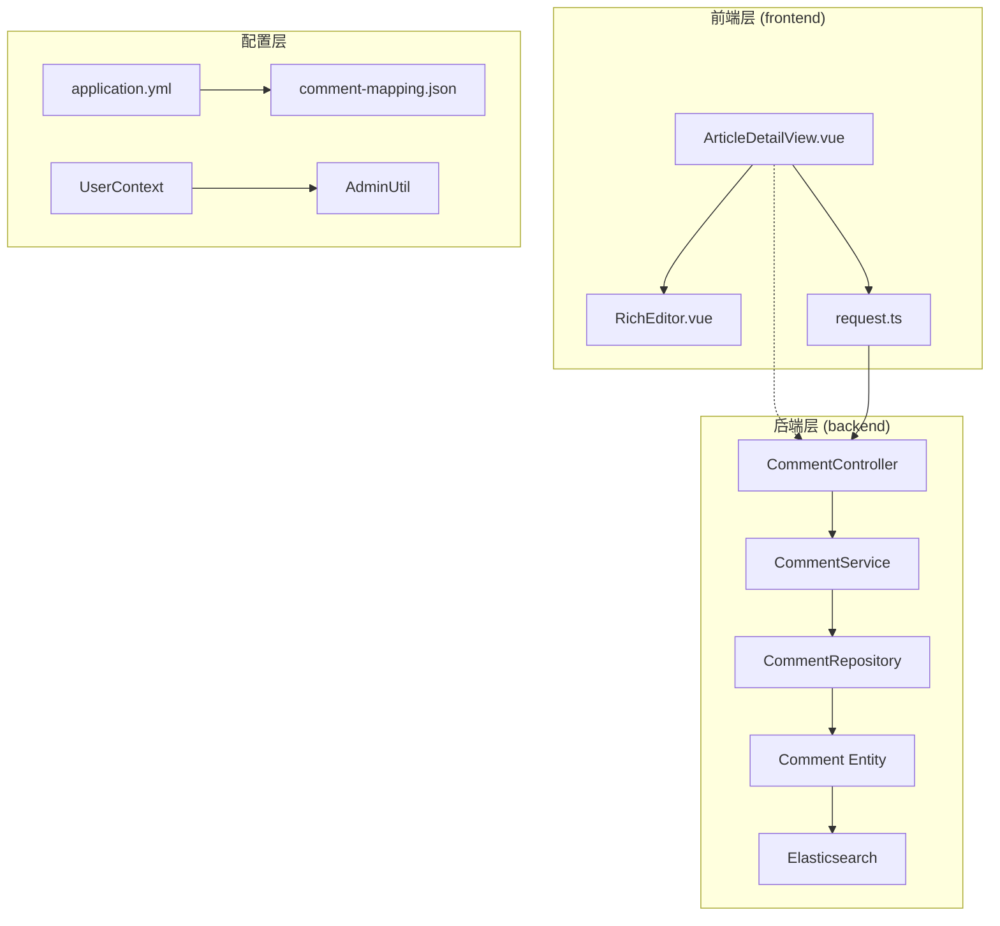
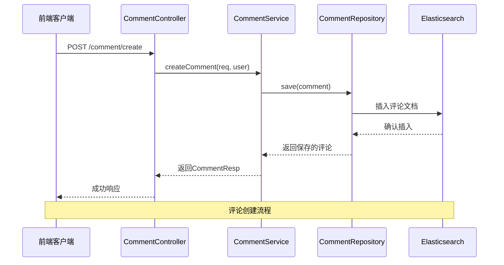
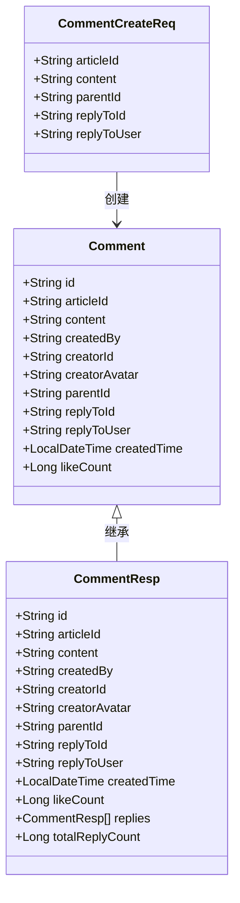
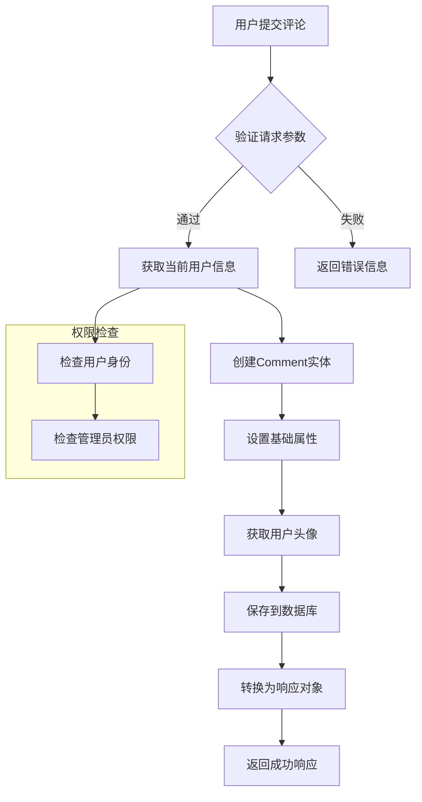
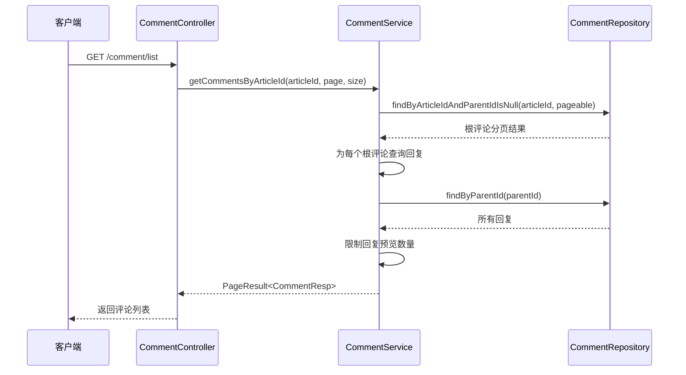
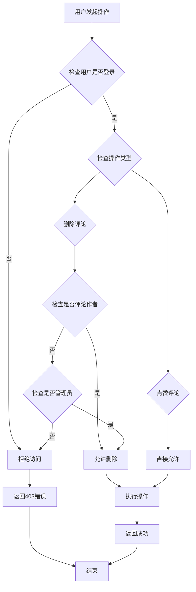
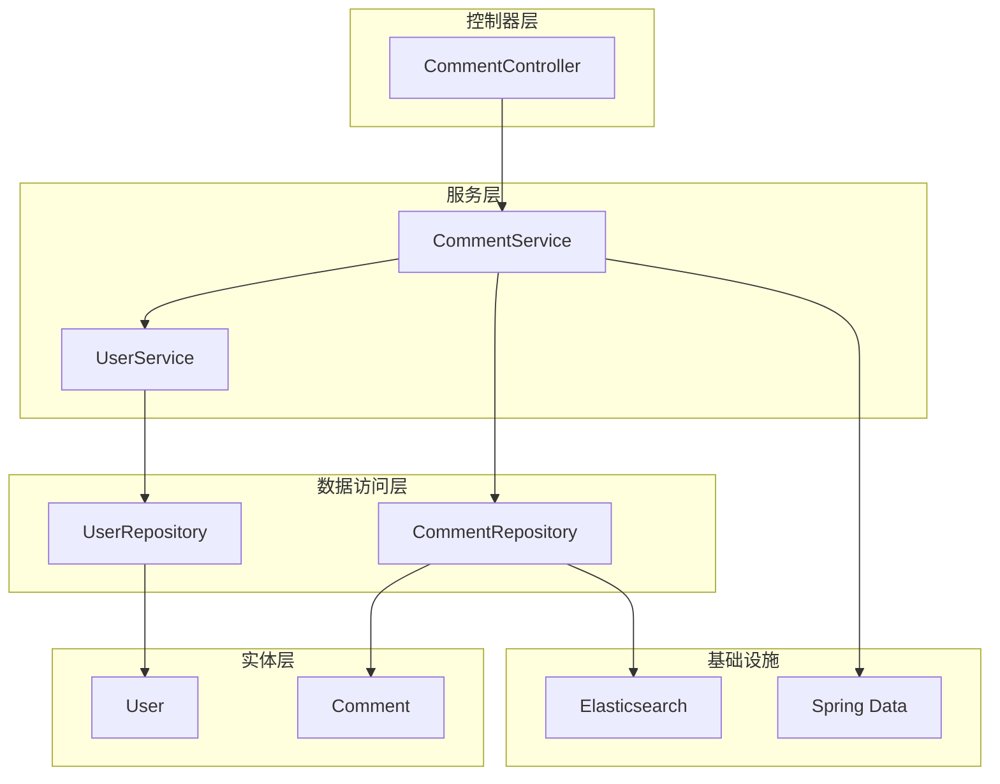
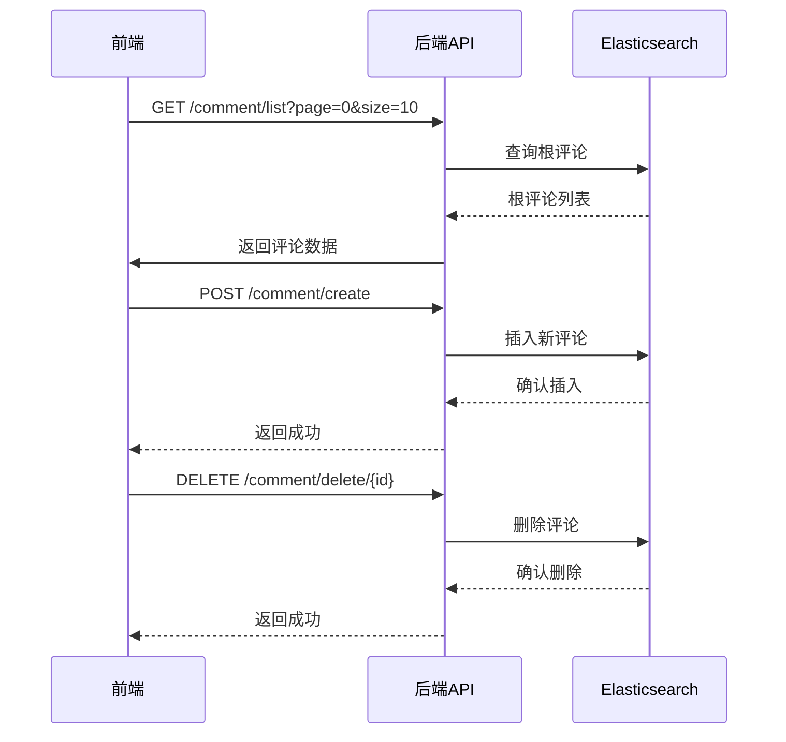

# 评论系统

<cite>
**本文档引用的文件**
- [CommentController.java](file://src/main/java/com/zhishilu/controller/CommentController.java)
- [CommentService.java](file://src/main/java/com/zhishilu/service/CommentService.java)
- [CommentRepository.java](file://src/main/java/com/zhishilu/repository/CommentRepository.java)
- [Comment.java](file://src/main/java/com/zhishilu/entity/Comment.java)
- [CommentCreateReq.java](file://src/main/java/com/zhishilu/req/CommentCreateReq.java)
- [CommentResp.java](file://src/main/java/com/zhishilu/resp/CommentResp.java)
- [comment-mapping.json](file://src/main/resources/comment-mapping.json)
- [PageResult.java](file://src/main/java/com/zhishilu/common/PageResult.java)
- [UserContext.java](file://src/main/java/com/zhishilu/util/UserContext.java)
- [AdminUtil.java](file://src/main/java/com/zhishilu/util/AdminUtil.java)
- [request.ts](file://frontend/src/utils/request.ts)
- [ArticleDetailView.vue](file://frontend/src/views/ArticleDetailView.vue)
- [application.yml](file://src/main/resources/application.yml)
</cite>

## 目录
1. [简介](#简介)
2. [项目结构](#项目结构)
3. [核心组件](#核心组件)
4. [架构概览](#架构概览)
5. [详细组件分析](#详细组件分析)
6. [依赖关系分析](#依赖关系分析)
7. [性能考虑](#性能考虑)
8. [故障排除指南](#故障排除指南)
9. [结论](#结论)

## 简介

这是一个基于Spring Boot和Vue.js构建的评论系统，采用前后端分离架构。系统支持文章评论和回复功能，具有完整的权限管理和用户体验设计。

**章节来源**
- [CommentController.java](file://src/main/java/com/zhishilu/controller/CommentController.java#L15-L17)
- [CommentService.java](file://src/main/java/com/zhishilu/service/CommentService.java#L23-L25)

## 项目结构

评论系统采用经典的三层架构设计：

**图表来源**
- [ArticleDetailView.vue](file://frontend/src/views/ArticleDetailView.vue#L1-L50)
- [CommentController.java](file://src/main/java/com/zhishilu/controller/CommentController.java#L18-L21)
- [CommentService.java](file://src/main/java/com/zhishilu/service/CommentService.java#L26-L29)

**章节来源**
- [application.yml](file://src/main/resources/application.yml#L1-L57)
- [comment-mapping.json](file://src/main/resources/comment-mapping.json#L1-L42)

## 核心组件

### 后端核心组件

#### 控制器层
- **CommentController**: 提供RESTful API接口，处理评论相关的HTTP请求
- 支持评论发布、列表查询、回复查询、删除、点赞等操作

#### 服务层
- **CommentService**: 核心业务逻辑处理，包含评论创建、查询、删除、点赞等功能
- 集成用户信息服务获取用户头像信息

#### 数据访问层
- **CommentRepository**: 基于Spring Data Elasticsearch的仓库接口
- 提供多种查询方法：按文章ID查询、按父评论ID查询、统计评论数量等

#### 实体层
- **Comment**: Elasticsearch文档实体，支持嵌套评论结构
- 完整的字段映射配置，包括全文搜索支持

**章节来源**
- [CommentController.java](file://src/main/java/com/zhishilu/controller/CommentController.java#L25-L87)
- [CommentService.java](file://src/main/java/com/zhishilu/service/CommentService.java#L37-L164)
- [CommentRepository.java](file://src/main/java/com/zhishilu/repository/CommentRepository.java#L13-L44)

### 前端核心组件

#### 视图层
- **ArticleDetailView.vue**: 文章详情页面，集成评论功能
- 实现评论列表展示、回复功能、点赞交互等

#### 工具层
- **request.ts**: Axios封装的HTTP客户端，统一处理请求和响应
- 自动添加认证头，统一错误处理

**章节来源**
- [ArticleDetailView.vue](file://frontend/src/views/ArticleDetailView.vue#L767-L948)
- [request.ts](file://frontend/src/utils/request.ts#L1-L65)

## 架构概览

评论系统采用微服务化的分层架构：

**图表来源**
- [CommentController.java](file://src/main/java/com/zhishilu/controller/CommentController.java#L28-L33)
- [CommentService.java](file://src/main/java/com/zhishilu/service/CommentService.java#L37-L63)
- [CommentRepository.java](file://src/main/java/com/zhishilu/repository/CommentRepository.java#L13-L18)

**章节来源**
- [CommentController.java](file://src/main/java/com/zhishilu/controller/CommentController.java#L1-L88)
- [CommentService.java](file://src/main/java/com/zhishilu/service/CommentService.java#L1-L165)

## 详细组件分析

### 评论实体设计

评论系统采用嵌套评论结构，支持无限层级回复：

**图表来源**
- [Comment.java](file://src/main/java/com/zhishilu/entity/Comment.java#L16-L80)
- [CommentCreateReq.java](file://src/main/java/com/zhishilu/req/CommentCreateReq.java#L12-L41)
- [CommentResp.java](file://src/main/java/com/zhishilu/resp/CommentResp.java#L12-L78)

#### 字段映射配置

评论实体采用Elasticsearch文档映射：

| 字段名 | 类型 | 分析器 | 说明 |
|--------|------|--------|------|
| id | keyword | - | 评论唯一标识 |
| articleId | keyword | - | 所属文章ID |
| content | text | ik_max_word/ik_smart | 评论内容，支持中文分词 |
| createdBy | keyword | - | 评论用户名 |
| creatorId | keyword | - | 评论用户ID |
| creatorAvatar | keyword | index=false | 评论用户头像 |
| parentId | keyword | - | 父评论ID（根评论为null） |
| replyToId | keyword | - | 被回复评论ID |
| replyToUser | keyword | - | 被回复用户名 |
| createdTime | date | yyyy-MM-dd'T'HH:mm:ss.SSS | 创建时间 |
| likeCount | long | - | 点赞数量 |

**章节来源**
- [comment-mapping.json](file://src/main/resources/comment-mapping.json#L1-L42)
- [Comment.java](file://src/main/java/com/zhishilu/entity/Comment.java#L13-L80)

### 业务流程分析

#### 评论创建流程

**图表来源**
- [CommentService.java](file://src/main/java/com/zhishilu/service/CommentService.java#L37-L63)
- [CommentController.java](file://src/main/java/com/zhishilu/controller/CommentController.java#L28-L33)

#### 评论列表查询流程

**图表来源**
- [CommentService.java](file://src/main/java/com/zhishilu/service/CommentService.java#L68-L94)
- [CommentRepository.java](file://src/main/java/com/zhishilu/repository/CommentRepository.java#L22-L28)

**章节来源**
- [CommentService.java](file://src/main/java/com/zhishilu/service/CommentService.java#L67-L108)

### 权限管理机制

系统实现了多层次的权限控制：

**图表来源**
- [CommentService.java](file://src/main/java/com/zhishilu/service/CommentService.java#L113-L132)
- [AdminUtil.java](file://src/main/java/com/zhishilu/util/AdminUtil.java#L14-L59)

**章节来源**
- [AdminUtil.java](file://src/main/java/com/zhishilu/util/AdminUtil.java#L27-L58)
- [UserContext.java](file://src/main/java/com/zhishilu/util/UserContext.java#L8-L33)

## 依赖关系分析

### 后端依赖关系

**图表来源**
- [CommentController.java](file://src/main/java/com/zhishilu/controller/CommentController.java#L23-L24)
- [CommentService.java](file://src/main/java/com/zhishilu/service/CommentService.java#L32-L33)

### 前后端通信

**图表来源**
- [ArticleDetailView.vue](file://frontend/src/views/ArticleDetailView.vue#L767-L948)
- [CommentController.java](file://src/main/java/com/zhishilu/controller/CommentController.java#L38-L67)

**章节来源**
- [request.ts](file://frontend/src/utils/request.ts#L1-L65)
- [CommentController.java](file://src/main/java/com/zhishilu/controller/CommentController.java#L1-L88)

## 性能考虑

### 数据库优化

1. **索引策略**
   - 使用keyword类型字段进行精确匹配查询
   - content字段使用中文分词器支持全文搜索
   - createdTime字段建立时间排序索引

2. **查询优化**
   - 根评论查询使用parentId为null的过滤条件
   - 回复查询限制预览数量（默认3条）
   - 分页查询使用Spring Data的Pageable接口

3. **缓存策略**
   - Elasticsearch作为主要存储，天然具备高性能查询能力
   - 用户头像信息从用户服务获取，避免重复查询

### 前端性能优化

1. **懒加载**
   - 评论列表采用分页加载
   - 回复内容按需加载，点击展开时才请求数据

2. **虚拟滚动**
   - 长列表使用虚拟滚动技术提升渲染性能

3. **请求优化**
   - 统一的请求拦截器处理认证和错误
   - 防抖和节流机制避免频繁请求

## 故障排除指南

### 常见问题及解决方案

#### 1. Elasticsearch连接问题
**症状**: 应用启动时报Elasticsearch连接超时
**解决方案**:
- 检查application.yml中的elasticsearch配置
- 确认Elasticsearch服务正常运行
- 验证网络连接和防火墙设置

#### 2. 评论无法保存
**症状**: 发送评论后无响应或报错
**解决方案**:
- 检查CommentCreateReq参数验证
- 确认用户已登录且具有评论权限
- 查看后端日志获取详细错误信息

#### 3. 权限相关错误
**症状**: 删除评论或点赞时返回403错误
**解决方案**:
- 验证用户是否为评论作者或管理员
- 检查AdminConfig配置中的管理员名单
- 确认UserContext中用户信息正确设置

#### 4. 前端请求失败
**症状**: 前端控制台出现网络错误
**解决方案**:
- 检查CORS配置是否正确
- 验证Token是否正确传递
- 确认后端API路径配置

**章节来源**
- [application.yml](file://src/main/resources/application.yml#L13-L18)
- [request.ts](file://frontend/src/utils/request.ts#L34-L62)

## 结论

该评论系统采用了现代化的技术栈和架构设计，具有以下特点：

### 技术优势
1. **架构清晰**: 采用分层架构，职责明确，易于维护和扩展
2. **性能优秀**: 基于Elasticsearch的全文搜索和高效查询
3. **用户体验**: 前后端分离，响应式设计，良好的交互体验
4. **安全性**: 完善的权限控制和错误处理机制

### 功能特性
1. **嵌套评论**: 支持无限层级的回复结构
2. **权限管理**: 用户、作者、管理员多级权限控制
3. **搜索功能**: 基于中文分词的全文搜索
4. **实时更新**: 评论创建后即时刷新显示

### 扩展建议
1. **消息通知**: 添加评论回复通知功能
2. **内容审核**: 集成内容安全检测
3. **统计分析**: 添加评论热度和趋势分析
4. **移动端优化**: 针对移动设备的界面优化

该系统为知识分享平台提供了完善的评论功能基础，能够满足大多数应用场景的需求。