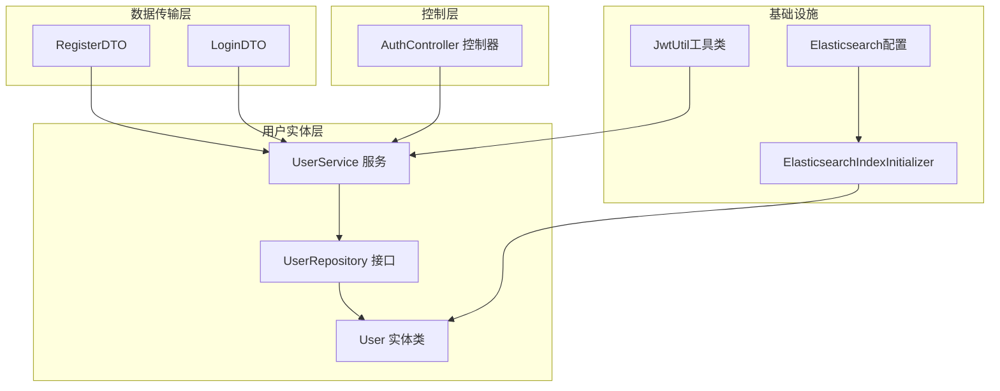
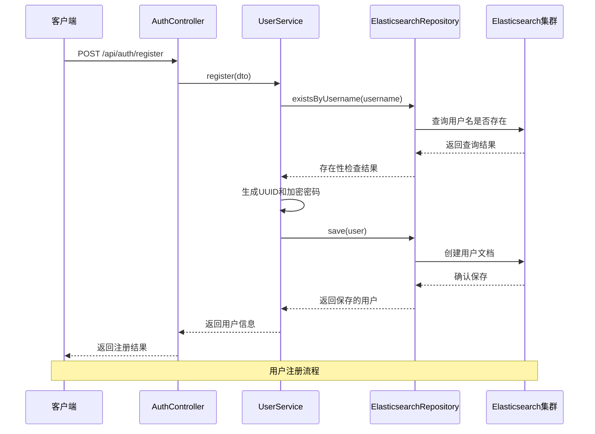
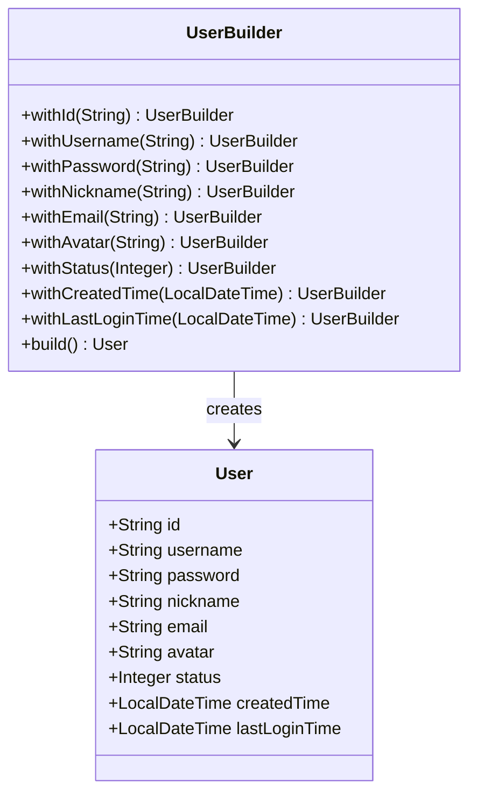
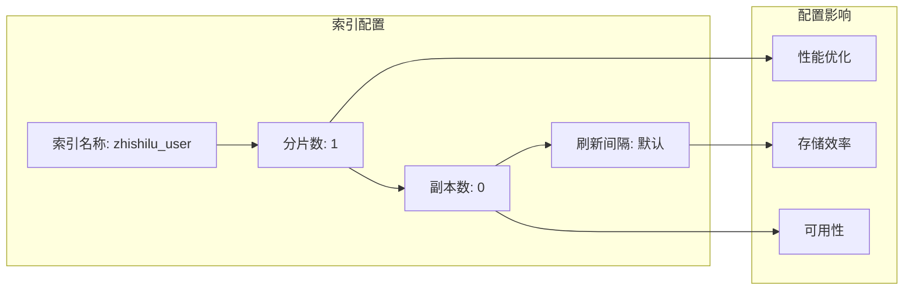
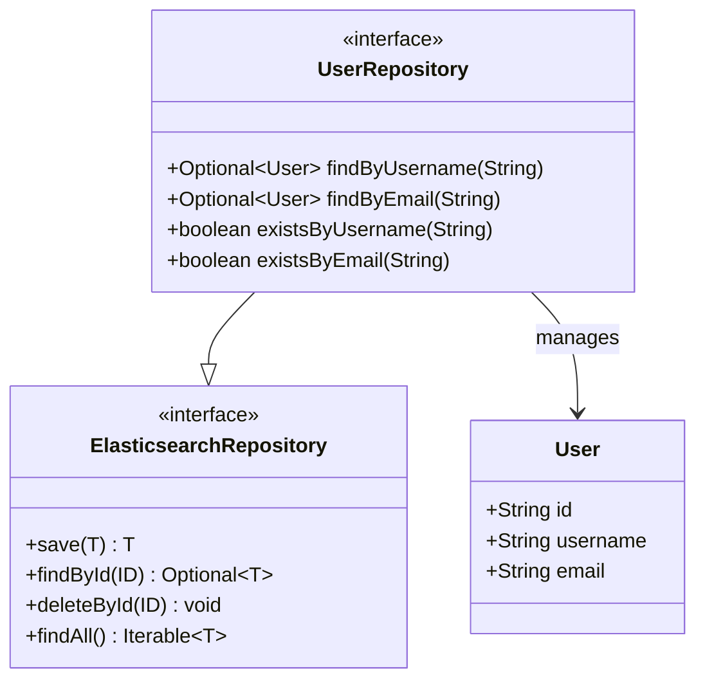
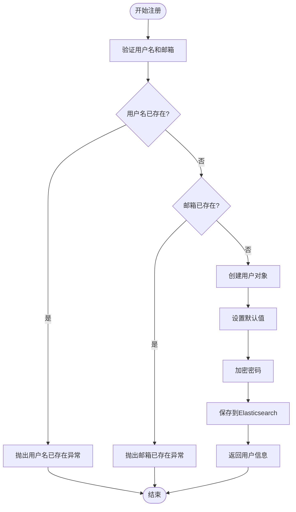
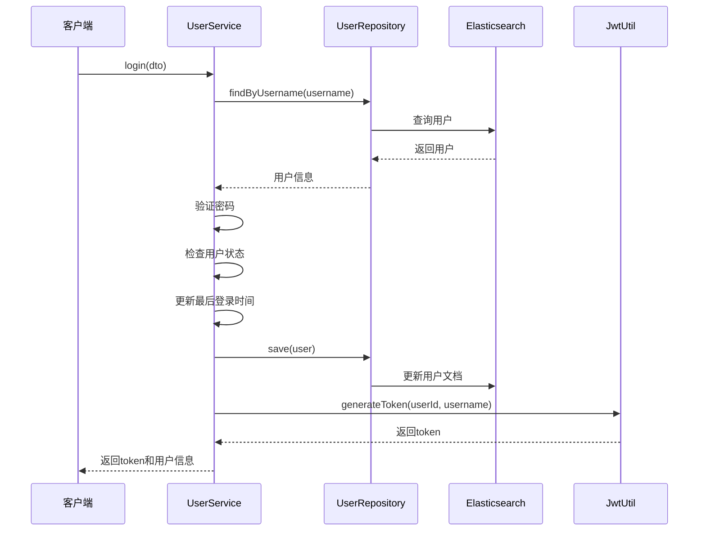
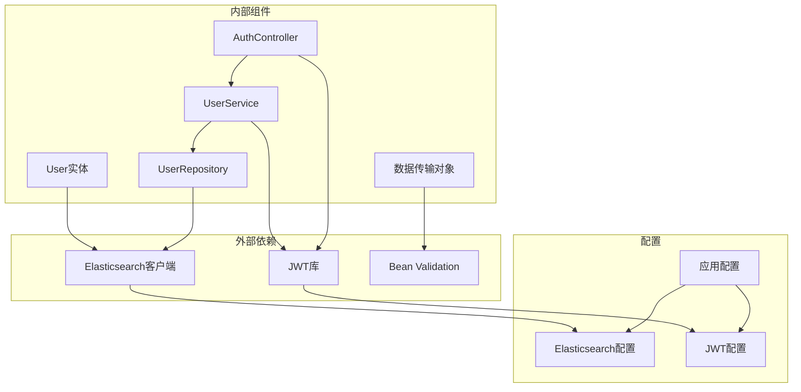
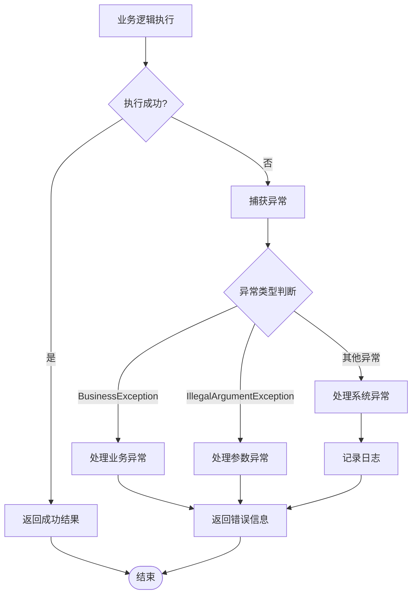

# 用户实体模型

<cite>
**本文档引用的文件**
- [User.java](file://src/main/java/com/zhishilu/entity/User.java)
- [UserRepository.java](file://src/main/java/com/zhishilu/repository/UserRepository.java)
- [UserService.java](file://src/main/java/com/zhishilu/service/UserService.java)
- [AuthController.java](file://src/main/java/com/zhishilu/controller/AuthController.java)
- [RegisterDTO.java](file://src/main/java/com/zhishilu/dto/RegisterDTO.java)
- [LoginDTO.java](file://src/main/java/com/zhishilu/dto/LoginDTO.java)
- [ElasticsearchIndexInitializer.java](file://src/main/java/com/zhishilu/config/ElasticsearchIndexInitializer.java)
- [application.yml](file://src/main/resources/application.yml)
- [JwtUtil.java](file://src/main/java/com/zhishilu/util/JwtUtil.java)
- [BusinessException.java](file://src/main/java/com/zhishilu/exception/BusinessException.java)
</cite>

## 目录
1. [简介](#简介)
2. [项目结构](#项目结构)
3. [核心组件](#核心组件)
4. [架构概览](#架构概览)
5. [详细组件分析](#详细组件分析)
6. [依赖关系分析](#依赖关系分析)
7. [性能考虑](#性能考虑)
8. [故障排除指南](#故障排除指南)
9. [结论](#结论)

## 简介

用户实体模型是知拾录个人知识收藏管理系统的核心数据结构，基于Spring Data Elasticsearch实现。该系统采用Elasticsearch作为主要数据存储，结合JWT认证机制，为用户提供完整的用户管理功能。

本项目采用现代化的技术栈：
- Java 17 + Spring Boot 3.2.1
- Elasticsearch 8.x 作为数据存储
- Apache Shiro + JWT进行认证鉴权
- Lombok简化代码开发

## 项目结构

用户实体模型在整个项目中的位置和作用：



**图表来源**
- [User.java](file://src/main/java/com/zhishilu/entity/User.java#L1-L68)
- [UserRepository.java](file://src/main/java/com/zhishilu/repository/UserRepository.java#L1-L35)
- [UserService.java](file://src/main/java/com/zhishilu/service/UserService.java#L1-L128)

**章节来源**
- [User.java](file://src/main/java/com/zhishilu/entity/User.java#L1-L68)
- [application.yml](file://src/main/resources/application.yml#L13-L18)

## 核心组件

### 用户实体类设计

用户实体类采用Lombok注解简化代码，并通过Spring Data Elasticsearch注解实现与Elasticsearch的集成。

#### 核心注解说明

- `@Document(indexName = "zhishilu_user")`: 指定Elasticsearch索引名称为"zhishilu_user"
- `@Setting(shards = 1, replicas = 0)`: 配置索引分片数和副本数
- `@Id`: 标识主键字段
- `@Field`: 定义字段映射和数据类型

#### 字段定义与业务含义

| 字段名 | 数据类型 | ES映射类型 | 业务含义 | 配置说明 |
|--------|----------|------------|----------|----------|
| id | String | Keyword | 用户唯一标识符 | 自动生成UUID |
| username | String | Keyword | 用户名 | 关键字类型，支持精确匹配 |
| password | String | Keyword | 加密后的密码 | 不建立倒排索引，仅存储明文 |
| nickname | String | Keyword | 昵称 | 关键字类型，支持精确匹配 |
| email | String | Keyword | 邮箱地址 | 关键字类型，支持精确匹配 |
| avatar | String | Keyword | 头像路径 | 关键字类型，存储文件路径 |
| status | Integer | Integer | 用户状态 | 1-正常，0-禁用 |
| createdTime | LocalDateTime | Date | 创建时间 | ISO 8601格式存储 |
| lastLoginTime | LocalDateTime | Date | 最后登录时间 | ISO 8601格式存储 |

**章节来源**
- [User.java](file://src/main/java/com/zhishilu/entity/User.java#L13-L66)

## 架构概览

用户实体模型的整体架构设计：



**图表来源**
- [AuthController.java](file://src/main/java/com/zhishilu/controller/AuthController.java#L27-L31)
- [UserService.java](file://src/main/java/com/zhishilu/service/UserService.java#L35-L56)
- [UserRepository.java](file://src/main/java/com/zhishilu/repository/UserRepository.java#L18-L28)

## 详细组件分析

### 用户实体类详细分析

#### 类结构设计



**图表来源**
- [User.java](file://src/main/java/com/zhishilu/entity/User.java#L15-L66)

#### 字段映射策略

每个字段都采用了特定的映射策略以满足不同的业务需求：

1. **关键字字段（Keyword）**: username, password, nickname, email, avatar
   - 适用于精确匹配和聚合查询
   - 不进行全文分析，保持原始值
   - 适合用于过滤和排序操作

2. **整数字段（Integer）**: status
   - 存储用户状态值
   - 支持数值范围查询和比较操作

3. **日期字段（Date）**: createdTime, lastLoginTime
   - 使用ISO 8601格式存储
   - 支持时间范围查询和排序

**章节来源**
- [User.java](file://src/main/java/com/zhishilu/entity/User.java#L23-L66)

### 数据库索引配置

#### 索引设置分析



**图表来源**
- [User.java](file://src/main/java/com/zhishilu/entity/User.java#L14)
- [ElasticsearchIndexInitializer.java](file://src/main/java/com/zhishilu/config/ElasticsearchIndexInitializer.java#L31-L38)

#### 配置决策说明

- **分片数设置**: 1个分片适用于开发环境和小规模数据
- **副本数设置**: 0个副本减少存储开销，适合测试环境
- **动态调整**: 生产环境中可根据数据量和查询负载调整分片和副本数量

**章节来源**
- [User.java](file://src/main/java/com/zhishilu/entity/User.java#L14)
- [application.yml](file://src/main/resources/application.yml#L13-L18)

### 数据访问层设计

#### Repository接口设计



**图表来源**
- [UserRepository.java](file://src/main/java/com/zhishilu/repository/UserRepository.java#L13-L34)

#### 查询方法分析

| 方法名 | 参数 | 返回值 | 业务用途 |
|--------|------|--------|----------|
| findByUsername | String | Optional<User> | 根据用户名查找用户 |
| findByEmail | String | Optional<User> | 根据邮箱查找用户 |
| existsByUsername | String | boolean | 检查用户名是否存在 |
| existsByEmail | String | boolean | 检查邮箱是否存在 |

**章节来源**
- [UserRepository.java](file://src/main/java/com/zhishilu/repository/UserRepository.java#L18-L33)

### 服务层业务逻辑

#### 用户注册流程



**图表来源**
- [UserService.java](file://src/main/java/com/zhishilu/service/UserService.java#L35-L56)

#### 用户登录流程



**图表来源**
- [UserService.java](file://src/main/java/com/zhishilu/service/UserService.java#L61-L87)
- [JwtUtil.java](file://src/main/java/com/zhishilu/util/JwtUtil.java#L31-L43)

**章节来源**
- [UserService.java](file://src/main/java/com/zhishilu/service/UserService.java#L35-L126)

## 依赖关系分析

### 组件间依赖关系



**图表来源**
- [User.java](file://src/main/java/com/zhishilu/entity/User.java#L3-L5)
- [UserService.java](file://src/main/java/com/zhishilu/service/UserService.java#L27-L28)
- [application.yml](file://src/main/resources/application.yml#L26-L31)

### 数据流分析

用户数据在系统中的流转过程：

1. **输入阶段**: DTO接收HTTP请求参数
2. **验证阶段**: Bean Validation确保数据完整性
3. **业务处理**: Service层执行业务逻辑
4. **持久化**: Repository层与Elasticsearch交互
5. **输出阶段**: 控制器返回响应给客户端

**章节来源**
- [AuthController.java](file://src/main/java/com/zhishilu/controller/AuthController.java#L27-L40)
- [RegisterDTO.java](file://src/main/java/com/zhishilu/dto/RegisterDTO.java#L14-L26)
- [LoginDTO.java](file://src/main/java/com/zhishilu/dto/LoginDTO.java#L12-L16)

## 性能考虑

### 索引性能优化

#### 字段选择策略

1. **关键字字段优化**
   - 对于需要精确匹配的字段使用Keyword类型
   - 避免对大文本字段使用Keyword类型
   - 考虑字段基数对内存的影响

2. **日期字段优化**
   - 使用ISO 8601格式确保时区一致性
   - 合理设置日期解析格式
   - 考虑时间范围查询的性能

3. **密码字段安全**
   - 密码字段不建立倒排索引，仅存储加密值
   - 使用强加密算法（SHA-256）
   - 实施盐值机制防止彩虹表攻击

#### 查询性能优化

1. **索引设计**
   - 单分片配置适合开发环境
   - 生产环境根据数据量调整分片数
   - 考虑查询模式优化索引结构

2. **缓存策略**
   - 对频繁查询的结果实施缓存
   - 合理设置缓存失效时间
   - 避免缓存敏感数据

### 安全考虑

#### 数据保护

1. **密码安全**
   - 使用SHA-256哈希算法
   - 实施1024次迭代增强安全性
   - 使用固定盐值防止预计算攻击

2. **敏感信息处理**
   - 用户上下文中清理敏感字段
   - API响应中避免泄露密码信息
   - 日志记录中过滤敏感数据

**章节来源**
- [UserService.java](file://src/main/java/com/zhishilu/service/UserService.java#L108-L110)
- [UserService.java](file://src/main/java/com/zhishilu/service/UserService.java#L115-L126)

## 故障排除指南

### 常见问题及解决方案

#### Elasticsearch连接问题

**问题症状**:
- 应用启动时报Elasticsearch连接失败
- 用户注册/登录操作超时

**排查步骤**:
1. 检查application.yml中的ES配置
2. 验证Elasticsearch服务状态
3. 确认网络连通性和认证信息

**解决方案**:
```yaml
spring:
  elasticsearch:
    uris: http://localhost:9200
    username: elastic
    password: changeme
    connection-timeout: 5s
    socket-timeout: 30s
```

#### 用户名重复问题

**问题症状**:
- 注册时提示用户名已存在
- 业务异常抛出"用户名已存在"

**排查步骤**:
1. 检查用户名唯一性约束
2. 验证数据库中是否存在重复记录
3. 确认业务逻辑中的去重检查

**解决方案**:
```java
// 在注册前检查用户名是否存在
if (userRepository.existsByUsername(dto.getUsername())) {
    throw new BusinessException("用户名已存在");
}
```

#### JWT令牌问题

**问题症状**:
- 登录后无法获取有效令牌
- Token解析失败或过期

**排查步骤**:
1. 检查JWT密钥配置
2. 验证令牌签名算法
3. 确认令牌过期时间设置

**解决方案**:
```yaml
jwt:
  secret: zhishilu-secret-key-must-be-at-least-256-bits-long-for-hs256
  expiration: 86400000  # 24小时
  header: Authorization
  prefix: Bearer
```

**章节来源**
- [application.yml](file://src/main/resources/application.yml#L13-L31)
- [BusinessException.java](file://src/main/java/com/zhishilu/exception/BusinessException.java#L13-L21)

### 错误处理机制

#### 异常分类

| 异常类型 | 触发条件 | 错误码 | 处理方式 |
|----------|----------|--------|----------|
| BusinessException | 业务逻辑错误 | 500 | 返回友好错误信息 |
| IllegalArgumentException | 参数验证失败 | 400 | 返回参数错误信息 |
| RuntimeException | 系统异常 | 500 | 记录日志并返回通用错误 |

#### 异常处理流程



**图表来源**
- [BusinessException.java](file://src/main/java/com/zhishilu/exception/BusinessException.java#L9-L21)
- [UserService.java](file://src/main/java/com/zhishilu/service/UserService.java#L37-L44)

**章节来源**
- [BusinessException.java](file://src/main/java/com/zhishilu/exception/BusinessException.java#L1-L23)
- [UserService.java](file://src/main/java/com/zhishilu/service/UserService.java#L35-L44)

## 结论

用户实体模型设计充分体现了现代微服务架构的最佳实践：

### 设计优势

1. **清晰的职责分离**: 实体类专注于数据结构，服务层处理业务逻辑
2. **良好的可扩展性**: 基于Spring Data Elasticsearch的接口设计便于扩展
3. **完善的错误处理**: 统一的异常处理机制确保系统的稳定性
4. **安全考虑周全**: 密码加密、敏感信息清理等安全措施到位

### 改进建议

1. **生产环境配置优化**
   - 调整Elasticsearch分片和副本数量
   - 实施监控和告警机制
   - 添加数据备份策略

2. **性能优化方向**
   - 实施查询缓存机制
   - 优化索引映射配置
   - 考虑读写分离策略

3. **功能扩展建议**
   - 添加用户角色和权限管理
   - 实施用户行为追踪
   - 增加用户统计和分析功能

该用户实体模型为整个知拾录系统提供了坚实的数据基础，通过合理的架构设计和完善的错误处理机制，确保了系统的稳定性和可维护性。