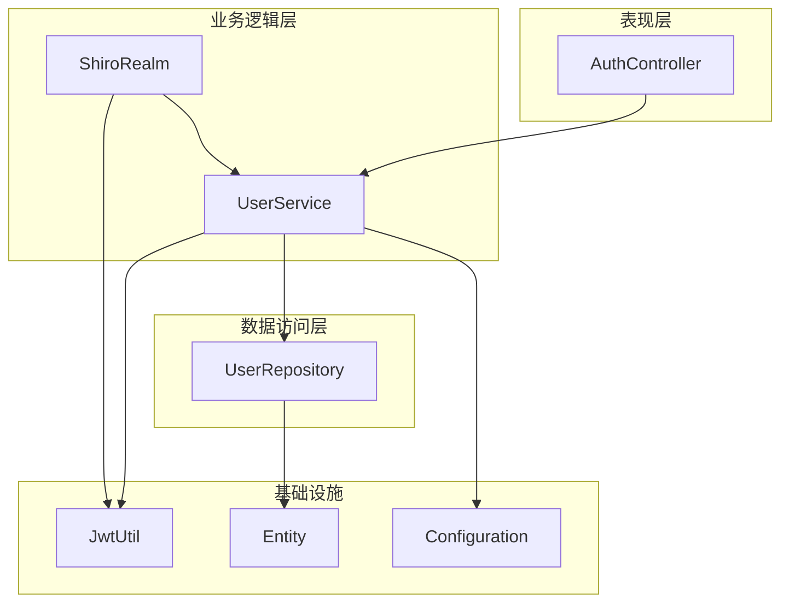
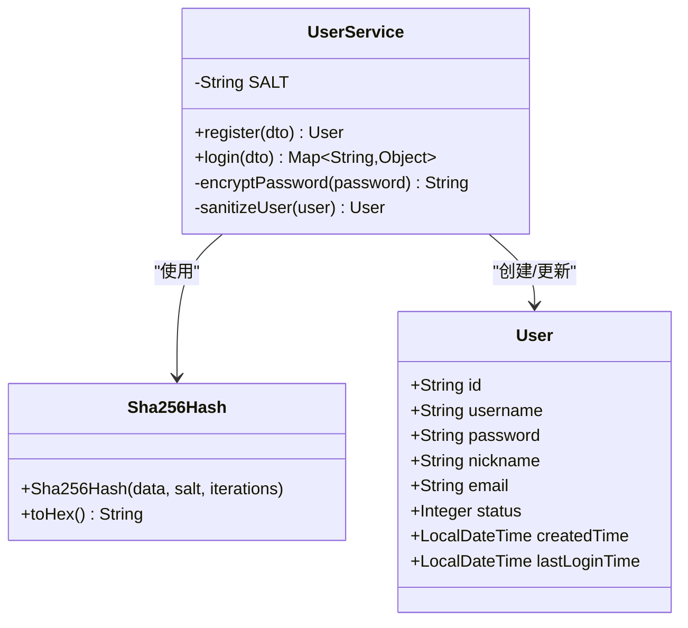
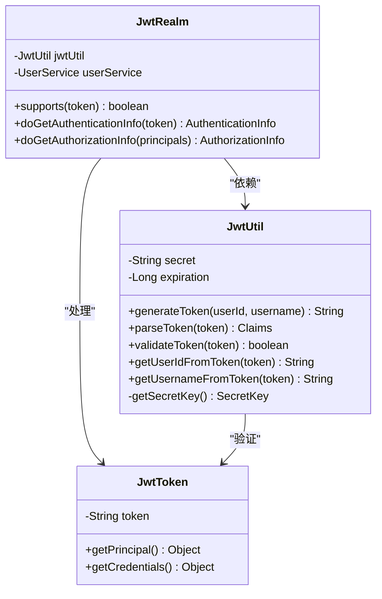
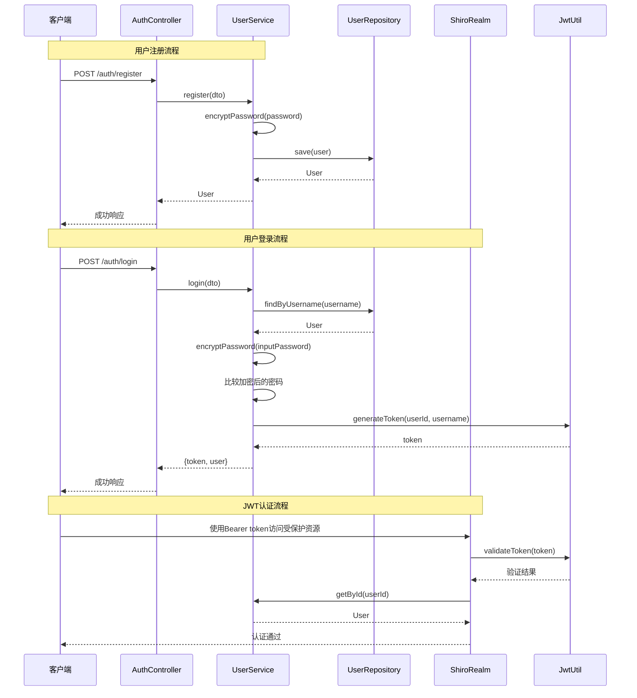
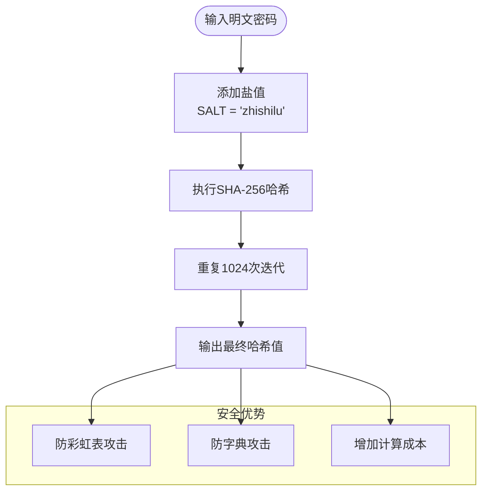
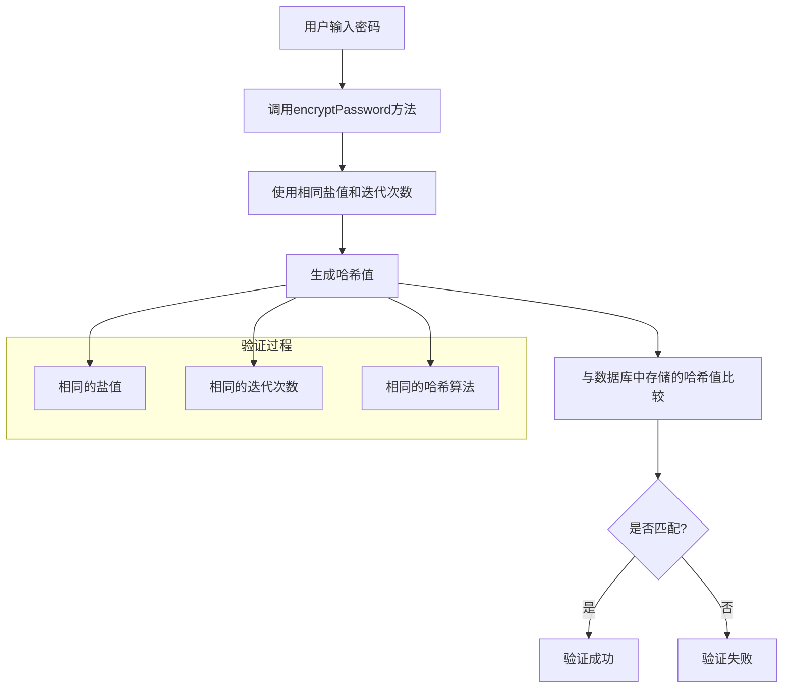
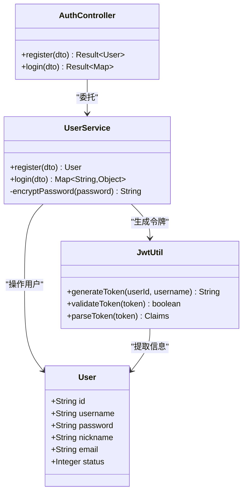
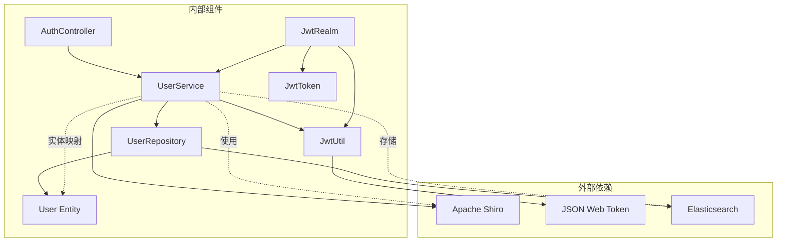

# 密码安全处理

<cite>
**本文档引用的文件**
- [UserService.java](file://src/main/java/com/zhishilu/service/UserService.java)
- [JwtUtil.java](file://src/main/java/com/zhishilu/util/JwtUtil.java)
- [User.java](file://src/main/java/com/zhishilu/entity/User.java)
- [application.yml](file://src/main/resources/application.yml)
- [LoginDTO.java](file://src/main/java/com/zhishilu/dto/LoginDTO.java)
- [RegisterDTO.java](file://src/main/java/com/zhishilu/dto/RegisterDTO.java)
- [AuthController.java](file://src/main/java/com/zhishilu/controller/AuthController.java)
- [JwtRealm.java](file://src/main/java/com/zhishilu/shiro/JwtRealm.java)
- [JwtToken.java](file://src/main/java/com/zhishilu/shiro/JwtToken.java)
- [UserRepository.java](file://src/main/java/com/zhishilu/repository/UserRepository.java)
</cite>

## 目录
1. [引言](#引言)
2. [项目结构](#项目结构)
3. [核心组件](#核心组件)
4. [架构概览](#架构概览)
5. [详细组件分析](#详细组件分析)
6. [依赖关系分析](#依赖关系分析)
7. [性能考虑](#性能考虑)
8. [故障排除指南](#故障排除指南)
9. [结论](#结论)

## 引言

本文件专注于分析该Spring Boot应用程序中的密码安全处理功能，特别是`UserService.encryptPassword()`方法的实现。该系统采用SHA-256哈希算法结合固定盐值和1024次迭代的密码加密方案，配合JWT令牌进行身份认证。本文档将深入解释密码加密的实现细节、安全设计原理、攻击防护措施以及最佳实践建议。

## 项目结构

该项目采用标准的Spring Boot分层架构，密码安全处理功能主要分布在以下模块中：

**图表来源**
- [AuthController.java](file://src/main/java/com/zhishilu/controller/AuthController.java#L1-L50)
- [UserService.java](file://src/main/java/com/zhishilu/service/UserService.java#L1-L128)
- [JwtUtil.java](file://src/main/java/com/zhishilu/util/JwtUtil.java#L1-L99)

**章节来源**
- [AuthController.java](file://src/main/java/com/zhishilu/controller/AuthController.java#L1-L50)
- [UserService.java](file://src/main/java/com/zhishilu/service/UserService.java#L1-L128)
- [JwtUtil.java](file://src/main/java/com/zhishilu/util/JwtUtil.java#L1-L99)

## 核心组件

### 密码加密组件

密码安全处理的核心实现位于`UserService.encryptPassword()`方法中，该方法使用Apache Shiro的SHA-256哈希算法：

**图表来源**
- [UserService.java](file://src/main/java/com/zhishilu/service/UserService.java#L108-L110)
- [User.java](file://src/main/java/com/zhishilu/entity/User.java#L15-L67)

### JWT认证组件

系统采用JWT进行会话管理，通过`JwtUtil`类提供令牌生成和验证功能：

**图表来源**
- [JwtUtil.java](file://src/main/java/com/zhishilu/util/JwtUtil.java#L22-L97)
- [JwtRealm.java](file://src/main/java/com/zhishilu/shiro/JwtRealm.java#L21-L70)
- [JwtToken.java](file://src/main/java/com/zhishilu/shiro/JwtToken.java#L8-L25)

**章节来源**
- [UserService.java](file://src/main/java/com/zhishilu/service/UserService.java#L108-L110)
- [JwtUtil.java](file://src/main/java/com/zhishilu/util/JwtUtil.java#L22-L97)
- [JwtRealm.java](file://src/main/java/com/zhishilu/shiro/JwtRealm.java#L21-L70)

## 架构概览

密码安全处理在整个系统中的工作流程如下：

**图表来源**
- [AuthController.java](file://src/main/java/com/zhishilu/controller/AuthController.java#L27-L40)
- [UserService.java](file://src/main/java/com/zhishilu/service/UserService.java#L35-L87)
- [JwtRealm.java](file://src/main/java/com/zhishilu/shiro/JwtRealm.java#L44-L69)
- [JwtUtil.java](file://src/main/java/com/zhishilu/util/JwtUtil.java#L31-L82)

## 详细组件分析

### 密码加密实现详解

#### SHA-256算法选择

系统采用SHA-256哈希算法进行密码加密，其选择基于以下安全考量：

1. **抗碰撞性**：SHA-256提供2^256级别的输出空间，有效防止碰撞攻击
2. **计算复杂度**：相比MD5和SHA-1，SHA-256具有更高的计算复杂度，增加暴力破解成本
3. **标准化**：作为FIPS 180-4标准的哈希算法，广泛应用于生产环境

#### 盐值(SALT)的安全作用

系统使用固定的盐值"zhishilu"进行密码加密：

**图表来源**
- [UserService.java](file://src/main/java/com/zhishilu/service/UserService.java#L30-L31)
- [UserService.java](file://src/main/java/com/zhishilu/service/UserService.java#L108-L110)

#### 迭代次数配置考量

系统配置了1024次迭代，这一配置的平衡点在于：

| 参数 | 数值 | 考量因素 |
|------|------|----------|
| 迭代次数 | 1024 | 平衡安全性和性能 |
| 盐值长度 | 固定字符串 | 简化实现但降低随机性 |
| 哈希算法 | SHA-256 | 标准化且高效 |
| 存储格式 | 十六进制 | 兼容性强 |

**章节来源**
- [UserService.java](file://src/main/java/com/zhishilu/service/UserService.java#L30-L31)
- [UserService.java](file://src/main/java/com/zhishilu/service/UserService.java#L108-L110)

### 密码验证流程

密码验证采用"加密后比较"的方式，确保数据库中存储的是哈希值而非明文：

**图表来源**
- [UserService.java](file://src/main/java/com/zhishilu/service/UserService.java#L66-L68)

**章节来源**
- [UserService.java](file://src/main/java/com/zhishilu/service/UserService.java#L66-L68)

### JWT集成机制

系统通过JWT实现无状态的身份认证：

**图表来源**
- [AuthController.java](file://src/main/java/com/zhishilu/controller/AuthController.java#L27-L40)
- [UserService.java](file://src/main/java/com/zhishilu/service/UserService.java#L79-L86)
- [JwtUtil.java](file://src/main/java/com/zhishilu/util/JwtUtil.java#L31-L43)

**章节来源**
- [AuthController.java](file://src/main/java/com/zhishilu/controller/AuthController.java#L27-L40)
- [UserService.java](file://src/main/java/com/zhishilu/service/UserService.java#L79-L86)
- [JwtUtil.java](file://src/main/java/com/zhishilu/util/JwtUtil.java#L31-L43)

## 依赖关系分析

密码安全处理功能涉及多个组件之间的复杂依赖关系：

**图表来源**
- [UserService.java](file://src/main/java/com/zhishilu/service/UserService.java#L11-L28)
- [JwtUtil.java](file://src/main/java/com/zhishilu/util/JwtUtil.java#L3-L9)
- [UserRepository.java](file://src/main/java/com/zhishilu/repository/UserRepository.java#L3-L5)

**章节来源**
- [UserService.java](file://src/main/java/com/zhishilu/service/UserService.java#L11-L28)
- [JwtUtil.java](file://src/main/java/com/zhishilu/util/JwtUtil.java#L3-L9)
- [UserRepository.java](file://src/main/java/com/zhishilu/repository/UserRepository.java#L3-L5)

## 性能考虑

### 加密性能分析

系统采用的密码加密方案在性能方面具有以下特点：

| 维度 | 实现方式 | 性能特征 | 优化建议 |
|------|----------|----------|----------|
| 加密算法 | SHA-256 | O(n) 时间复杂度 | 考虑升级到bcrypt/scrypt |
| 盐值处理 | 固定字符串 | O(1) 时间复杂度 | 使用随机盐值 |
| 迭代次数 | 1024次 | O(k) 时间复杂度 | 根据硬件调整 |
| 内存使用 | 哈希计算 | O(1) 空间复杂度 | 合理设置阈值 |

### 存储性能影响

用户实体的密码字段配置为不可索引状态，这有助于：

1. **查询性能**：避免对密码字段进行全文搜索
2. **存储效率**：减少索引占用的空间
3. **安全隔离**：防止密码被意外暴露

**章节来源**
- [User.java](file://src/main/java/com/zhishilu/entity/User.java#L28-L30)
- [UserService.java](file://src/main/java/com/zhishilu/service/UserService.java#L108-L110)

## 故障排除指南

### 常见问题及解决方案

#### 密码验证失败

**症状**：用户登录时提示用户名或密码错误

**可能原因**：
1. 盐值配置不一致
2. 迭代次数配置不匹配
3. 字符编码问题

**排查步骤**：
1. 检查应用配置文件中的盐值设置
2. 验证所有组件使用相同的盐值
3. 确认数据库中存储的密码格式

#### JWT令牌相关问题

**症状**：令牌验证失败或过期

**排查方法**：
1. 检查JWT密钥配置
2. 验证令牌过期时间设置
3. 确认客户端正确处理令牌头

**章节来源**
- [UserService.java](file://src/main/java/com/zhishilu/service/UserService.java#L66-L68)
- [JwtUtil.java](file://src/main/java/com/zhishilu/util/JwtUtil.java#L48-L62)

### 安全审计要点

#### 密码策略检查清单

| 检查项 | 当前实现 | 安全建议 | 优先级 |
|--------|----------|----------|--------|
| 盐值随机性 | 固定字符串 | 使用随机盐值 | 高 |
| 迭代次数 | 1024次 | 动态调整至1000-2000次 | 中 |
| 哈希算法 | SHA-256 | 考虑bcrypt/scrypt | 高 |
| 密钥管理 | 配置文件 | 使用密钥管理服务 | 高 |
| 密码轮换 | 不支持 | 实现定期轮换机制 | 中 |

#### 合规性要求评估

系统当前实现满足的基本安全要求：
- ✅ 密码不以明文形式存储
- ✅ 使用标准哈希算法
- ✅ 提供基本的访问控制
- ❌ 缺少密码强度验证
- ❌ 无密码历史记录
- ❌ 无账户锁定机制

**章节来源**
- [application.yml](file://src/main/resources/application.yml#L26-L31)
- [UserService.java](file://src/main/java/com/zhishilu/service/UserService.java#L108-L110)

## 结论

该密码安全处理系统采用了合理的安全设计，在SHA-256哈希算法的基础上结合固定盐值和1024次迭代提供了基础的密码保护能力。系统通过JWT实现了无状态的身份认证，配合Spring Boot的分层架构形成了完整的认证授权体系。

### 主要优势

1. **算法标准化**：采用经过验证的SHA-256哈希算法
2. **实现简洁**：代码结构清晰，易于维护
3. **性能平衡**：在安全性和性能之间找到合理平衡
4. **架构完整**：与JWT认证体系无缝集成

### 改进建议

1. **增强盐值随机性**：使用每个用户的唯一盐值
2. **提升迭代强度**：根据硬件条件调整迭代次数
3. **算法升级**：考虑使用bcrypt或scrypt等专门的密码哈希算法
4. **密钥管理**：使用专业的密钥管理服务替代配置文件
5. **监控告警**：添加密码相关的安全监控和告警机制

该系统为后续的安全升级提供了良好的基础，通过渐进式的改进可以达到更高水平的密码安全保护。