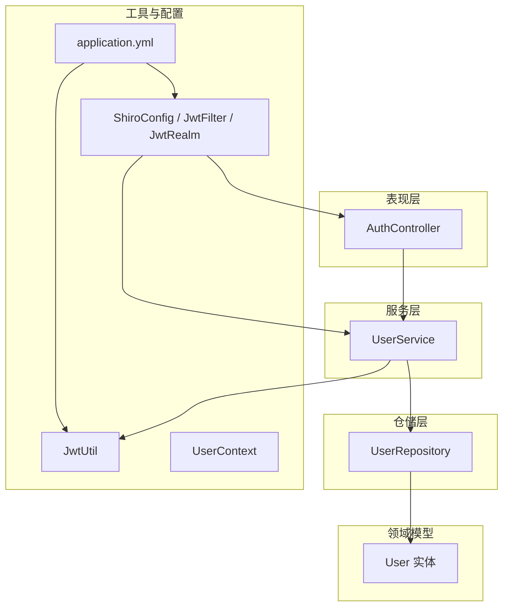
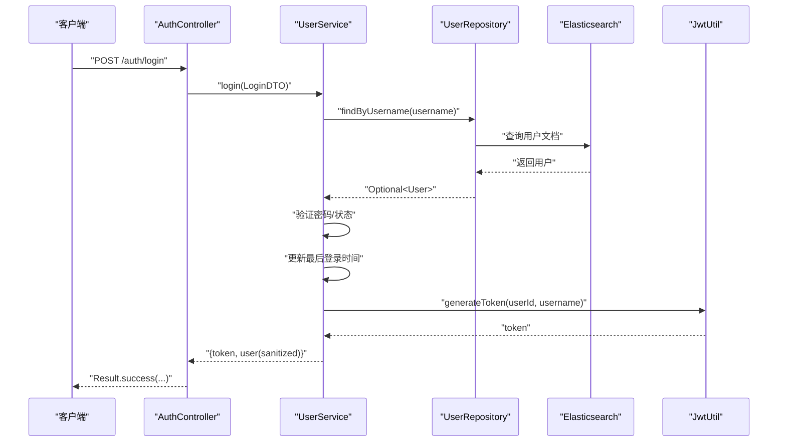
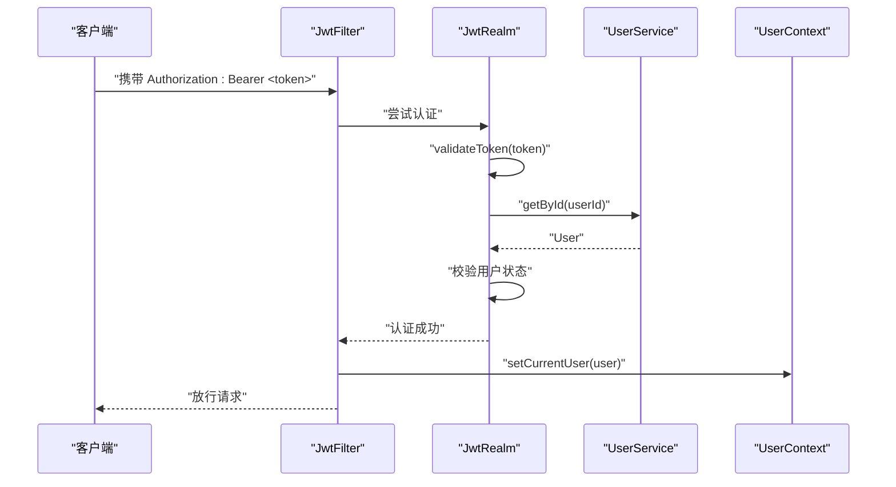
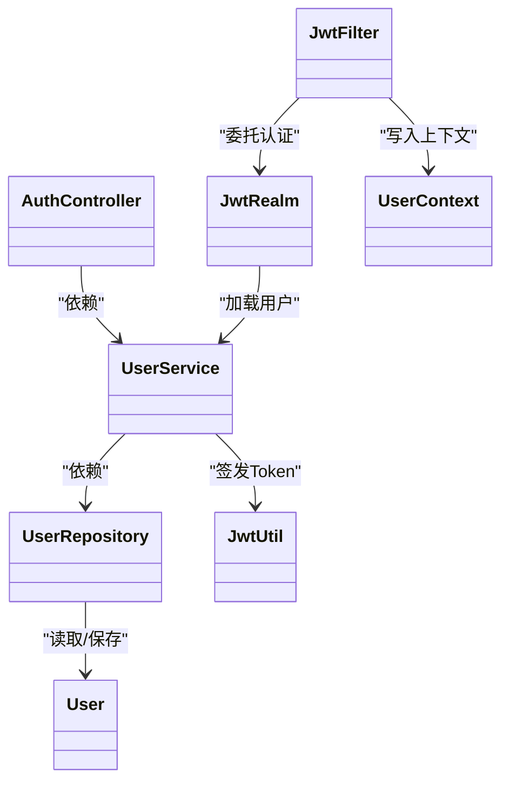

# 用户数据管理

<cite>
**本文引用的文件**
- [User.java](file://src/main/java/com/zhishilu/entity/User.java)
- [UserRepository.java](file://src/main/java/com/zhishilu/repository/UserRepository.java)
- [UserService.java](file://src/main/java/com/zhishilu/service/UserService.java)
- [AuthController.java](file://src/main/java/com/zhishilu/controller/AuthController.java)
- [UserContext.java](file://src/main/java/com/zhishilu/util/UserContext.java)
- [LoginDTO.java](file://src/main/java/com/zhishilu/dto/LoginDTO.java)
- [RegisterDTO.java](file://src/main/java/com/zhishilu/dto/RegisterDTO.java)
- [Result.java](file://src/main/java/com/zhishilu/common/Result.java)
- [BusinessException.java](file://src/main/java/com/zhishilu/exception/BusinessException.java)
- [JwtUtil.java](file://src/main/java/com/zhishilu/util/JwtUtil.java)
- [application.yml](file://src/main/resources/application.yml)
- [JwtFilter.java](file://src/main/java/com/zhishilu/shiro/JwtFilter.java)
- [JwtRealm.java](file://src/main/java/com/zhishilu/shiro/JwtRealm.java)
- [ShiroConfig.java](file://src/main/java/com/zhishilu/config/ShiroConfig.java)
</cite>

## 目录
1. [简介](#简介)
2. [项目结构](#项目结构)
3. [核心组件](#核心组件)
4. [架构总览](#架构总览)
5. [详细组件分析](#详细组件分析)
6. [依赖关系分析](#依赖关系分析)
7. [性能与缓存建议](#性能与缓存建议)
8. [故障排查指南](#故障排查指南)
9. [结论](#结论)
10. [附录：使用示例与最佳实践](#附录使用示例与最佳实践)

## 简介
本技术文档聚焦于用户数据管理功能，围绕以下目标展开：
- 深入解析 getById 与 getByUsername 的实现逻辑，涵盖查询流程、空值处理与异常抛出机制
- 详述 sanitizeUser 的用户信息清理策略，包括敏感信息过滤、数据脱敏与字段选择性返回
- 全面说明用户数据模型（User 实体）的字段语义与索引映射
- 提供查询性能优化建议与缓存策略考量
- 给出使用示例、最佳实践、数据一致性与事务处理机制说明

## 项目结构
该项目采用分层架构：控制器层负责对外接口；服务层承载业务逻辑；仓储层对接 Elasticsearch；工具与配置层提供鉴权、上下文与系统配置。

图表来源
- [AuthController.java](file://src/main/java/com/zhishilu/controller/AuthController.java#L1-L50)
- [UserService.java](file://src/main/java/com/zhishilu/service/UserService.java#L1-L128)
- [UserRepository.java](file://src/main/java/com/zhishilu/repository/UserRepository.java#L1-L35)
- [User.java](file://src/main/java/com/zhishilu/entity/User.java#L1-L68)
- [JwtUtil.java](file://src/main/java/com/zhishilu/util/JwtUtil.java#L1-L99)
- [UserContext.java](file://src/main/java/com/zhishilu/util/UserContext.java#L1-L33)
- [ShiroConfig.java](file://src/main/java/com/zhishilu/config/ShiroConfig.java#L1-L72)
- [JwtFilter.java](file://src/main/java/com/zhishilu/shiro/JwtFilter.java#L1-L109)
- [JwtRealm.java](file://src/main/java/com/zhishilu/shiro/JwtRealm.java#L1-L71)
- [application.yml](file://src/main/resources/application.yml#L1-L47)

章节来源
- [AuthController.java](file://src/main/java/com/zhishilu/controller/AuthController.java#L1-L50)
- [UserService.java](file://src/main/java/com/zhishilu/service/UserService.java#L1-L128)
- [UserRepository.java](file://src/main/java/com/zhishilu/repository/UserRepository.java#L1-L35)
- [User.java](file://src/main/java/com/zhishilu/entity/User.java#L1-L68)
- [application.yml](file://src/main/resources/application.yml#L1-L47)

## 核心组件
- 用户实体 User：定义用户字段、Elasticsearch 文档映射与字段类型
- 用户仓储 UserRepository：提供基于用户名/邮箱的查询与存在性检查
- 用户服务 UserService：实现注册、登录、按ID/用户名查询、密码加密与用户信息清理
- 认证控制器 AuthController：对外暴露注册与登录接口，并统一返回包装
- 工具与上下文：JwtUtil 负责签发与解析 Token；UserContext 提供线程本地用户上下文
- 安全框架集成：Shiro 配置、JwtFilter 与 JwtRealm 完成无状态认证与用户状态校验

章节来源
- [User.java](file://src/main/java/com/zhishilu/entity/User.java#L1-L68)
- [UserRepository.java](file://src/main/java/com/zhishilu/repository/UserRepository.java#L1-L35)
- [UserService.java](file://src/main/java/com/zhishilu/service/UserService.java#L1-L128)
- [AuthController.java](file://src/main/java/com/zhishilu/controller/AuthController.java#L1-L50)
- [JwtUtil.java](file://src/main/java/com/zhishilu/util/JwtUtil.java#L1-L99)
- [UserContext.java](file://src/main/java/com/zhishilu/util/UserContext.java#L1-L33)
- [ShiroConfig.java](file://src/main/java/com/zhishilu/config/ShiroConfig.java#L1-L72)
- [JwtFilter.java](file://src/main/java/com/zhishilu/shiro/JwtFilter.java#L1-L109)
- [JwtRealm.java](file://src/main/java/com/zhishilu/shiro/JwtRealm.java#L1-L71)

## 架构总览
下图展示从控制器到服务、仓储与外部系统的交互关系，以及认证链路如何通过 Shiro 与 JWT 完成无状态鉴权。

图表来源
- [AuthController.java](file://src/main/java/com/zhishilu/controller/AuthController.java#L36-L40)
- [UserService.java](file://src/main/java/com/zhishilu/service/UserService.java#L61-L87)
- [UserRepository.java](file://src/main/java/com/zhishilu/repository/UserRepository.java#L16-L18)
- [JwtUtil.java](file://src/main/java/com/zhishilu/util/JwtUtil.java#L31-L43)

## 详细组件分析

### 用户数据模型（User 实体）
- 字段与含义
  - id：用户唯一标识（字符串）
  - username：用户名（关键词，用于精确匹配与登录）
  - password：密码（关键词，不建立倒排索引以避免泄露风险）
  - nickname：昵称（关键词）
  - email：邮箱（关键词）
  - avatar：头像路径（关键词）
  - status：状态（整数，1 表示正常，0 表示禁用）
  - createdTime：创建时间（日期时间）
  - lastLoginTime：最后登录时间（日期时间）

- 索引映射
  - 文档索引名称：zhishilu_user
  - 分片与副本：1 分片，0 副本
  - 字段类型：根据业务需求设置为 Keyword 或 Date 类型

- 安全与隐私
  - password 字段不参与全文检索，降低泄露风险
  - 业务侧仍需对传输层进行 HTTPS 保护

章节来源
- [User.java](file://src/main/java/com/zhishilu/entity/User.java#L13-L66)

### 用户仓储（UserRepository）
- 查询能力
  - findByUsername：按用户名精确查询
  - findByEmail：按邮箱精确查询
  - existsByUsername / existsByEmail：存在性检查
- 返回类型：Optional<User>，便于调用方进行空值处理

章节来源
- [UserRepository.java](file://src/main/java/com/zhishilu/repository/UserRepository.java#L16-L33)

### 用户服务（UserService）
- getById 与 getByUsername 的实现要点
  - getById：通过 id 查询用户，若不存在则抛出业务异常
  - getByUsername：通过 username 查询用户，若不存在则抛出业务异常
  - 异常机制：统一使用 BusinessException，便于上层控制器捕获与封装

- sanitizeUser 的清理策略
  - 目标：对外返回的用户对象仅包含非敏感字段，避免将密码等字段暴露给前端
  - 策略：构造新的 User 对象，显式复制允许公开的字段（id、username、nickname、email、avatar、status、createdTime、lastLoginTime），不包含 password
  - 适用场景：登录成功后返回用户信息时使用

- 密码加密与登录流程
  - 加密：使用 SHA-256 + 盐值迭代计算，盐值固定为“zhishilu”
  - 登录：校验用户名存在性与密码一致性，检查用户状态，更新最后登录时间，签发 JWT 并返回 token 与清理后的用户信息

- DTO 与返回包装
  - LoginDTO/ RegisterDTO：输入参数校验
  - Result：统一返回结构，包含 code、message、data、timestamp

章节来源
- [UserService.java](file://src/main/java/com/zhishilu/service/UserService.java#L92-L103)
- [UserService.java](file://src/main/java/com/zhishilu/service/UserService.java#L115-L126)
- [UserService.java](file://src/main/java/com/zhishilu/service/UserService.java#L108-L110)
- [UserService.java](file://src/main/java/com/zhishilu/service/UserService.java#L61-L87)
- [LoginDTO.java](file://src/main/java/com/zhishilu/dto/LoginDTO.java#L12-L16)
- [RegisterDTO.java](file://src/main/java/com/zhishilu/dto/RegisterDTO.java#L14-L26)
- [Result.java](file://src/main/java/com/zhishilu/common/Result.java#L20-L70)
- [BusinessException.java](file://src/main/java/com/zhishilu/exception/BusinessException.java#L13-L21)

### 认证控制器（AuthController）
- 接口职责
  - /auth/register：注册新用户
  - /auth/login：用户登录并返回 token 与清理后的用户信息
  - /auth/unauthorized：未授权提示
- 返回封装：统一使用 Result.success(...) 包裹业务结果

章节来源
- [AuthController.java](file://src/main/java/com/zhishilu/controller/AuthController.java#L27-L40)

### 安全与上下文（Shiro + JWT）
- 无状态认证链路
  - JwtFilter：从请求头提取 Bearer Token，交由 Shiro 认证
  - JwtRealm：校验 Token 有效性与用户状态，通过 userService.getById 加载用户
  - UserContext：将认证成功的用户放入线程本地上下文，便于后续业务使用
- 配置要点
  - ShiroConfig：关闭 Session，启用自定义 JwtFilter
  - application.yml：JWT 密钥、过期时间、Header 前缀等

图表来源
- [JwtFilter.java](file://src/main/java/com/zhishilu/shiro/JwtFilter.java#L70-L75)
- [JwtRealm.java](file://src/main/java/com/zhishilu/shiro/JwtRealm.java#L44-L69)
- [UserService.java](file://src/main/java/com/zhishilu/service/UserService.java#L92-L95)
- [UserContext.java](file://src/main/java/com/zhishilu/util/UserContext.java#L15-L24)

章节来源
- [ShiroConfig.java](file://src/main/java/com/zhishilu/config/ShiroConfig.java#L26-L69)
- [JwtFilter.java](file://src/main/java/com/zhishilu/shiro/JwtFilter.java#L39-L85)
- [JwtRealm.java](file://src/main/java/com/zhishilu/shiro/JwtRealm.java#L44-L69)
- [UserService.java](file://src/main/java/com/zhishilu/service/UserService.java#L92-L95)
- [UserContext.java](file://src/main/java/com/zhishilu/util/UserContext.java#L15-L24)
- [application.yml](file://src/main/resources/application.yml#L26-L31)

## 依赖关系分析
- 控制器依赖服务：AuthController 依赖 UserService
- 服务依赖仓储与工具：UserService 依赖 UserRepository 与 JwtUtil
- 仓储依赖外部存储：UserRepository 依赖 Elasticsearch
- 安全链路：JwtFilter → JwtRealm → UserService → UserRepository
- 上下文：JwtFilter 在认证成功后写入 UserContext

图表来源
- [AuthController.java](file://src/main/java/com/zhishilu/controller/AuthController.java#L22-L22)
- [UserService.java](file://src/main/java/com/zhishilu/service/UserService.java#L27-L28)
- [UserRepository.java](file://src/main/java/com/zhishilu/repository/UserRepository.java#L13-L13)
- [JwtUtil.java](file://src/main/java/com/zhishilu/util/JwtUtil.java#L31-L43)
- [JwtFilter.java](file://src/main/java/com/zhishilu/shiro/JwtFilter.java#L70-L75)
- [JwtRealm.java](file://src/main/java/com/zhishilu/shiro/JwtRealm.java#L56-L59)
- [UserContext.java](file://src/main/java/com/zhishilu/util/UserContext.java#L15-L24)

章节来源
- [AuthController.java](file://src/main/java/com/zhishilu/controller/AuthController.java#L22-L22)
- [UserService.java](file://src/main/java/com/zhishilu/service/UserService.java#L27-L28)
- [UserRepository.java](file://src/main/java/com/zhishilu/repository/UserRepository.java#L13-L13)
- [JwtUtil.java](file://src/main/java/com/zhishilu/util/JwtUtil.java#L31-L43)
- [JwtFilter.java](file://src/main/java/com/zhishilu/shiro/JwtFilter.java#L70-L75)
- [JwtRealm.java](file://src/main/java/com/zhishilu/shiro/JwtRealm.java#L56-L59)
- [UserContext.java](file://src/main/java/com/zhishilu/util/UserContext.java#L15-L24)

## 性能与缓存建议
- 查询性能优化
  - 使用精确匹配字段（username/email）进行查询，避免通配符导致的扫描
  - 合理设置 Elasticsearch 分片与副本数量，结合业务量评估
  - 对高频查询字段建立合适的字段类型（如 Keyword），减少映射复杂度
- 缓存策略
  - Token 层面：利用 JWT 无状态特性，避免服务端会话缓存
  - 用户信息缓存：可对用户基础信息进行短期缓存（如 Redis），注意与数据库的一致性
  - 写路径一致性：登录成功更新 lastLoginTime 后再签发 Token，确保前端拿到最新状态
- 事务与一致性
  - 当前实现未使用数据库事务，用户信息更新与 Token 签发为两个步骤
  - 建议在高并发场景下引入幂等设计与最终一致性策略，或在需要强一致的场景切换至具备 ACID 的存储

[本节为通用性能建议，不直接分析具体文件]

## 故障排查指南
- 用户不存在
  - 现象：调用 getById/getByUsername 抛出业务异常
  - 排查：确认用户 ID/用户名是否正确；检查 Elasticsearch 中是否存在对应文档
- 密码错误或账号被禁用
  - 现象：登录时报错“用户名或密码错误”或“账号已被禁用”
  - 排查：确认密码加密算法与盐值；检查用户状态字段
- Token 无效或过期
  - 现象：访问受保护接口返回 401
  - 排查：确认 Header 是否包含正确的 Bearer 前缀；检查 JWT 密钥与过期时间配置
- 上下文未设置
  - 现象：业务中无法获取当前用户
  - 排查：确认 JwtFilter 是否在认证成功后调用了 UserContext.setCurrentUser

章节来源
- [UserService.java](file://src/main/java/com/zhishilu/service/UserService.java#L92-L103)
- [UserService.java](file://src/main/java/com/zhishilu/service/UserService.java#L62-L73)
- [JwtFilter.java](file://src/main/java/com/zhishilu/shiro/JwtFilter.java#L70-L75)
- [JwtRealm.java](file://src/main/java/com/zhishilu/shiro/JwtRealm.java#L48-L66)
- [UserContext.java](file://src/main/java/com/zhishilu/util/UserContext.java#L15-L24)

## 结论
本功能模块以清晰的分层设计实现了用户数据的查询、清理与认证流程。getById 与 getByUsername 提供了稳定的查询入口与完善的异常处理；sanitizeUser 确保对外返回的数据不包含敏感字段；结合 Shiro 与 JWT 实现了无状态认证与用户上下文注入。建议在生产环境中进一步完善缓存与一致性策略，并持续关注 Elasticsearch 的索引与查询性能。

[本节为总结性内容，不直接分析具体文件]

## 附录：使用示例与最佳实践

- 使用示例
  - 登录并获取用户信息
    - 请求：POST /auth/login，Body 为 LoginDTO（包含 username 与 password）
    - 响应：Result.success，data 中包含 token 与 sanitized user
  - 获取当前用户上下文
    - 在已认证的请求中，通过 UserContext.getCurrentUser 获取当前用户

- 最佳实践
  - 输入校验：始终使用 DTO 进行参数校验（如 LoginDTO/ RegisterDTO）
  - 输出脱敏：对外返回用户信息一律使用 sanitizeUser 清理敏感字段
  - 安全传输：确保所有接口走 HTTPS，避免明文传输
  - 认证链路：遵循 Bearer Token 规范，Header 名称与前缀在 application.yml 中集中配置
  - 错误处理：统一使用 BusinessException 与 Result 封装，便于前端统一处理

- 数据一致性与事务
  - 登录流程：查询用户 → 校验密码与状态 → 更新最后登录时间 → 签发 Token
  - 建议：在高并发下，为用户状态与登录时间更新增加重试与幂等控制，或在需要强一致的场景切换到具备事务能力的存储

章节来源
- [AuthController.java](file://src/main/java/com/zhishilu/controller/AuthController.java#L36-L40)
- [UserService.java](file://src/main/java/com/zhishilu/service/UserService.java#L61-L87)
- [UserContext.java](file://src/main/java/com/zhishilu/util/UserContext.java#L22-L24)
- [application.yml](file://src/main/resources/application.yml#L26-L31)