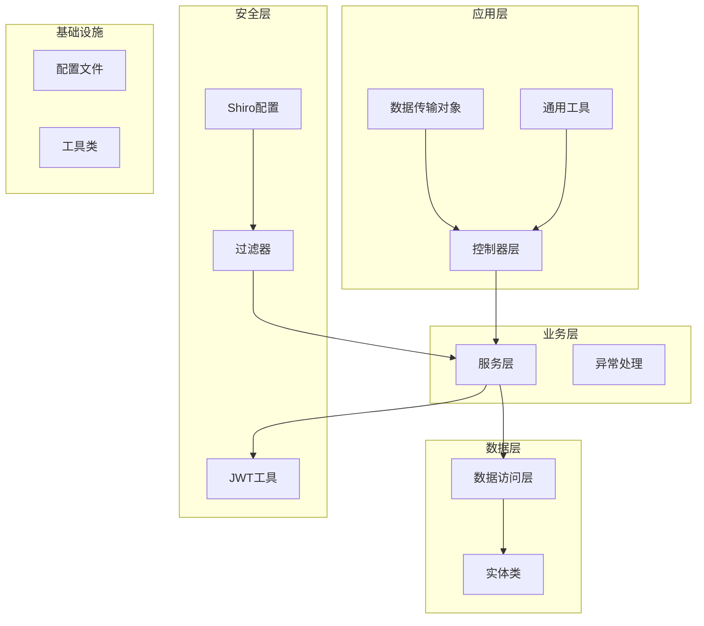
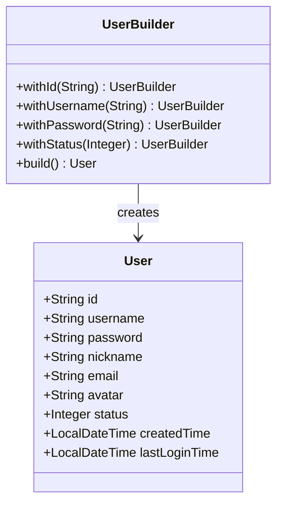
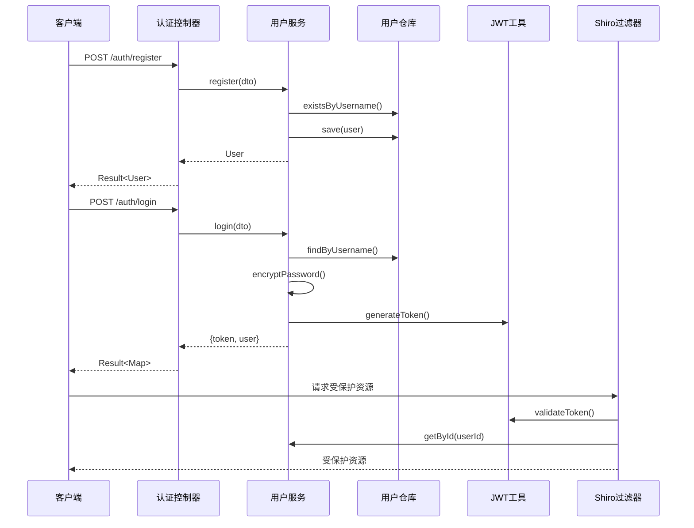
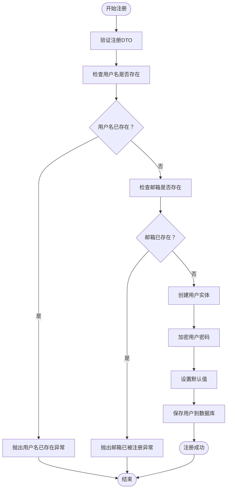
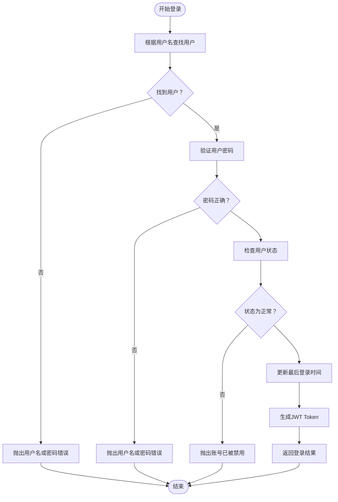
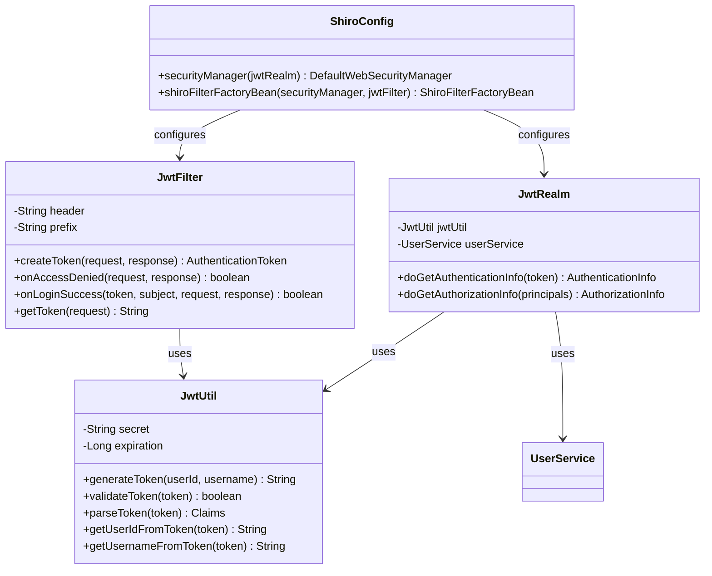
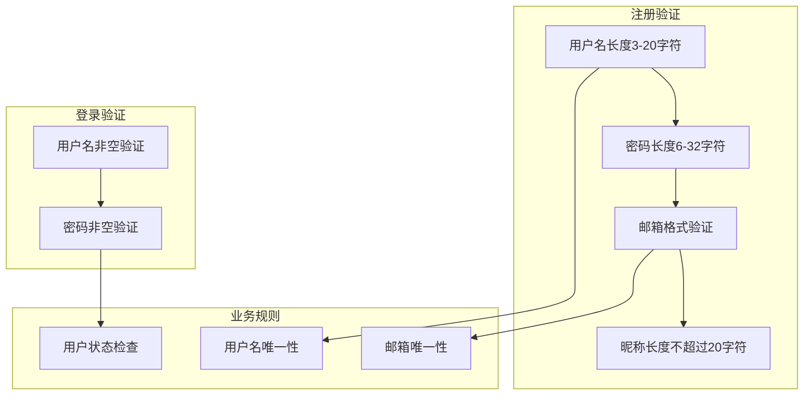
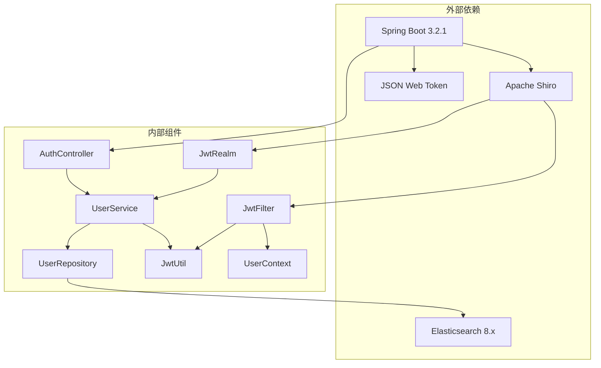
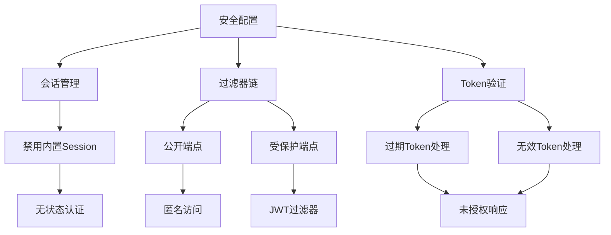
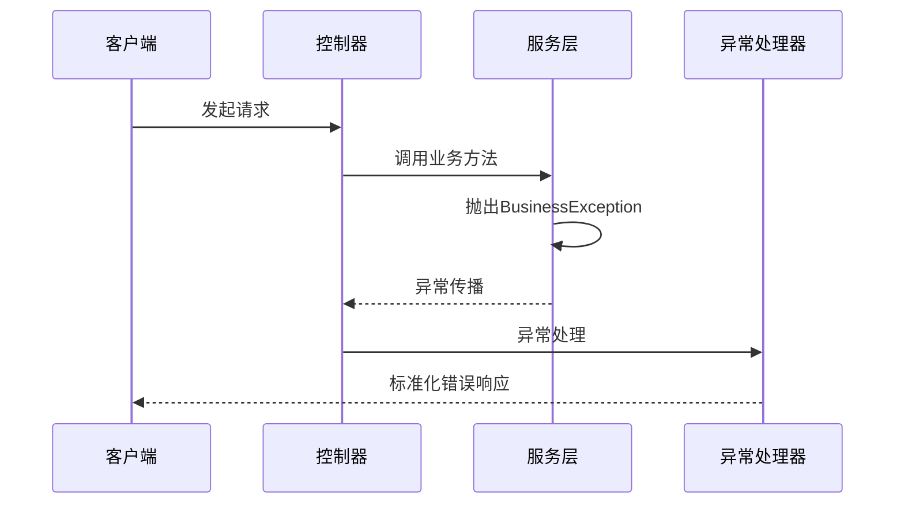

# 用户服务实现

<cite>
**本文档引用的文件**
- [UserService.java](file://src/main/java/com/zhishilu/service/UserService.java)
- [User.java](file://src/main/java/com/zhishilu/entity/User.java)
- [UserRepository.java](file://src/main/java/com/zhishilu/repository/UserRepository.java)
- [AuthController.java](file://src/main/java/com/zhishilu/controller/AuthController.java)
- [JwtRealm.java](file://src/main/java/com/zhishilu/shiro/JwtRealm.java)
- [JwtUtil.java](file://src/main/java/com/zhishilu/util/JwtUtil.java)
- [ShiroConfig.java](file://src/main/java/com/zhishilu/config/ShiroConfig.java)
- [JwtFilter.java](file://src/main/java/com/zhishilu/shiro/JwtFilter.java)
- [RegisterDTO.java](file://src/main/java/com/zhishilu/dto/RegisterDTO.java)
- [LoginDTO.java](file://src/main/java/com/zhishilu/dto/LoginDTO.java)
- [Result.java](file://src/main/java/com/zhishilu/common/Result.java)
- [application.yml](file://src/main/resources/application.yml)
- [README.md](file://README.md)
</cite>

## 目录
1. [简介](#简介)
2. [项目结构](#项目结构)
3. [核心组件](#核心组件)
4. [架构概览](#架构概览)
5. [详细组件分析](#详细组件分析)
6. [依赖关系分析](#依赖关系分析)
7. [性能考虑](#性能考虑)
8. [故障排除指南](#故障排除指南)
9. [结论](#结论)

## 简介

本项目是一个基于Spring Boot的个人知识收藏管理系统，采用JWT + Apache Shiro进行用户认证和授权。用户服务作为系统的核心模块，负责用户注册、登录验证、密码处理、用户信息管理等核心业务功能。

系统采用分层架构设计，包括：
- **表现层**：RESTful API控制器
- **服务层**：业务逻辑处理
- **数据访问层**：基于Elasticsearch的数据持久化
- **安全层**：基于JWT的无状态认证

## 项目结构

项目采用标准的Maven目录结构，主要分为以下模块：

**图表来源**
- [UserService.java](file://src/main/java/com/zhishilu/service/UserService.java#L1-L128)
- [AuthController.java](file://src/main/java/com/zhishilu/controller/AuthController.java#L1-L50)
- [UserRepository.java](file://src/main/java/com/zhishilu/repository/UserRepository.java#L1-L35)

**章节来源**
- [README.md](file://README.md#L99-L133)
- [application.yml](file://src/main/resources/application.yml#L1-L47)

## 核心组件

### 用户实体模型

用户实体采用Elasticsearch注解进行映射，支持全文搜索和精确查询：

**图表来源**
- [User.java](file://src/main/java/com/zhishilu/entity/User.java#L15-L67)

### 用户服务接口

用户服务提供完整的用户生命周期管理：

| 方法 | 功能描述 | 参数类型 | 返回值类型 |
|------|----------|----------|------------|
| register | 用户注册 | RegisterDTO | User |
| login | 用户登录 | LoginDTO | Map<String, Object> |
| getById | 根据ID获取用户 | String | User |
| getByUsername | 根据用户名获取用户 | String | User |

**章节来源**
- [UserService.java](file://src/main/java/com/zhishilu/service/UserService.java#L35-L103)

## 架构概览

系统采用无状态认证架构，基于JWT实现单点登录和跨域访问控制：

**图表来源**
- [AuthController.java](file://src/main/java/com/zhishilu/controller/AuthController.java#L27-L40)
- [UserService.java](file://src/main/java/com/zhishilu/service/UserService.java#L61-L87)
- [JwtFilter.java](file://src/main/java/com/zhishilu/shiro/JwtFilter.java#L39-L75)

## 详细组件分析

### 用户注册流程

用户注册是系统中最复杂的业务流程，涉及多重验证和数据处理：

**图表来源**
- [UserService.java](file://src/main/java/com/zhishilu/service/UserService.java#L35-L56)
- [RegisterDTO.java](file://src/main/java/com/zhishilu/dto/RegisterDTO.java#L14-L26)

#### 注册流程的关键实现要点：

1. **双重唯一性验证**：同时检查用户名和邮箱的唯一性
2. **密码安全处理**：使用SHA-256算法配合固定盐值进行加密
3. **默认值设置**：昵称为空时回退到用户名，状态默认为1（正常）
4. **时间戳管理**：自动记录创建时间和最后登录时间

**章节来源**
- [UserService.java](file://src/main/java/com/zhishilu/service/UserService.java#L35-L56)
- [RegisterDTO.java](file://src/main/java/com/zhishilu/dto/RegisterDTO.java#L1-L28)

### 用户登录流程

登录流程实现了严格的身份验证和状态检查：

**图表来源**
- [UserService.java](file://src/main/java/com/zhishilu/service/UserService.java#L61-L87)

#### 登录流程的安全特性：

1. **状态检查**：确保用户账户处于激活状态
2. **时间同步**：登录成功后更新最后登录时间
3. **Token生成**：使用JWT实现无状态认证
4. **敏感信息清理**：返回给客户端的用户信息经过脱敏处理

**章节来源**
- [UserService.java](file://src/main/java/com/zhishilu/service/UserService.java#L61-L87)

### JWT认证机制

系统采用JWT（JSON Web Token）实现无状态认证，结合Apache Shiro进行统一的安全管理：

**图表来源**
- [JwtUtil.java](file://src/main/java/com/zhishilu/util/JwtUtil.java#L20-L99)
- [JwtFilter.java](file://src/main/java/com/zhishilu/shiro/JwtFilter.java#L29-L109)
- [JwtRealm.java](file://src/main/java/com/zhishilu/shiro/JwtRealm.java#L21-L71)

#### JWT配置参数：

| 参数 | 默认值 | 描述 |
|------|--------|------|
| jwt.secret | zhishilu-secret-key-must-be-at-least-256-bits-long-for-hs256 | JWT签名密钥 |
| jwt.expiration | 86400000 | Token过期时间（毫秒，24小时） |
| jwt.header | Authorization | HTTP头部名称 |
| jwt.prefix | Bearer | Token前缀 |

**章节来源**
- [JwtUtil.java](file://src/main/java/com/zhishilu/util/JwtUtil.java#L22-L26)
- [application.yml](file://src/main/resources/application.yml#L27-L31)

### 数据验证与业务规则

系统实现了多层次的数据验证和业务规则检查：

**图表来源**
- [RegisterDTO.java](file://src/main/java/com/zhishilu/dto/RegisterDTO.java#L14-L26)
- [LoginDTO.java](file://src/main/java/com/zhishilu/dto/LoginDTO.java#L12-L16)

**章节来源**
- [RegisterDTO.java](file://src/main/java/com/zhishilu/dto/RegisterDTO.java#L1-L28)
- [LoginDTO.java](file://src/main/java/com/zhishilu/dto/LoginDTO.java#L1-L18)

## 依赖关系分析

系统采用松耦合的设计，各组件之间的依赖关系清晰明确：

**图表来源**
- [UserService.java](file://src/main/java/com/zhishilu/service/UserService.java#L1-L128)
- [AuthController.java](file://src/main/java/com/zhishilu/controller/AuthController.java#L1-L50)
- [ShiroConfig.java](file://src/main/java/com/zhishilu/config/ShiroConfig.java#L27-L39)

### 核心依赖注入关系

| 组件 | 依赖组件 | 注入方式 |
|------|----------|----------|
| UserService | UserRepository, JwtUtil | 构造函数注入 |
| AuthController | UserService | 构造函数注入 |
| JwtFilter | JwtUtil, UserContext | 字段注入 |
| JwtRealm | JwtUtil, UserService | 构造函数注入 |
| ShiroConfig | JwtRealm, JwtFilter | Bean注入 |

**章节来源**
- [UserService.java](file://src/main/java/com/zhishilu/service/UserService.java#L27-L28)
- [AuthController.java](file://src/main/java/com/zhishilu/controller/AuthController.java#L22-L22)
- [JwtFilter.java](file://src/main/java/com/zhishilu/shiro/JwtFilter.java#L23-L24)

## 性能考虑

### 缓存策略

系统目前采用Elasticsearch作为数据存储，具有以下性能特点：

1. **索引优化**：用户实体使用Keyword类型字段进行精确匹配
2. **查询优化**：通过Elasticsearch的全文搜索能力提升查询效率
3. **分片配置**：单分片配置适用于小规模应用

### 安全配置

**图表来源**
- [ShiroConfig.java](file://src/main/java/com/zhishilu/config/ShiroConfig.java#L31-L36)
- [JwtFilter.java](file://src/main/java/com/zhishilu/shiro/JwtFilter.java#L58-L85)

### 性能优化建议

1. **数据库连接池优化**：配置合适的连接池大小和超时时间
2. **Elasticsearch集群**：生产环境建议配置多分片和副本
3. **缓存策略**：对于频繁访问的用户信息可以添加Redis缓存
4. **异步处理**：登录日志和统计信息可以异步处理
5. **连接复用**：合理配置HTTP客户端连接池

**章节来源**
- [application.yml](file://src/main/resources/application.yml#L13-L18)
- [ShiroConfig.java](file://src/main/java/com/zhishilu/config/ShiroConfig.java#L31-L36)

## 故障排除指南

### 常见问题及解决方案

| 问题类型 | 症状 | 可能原因 | 解决方案 |
|----------|------|----------|----------|
| 注册失败 | 用户名已存在 | 用户名重复 | 检查用户名唯一性约束 |
| 登录失败 | 用户名或密码错误 | 密码加密不匹配 | 验证密码加密算法一致性 |
| Token过期 | 401未授权 | Token过期时间已到 | 调整jwt.expiration配置 |
| 用户被禁用 | 账号已被禁用 | 用户状态非1 | 检查用户状态字段 |
| CORS错误 | 跨域访问失败 | CORS配置不正确 | 配置允许的源和方法 |

### 异常处理机制

系统采用统一的异常处理机制，所有业务异常都会被转换为标准的响应格式：

**图表来源**
- [UserService.java](file://src/main/java/com/zhishilu/service/UserService.java#L37-L43)
- [AuthController.java](file://src/main/java/com/zhishilu/controller/AuthController.java#L28-L39)

**章节来源**
- [UserService.java](file://src/main/java/com/zhishilu/service/UserService.java#L37-L43)
- [Result.java](file://src/main/java/com/zhishilu/common/Result.java#L43-L62)

### 调试和监控

1. **日志配置**：系统提供了详细的日志配置，便于问题排查
2. **健康检查**：可以通过访问`/actuator/health`监控应用状态
3. **性能监控**：建议集成APM工具进行性能监控
4. **错误追踪**：使用统一的异常处理机制便于错误追踪

**章节来源**
- [application.yml](file://src/main/resources/application.yml#L40-L47)

## 结论

本用户服务实现采用了现代化的Spring Boot架构，结合JWT和Apache Shiro实现了安全可靠的用户认证系统。系统的主要优势包括：

1. **安全性**：采用JWT无状态认证，配合严格的密码加密策略
2. **可扩展性**：清晰的分层架构便于功能扩展和维护
3. **易用性**：提供RESTful API接口，便于前端集成
4. **可靠性**：完善的异常处理和错误响应机制

### 最佳实践建议

1. **密码安全**：建议使用更现代的密码哈希算法如bcrypt
2. **Token管理**：实现Token刷新机制，提升用户体验
3. **监控告警**：建立完善的监控和告警体系
4. **测试覆盖**：增加单元测试和集成测试覆盖率
5. **文档完善**：补充详细的API文档和开发指南

该系统为个人知识管理提供了坚实的技术基础，通过合理的架构设计和安全策略，能够满足大多数应用场景的需求。