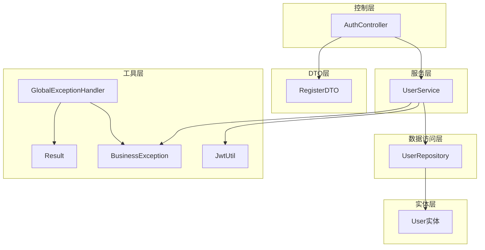
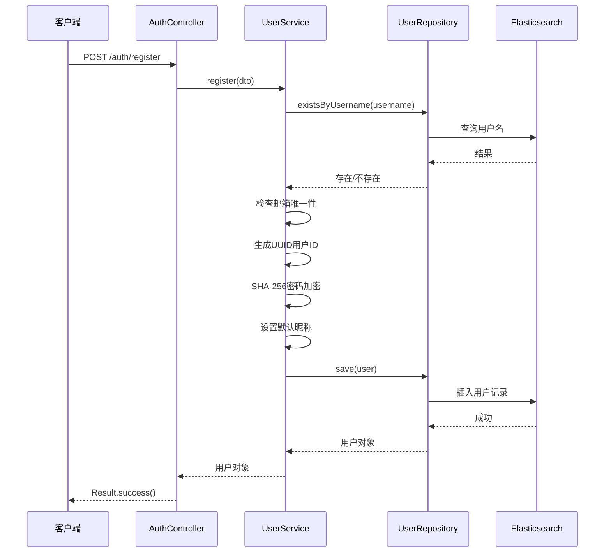
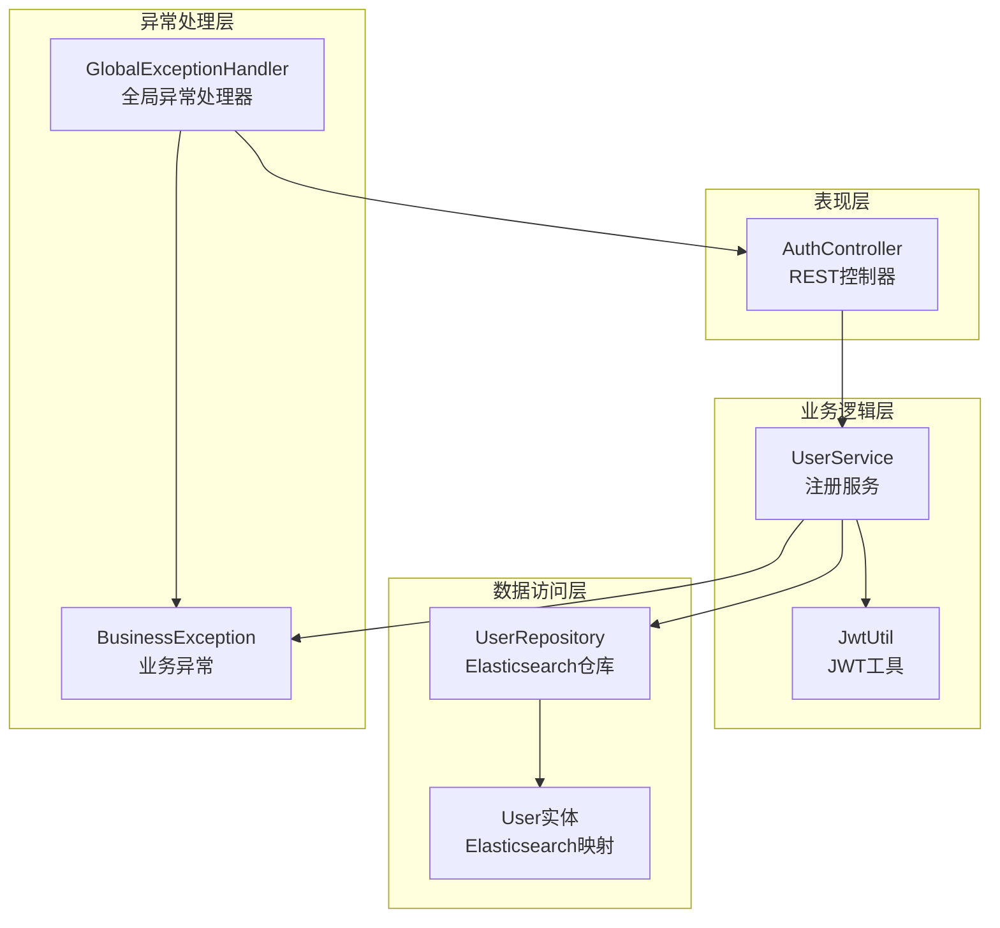
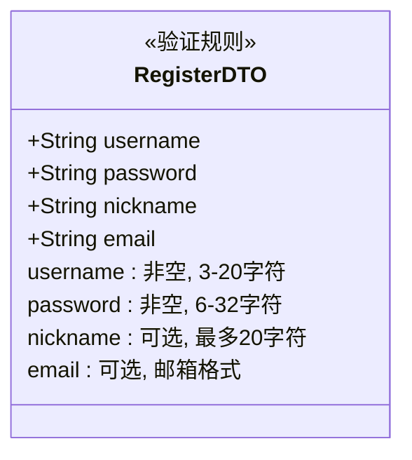
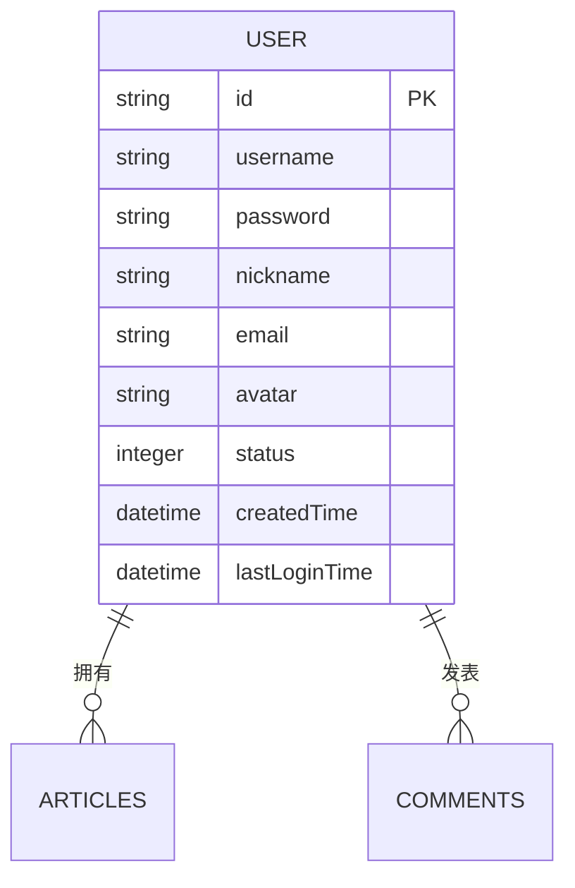
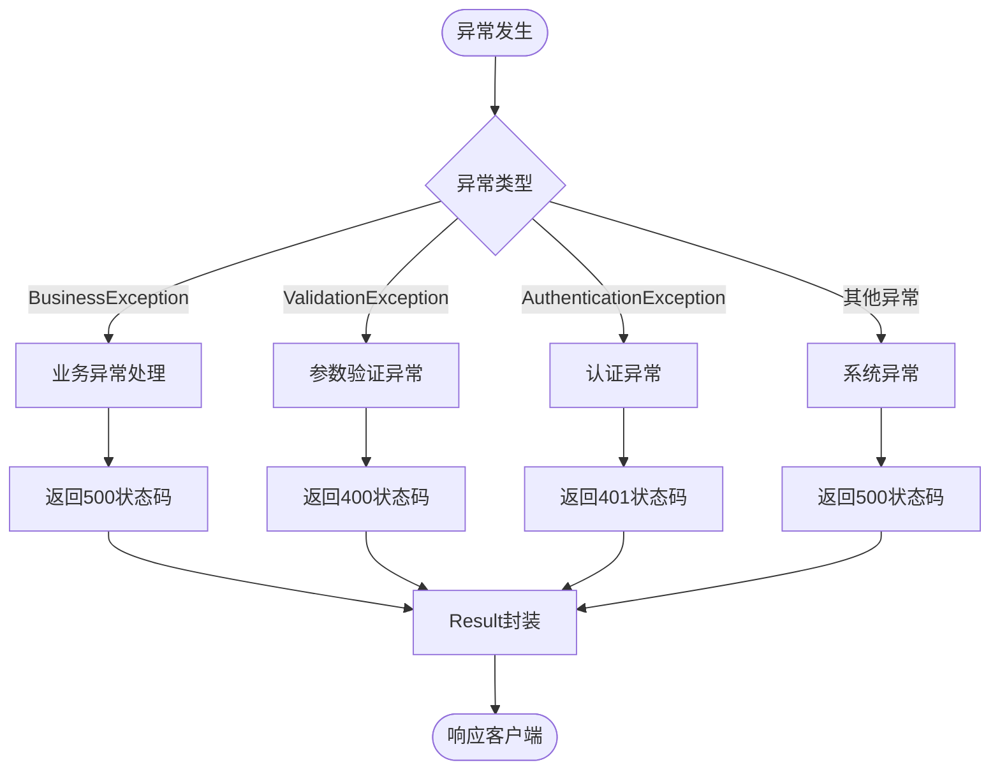
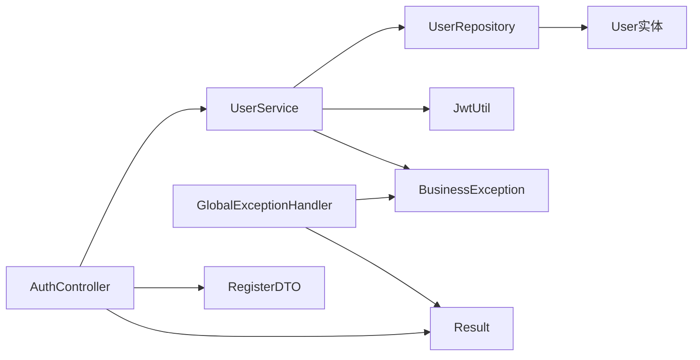

# 用户注册功能

<cite>
**本文档引用的文件**
- [RegisterDTO.java](file://src/main/java/com/zhishilu/dto/RegisterDTO.java)
- [UserService.java](file://src/main/java/com/zhishilu/service/UserService.java)
- [AuthController.java](file://src/main/java/com/zhishilu/controller/AuthController.java)
- [UserRepository.java](file://src/main/java/com/zhishilu/repository/UserRepository.java)
- [User.java](file://src/main/java/com/zhishilu/entity/User.java)
- [Result.java](file://src/main/java/com/zhishilu/common/Result.java)
- [BusinessException.java](file://src/main/java/com/zhishilu/exception/BusinessException.java)
- [GlobalExceptionHandler.java](file://src/main/java/com/zhishilu/exception/GlobalExceptionHandler.java)
- [JwtUtil.java](file://src/main/java/com/zhishilu/util/JwtUtil.java)
- [application.yml](file://src/main/resources/application.yml)
</cite>

## 目录
1. [简介](#简介)
2. [项目结构](#项目结构)
3. [核心组件](#核心组件)
4. [架构概览](#架构概览)
5. [详细组件分析](#详细组件分析)
6. [依赖关系分析](#依赖关系分析)
7. [性能考虑](#性能考虑)
8. [故障排除指南](#故障排除指南)
9. [结论](#结论)

## 简介

本文档深入分析了用户注册功能的完整实现，包括register方法的详细流程、数据验证机制、业务规则检查、异常处理策略以及相关的安全和性能考虑。该系统采用Spring Boot框架，使用Elasticsearch作为用户数据存储，通过JWT进行身份认证，并实现了基于SHA-256的密码加密机制。

## 项目结构

用户注册功能涉及以下关键模块：

**图表来源**
- [AuthController.java](file://src/main/java/com/zhishilu/controller/AuthController.java#L17-L50)
- [UserService.java](file://src/main/java/com/zhishilu/service/UserService.java#L22-L128)
- [UserRepository.java](file://src/main/java/com/zhishilu/repository/UserRepository.java#L12-L35)

**章节来源**
- [AuthController.java](file://src/main/java/com/zhishilu/controller/AuthController.java#L1-L50)
- [UserService.java](file://src/main/java/com/zhishilu/service/UserService.java#L1-L128)
- [UserRepository.java](file://src/main/java/com/zhishilu/repository/UserRepository.java#L1-L35)

## 核心组件

### RegisterDTO参数验证机制

RegisterDTO类定义了用户注册时必需的字段及其验证规则：

- **用户名验证**：非空且长度在3-20个字符之间
- **密码验证**：非空且长度在6-32个字符之间  
- **昵称验证**：可选，最大20个字符
- **邮箱验证**：可选，必须符合邮箱格式

这些验证规则通过Jakarta Validation注解实现，确保输入数据的基本完整性。

**章节来源**
- [RegisterDTO.java](file://src/main/java/com/zhishilu/dto/RegisterDTO.java#L11-L27)

### UserService注册流程

UserService中的register方法实现了完整的注册逻辑：

**图表来源**
- [AuthController.java](file://src/main/java/com/zhishilu/controller/AuthController.java#L27-L31)
- [UserService.java](file://src/main/java/com/zhishilu/service/UserService.java#L35-L56)
- [UserRepository.java](file://src/main/java/com/zhishilu/repository/UserRepository.java#L27-L33)

**章节来源**
- [UserService.java](file://src/main/java/com/zhishilu/service/UserService.java#L35-L56)

## 架构概览

用户注册功能遵循经典的三层架构模式：

**图表来源**
- [AuthController.java](file://src/main/java/com/zhishilu/controller/AuthController.java#L17-L20)
- [UserService.java](file://src/main/java/com/zhishilu/service/UserService.java#L22-L28)
- [UserRepository.java](file://src/main/java/com/zhishilu/repository/UserRepository.java#L12-L13)

## 详细组件分析

### RegisterDTO参数验证

RegisterDTO类使用了多种验证注解来确保数据完整性：

**图表来源**
- [RegisterDTO.java](file://src/main/java/com/zhishilu/dto/RegisterDTO.java#L12-L26)

**章节来源**
- [RegisterDTO.java](file://src/main/java/com/zhishilu/dto/RegisterDTO.java#L1-L28)

### UserService注册实现

UserService的register方法包含了完整的业务逻辑：

#### 用户名唯一性验证
- 使用`existsByUsername()`方法检查用户名是否已存在
- 如果存在则抛出BusinessException异常

#### 邮箱重复检查
- 检查邮箱字段是否为空
- 如果不为空则调用`existsByEmail()`进行重复性检查
- 避免邮箱字段为空时的无效查询

#### 用户信息初始化
- 生成UUID作为用户ID
- 设置用户名和密码
- 设置昵称为用户名（如果未提供）
- 设置默认状态为1（正常）
- 记录创建时间

#### 密码加密处理
使用SHA-256算法进行密码加密：
- 固定盐值："zhishilu"
- 迭代次数：1024次
- 输出格式：十六进制字符串

**章节来源**
- [UserService.java](file://src/main/java/com/zhishilu/service/UserService.java#L35-L56)
- [UserService.java](file://src/main/java/com/zhishilu/service/UserService.java#L108-L110)

### 数据模型设计

User实体类映射到Elasticsearch索引：

**图表来源**
- [User.java](file://src/main/java/com/zhishilu/entity/User.java#L15-L67)

**章节来源**
- [User.java](file://src/main/java/com/zhishilu/entity/User.java#L1-L68)

### 异常处理策略

系统采用统一的异常处理机制：

**图表来源**
- [GlobalExceptionHandler.java](file://src/main/java/com/zhishilu/exception/GlobalExceptionHandler.java#L27-L85)

**章节来源**
- [BusinessException.java](file://src/main/java/com/zhishilu/exception/BusinessException.java#L1-L23)
- [GlobalExceptionHandler.java](file://src/main/java/com/zhishilu/exception/GlobalExceptionHandler.java#L1-L87)

## 依赖关系分析

用户注册功能的组件依赖关系如下：

**图表来源**
- [AuthController.java](file://src/main/java/com/zhishilu/controller/AuthController.java#L22-L22)
- [UserService.java](file://src/main/java/com/zhishilu/service/UserService.java#L27-L28)

**章节来源**
- [AuthController.java](file://src/main/java/com/zhishilu/controller/AuthController.java#L1-L50)
- [UserService.java](file://src/main/java/com/zhishilu/service/UserService.java#L1-L128)

## 性能考虑

### 数据库查询优化

1. **索引优化**：用户名和邮箱字段都使用Keyword类型，适合精确匹配查询
2. **查询缓存**：Elasticsearch内置缓存机制
3. **批量操作**：支持批量用户查询操作

### 加密性能优化

1. **迭代次数平衡**：1024次迭代提供了良好的安全性与性能平衡
2. **内存使用**：SHA-256哈希计算内存占用较小
3. **并发处理**：密码加密在单线程环境下执行，避免并发问题

### 缓存策略

虽然当前实现未使用缓存，但可以考虑：
- 用户名/邮箱查询结果缓存
- 新注册用户信息的短期缓存
- 配置信息缓存

## 故障排除指南

### 常见问题及解决方案

#### 注册失败 - 用户名已存在
**症状**：返回"用户名已存在"错误
**原因**：用户名重复
**解决方案**：使用不同的用户名重新注册

#### 注册失败 - 邮箱已被注册  
**症状**：返回"邮箱已被注册"错误
**原因**：邮箱地址重复
**解决方案**：使用不同的邮箱地址或联系客服

#### 参数验证失败
**症状**：返回400状态码和验证错误信息
**原因**：用户名、密码或邮箱格式不符合要求
**解决方案**：检查输入格式并重新提交

#### 系统异常
**症状**：返回500状态码
**原因**：数据库连接或其他系统问题
**解决方案**：检查服务器日志，稍后重试

**章节来源**
- [GlobalExceptionHandler.java](file://src/main/java/com/zhishilu/exception/GlobalExceptionHandler.java#L56-L85)

### 调试建议

1. **启用详细日志**：检查application.yml中的日志配置
2. **数据库连接**：确认Elasticsearch服务正常运行
3. **JWT配置**：验证JWT密钥和过期时间设置
4. **网络连接**：确保客户端能够访问API端点

## 结论

用户注册功能实现了完整的用户生命周期管理，具有以下特点：

### 安全特性
- 使用SHA-256哈希算法进行密码加密
- 固定盐值增强安全性
- JWT令牌机制保障会话安全
- 输入参数严格验证

### 技术优势
- 基于Spring Boot的现代化架构
- Elasticsearch提供高性能搜索能力
- 统一的异常处理机制
- 清晰的分层架构设计

### 改进建议
1. 实现邮箱验证功能
2. 添加注册邮件通知
3. 增加用户注册频率限制
4. 考虑添加图形验证码
5. 实现用户注册统计功能

该系统为后续的功能扩展奠定了良好的基础，具备良好的可维护性和扩展性。