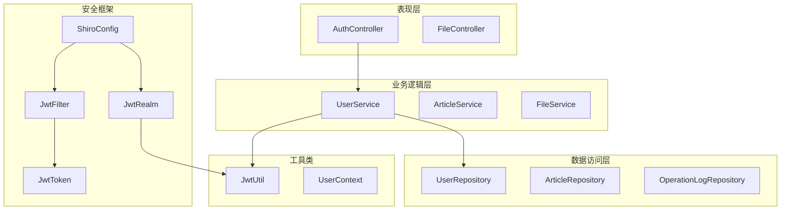
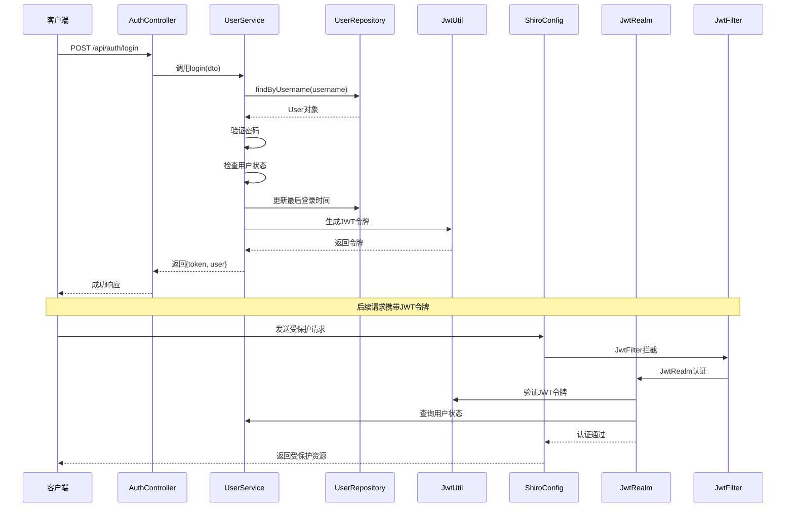
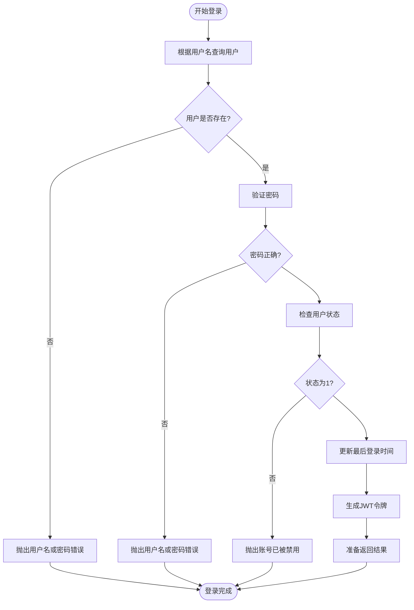
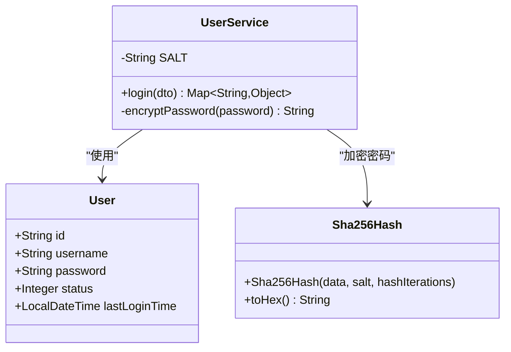
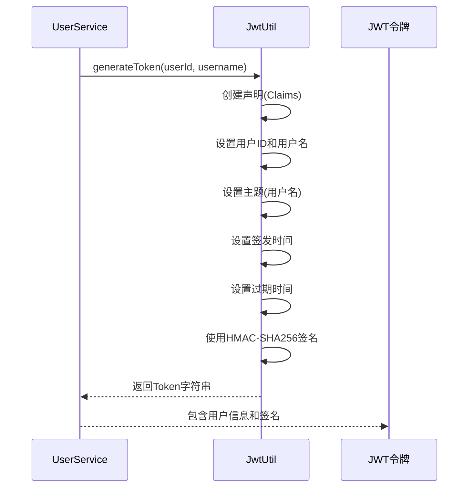
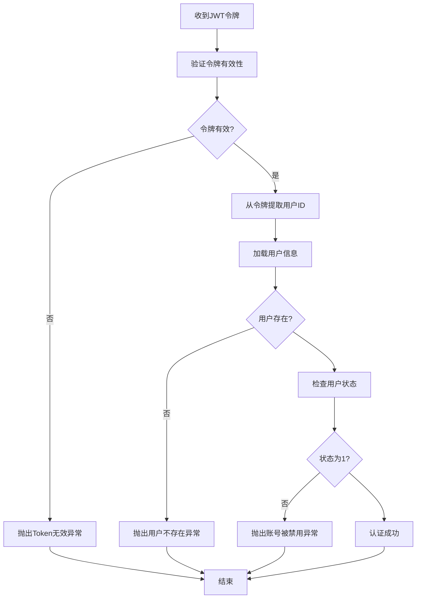
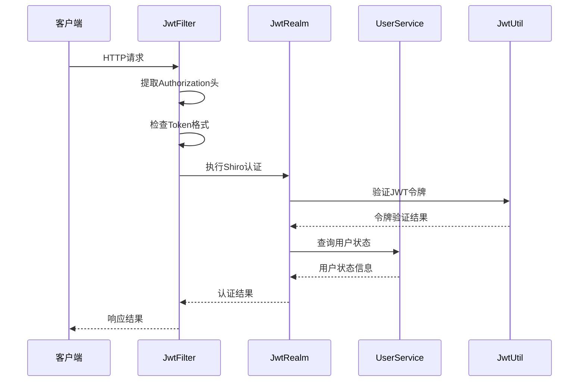
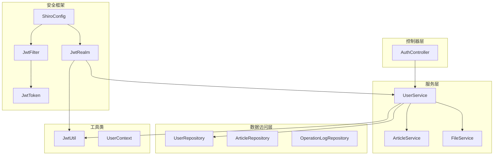

# 用户登录认证

<cite>
**本文档引用的文件**
- [AuthController.java](file://src/main/java/com/zhishilu/controller/AuthController.java)
- [UserService.java](file://src/main/java/com/zhishilu/service/UserService.java)
- [UserRepository.java](file://src/main/java/com/zhishilu/repository/UserRepository.java)
- [LoginDTO.java](file://src/main/java/com/zhishilu/dto/LoginDTO.java)
- [JwtRealm.java](file://src/main/java/com/zhishilu/shiro/JwtRealm.java)
- [JwtFilter.java](file://src/main/java/com/zhishilu/shiro/JwtFilter.java)
- [JwtToken.java](file://src/main/java/com/zhishilu/shiro/JwtToken.java)
- [JwtUtil.java](file://src/main/java/com/zhishilu/util/JwtUtil.java)
- [ShiroConfig.java](file://src/main/java/com/zhishilu/config/ShiroConfig.java)
- [User.java](file://src/main/java/com/zhishilu/entity/User.java)
- [Result.java](file://src/main/java/com/zhishilu/common/Result.java)
- [application.yml](file://src/main/resources/application.yml)
</cite>

## 目录
1. [简介](#简介)
2. [项目结构](#项目结构)
3. [核心组件](#核心组件)
4. [架构概览](#架构概览)
5. [详细组件分析](#详细组件分析)
6. [依赖关系分析](#依赖关系分析)
7. [性能考虑](#性能考虑)
8. [故障排除指南](#故障排除指南)
9. [结论](#结论)

## 简介

本项目采用Spring Boot + Apache Shiro + JWT的认证架构，实现了完整的用户登录认证功能。系统通过Shiro的安全框架进行统一的认证授权管理，使用JWT作为无状态的令牌机制，配合Elasticsearch进行用户数据存储。

## 项目结构

项目采用标准的分层架构设计，主要包含以下层次：

**图表来源**
- [AuthController.java](file://src/main/java/com/zhishilu/controller/AuthController.java#L17-L49)
- [UserService.java](file://src/main/java/com/zhishilu/service/UserService.java#L22-L25)
- [ShiroConfig.java](file://src/main/java/com/zhishilu/config/ShiroConfig.java#L21-L71)

**章节来源**
- [AuthController.java](file://src/main/java/com/zhishilu/controller/AuthController.java#L1-L50)
- [ShiroConfig.java](file://src/main/java/com/zhishilu/config/ShiroConfig.java#L1-L72)

## 核心组件

### 认证控制器 (AuthController)

负责处理用户认证相关的HTTP请求，提供注册和登录接口。

### 用户服务 (UserService)

实现核心的业务逻辑，包括用户注册、登录验证、密码加密等功能。

### JWT安全组件

- **JwtRealm**: Shiro的认证域，负责JWT令牌的验证和用户状态检查
- **JwtFilter**: 请求过滤器，拦截HTTP请求并提取JWT令牌
- **JwtToken**: Shiro认证令牌的实现
- **JwtUtil**: JWT工具类，提供令牌生成、解析和验证功能

### 数据存储

- **UserRepository**: 基于Elasticsearch的用户数据访问层
- **User实体**: 用户数据模型，包含用户名、密码、状态等字段

**章节来源**
- [AuthController.java](file://src/main/java/com/zhishilu/controller/AuthController.java#L14-L49)
- [UserService.java](file://src/main/java/com/zhishilu/service/UserService.java#L19-L127)
- [JwtRealm.java](file://src/main/java/com/zhishilu/shiro/JwtRealm.java#L15-L71)

## 架构概览

系统采用前后端分离的架构模式，认证流程通过Shiro的过滤器链进行统一管理：

**图表来源**
- [AuthController.java](file://src/main/java/com/zhishilu/controller/AuthController.java#L36-L40)
- [UserService.java](file://src/main/java/com/zhishilu/service/UserService.java#L61-L87)
- [JwtFilter.java](file://src/main/java/com/zhishilu/shiro/JwtFilter.java#L39-L85)
- [JwtRealm.java](file://src/main/java/com/zhishilu/shiro/JwtRealm.java#L43-L69)

## 详细组件分析

### 登录方法完整认证流程

登录方法实现了严格的认证流程，确保系统的安全性：

**图表来源**
- [UserService.java](file://src/main/java/com/zhishilu/service/UserService.java#L61-L87)

#### 密码加密验证机制

系统使用SHA-256哈希算法与固定盐值结合的方式进行密码加密：

**图表来源**
- [UserService.java](file://src/main/java/com/zhishilu/service/UserService.java#L30-L110)
- [User.java](file://src/main/java/com/zhishilu/entity/User.java#L15-L67)

#### JWT Token生成过程

JWT令牌包含用户身份信息和安全签名：

**图表来源**
- [JwtUtil.java](file://src/main/java/com/zhishilu/util/JwtUtil.java#L31-L43)

### Shiro安全框架集成

#### JwtRealm认证流程

**图表来源**
- [JwtRealm.java](file://src/main/java/com/zhishilu/shiro/JwtRealm.java#L43-L69)

#### JwtFilter请求拦截

**图表来源**
- [JwtFilter.java](file://src/main/java/com/zhishilu/shiro/JwtFilter.java#L39-L85)
- [JwtRealm.java](file://src/main/java/com/zhishilu/shiro/JwtRealm.java#L43-L69)

**章节来源**
- [UserService.java](file://src/main/java/com/zhishilu/service/UserService.java#L58-L127)
- [JwtUtil.java](file://src/main/java/com/zhishilu/util/JwtUtil.java#L15-L99)
- [JwtRealm.java](file://src/main/java/com/zhishilu/shiro/JwtRealm.java#L15-L71)
- [JwtFilter.java](file://src/main/java/com/zhishilu/shiro/JwtFilter.java#L24-L109)

## 依赖关系分析

系统各组件之间的依赖关系如下：

**图表来源**
- [AuthController.java](file://src/main/java/com/zhishilu/controller/AuthController.java#L22-L22)
- [UserService.java](file://src/main/java/com/zhishilu/service/UserService.java#L27-L28)
- [ShiroConfig.java](file://src/main/java/com/zhishilu/config/ShiroConfig.java#L27-L39)

**章节来源**
- [AuthController.java](file://src/main/java/com/zhishilu/controller/AuthController.java#L1-L50)
- [UserService.java](file://src/main/java/com/zhishilu/service/UserService.java#L1-L128)
- [ShiroConfig.java](file://src/main/java/com/zhishilu/config/ShiroConfig.java#L1-L72)

## 性能考虑

### 缓存策略
- 用户信息缓存：建议在UserService中添加用户信息缓存，减少数据库查询次数
- JWT令牌验证缓存：可以缓存有效的JWT令牌，避免重复验证

### 数据库优化
- 用户名索引：UserRepository已经提供了基于用户名的查询方法
- 密码字段不建立索引：符合安全最佳实践

### 并发处理
- 登录时间更新：使用原子性操作确保并发场景下的数据一致性
- JWT令牌生成：使用线程安全的HMAC算法

## 故障排除指南

### 常见登录异常情况

| 异常类型 | 触发条件 | 错误码 | 处理建议 |
|---------|---------|--------|----------|
| 用户名或密码错误 | 用户名不存在或密码不匹配 | 500 | 检查用户名密码输入，确认大小写 |
| 账号已被禁用 | 用户状态非1 | 500 | 联系管理员启用账号 |
| Token无效或已过期 | JWT令牌验证失败 | 401 | 重新登录获取新令牌 |
| 用户不存在 | 令牌中的用户ID对应用户不存在 | 401 | 检查用户是否被删除 |

### 调试步骤

1. **检查JWT配置**
   - 验证JWT密钥长度（至少256位）
   - 确认令牌过期时间设置合理
   - 检查HTTP头部配置

2. **验证用户数据**
   - 确认用户表中存在测试用户
   - 检查密码加密是否正确
   - 验证用户状态为1

3. **监控Shiro过滤器**
   - 查看JwtFilter的日志输出
   - 检查令牌提取是否正确
   - 验证认证流程是否正常

4. **数据库连接**
   - 确认Elasticsearch连接正常
   - 检查用户索引是否存在
   - 验证数据同步状态

**章节来源**
- [JwtFilter.java](file://src/main/java/com/zhishilu/shiro/JwtFilter.java#L78-L85)
- [JwtRealm.java](file://src/main/java/com/zhishilu/shiro/JwtRealm.java#L47-L50)
- [Result.java](file://src/main/java/com/zhishilu/common/Result.java#L43-L62)

## 结论

本项目的用户登录认证系统采用了现代的无状态认证架构，结合了Spring Boot的便利性和Apache Shiro的强大功能。系统的主要优势包括：

1. **安全性**：使用JWT令牌实现无状态认证，配合SHA-256哈希加密保护用户密码
2. **可扩展性**：基于Shiro的模块化设计，便于添加新的认证方式
3. **易维护性**：清晰的分层架构和标准化的代码组织
4. **性能**：无状态设计减少了服务器内存占用

建议的改进方向：
- 添加登录失败次数限制和锁定机制
- 实现令牌刷新机制
- 增加更详细的审计日志
- 考虑使用Redis等缓存存储JWT令牌