# 用户管理系统

<cite>
**本文档引用的文件**
- [User.java](file://src/main/java/com/zhishilu/entity/User.java)
- [UserService.java](file://src/main/java/com/zhishilu/service/UserService.java)
- [AuthController.java](file://src/main/java/com/zhishilu/controller/AuthController.java)
- [LoginDTO.java](file://src/main/java/com/zhishilu/dto/LoginDTO.java)
- [RegisterDTO.java](file://src/main/java/com/zhishilu/dto/RegisterDTO.java)
- [UserRepository.java](file://src/main/java/com/zhishilu/repository/UserRepository.java)
- [JwtUtil.java](file://src/main/java/com/zhishilu/util/JwtUtil.java)
- [JwtFilter.java](file://src/main/java/com/zhishilu/shiro/JwtFilter.java)
- [JwtRealm.java](file://src/main/java/com/zhishilu/shiro/JwtRealm.java)
- [UserContext.java](file://src/main/java/com/zhishilu/util/UserContext.java)
- [Result.java](file://src/main/java/com/zhishilu/common/Result.java)
- [GlobalExceptionHandler.java](file://src/main/java/com/zhishilu/exception/GlobalExceptionHandler.java)
- [application.yml](file://src/main/resources/application.yml)
- [README.md](file://README.md)
</cite>

## 目录
1. [项目概述](#项目概述)
2. [系统架构](#系统架构)
3. [用户实体模型](#用户实体模型)
4. [认证与授权机制](#认证与授权机制)
5. [用户服务层实现](#用户服务层实现)
6. [API接口规范](#api接口规范)
7. [安全策略](#安全策略)
8. [会话管理](#会话管理)
9. [错误处理机制](#错误处理机制)
10. [使用场景与示例](#使用场景与示例)
11. [性能考虑](#性能考虑)
12. [故障排除指南](#故障排除指南)

## 项目概述

知拾录是一个基于Spring Boot构建的个人知识收藏管理系统，采用现代化的技术栈实现用户认证与权限控制。系统采用前后端分离架构，通过JWT令牌实现无状态认证，结合Apache Shiro进行权限管理。

### 核心技术栈
- **后端框架**: Spring Boot 3.2.1 + Spring MVC
- **认证授权**: Apache Shiro + JWT
- **数据存储**: Elasticsearch 8.x
- **开发工具**: Lombok
- **语言版本**: Java 17

### 主要功能特性
- 用户注册/登录认证
- 基于JWT的无状态会话管理
- 基于Shiro的权限控制
- Elasticsearch全文搜索
- 文件上传管理
- 操作日志记录

## 系统架构

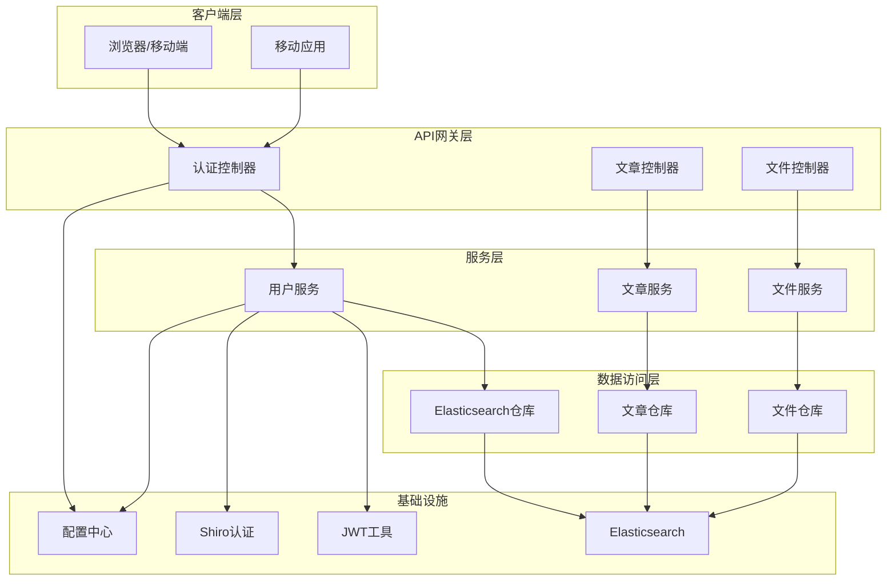

**图表来源**
- [AuthController.java](file://src/main/java/com/zhishilu/controller/AuthController.java#L17-L20)
- [UserService.java](file://src/main/java/com/zhishilu/service/UserService.java#L22-L25)
- [UserRepository.java](file://src/main/java/com/zhishilu/repository/UserRepository.java#L12-L13)

## 用户实体模型

用户实体是系统的核心数据模型，采用Elasticsearch文档数据库存储，支持高效的全文检索和查询。

### 实体属性设计

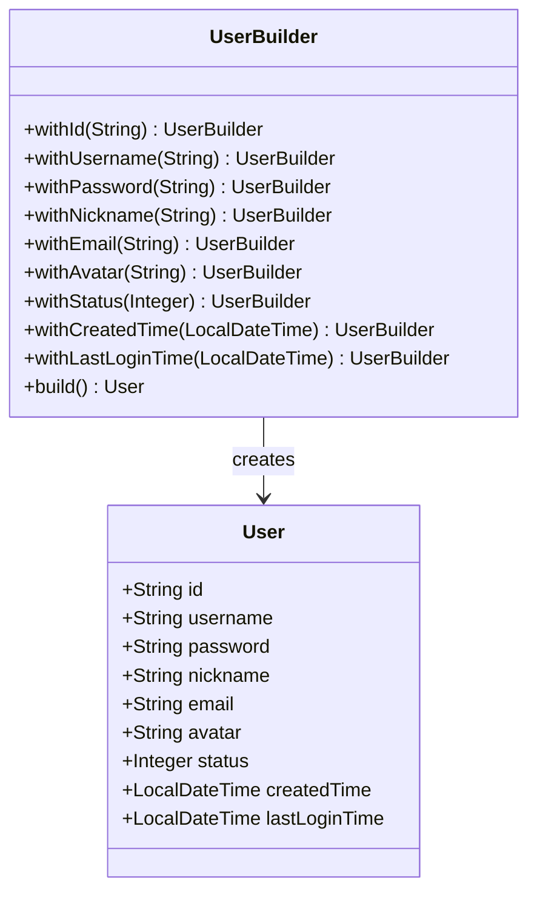

**图表来源**
- [User.java](file://src/main/java/com/zhishilu/entity/User.java#L15-L67)

### 字段详细说明

| 字段名 | 类型 | 索引类型 | 描述 | 约束条件 |
|--------|------|----------|------|----------|
| id | String | ID | 用户唯一标识符 | UUID生成，主键 |
| username | String | Keyword | 用户名 | 唯一约束，3-20字符 |
| password | String | Keyword | 加密后的密码 | 不可索引，长度32字符 |
| nickname | String | Keyword | 昵称 | 可选，最大20字符 |
| email | String | Keyword | 邮箱地址 | 可选，邮箱格式验证 |
| avatar | String | Keyword | 头像路径 | 可选，文件存储路径 |
| status | Integer | Integer | 用户状态 | 1-正常，0-禁用，默认1 |
| createdTime | LocalDateTime | Date | 创建时间 | 自动设置 |
| lastLoginTime | LocalDateTime | Date | 最后登录时间 | 自动更新 |

### Elasticsearch映射配置

用户实体在Elasticsearch中的映射配置确保了：
- **索引优化**: 关键字字段使用Keyword类型便于精确匹配
- **搜索性能**: 时间字段使用Date类型支持范围查询
- **安全性**: 密码字段不建立索引，防止明文泄露

**章节来源**
- [User.java](file://src/main/java/com/zhishilu/entity/User.java#L13-L67)

## 认证与授权机制

系统采用JWT令牌与Apache Shiro相结合的认证授权方案，实现了无状态的用户身份验证和权限控制。

### 认证流程

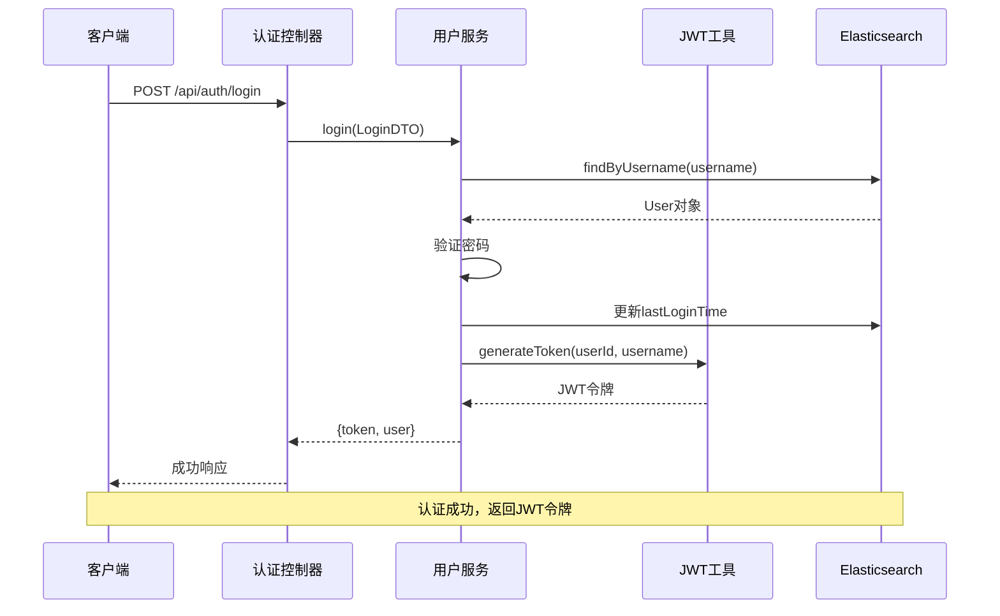

**图表来源**
- [AuthController.java](file://src/main/java/com/zhishilu/controller/AuthController.java#L36-L40)
- [UserService.java](file://src/main/java/com/zhishilu/service/UserService.java#L61-L87)
- [JwtUtil.java](file://src/main/java/com/zhishilu/util/JwtUtil.java#L31-L43)

### 权限控制架构

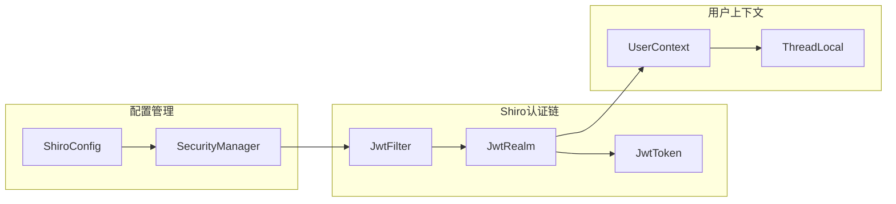

**图表来源**
- [JwtFilter.java](file://src/main/java/com/zhishilu/shiro/JwtFilter.java#L29-L75)
- [JwtRealm.java](file://src/main/java/com/zhishilu/shiro/JwtRealm.java#L21-L69)
- [UserContext.java](file://src/main/java/com/zhishilu/util/UserContext.java#L8-L32)

**章节来源**
- [JwtFilter.java](file://src/main/java/com/zhishilu/shiro/JwtFilter.java#L29-L109)
- [JwtRealm.java](file://src/main/java/com/zhishilu/shiro/JwtRealm.java#L21-L71)
- [UserContext.java](file://src/main/java/com/zhishilu/util/UserContext.java#L8-L33)

## 用户服务层实现

用户服务层负责处理用户相关的业务逻辑，包括注册、登录、密码处理等核心功能。

### 核心业务方法

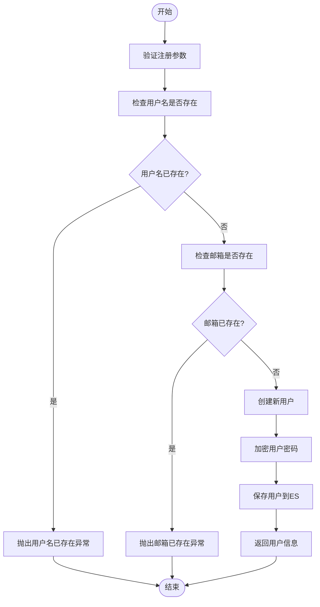

**图表来源**
- [UserService.java](file://src/main/java/com/zhishilu/service/UserService.java#L35-L56)

### 密码加密策略

系统采用SHA-256哈希算法配合固定盐值进行密码加密：

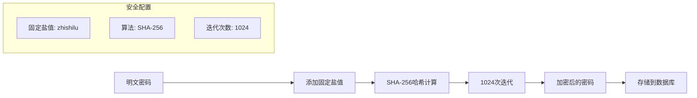

**图表来源**
- [UserService.java](file://src/main/java/com/zhishilu/service/UserService.java#L108-L110)

**章节来源**
- [UserService.java](file://src/main/java/com/zhishilu/service/UserService.java#L25-L128)

## API接口规范

系统提供RESTful API接口，遵循统一的响应格式和错误处理机制。

### 认证接口

#### 用户注册

**请求URL**: `POST /api/auth/register`

**请求头**:
```
Content-Type: application/json
Accept: application/json
```

**请求参数**:
| 参数名 | 类型 | 必填 | 描述 | 长度限制 |
|--------|------|------|------|----------|
| username | String | 是 | 用户名 | 3-20字符 |
| password | String | 是 | 密码 | 6-32字符 |
| nickname | String | 否 | 昵称 | 最大20字符 |
| email | String | 否 | 邮箱地址 | 邮箱格式 |

**请求示例**:
```json
{
  "username": "john_doe",
  "password": "password123",
  "nickname": "John Doe",
  "email": "john@example.com"
}
```

**响应格式**:
```json
{
  "code": 200,
  "message": "注册成功",
  "data": {
    "id": "uuid-string",
    "username": "john_doe",
    "nickname": "John Doe",
    "email": "john@example.com",
    "avatar": null,
    "status": 1,
    "createdTime": "2024-01-01T12:00:00",
    "lastLoginTime": null
  },
  "timestamp": 1704067200000
}
```

#### 用户登录

**请求URL**: `POST /api/auth/login`

**请求参数**:
| 参数名 | 类型 | 必填 | 描述 |
|--------|------|------|------|
| username | String | 是 | 用户名 |
| password | String | 是 | 密码 |

**请求示例**:
```json
{
  "username": "john_doe",
  "password": "password123"
}
```

**成功响应**:
```json
{
  "code": 200,
  "message": "登录成功",
  "data": {
    "token": "eyJhbGciOiJIUzI1NiIsInR5cCI6IkpXVCJ9...",
    "user": {
      "id": "uuid-string",
      "username": "john_doe",
      "nickname": "John Doe",
      "email": "john@example.com",
      "avatar": null,
      "status": 1,
      "createdTime": "2024-01-01T12:00:00",
      "lastLoginTime": "2024-01-01T12:00:00"
    }
  },
  "timestamp": 1704067200000
}
```

**错误响应**:
```json
{
  "code": 400,
  "message": "用户名或密码错误",
  "data": null,
  "timestamp": 1704067200000
}
```

### 统一响应格式

所有API接口都遵循统一的响应格式：

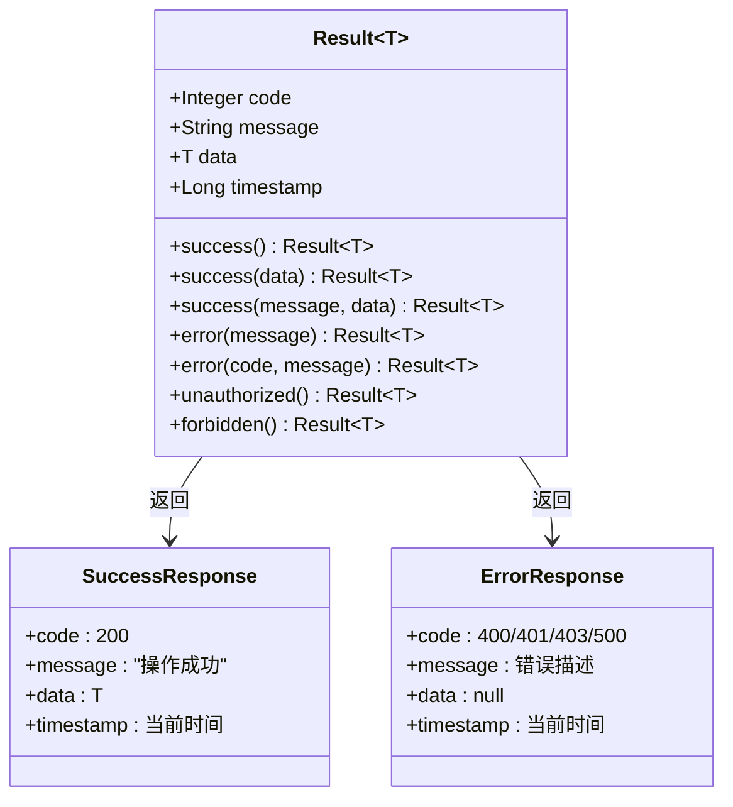

**图表来源**
- [Result.java](file://src/main/java/com/zhishilu/common/Result.java#L9-L71)

**章节来源**
- [AuthController.java](file://src/main/java/com/zhishilu/controller/AuthController.java#L27-L40)
- [Result.java](file://src/main/java/com/zhishilu/common/Result.java#L20-L70)

## 安全策略

系统采用多层次的安全策略，确保用户数据和系统资源的安全性。

### JWT令牌安全

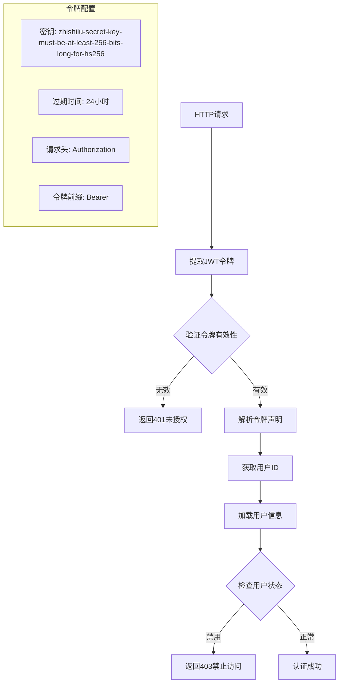

**图表来源**
- [JwtUtil.java](file://src/main/java/com/zhishilu/util/JwtUtil.java#L31-L97)
- [JwtFilter.java](file://src/main/java/com/zhishilu/shiro/JwtFilter.java#L90-L97)

### 密码安全策略

系统采用以下密码安全措施：

1. **哈希算法**: SHA-256
2. **迭代次数**: 1024次
3. **固定盐值**: zhishilu
4. **存储方式**: 明文存储哈希值，不存储原始密码

### 数据验证规则

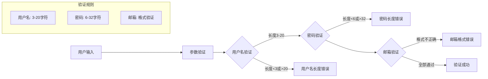

**图表来源**
- [RegisterDTO.java](file://src/main/java/com/zhishilu/dto/RegisterDTO.java#L14-L26)
- [LoginDTO.java](file://src/main/java/com/zhishilu/dto/LoginDTO.java#L12-L16)

**章节来源**
- [JwtUtil.java](file://src/main/java/com/zhishilu/util/JwtUtil.java#L22-L27)
- [RegisterDTO.java](file://src/main/java/com/zhishilu/dto/RegisterDTO.java#L14-L27)
- [LoginDTO.java](file://src/main/java/com/zhishilu/dto/LoginDTO.java#L12-L17)

## 会话管理

系统采用JWT令牌实现无状态的会话管理，避免了传统Session的服务器端存储开销。

### 会话生命周期

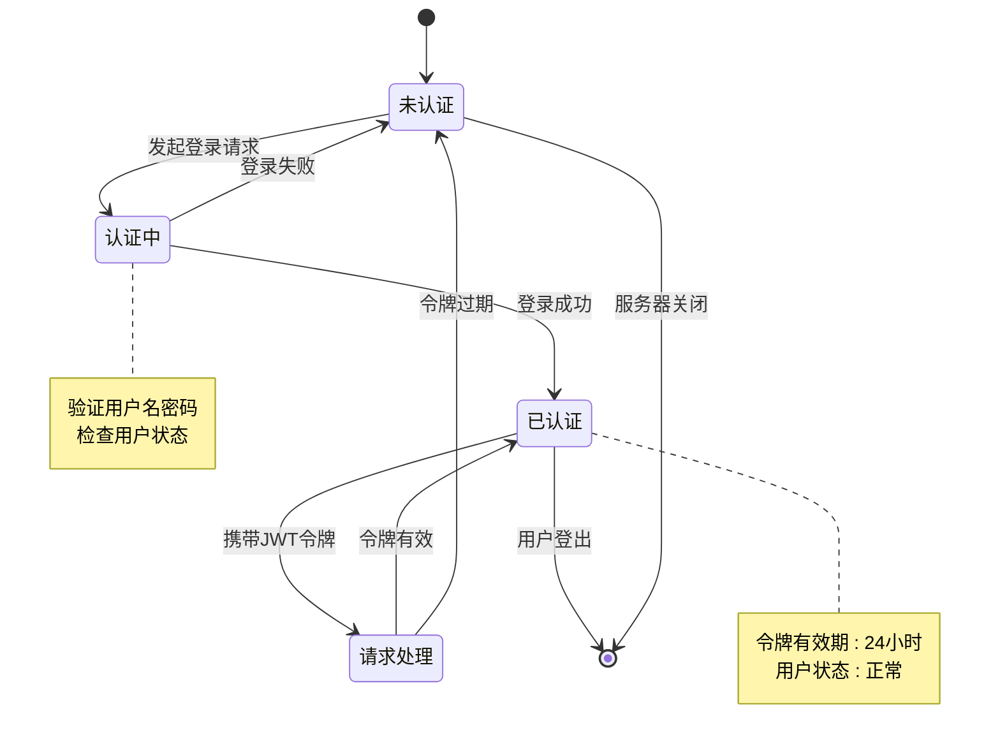

### 用户上下文管理

系统通过ThreadLocal实现用户上下文的线程安全管理：

```mermaid
classDiagram
class UserContext {
-ThreadLocal~User~ USER_HOLDER
+setCurrentUser(User) void
+getCurrentUser() User
+clear() void
}
class JwtFilter {
+onLoginSuccess(AuthenticationToken, Subject,
ServletRequest, ServletResponse) boolean
+onLoginFailure(AuthenticationToken,
AuthenticationException,
ServletRequest, ServletResponse) boolean
}
class User {
+String id
+String username
+String nickname
+String email
+Integer status
}
JwtFilter --> UserContext : 设置用户上下文
UserContext --> User : 存储当前用户
```

**图表来源**
- [UserContext.java](file://src/main/java/com/zhishilu/util/UserContext.java#L8-L33)
- [JwtFilter.java](file://src/main/java/com/zhishilu/shiro/JwtFilter.java#L70-L75)

**章节来源**
- [UserContext.java](file://src/main/java/com/zhishilu/util/UserContext.java#L8-L33)
- [JwtFilter.java](file://src/main/java/com/zhishilu/shiro/JwtFilter.java#L70-L75)

## 错误处理机制

系统采用全局异常处理器统一处理各种异常情况，提供一致的错误响应格式。

### 异常分类处理

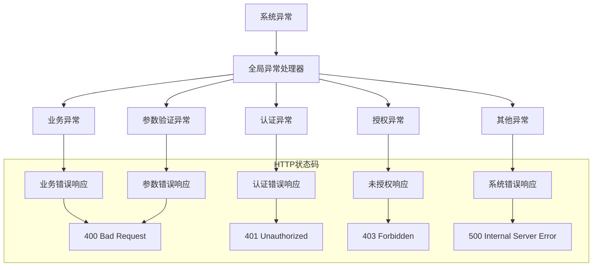

**图表来源**
- [GlobalExceptionHandler.java](file://src/main/java/com/zhishilu/exception/GlobalExceptionHandler.java#L22-L87)

### 错误响应格式

| 异常类型 | HTTP状态码 | 错误代码 | 错误消息示例 |
|----------|------------|----------|--------------|
| 业务异常 | 200 | 业务自定义 | 用户名已存在 |
| 认证异常 | 401 | 401 | 请先登录 |
| 授权异常 | 403 | 403 | 没有权限执行此操作 |
| 参数验证异常 | 400 | 400 | 用户名不能为空 |
| 系统异常 | 500 | 500 | 系统异常，请稍后重试 |

**章节来源**
- [GlobalExceptionHandler.java](file://src/main/java/com/zhishilu/exception/GlobalExceptionHandler.java#L27-L85)

## 使用场景与示例

### 场景一：用户注册流程

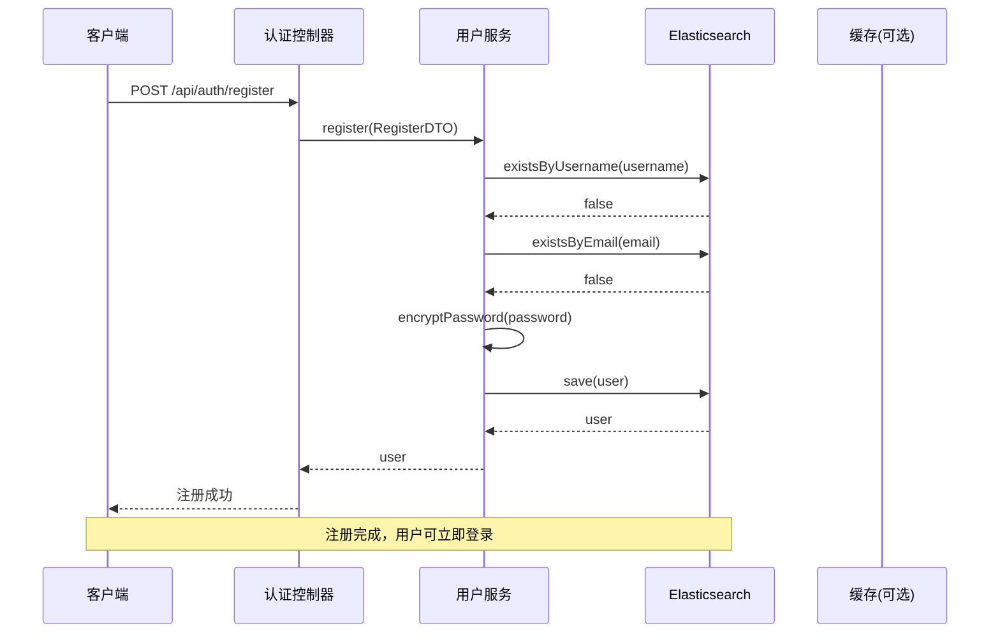

**图表来源**
- [AuthController.java](file://src/main/java/com/zhishilu/controller/AuthController.java#L27-L31)
- [UserService.java](file://src/main/java/com/zhishilu/service/UserService.java#L35-L56)

### 场景二：用户登录流程

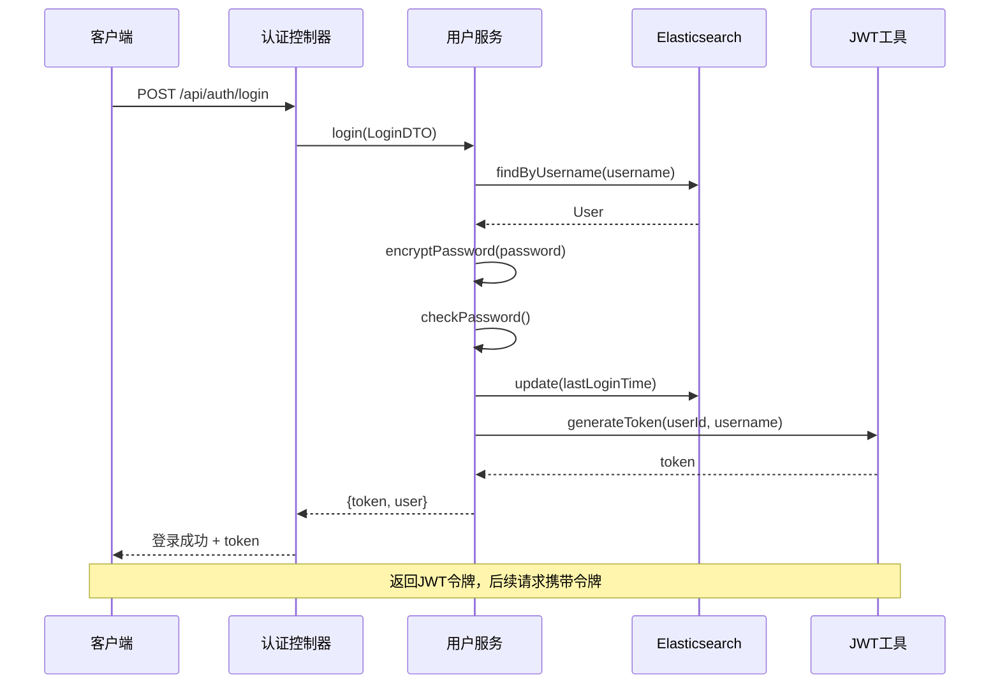

**图表来源**
- [AuthController.java](file://src/main/java/com/zhishilu/controller/AuthController.java#L36-L40)
- [UserService.java](file://src/main/java/com/zhishilu/service/UserService.java#L61-L87)

### 场景三：受保护资源访问

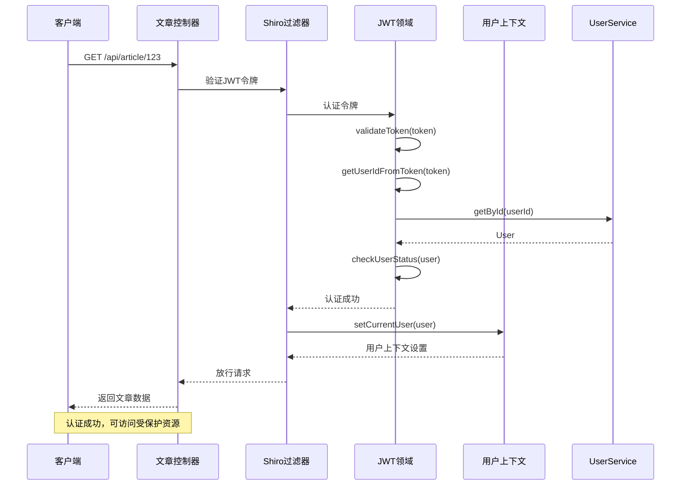

**图表来源**
- [JwtFilter.java](file://src/main/java/com/zhishilu/shiro/JwtFilter.java#L70-L75)
- [JwtRealm.java](file://src/main/java/com/zhishilu/shiro/JwtRealm.java#L44-L69)
- [UserContext.java](file://src/main/java/com/zhishilu/util/UserContext.java#L15-L24)

## 性能考虑

### 数据库优化

1. **索引策略**: 用户名和邮箱字段建立唯一索引，提高查询性能
2. **分片配置**: Elasticsearch使用单分片配置，适合小规模应用
3. **缓存策略**: 可扩展Redis缓存用户信息，减少数据库查询

### 安全性能

1. **密码哈希**: 1024次迭代提供良好的安全性和性能平衡
2. **令牌过期**: 24小时过期时间平衡安全性与用户体验
3. **连接池**: Elasticsearch连接超时配置优化网络性能

### 系统监控

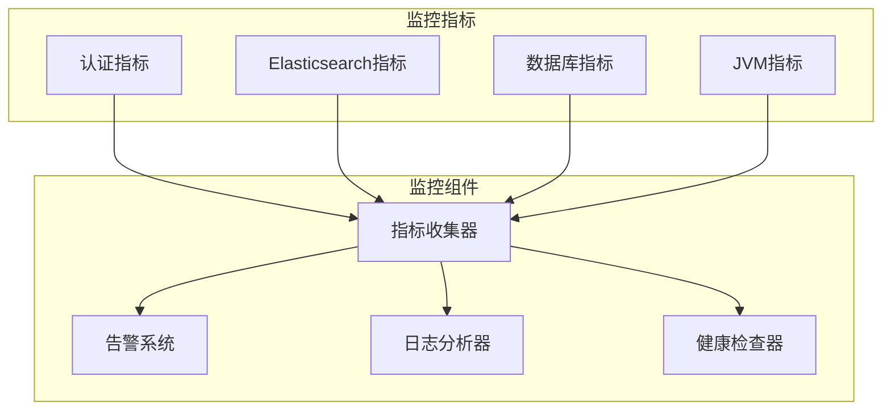

## 故障排除指南

### 常见问题诊断

#### 1. 用户名或密码错误

**症状**: 登录时返回"用户名或密码错误"

**可能原因**:
- 用户名不存在
- 密码不正确
- 用户被禁用

**解决步骤**:
1. 验证用户名是否存在于数据库
2. 检查密码哈希是否匹配
3. 确认用户状态为正常

#### 2. JWT令牌过期

**症状**: 访问受保护资源时返回401未授权

**可能原因**:
- 令牌已过期（默认24小时）
- 服务器时间不同步
- 令牌被篡改

**解决步骤**:
1. 重新登录获取新令牌
2. 检查服务器时间配置
3. 验证令牌签名完整性

#### 3. Elasticsearch连接失败

**症状**: 注册或登录时报数据库连接错误

**可能原因**:
- Elasticsearch服务未启动
- 网络连接问题
- 认证凭据错误

**解决步骤**:
1. 检查Elasticsearch服务状态
2. 验证连接配置
3. 确认网络连通性

### 调试建议

1. **启用详细日志**: 在application.yml中调整日志级别
2. **使用Postman测试**: 验证API接口功能
3. **检查环境变量**: 确保JWT密钥和ES配置正确
4. **监控系统指标**: 关注CPU、内存、磁盘使用情况

**章节来源**
- [GlobalExceptionHandler.java](file://src/main/java/com/zhishilu/exception/GlobalExceptionHandler.java#L27-L85)
- [application.yml](file://src/main/resources/application.yml#L26-L31)