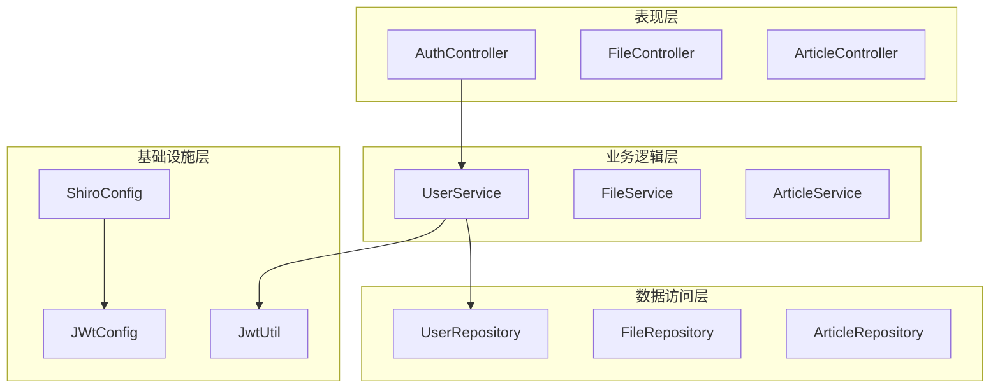
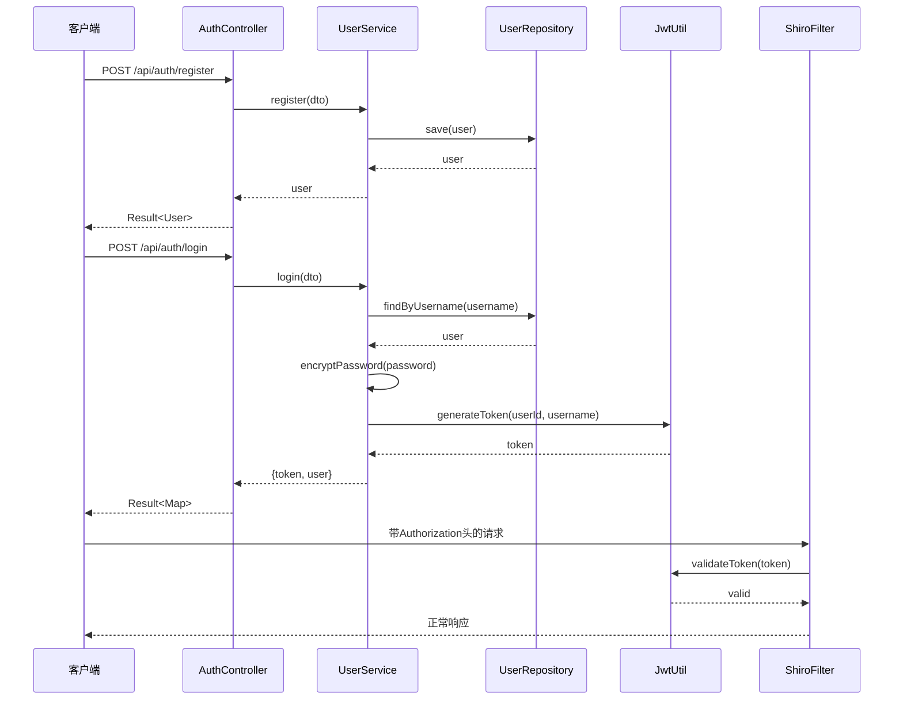
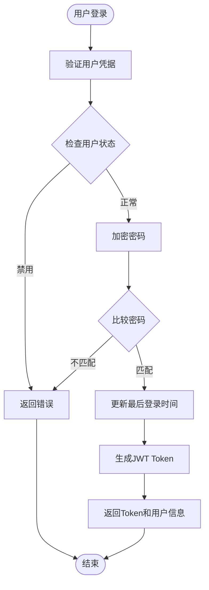
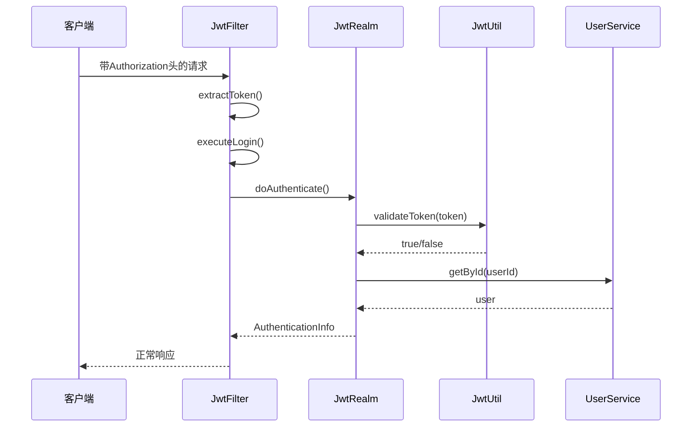
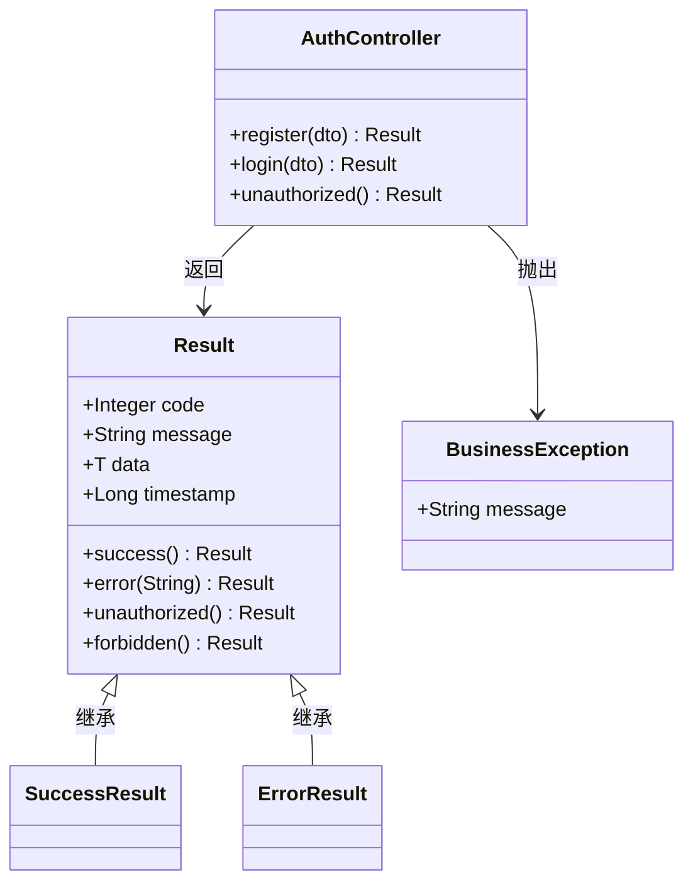
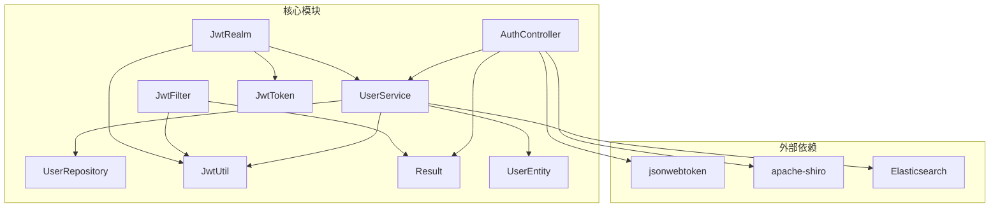

# 认证API接口

<cite>
**本文档引用的文件**
- [AuthController.java](file://src/main/java/com/zhishilu/controller/AuthController.java)
- [LoginDTO.java](file://src/main/java/com/zhishilu/dto/LoginDTO.java)
- [RegisterDTO.java](file://src/main/java/com/zhishilu/dto/RegisterDTO.java)
- [UserService.java](file://src/main/java/com/zhishilu/service/UserService.java)
- [JwtUtil.java](file://src/main/java/com/zhishilu/util/JwtUtil.java)
- [JwtFilter.java](file://src/main/java/com/zhishilu/shiro/JwtFilter.java)
- [JwtRealm.java](file://src/main/java/com/zhishilu/shiro/JwtRealm.java)
- [JwtToken.java](file://src/main/java/com/zhishilu/shiro/JwtToken.java)
- [Result.java](file://src/main/java/com/zhishilu/common/Result.java)
- [User.java](file://src/main/java/com/zhishilu/entity/User.java)
- [ShiroConfig.java](file://src/main/java/com/zhishilu/config/ShiroConfig.java)
- [application.yml](file://src/main/resources/application.yml)
- [README.md](file://README.md)
</cite>

## 目录
1. [简介](#简介)
2. [项目结构](#项目结构)
3. [核心组件](#核心组件)
4. [架构概览](#架构概览)
5. [详细组件分析](#详细组件分析)
6. [依赖关系分析](#依赖关系分析)
7. [性能考虑](#性能考虑)
8. [故障排除指南](#故障排除指南)
9. [结论](#结论)

## 简介

本项目是一个基于Spring Boot的个人知识管理系统，采用Apache Shiro与JWT结合的方式实现用户认证和授权功能。系统提供了完整的用户注册和登录认证接口，支持基于Token的无状态认证机制。

## 项目结构

系统采用标准的分层架构设计，主要包含以下层次：



**图表来源**
- [AuthController.java](file://src/main/java/com/zhishilu/controller/AuthController.java#L17-L20)
- [UserService.java](file://src/main/java/com/zhishilu/service/UserService.java#L22-L25)
- [ShiroConfig.java](file://src/main/java/com/zhishilu/config/ShiroConfig.java#L20-L21)

**章节来源**
- [AuthController.java](file://src/main/java/com/zhishilu/controller/AuthController.java#L1-L50)
- [UserService.java](file://src/main/java/com/zhishilu/service/UserService.java#L1-L128)
- [ShiroConfig.java](file://src/main/java/com/zhishilu/config/ShiroConfig.java#L1-L72)

## 核心组件

### 认证控制器 (AuthController)

AuthController是认证功能的主要入口点，提供了用户注册和登录两个核心接口：

- **注册接口**: POST `/api/auth/register`
- **登录接口**: POST `/api/auth/login`
- **未授权提示**: GET `/api/auth/unauthorized`

### 数据传输对象 (DTO)

系统使用DTO模式来封装请求参数，确保数据验证和传输的安全性：

#### LoginDTO
- `username`: 用户名 (必填，非空)
- `password`: 密码 (必填，非空)

#### RegisterDTO
- `username`: 用户名 (必填，3-20字符)
- `password`: 密码 (必填，6-32字符)
- `nickname`: 昵称 (可选，最多20字符)
- `email`: 邮箱 (可选，有效邮箱格式)

### 服务层 (UserService)

UserService负责具体的业务逻辑实现，包括用户注册、登录验证、密码加密等功能。

### 安全框架集成

系统集成了Apache Shiro和JWT，实现了基于Token的无状态认证机制：

- **JwtFilter**: 处理JWT Token的提取、验证和错误响应
- **JwtRealm**: 实现Shiro的认证逻辑
- **JwtUtil**: 提供JWT Token的生成、解析和验证功能

**章节来源**
- [AuthController.java](file://src/main/java/com/zhishilu/controller/AuthController.java#L14-L50)
- [LoginDTO.java](file://src/main/java/com/zhishilu/dto/LoginDTO.java#L6-L18)
- [RegisterDTO.java](file://src/main/java/com/zhishilu/dto/RegisterDTO.java#L8-L28)
- [UserService.java](file://src/main/java/com/zhishilu/service/UserService.java#L19-L128)

## 架构概览

系统采用前后端分离的架构设计，认证流程通过JWT Token实现无状态认证：



**图表来源**
- [AuthController.java](file://src/main/java/com/zhishilu/controller/AuthController.java#L27-L40)
- [UserService.java](file://src/main/java/com/zhishilu/service/UserService.java#L35-L87)
- [JwtUtil.java](file://src/main/java/com/zhishilu/util/JwtUtil.java#L31-L43)
- [JwtFilter.java](file://src/main/java/com/zhishilu/shiro/JwtFilter.java#L39-L67)

## 详细组件分析

### 认证接口规范

#### 用户注册接口

**接口定义**
- 方法: POST
- 路径: `/api/auth/register`
- 请求体: RegisterDTO
- 响应体: Result<User>

**请求参数说明**

| 参数名 | 类型 | 必填 | 长度限制 | 验证规则 | 描述 |
|--------|------|------|----------|----------|------|
| username | String | 是 | 3-20字符 | 非空，字母数字下划线 | 用户名 |
| password | String | 是 | 6-32字符 | 非空，至少6位 | 登录密码 |
| nickname | String | 否 | 最多20字符 | 可选 | 用户昵称 |
| email | String | 否 | 无限制 | 邮箱格式 | 用户邮箱 |

**响应格式**

成功响应:
```json
{
  "code": 200,
  "message": "注册成功",
  "data": {
    "id": "string",
    "username": "string",
    "nickname": "string",
    "email": "string",
    "avatar": "string",
    "status": 1,
    "createdTime": "2024-01-01T00:00:00",
    "lastLoginTime": "2024-01-01T00:00:00"
  },
  "timestamp": 1700000000000
}
```

失败响应:
```json
{
  "code": 500,
  "message": "用户名已存在",
  "data": null,
  "timestamp": 1700000000000
}
```

**状态码说明**
- 200: 注册成功
- 500: 注册失败（用户名已存在、邮箱已被注册等）
- 400: 请求参数验证失败

#### 用户登录接口

**接口定义**
- 方法: POST
- 路径: `/api/auth/login`
- 请求体: LoginDTO
- 响应体: Result<Map>

**请求参数说明**

| 参数名 | 类型 | 必填 | 验证规则 | 描述 |
|--------|------|------|----------|------|
| username | String | 是 | 非空 | 用户名 |
| password | String | 是 | 非空 | 登录密码 |

**响应格式**

成功响应:
```json
{
  "code": 200,
  "message": "登录成功",
  "data": {
    "token": "eyJhbGciOiJIUzI1NiIsInR5cCI6IkpXVCJ9...",
    "user": {
      "id": "string",
      "username": "string",
      "nickname": "string",
      "email": "string",
      "avatar": "string",
      "status": 1,
      "createdTime": "2024-01-01T00:00:00",
      "lastLoginTime": "2024-01-01T00:00:00"
    }
  },
  "timestamp": 1700000000000
}
```

失败响应:
```json
{
  "code": 500,
  "message": "用户名或密码错误",
  "data": null,
  "timestamp": 1700000000000
}
```

**状态码说明**
- 200: 登录成功
- 500: 登录失败（用户名或密码错误、账号被禁用等）
- 401: 未授权访问

#### 未授权提示接口

**接口定义**
- 方法: GET
- 路径: `/api/auth/unauthorized`
- 响应体: Result<Void>

**响应格式**
```json
{
  "code": 401,
  "message": "未授权，请先登录",
  "data": null,
  "timestamp": 1700000000000
}
```

**章节来源**
- [AuthController.java](file://src/main/java/com/zhishilu/controller/AuthController.java#L24-L48)
- [LoginDTO.java](file://src/main/java/com/zhishilu/dto/LoginDTO.java#L10-L17)
- [RegisterDTO.java](file://src/main/java/com/zhishilu/dto/RegisterDTO.java#L12-L27)
- [Result.java](file://src/main/java/com/zhishilu/common/Result.java#L8-L71)

### JWT Token认证机制

#### Token生成流程



**图表来源**
- [UserService.java](file://src/main/java/com/zhishilu/service/UserService.java#L61-L87)
- [JwtUtil.java](file://src/main/java/com/zhishilu/util/JwtUtil.java#L31-L43)

#### Token验证流程



**图表来源**
- [JwtFilter.java](file://src/main/java/com/zhishilu/shiro/JwtFilter.java#L39-L85)
- [JwtRealm.java](file://src/main/java/com/zhishilu/shiro/JwtRealm.java#L44-L69)
- [JwtUtil.java](file://src/main/java/com/zhishilu/util/JwtUtil.java#L67-L74)

**章节来源**
- [UserService.java](file://src/main/java/com/zhishilu/service/UserService.java#L58-L87)
- [JwtUtil.java](file://src/main/java/com/zhishilu/util/JwtUtil.java#L15-L99)
- [JwtFilter.java](file://src/main/java/com/zhishilu/shiro/JwtFilter.java#L24-L109)
- [JwtRealm.java](file://src/main/java/com/zhishilu/shiro/JwtRealm.java#L15-L71)

### 错误处理策略

系统采用统一的错误处理机制，通过Result类提供标准化的响应格式：



**图表来源**
- [Result.java](file://src/main/java/com/zhishilu/common/Result.java#L8-L71)
- [AuthController.java](file://src/main/java/com/zhishilu/controller/AuthController.java#L14-L50)

**章节来源**
- [Result.java](file://src/main/java/com/zhishilu/common/Result.java#L1-L71)
- [UserService.java](file://src/main/java/com/zhishilu/service/UserService.java#L35-L44)

## 依赖关系分析

系统各组件之间的依赖关系如下：



**图表来源**
- [AuthController.java](file://src/main/java/com/zhishilu/controller/AuthController.java#L3-L10)
- [UserService.java](file://src/main/java/com/zhishilu/service/UserService.java#L3-L12)
- [JwtUtil.java](file://src/main/java/com/zhishilu/util/JwtUtil.java#L3-L7)

**章节来源**
- [AuthController.java](file://src/main/java/com/zhishilu/controller/AuthController.java#L1-L50)
- [UserService.java](file://src/main/java/com/zhishilu/service/UserService.java#L1-L128)
- [ShiroConfig.java](file://src/main/java/com/zhishilu/config/ShiroConfig.java#L1-L72)

## 性能考虑

### JWT配置优化

系统采用以下JWT配置来平衡安全性与性能：

- **密钥长度**: 至少256位的HS256算法密钥
- **过期时间**: 24小时（86400000毫秒）
- **签名算法**: HS256（对称加密，性能较好）

### 缓存策略

建议在生产环境中实现以下缓存策略：
- 用户信息缓存：减少数据库查询次数
- Token黑名单缓存：快速检测失效Token
- 密码哈希缓存：避免重复计算

### 并发处理

系统采用无状态设计，天然支持高并发：
- JWT Token无服务器端状态存储
- 基于Shiro的轻量级认证框架
- Elasticsearch的高性能查询能力

## 故障排除指南

### 常见问题及解决方案

#### 1. Token验证失败

**症状**: 返回401未授权错误

**可能原因**:
- Token已过期
- Token格式不正确
- 密钥配置错误

**解决步骤**:
1. 检查Token是否在有效期内
2. 验证Authorization头格式是否正确
3. 确认JWT密钥配置一致

#### 2. 用户名或密码错误

**症状**: 登录失败，返回用户名或密码错误

**可能原因**:
- 密码输入错误
- 用户名不存在
- 账号被禁用

**解决步骤**:
1. 确认用户名和密码输入正确
2. 检查用户状态是否正常
3. 验证密码加密算法一致性

#### 3. CORS跨域问题

**症状**: 浏览器控制台出现跨域错误

**解决步骤**:
1. 检查前端请求头设置
2. 确认后端CORS配置
3. 验证预检请求处理

**章节来源**
- [JwtFilter.java](file://src/main/java/com/zhishilu/shiro/JwtFilter.java#L58-L85)
- [JwtRealm.java](file://src/main/java/com/zhishilu/shiro/JwtRealm.java#L47-L66)
- [application.yml](file://src/main/resources/application.yml#L26-L32)

## 结论

本认证API接口设计遵循了RESTful原则，采用了JWT无状态认证机制，具有以下特点：

**安全性优势**:
- 基于JWT的无状态认证，支持水平扩展
- 密码采用SHA-256加盐加密存储
- 完整的错误处理和异常捕获机制

**易用性特点**:
- 标准化的响应格式，便于前端集成
- 清晰的接口文档和错误信息
- 灵活的配置选项

**扩展性考虑**:
- 基于Shiro的插件化架构
- 支持细粒度权限控制
- 易于添加新的认证方式

建议在生产环境中进一步完善：
- 添加Token刷新机制
- 实现更细粒度的权限控制
- 增加安全审计日志
- 优化性能监控指标