# Vue前端应用

<cite>
**本文档引用的文件**
- [package.json](file://frontend/package.json)
- [main.ts](file://frontend/src/main.ts)
- [App.vue](file://frontend/src/App.vue)
- [vite.config.ts](file://frontend/vite.config.ts)
- [router/index.ts](file://frontend/src/router/index.ts)
- [stores/counter.ts](file://frontend/src/stores/counter.ts)
- [utils/request.ts](file://frontend/src/utils/request.ts)
- [utils/image.ts](file://frontend/src/utils/image.ts)
- [views/HomeView.vue](file://frontend/src/views/HomeView.vue)
- [views/LoginView.vue](file://frontend/src/views/LoginView.vue)
- [views/ArticleDetailView.vue](file://frontend/src/views/ArticleDetailView.vue)
- [components/ArticleCard.vue](file://frontend/src/components/ArticleCard.vue)
- [tailwind.config.js](file://frontend/tailwind.config.js)
- [postcss.config.js](file://frontend/postcss.config.js)
- [style.css](file://frontend/src/style.css)
</cite>

## 更新摘要
**变更内容**
- 新增桌面端模态框体验功能，提升桌面端用户交互质量
- 增强图像预览功能，支持图片大图查看和滑动浏览
- 优化ArticleCard组件，实现桌面端弹窗与移动端页面的差异化处理
- 完善图片轮播和触摸滑动交互体验
- **新增flex-grow占位符优化**：在ArticleCard组件底部信息区域添加flex-grow占位符，改善卡片布局和视觉平衡

## 目录
1. [项目概述](#项目概述)
2. [项目结构](#项目结构)
3. [核心组件](#核心组件)
4. [架构概览](#架构概览)
5. [详细组件分析](#详细组件分析)
6. [依赖关系分析](#依赖关系分析)
7. [性能考虑](#性能考虑)
8. [故障排除指南](#故障排除指南)
9. [结论](#结论)

## 项目概述

这是一个基于Vue 3构建的现代化前端应用，名为"知拾录"（Personal Knowledge Library）。该应用提供个人知识收藏与管理功能，支持文章浏览、搜索、详情查看等核心功能。项目采用现代前端技术栈，包括Vue 3、TypeScript、Pinia状态管理、Vue Router路由管理和TailwindCSS样式框架。

应用的核心特色包括：
- 响应式设计，支持多设备访问
- 智能搜索功能，包含搜索建议和补全
- 图片轮播和预览功能
- 用户认证和授权机制
- 实时内容更新和缓存策略
- **桌面端模态框体验**，提供更流畅的详情查看体验
- **优化的卡片布局**，通过flex-grow占位符实现视觉平衡

## 项目结构

前端项目采用标准的Vue 3单页应用结构，主要目录组织如下：

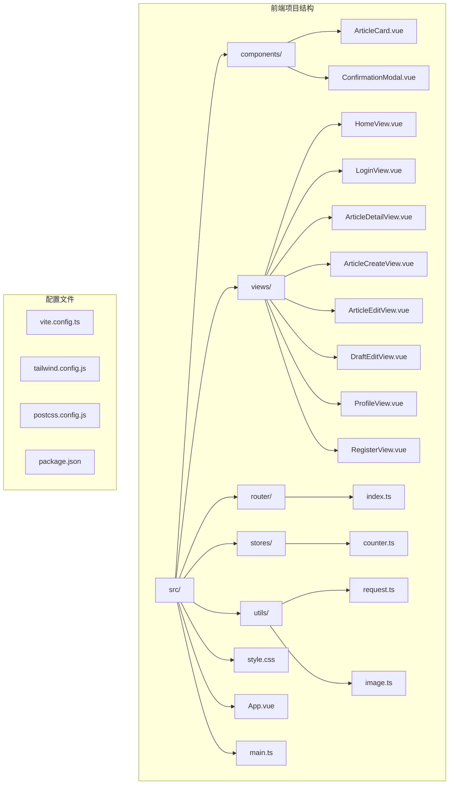

**图表来源**
- [main.ts](file://frontend/src/main.ts#L1-L11)
- [App.vue](file://frontend/src/App.vue#L1-L16)
- [router/index.ts](file://frontend/src/router/index.ts#L1-L85)

**章节来源**
- [package.json](file://frontend/package.json#L1-L61)
- [main.ts](file://frontend/src/main.ts#L1-L11)
- [vite.config.ts](file://frontend/vite.config.ts#L1-L30)

## 核心组件

### 应用入口与初始化

应用通过main.ts文件进行初始化，配置了Vue应用实例、Pinia状态管理和Vue Router路由系统。

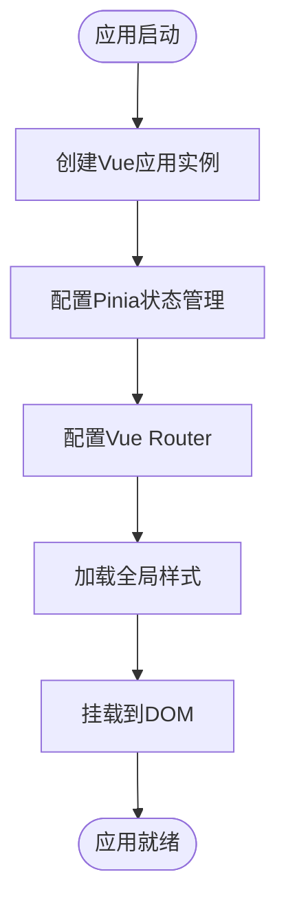

**图表来源**
- [main.ts](file://frontend/src/main.ts#L1-L11)

### 路由系统

应用使用Vue Router实现客户端路由管理，支持多种页面类型和权限控制：

| 路由名称 | 路径 | 组件 | 权限要求 | 功能描述 |
|---------|------|------|----------|----------|
| home | `/` | HomeView | 无需登录 | 主页，文章列表和搜索功能 |
| login | `/login` | LoginView | 无需登录 | 用户登录页面 |
| register | `/register` | RegisterView | 无需登录 | 用户注册页面 |
| profile | `/profile` | ProfileView | 需要登录 | 用户个人中心 |
| post | `/post` | ArticleCreateView | 需要登录 | 新建文章 |
| article-detail | `/article/:id` | ArticleDetailView | 需要登录 | 文章详情查看 |
| article-edit | `/article/:id/edit` | ArticleEditView | 需要登录 | 编辑文章 |
| draft-edit | `/draft/:id/edit` | DraftEditView | 需要登录 | 草稿编辑 |

**图表来源**
- [router/index.ts](file://frontend/src/router/index.ts#L11-L62)

### 状态管理

应用使用Pinia作为状态管理解决方案，目前包含基础计数器状态：

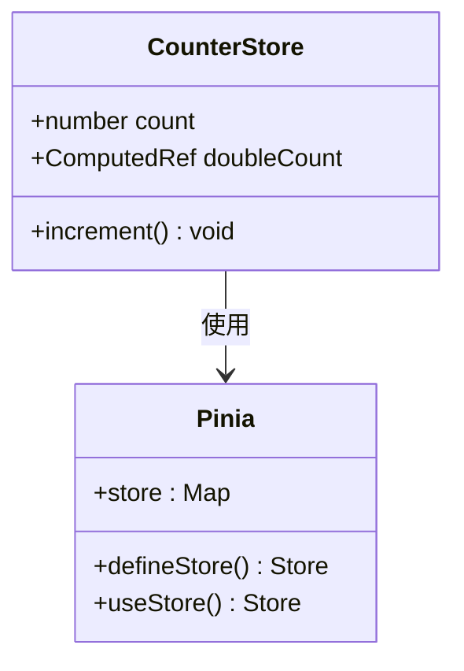

**图表来源**
- [stores/counter.ts](file://frontend/src/stores/counter.ts#L1-L13)

**章节来源**
- [router/index.ts](file://frontend/src/router/index.ts#L65-L82)
- [stores/counter.ts](file://frontend/src/stores/counter.ts#L1-L13)

## 架构概览

应用采用前后端分离架构，前端通过HTTP请求与后端API交互：

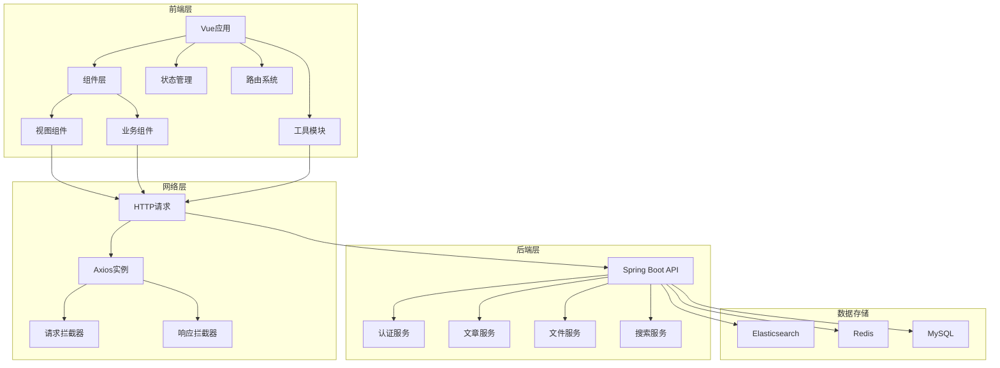

**图表来源**
- [utils/request.ts](file://frontend/src/utils/request.ts#L1-L65)
- [vite.config.ts](file://frontend/vite.config.ts#L22-L27)

## 详细组件分析

### 主页组件 (HomeView)

主页是应用的核心界面，集成了完整的搜索、浏览和交互功能：

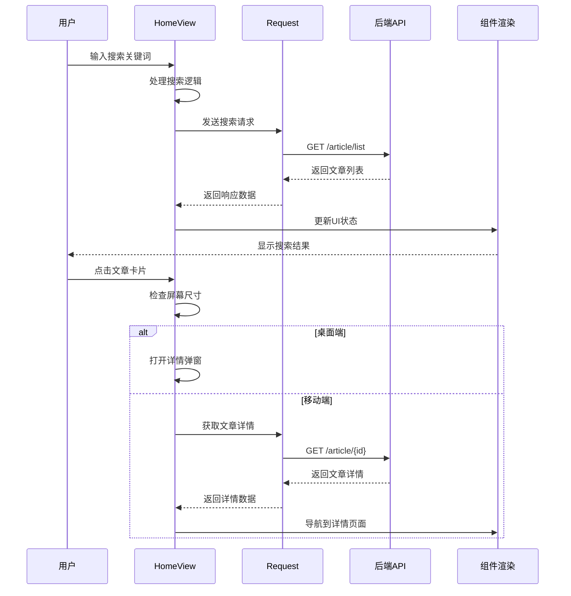

**图表来源**
- [views/HomeView.vue](file://frontend/src/views/HomeView.vue#L560-L611)
- [utils/request.ts](file://frontend/src/utils/request.ts#L1-L65)

主页的主要功能特性：

1. **智能搜索系统**：支持多字段搜索（标题、内容、类别、用户名、地点）
2. **实时搜索建议**：集成搜索补全功能
3. **响应式网格布局**：自适应不同屏幕尺寸的网格显示
4. **图片轮播功能**：支持文章图片的滑动浏览
5. **详情弹窗**：桌面端支持弹窗查看详情，移动端跳转页面

**更新** 新增桌面端模态框体验，提供更流畅的文章详情查看体验

**章节来源**
- [views/HomeView.vue](file://frontend/src/views/HomeView.vue#L1-L893)

### 登录组件 (LoginView)

登录组件提供了用户身份验证功能：

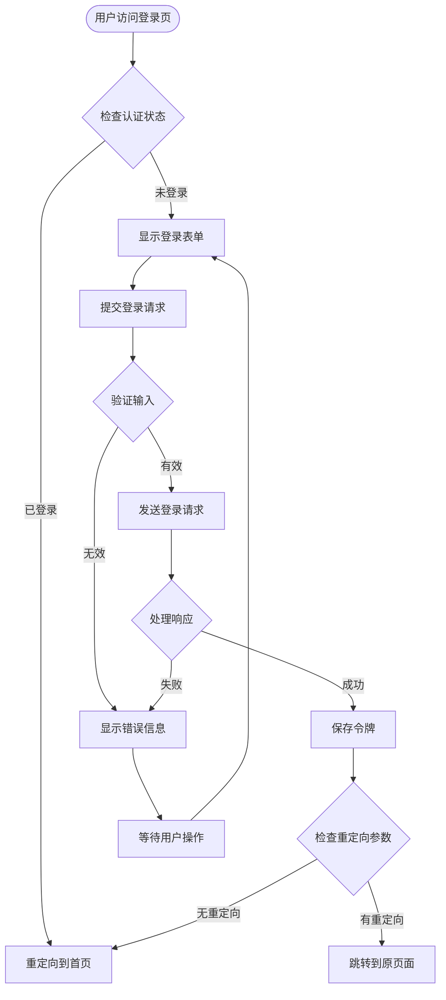

**图表来源**
- [views/LoginView.vue](file://frontend/src/views/LoginView.vue#L176-L201)

**章节来源**
- [views/LoginView.vue](file://frontend/src/views/LoginView.vue#L1-L203)

### 文章详情组件 (ArticleDetailView)

文章详情组件提供了丰富的文章展示和交互功能：

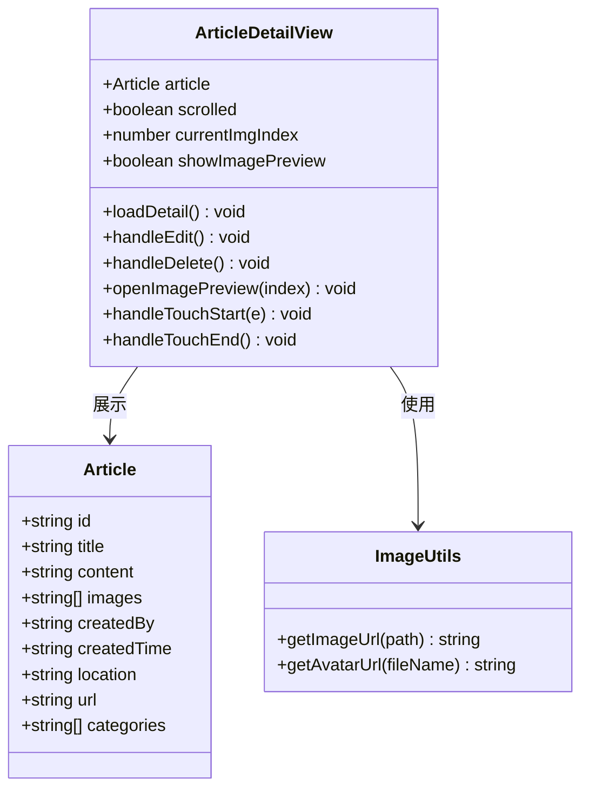

**图表来源**
- [views/ArticleDetailView.vue](file://frontend/src/views/ArticleDetailView.vue#L204-L356)
- [utils/image.ts](file://frontend/src/utils/image.ts#L1-L34)

**更新** 增强图像预览功能，支持图片大图查看和滑动浏览，提供更好的视觉体验

**章节来源**
- [views/ArticleDetailView.vue](file://frontend/src/views/ArticleDetailView.vue#L1-L370)

### 文章卡片组件 (ArticleCard)

文章卡片是主页的核心展示组件，现已支持桌面端弹窗和移动端页面两种模式。**最新优化**是在底部信息区域添加了flex-grow占位符，实现了更好的布局和视觉平衡。

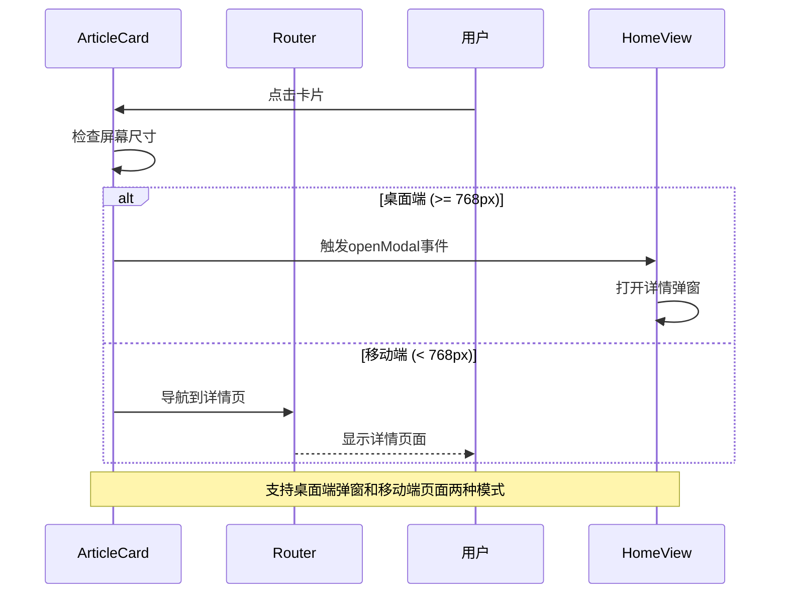

**图表来源**
- [components/ArticleCard.vue](file://frontend/src/components/ArticleCard.vue#L102-L109)

**更新** 新增桌面端弹窗功能，通过屏幕宽度检测实现差异化处理

**更新** **新增flex-grow占位符优化**：在底部信息区域添加flex-grow占位符，将发布人信息、时间地点和链接信息推到底部，实现视觉平衡和更好的布局效果

**章节来源**
- [components/ArticleCard.vue](file://frontend/src/components/ArticleCard.vue#L1-L238)

### 网络请求模块 (Request)

应用使用Axios封装HTTP请求，提供统一的请求和响应处理：

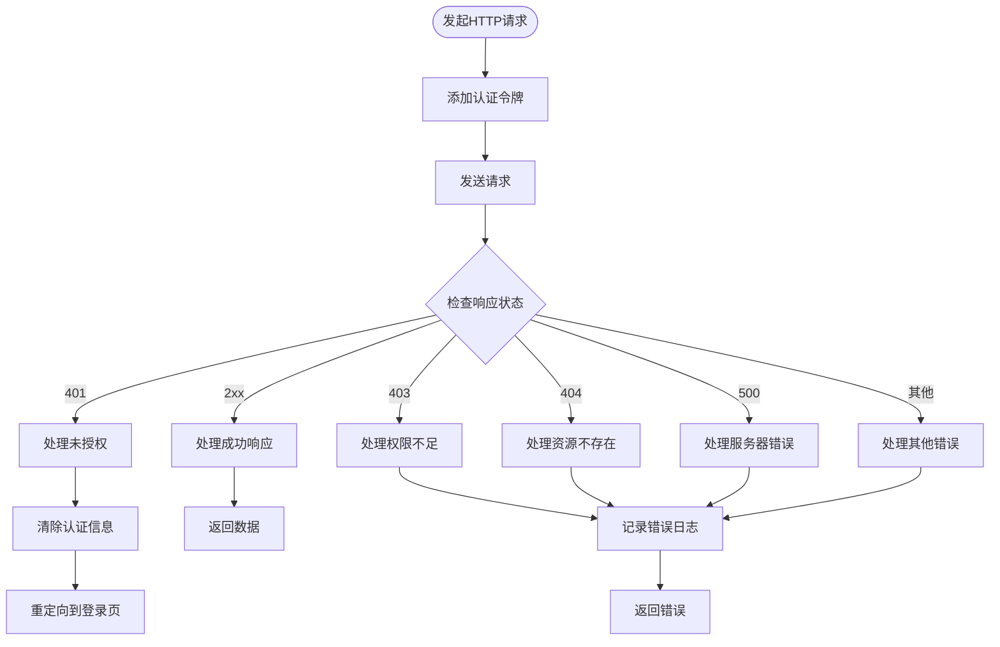

**图表来源**
- [utils/request.ts](file://frontend/src/utils/request.ts#L14-L62)

**章节来源**
- [utils/request.ts](file://frontend/src/utils/request.ts#L1-L65)

### 图片处理模块 (Image)

图片处理模块负责生成正确的图片访问URL：

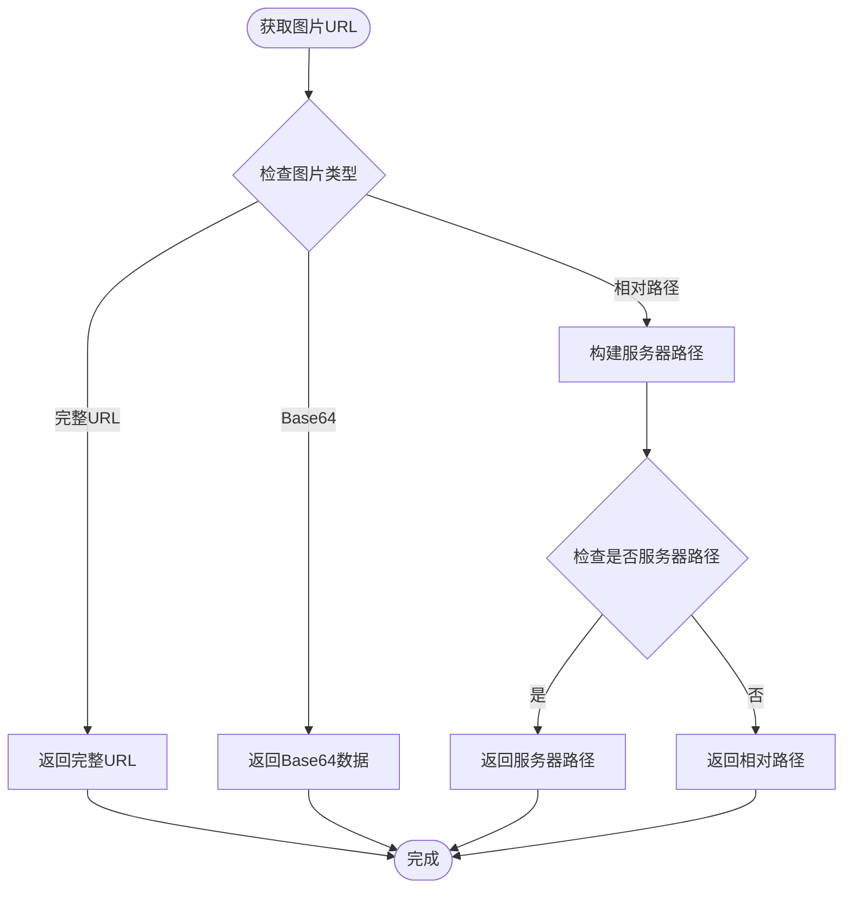

**图表来源**
- [utils/image.ts](file://frontend/src/utils/image.ts#L6-L33)

**章节来源**
- [utils/image.ts](file://frontend/src/utils/image.ts#L1-L34)

## 依赖关系分析

应用的依赖关系体现了清晰的分层架构：

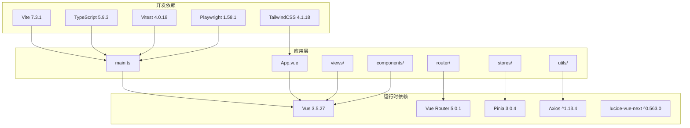

**图表来源**
- [package.json](file://frontend/package.json#L19-L56)

**章节来源**
- [package.json](file://frontend/package.json#L1-L61)

## 性能考虑

### 前端性能优化策略

1. **路由懒加载**：通过动态导入实现组件按需加载
2. **图片优化**：支持懒加载和格式优化
3. **状态缓存**：使用localStorage缓存用户认证信息
4. **请求优化**：实现请求去重和防抖机制
5. **组件优化**：使用keep-alive缓存常用组件
6. **模态框优化**：使用teleport实现DOM分离，提升渲染性能
7. **布局优化**：通过flex-grow占位符实现高效的弹性布局

### 构建优化

应用使用Vite进行快速开发和生产构建，支持：
- 即时热更新（HMR）
- 代码分割和懒加载
- Tree-shaking优化
- 压缩和混淆

## 故障排除指南

### 常见问题及解决方案

1. **登录失败**
   - 检查用户名和密码是否正确
   - 确认网络连接正常
   - 查看浏览器控制台错误信息

2. **图片加载失败**
   - 检查图片URL是否正确
   - 确认文件服务器正常运行
   - 验证文件权限设置

3. **搜索功能异常**
   - 检查Elasticsearch服务状态
   - 验证索引是否正确建立
   - 确认搜索参数格式正确

4. **路由跳转问题**
   - 检查路由配置是否正确
   - 验证认证状态和权限
   - 确认重定向参数处理

5. **模态框显示问题**
   - 检查teleport目标元素是否存在
   - 验证z-index层级设置
   - 确认事件冒泡处理

6. **卡片布局问题**
   - 检查flex-grow占位符是否正确应用
   - 验证容器的flex属性设置
   - 确认响应式断点配置

**章节来源**
- [utils/request.ts](file://frontend/src/utils/request.ts#L34-L61)
- [router/index.ts](file://frontend/src/router/index.ts#L66-L82)

## 结论

该Vue前端应用展现了现代前端开发的最佳实践，具有以下特点：

**技术优势**：
- 采用Vue 3 Composition API，提供更好的类型安全和开发体验
- 使用TypeScript增强代码质量和可维护性
- 集成Pinia实现简洁高效的状态管理
- 通过TailwindCSS实现快速样式开发
- **新增桌面端模态框体验**，提升用户交互质量
- **优化的卡片布局系统**，通过flex-grow占位符实现视觉平衡

**功能特色**：
- 完整的用户认证和授权体系
- 智能搜索和推荐功能
- 响应式设计支持多设备访问
- 实时内容更新和交互反馈
- **增强的图像预览功能**，支持大图查看和滑动浏览
- **桌面端弹窗详情页**，提供更流畅的用户体验
- **优化的卡片布局**，通过flex-grow占位符改善视觉平衡

**架构优势**：
- 清晰的分层架构和模块化设计
- 良好的扩展性和维护性
- 完善的错误处理和调试机制
- 标准化的开发流程和工具链

**布局优化亮点**：
- **flex-grow占位符技术**：在ArticleCard组件底部信息区域添加flex-grow占位符，实现内容的弹性分布
- **视觉平衡设计**：通过占位符将发布人信息、时间地点和链接信息推到底部，创造更和谐的视觉效果
- **响应式布局**：在不同屏幕尺寸下保持一致的布局体验

该应用为个人知识管理提供了优秀的用户体验和技术基础，特别是新增的桌面端模态框功能和flex-grow占位符优化显著提升了用户交互体验和视觉美感，具备良好的发展和扩展潜力。