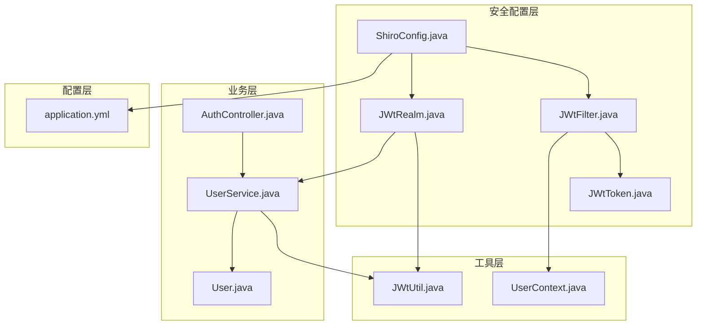
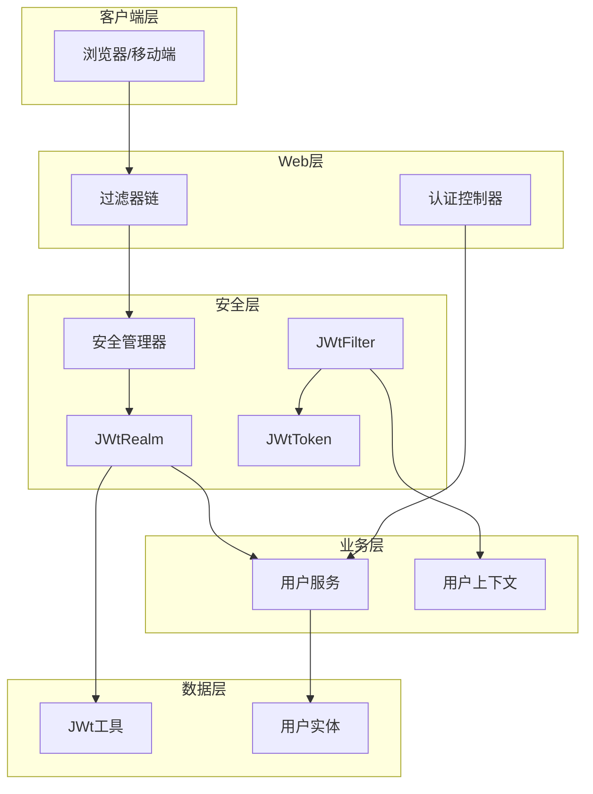
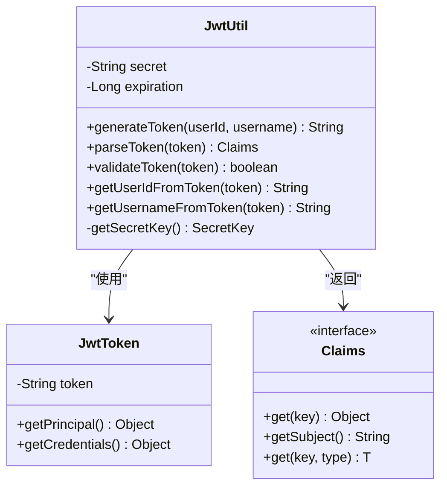
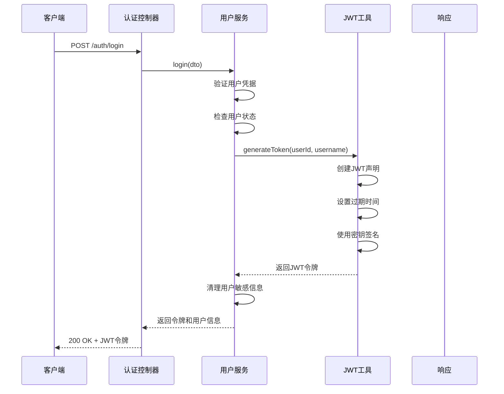
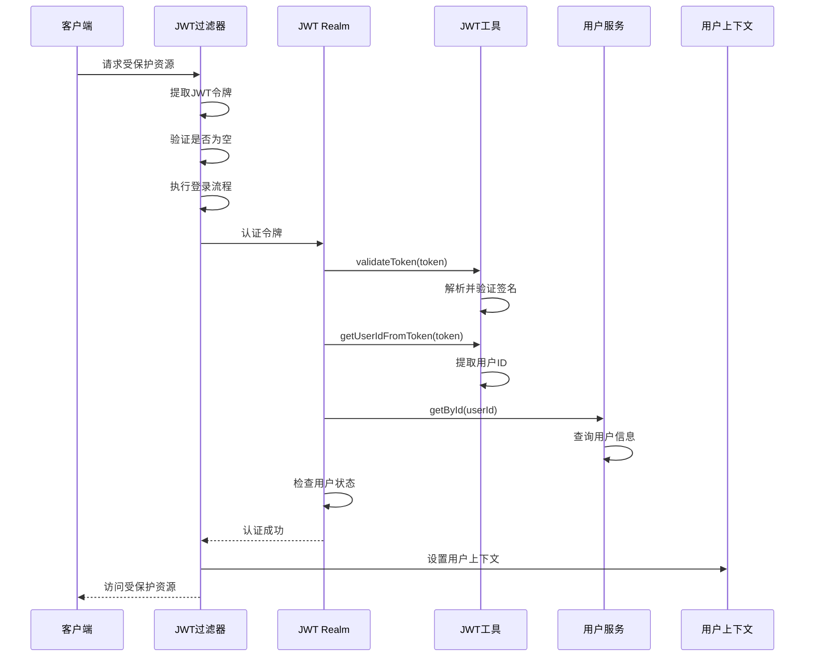
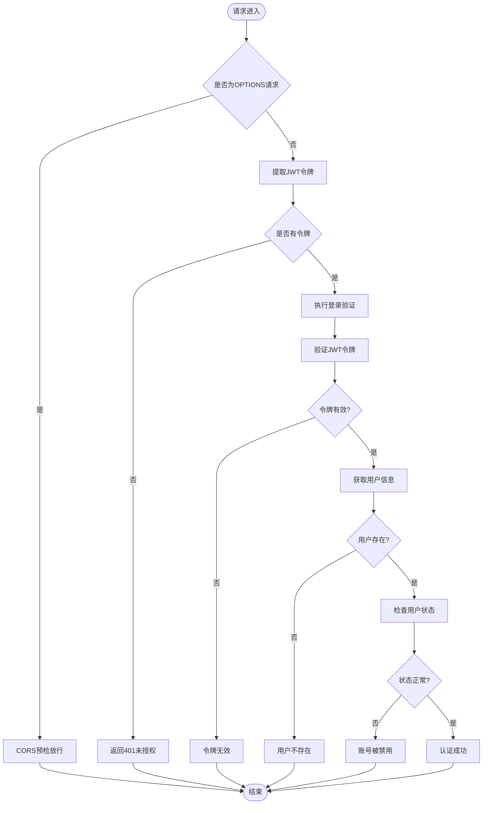
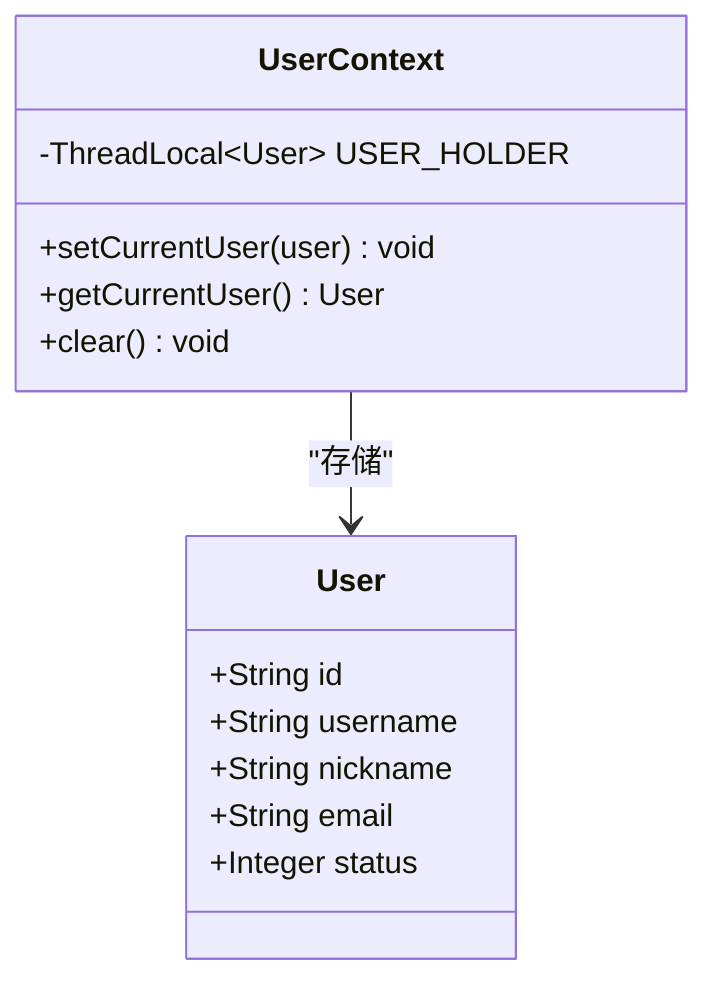
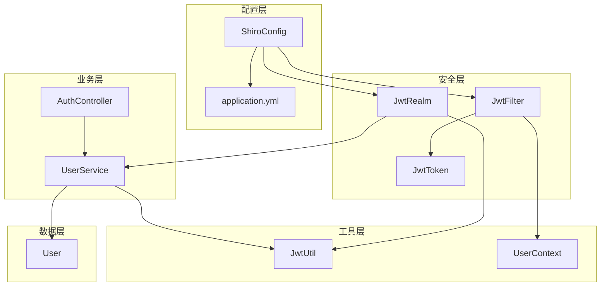

# 安全架构设计

<cite>
**本文档引用的文件**
- [ShiroConfig.java](file://src/main/java/com/zhishilu/config/ShiroConfig.java)
- [JwtFilter.java](file://src/main/java/com/zhishilu/shiro/JwtFilter.java)
- [JwtRealm.java](file://src/main/java/com/zhishilu/shiro/JwtRealm.java)
- [JwtToken.java](file://src/main/java/com/zhishilu/shiro/JwtToken.java)
- [JwtUtil.java](file://src/main/java/com/zhishilu/util/JwtUtil.java)
- [AuthController.java](file://src/main/java/com/zhishilu/controller/AuthController.java)
- [UserService.java](file://src/main/java/com/zhishilu/service/UserService.java)
- [UserContext.java](file://src/main/java/com/zhishilu/util/UserContext.java)
- [User.java](file://src/main/java/com/zhishilu/entity/User.java)
- [application.yml](file://src/main/resources/application.yml)
- [README.md](file://README.md)
</cite>

## 目录
1. [引言](#引言)
2. [项目结构](#项目结构)
3. [核心组件](#核心组件)
4. [架构概览](#架构概览)
5. [详细组件分析](#详细组件分析)
6. [依赖关系分析](#依赖关系分析)
7. [性能考虑](#性能考虑)
8. [故障排除指南](#故障排除指南)
9. [结论](#结论)

## 引言

知拾录系统采用基于Apache Shiro和JWT的无状态认证架构，实现了RESTful API的安全访问控制。该架构通过无会话设计消除了服务器端状态存储，提高了系统的可扩展性和负载均衡能力。本文档深入分析了安全管理器配置、过滤器链设计、Realm实现以及JWT令牌的完整生命周期管理。

## 项目结构

知拾录系统的安全架构主要分布在以下模块中：

**图表来源**
- [ShiroConfig.java](file://src/main/java/com/zhishilu/config/ShiroConfig.java#L1-L72)
- [JwtFilter.java](file://src/main/java/com/zhishilu/shiro/JwtFilter.java#L1-L109)
- [JwtRealm.java](file://src/main/java/com/zhishilu/shiro/JwtRealm.java#L1-L71)

**章节来源**
- [README.md](file://README.md#L1-L133)

## 核心组件

### 安全管理器配置

系统的核心安全管理器通过ShiroConfig进行配置，实现了无状态认证的关键设置：

- **会话禁用策略**：通过DefaultSubjectDAO和DefaultSessionStorageEvaluator禁用了Shiro自带的Session功能
- **Realm集成**：将自定义的JwtRealm注入到安全管理器中
- **过滤器链**：配置了灵活的URL匹配规则和过滤器映射

### JWT过滤器链

JwtFilter作为自定义过滤器，负责处理所有HTTP请求的认证逻辑：

- **Token提取**：支持从HTTP头和URL参数两种方式提取JWT令牌
- **CORS支持**：对OPTIONS预检请求直接放行
- **错误处理**：统一的401未授权响应格式
- **用户上下文**：认证成功后将用户信息存入ThreadLocal上下文

### Realm实现

JwtRealm实现了Shiro的AuthorizingRealm接口，提供完整的认证和授权服务：

- **认证流程**：验证JWT令牌有效性，解析用户信息，检查用户状态
- **授权框架**：提供基础的授权信息结构，支持未来扩展
- **异常处理**：针对不同认证失败场景抛出相应的异常

**章节来源**
- [ShiroConfig.java](file://src/main/java/com/zhishilu/config/ShiroConfig.java#L26-L70)
- [JwtFilter.java](file://src/main/java/com/zhishilu/shiro/JwtFilter.java#L39-L85)
- [JwtRealm.java](file://src/main/java/com/zhishilu/shiro/JwtRealm.java#L26-L69)

## 架构概览

知拾录系统的安全架构采用分层设计，确保了高内聚、低耦合的系统结构：

**图表来源**
- [ShiroConfig.java](file://src/main/java/com/zhishilu/config/ShiroConfig.java#L26-L70)
- [JwtFilter.java](file://src/main/java/com/zhishilu/shiro/JwtFilter.java#L39-L85)
- [JwtRealm.java](file://src/main/java/com/zhishilu/shiro/JwtRealm.java#L26-L69)

## 详细组件分析

### JWT工具类分析

JwtUtil提供了完整的JWT令牌管理功能：

**图表来源**
- [JwtUtil.java](file://src/main/java/com/zhishilu/util/JwtUtil.java#L20-L98)
- [JwtToken.java](file://src/main/java/com/zhishilu/shiro/JwtToken.java#L8-L25)

#### 令牌生成流程

**图表来源**
- [AuthController.java](file://src/main/java/com/zhishilu/controller/AuthController.java#L36-L40)
- [UserService.java](file://src/main/java/com/zhishilu/service/UserService.java#L61-L87)
- [JwtUtil.java](file://src/main/java/com/zhishilu/util/JwtUtil.java#L31-L43)

#### 认证流程

**图表来源**
- [JwtFilter.java](file://src/main/java/com/zhishilu/shiro/JwtFilter.java#L58-L75)
- [JwtRealm.java](file://src/main/java/com/zhishilu/shiro/JwtRealm.java#L44-L69)
- [JwtUtil.java](file://src/main/java/com/zhishilu/util/JwtUtil.java#L67-L82)

### 过滤器链设计

系统通过ShiroConfig配置了灵活的过滤器链规则：

**图表来源**
- [ShiroConfig.java](file://src/main/java/com/zhishilu/config/ShiroConfig.java#L56-L64)
- [JwtFilter.java](file://src/main/java/com/zhishilu/shiro/JwtFilter.java#L58-L85)
- [JwtRealm.java](file://src/main/java/com/zhishilu/shiro/JwtRealm.java#L44-L69)

### 用户上下文管理

UserContext提供了线程级别的用户信息存储：

**图表来源**
- [UserContext.java](file://src/main/java/com/zhishilu/util/UserContext.java#L8-L33)
- [User.java](file://src/main/java/com/zhishilu/entity/User.java#L15-L67)

**章节来源**
- [JwtUtil.java](file://src/main/java/com/zhishilu/util/JwtUtil.java#L20-L98)
- [JwtFilter.java](file://src/main/java/com/zhishilu/shiro/JwtFilter.java#L39-L85)
- [JwtRealm.java](file://src/main/java/com/zhishilu/shiro/JwtRealm.java#L26-L69)
- [UserContext.java](file://src/main/java/com/zhishilu/util/UserContext.java#L8-L33)

## 依赖关系分析

系统安全组件之间的依赖关系体现了清晰的分层架构：

**图表来源**
- [ShiroConfig.java](file://src/main/java/com/zhishilu/config/ShiroConfig.java#L26-L70)
- [JwtFilter.java](file://src/main/java/com/zhishilu/shiro/JwtFilter.java#L39-L85)
- [JwtRealm.java](file://src/main/java/com/zhishilu/shiro/JwtRealm.java#L23-L24)

### 组件耦合度分析

- **低耦合设计**：各组件通过接口和抽象类进行交互，减少了直接依赖
- **依赖注入**：Spring框架的依赖注入机制确保了组件间的松散耦合
- **接口隔离**：每个组件都有明确的职责边界和接口定义

**章节来源**
- [ShiroConfig.java](file://src/main/java/com/zhishilu/config/ShiroConfig.java#L26-L70)
- [JwtFilter.java](file://src/main/java/com/zhishilu/shiro/JwtFilter.java#L39-L85)
- [JwtRealm.java](file://src/main/java/com/zhishilu/shiro/JwtRealm.java#L23-L24)

## 性能考虑

### 无状态认证的优势

1. **水平扩展性**：无会话设计使得系统可以轻松实现水平扩展
2. **内存优化**：避免了服务器端Session存储的内存消耗
3. **负载均衡**：多个应用实例可以共享相同的认证状态

### 性能优化建议

1. **令牌缓存策略**：对于频繁访问的用户，可以考虑实现令牌缓存机制
2. **异步认证**：对于复杂的权限检查，可以考虑异步处理
3. **连接池优化**：合理配置数据库和外部服务的连接池参数

## 故障排除指南

### 常见安全问题及解决方案

#### 1. 令牌过期问题

**问题现象**：用户登录后一段时间无法访问受保护资源

**解决方案**：
- 检查JWT过期时间配置
- 实现令牌刷新机制
- 在客户端实现自动刷新逻辑

#### 2. CORS跨域问题

**问题现象**：前端请求出现跨域错误

**解决方案**：
- 配置正确的CORS头
- 确保OPTIONS预检请求正确处理
- 检查代理服务器配置

#### 3. 用户状态异常

**问题现象**：用户被禁用但仍能访问系统

**解决方案**：
- 检查用户状态字段值
- 确认状态检查逻辑
- 实现用户状态实时同步

**章节来源**
- [JwtFilter.java](file://src/main/java/com/zhishilu/shiro/JwtFilter.java#L58-L85)
- [JwtRealm.java](file://src/main/java/com/zhishilu/shiro/JwtRealm.java#L64-L66)
- [application.yml](file://src/main/resources/application.yml#L27-L31)

## 结论

知拾录系统的安全架构通过Apache Shiro和JWT的有机结合，实现了高效、可扩展的无状态认证方案。该架构具有以下特点：

1. **安全性**：采用JWT令牌和Spring Security框架确保认证安全
2. **可扩展性**：无会话设计支持水平扩展和微服务部署
3. **易维护性**：清晰的分层架构和依赖注入机制便于代码维护
4. **灵活性**：可配置的过滤器链和Realm实现支持业务需求变化

该安全架构为类似的知识管理系统提供了良好的参考模板，特别是在需要支持大量并发用户和复杂权限控制的场景下表现尤为突出。