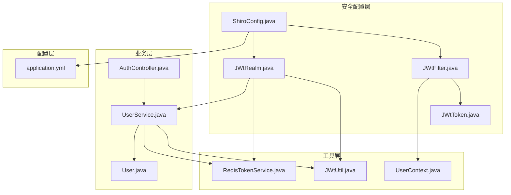
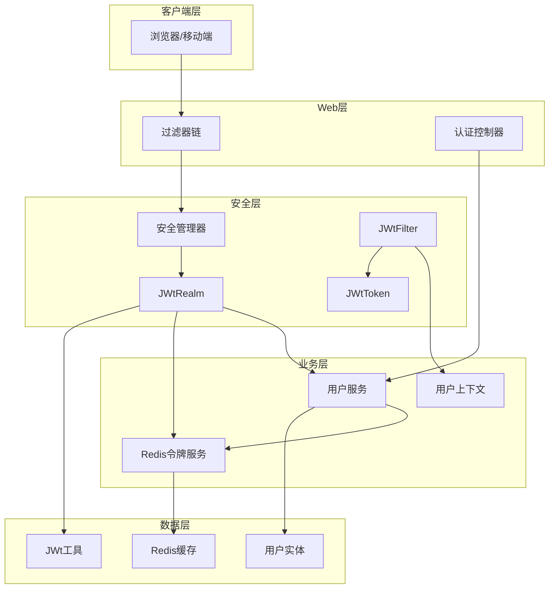
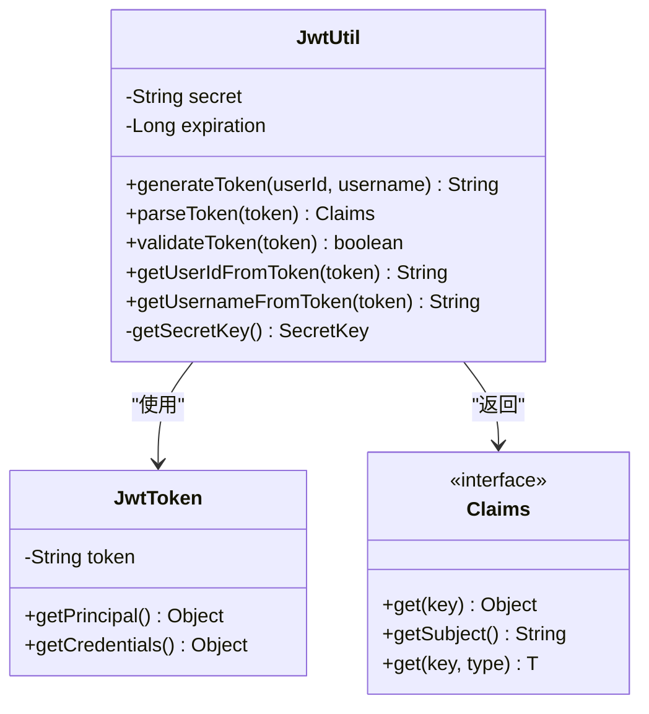
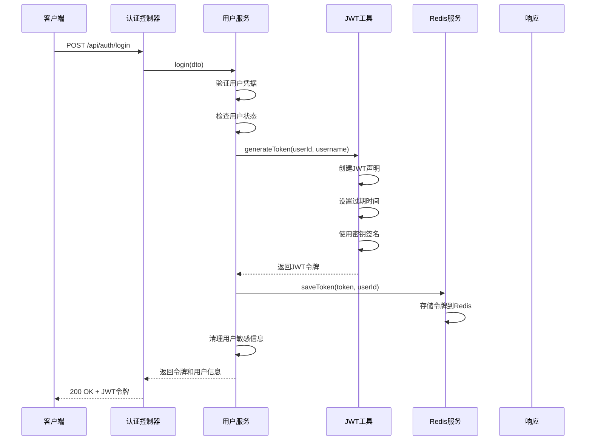
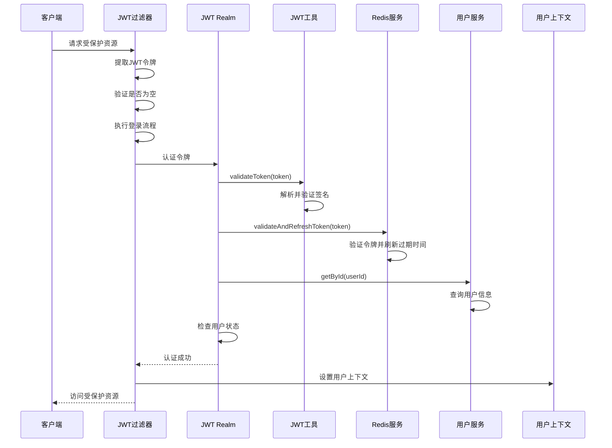
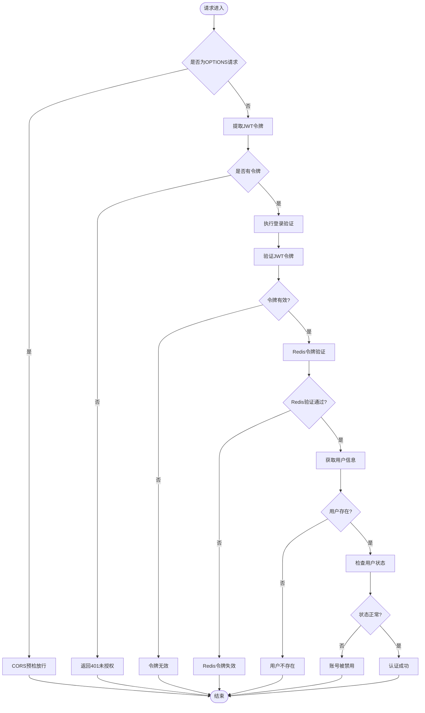
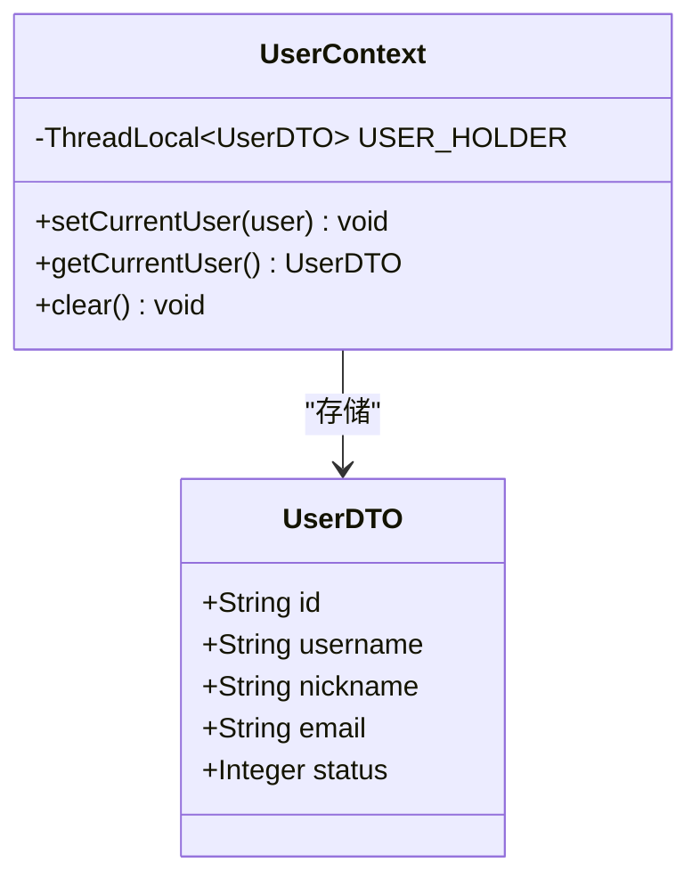
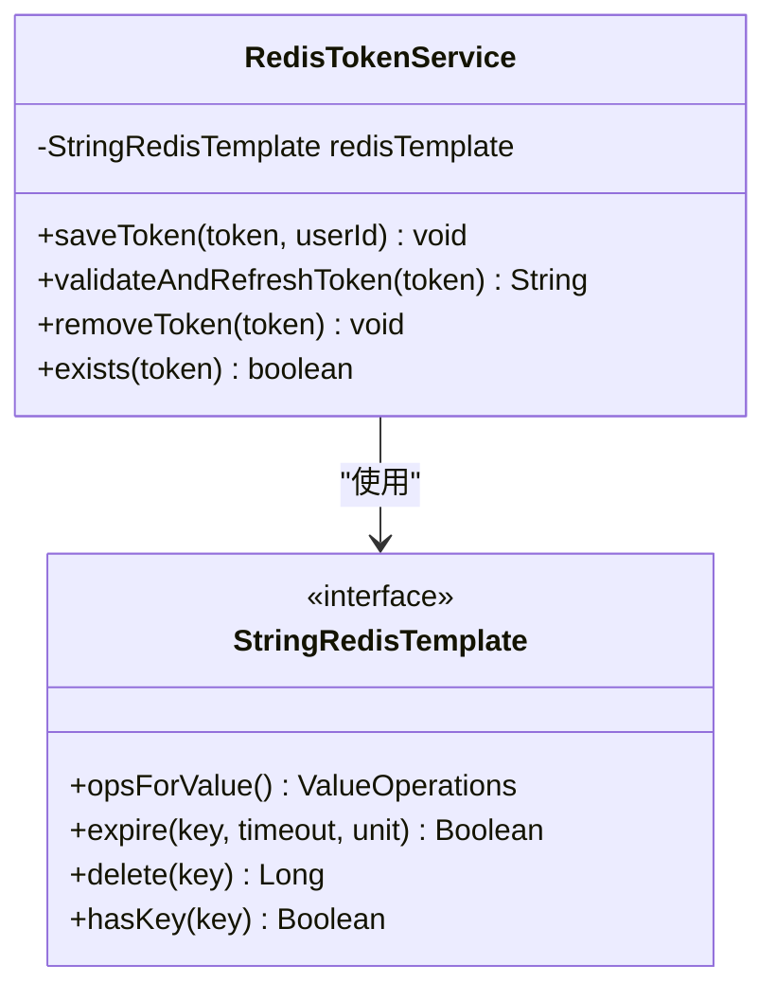

# 安全架构设计

<cite>
**本文档引用的文件**
- [ShiroConfig.java](file://src/main/java/com/zhishilu/config/ShiroConfig.java)
- [JwtFilter.java](file://src/main/java/com/zhishilu/shiro/JwtFilter.java)
- [JwtRealm.java](file://src/main/java/com/zhishilu/shiro/JwtRealm.java)
- [JwtToken.java](file://src/main/java/com/zhishilu/shiro/JwtToken.java)
- [JwtUtil.java](file://src/main/java/com/zhishilu/util/JwtUtil.java)
- [AuthController.java](file://src/main/java/com/zhishilu/controller/AuthController.java)
- [UserService.java](file://src/main/java/com/zhishilu/service/UserService.java)
- [UserContext.java](file://src/main/java/com/zhishilu/util/UserContext.java)
- [RedisTokenService.java](file://src/main/java/com/zhishilu/service/RedisTokenService.java)
- [application.yml](file://src/main/resources/application.yml)
- [README.md](file://README.md)
</cite>

## 更新摘要
**变更内容**
- 补充了Redis Token服务的完整实现细节
- 更新了JWT配置参数和安全策略
- 完善了认证流程和过滤器链的详细说明
- 增加了用户上下文管理的实现细节
- 补充了完整的安全组件依赖关系分析

## 目录
1. [引言](#引言)
2. [项目结构](#项目结构)
3. [核心组件](#核心组件)
4. [架构概览](#架构概览)
5. [详细组件分析](#详细组件分析)
6. [依赖关系分析](#依赖关系分析)
7. [性能考虑](#性能考虑)
8. [故障排除指南](#故障排除指南)
9. [结论](#结论)

## 引言

知拾录系统采用基于Apache Shiro和JWT的无状态认证架构，实现了RESTful API的安全访问控制。该架构通过无会话设计消除了服务器端状态存储，提高了系统的可扩展性和负载均衡能力。本文档深入分析了安全管理器配置、过滤器链设计、Realm实现以及JWT令牌的完整生命周期管理，特别关注了Redis Token服务的集成和用户上下文管理机制。

## 项目结构

知拾录系统的安全架构主要分布在以下模块中：

```mermaid
graph TB
subgraph "安全配置层"
SC[ShiroConfig.java]
JC[JWtFilter.java]
JR[JWtRealm.java]
JT[JWtToken.java]
end
subgraph "工具层"
JU[JWtUtil.java]
UC[UserContext.java]
RT[RedisTokenService.java]
end
subgraph "业务层"
AC[AuthController.java]
US[UserService.java]
UE[User.java]
end
subgraph "配置层"
YML[application.yml]
end
SC --> JC
SC --> JR
JC --> JT
JR --> JU
JR --> RT
JR --> US
US --> JU
US --> RT
US --> UE
AC --> US
JC --> UC
SC --> YML
```

**图表来源**
- [ShiroConfig.java](file://src/main/java/com/zhishilu/config/ShiroConfig.java#L1-L104)
- [JwtFilter.java](file://src/main/java/com/zhishilu/shiro/JwtFilter.java#L1-L107)
- [JwtRealm.java](file://src/main/java/com/zhishilu/shiro/JwtRealm.java#L1-L78)

**章节来源**
- [README.md](file://README.md#L1-L132)

## 核心组件

### 安全管理器配置

系统的核心安全管理器通过ShiroConfig进行配置，实现了无状态认证的关键设置：

- **会话禁用策略**：通过DefaultSubjectDAO和DefaultSessionStorageEvaluator禁用了Shiro自带的Session功能
- **Realm集成**：将自定义的JwtRealm注入到安全管理器中
- **过滤器链**：配置了灵活的URL匹配规则和过滤器映射
- **自定义过滤器注册**：手动注册JwtFilter确保@Value注解生效

### JWT过滤器链

JwtFilter作为自定义过滤器，负责处理所有HTTP请求的认证逻辑：

- **Token提取**：支持从HTTP头（Authorization）和URL参数两种方式提取JWT令牌
- **CORS支持**：对OPTIONS预检请求直接放行
- **错误处理**：统一的401未授权响应格式
- **用户上下文**：认证成功后将用户信息存入ThreadLocal上下文
- **配置参数**：通过@Value注解支持自定义Header名称和Token前缀

### Realm实现

JwtRealm实现了Shiro的AuthorizingRealm接口，提供完整的认证和授权服务：

- **认证流程**：验证JWT令牌有效性，解析用户信息，检查用户状态
- **Redis集成**：通过RedisTokenService验证令牌并刷新过期时间
- **授权框架**：提供基础的授权信息结构，支持未来扩展
- **异常处理**：针对不同认证失败场景抛出相应的异常

**章节来源**
- [ShiroConfig.java](file://src/main/java/com/zhishilu/config/ShiroConfig.java#L27-L102)
- [JwtFilter.java](file://src/main/java/com/zhishilu/shiro/JwtFilter.java#L27-L106)
- [JwtRealm.java](file://src/main/java/com/zhishilu/shiro/JwtRealm.java#L23-L77)

## 架构概览

知拾录系统的安全架构采用分层设计，确保了高内聚、低耦合的系统结构：

```mermaid
graph TB
subgraph "客户端层"
C[浏览器/移动端]
end
subgraph "Web层"
F[过滤器链]
AC[认证控制器]
end
subgraph "安全层"
SM[安全管理器]
JR[JWtRealm]
JC[JWtFilter]
JT[JWtToken]
end
subgraph "业务层"
US[用户服务]
UC[用户上下文]
RT[Redis令牌服务]
end
subgraph "数据层"
JU[JWt工具]
UE[用户实体]
ER[Redis缓存]
end
C --> F
F --> SM
SM --> JR
JR --> JU
JR --> RT
JR --> US
US --> UE
US --> RT
JC --> JT
JC --> UC
AC --> US
RT --> ER
```

**图表来源**
- [ShiroConfig.java](file://src/main/java/com/zhishilu/config/ShiroConfig.java#L27-L102)
- [JwtFilter.java](file://src/main/java/com/zhishilu/shiro/JwtFilter.java#L27-L106)
- [JwtRealm.java](file://src/main/java/com/zhishilu/shiro/JwtRealm.java#L23-L77)

## 详细组件分析

### JWT工具类分析

JwtUtil提供了完整的JWT令牌管理功能：

```mermaid
classDiagram
class JwtUtil {
-String secret
-Long expiration
+generateToken(userId, username) String
+parseToken(token) Claims
+validateToken(token) boolean
+getUserIdFromToken(token) String
+getUsernameFromToken(token) String
-getSecretKey() SecretKey
}
class JwtToken {
-String token
+getPrincipal() Object
+getCredentials() Object
}
class Claims {
<<interface>>
+get(key) Object
+getSubject() String
+get(key, type) T
}
JwtUtil --> JwtToken : "使用"
JwtUtil --> Claims : "返回"
```

**图表来源**
- [JwtUtil.java](file://src/main/java/com/zhishilu/util/JwtUtil.java#L20-L98)
- [JwtToken.java](file://src/main/java/com/zhishilu/shiro/JwtToken.java#L8-L25)

#### 令牌生成流程

```mermaid
sequenceDiagram
participant Client as 客户端
participant Controller as 认证控制器
participant Service as 用户服务
participant Util as JWT工具
participant Redis as Redis服务
participant Response as 响应
Client->>Controller : POST /api/auth/login
Controller->>Service : login(dto)
Service->>Service : 验证用户凭据
Service->>Service : 检查用户状态
Service->>Util : generateToken(userId, username)
Util->>Util : 创建JWT声明
Util->>Util : 设置过期时间
Util->>Util : 使用密钥签名
Util-->>Service : 返回JWT令牌
Service->>Redis : saveToken(token, userId)
Redis->>Redis : 存储令牌到Redis
Service->>Service : 清理用户敏感信息
Service-->>Controller : 返回令牌和用户信息
Controller-->>Client : 200 OK + JWT令牌
```

**图表来源**
- [AuthController.java](file://src/main/java/com/zhishilu/controller/AuthController.java#L35-L39)
- [UserService.java](file://src/main/java/com/zhishilu/service/UserService.java#L65-L95)
- [JwtUtil.java](file://src/main/java/com/zhishilu/util/JwtUtil.java#L31-L43)

#### 认证流程

```mermaid
sequenceDiagram
participant Client as 客户端
participant Filter as JWT过滤器
participant Realm as JWT Realm
participant Util as JWT工具
participant Redis as Redis服务
participant Service as 用户服务
participant Context as 用户上下文
Client->>Filter : 请求受保护资源
Filter->>Filter : 提取JWT令牌
Filter->>Filter : 验证是否为空
Filter->>Filter : 执行登录流程
Filter->>Realm : 认证令牌
Realm->>Util : validateToken(token)
Util->>Util : 解析并验证签名
Realm->>Redis : validateAndRefreshToken(token)
Redis->>Redis : 验证令牌并刷新过期时间
Realm->>Service : getById(userId)
Service->>Service : 查询用户信息
Realm->>Realm : 检查用户状态
Realm-->>Filter : 认证成功
Filter->>Context : 设置用户上下文
Filter-->>Client : 访问受保护资源
```

**图表来源**
- [JwtFilter.java](file://src/main/java/com/zhishilu/shiro/JwtFilter.java#L37-L83)
- [JwtRealm.java](file://src/main/java/com/zhishilu/shiro/JwtRealm.java#L46-L76)
- [JwtUtil.java](file://src/main/java/com/zhishilu/util/JwtUtil.java#L67-L74)

### 过滤器链设计

系统通过ShiroConfig配置了灵活的过滤器链规则：

```mermaid
flowchart TD
Start([请求进入]) --> CheckMethod{是否为OPTIONS请求}
CheckMethod --> |是| Allow[CORS预检放行]
CheckMethod --> |否| ExtractToken[提取JWT令牌]
ExtractToken --> HasToken{是否有令牌}
HasToken --> |否| Unauthorized[返回401未授权]
HasToken --> |是| ExecuteLogin[执行登录验证]
ExecuteLogin --> ValidateToken[验证JWT令牌]
ValidateToken --> TokenValid{令牌有效?}
TokenValid --> |否| TokenError[令牌无效]
TokenValid --> |是| ValidateRedis[Redis令牌验证]
ValidateRedis --> RedisValid{Redis验证通过?}
RedisValid --> |否| RedisError[Redis令牌失效]
RedisValid --> |是| GetUser[获取用户信息]
GetUser --> UserExists{用户存在?}
UserExists --> |否| UserError[用户不存在]
UserExists --> |是| CheckStatus[检查用户状态]
CheckStatus --> StatusActive{状态正常?}
StatusActive --> |否| StatusError[账号被禁用]
StatusActive --> |是| Success[认证成功]
Allow --> End([结束])
Unauthorized --> End
TokenError --> End
RedisError --> End
UserError --> End
StatusError --> End
Success --> End
```

**图表来源**
- [ShiroConfig.java](file://src/main/java/com/zhishilu/config/ShiroConfig.java#L75-L98)
- [JwtFilter.java](file://src/main/java/com/zhishilu/shiro/JwtFilter.java#L46-L83)
- [JwtRealm.java](file://src/main/java/com/zhishilu/shiro/JwtRealm.java#L46-L76)

### 用户上下文管理

UserContext提供了线程级别的用户信息存储：

```mermaid
classDiagram
class UserContext {
-ThreadLocal~UserDTO~ USER_HOLDER
+setCurrentUser(user) void
+getCurrentUser() UserDTO
+clear() void
}
class UserDTO {
+String id
+String username
+String nickname
+String email
+Integer status
}
UserContext --> UserDTO : "存储"
```

**图表来源**
- [UserContext.java](file://src/main/java/com/zhishilu/util/UserContext.java#L8-L32)
- [UserService.java](file://src/main/java/com/zhishilu/service/UserService.java#L108-L121)

### Redis令牌服务

RedisTokenService提供了令牌的持久化存储和管理：

```mermaid
classDiagram
class RedisTokenService {
-StringRedisTemplate redisTemplate
+saveToken(token, userId) void
+validateAndRefreshToken(token) String
+removeToken(token) void
+exists(token) boolean
}
class StringRedisTemplate {
<<interface>>
+opsForValue() ValueOperations
+expire(key, timeout, unit) Boolean
+delete(key) Long
+hasKey(key) Boolean
}
RedisTokenService --> StringRedisTemplate : "使用"
```

**图表来源**
- [RedisTokenService.java](file://src/main/java/com/zhishilu/service/RedisTokenService.java#L16-L58)

**章节来源**
- [JwtUtil.java](file://src/main/java/com/zhishilu/util/JwtUtil.java#L20-L98)
- [JwtFilter.java](file://src/main/java/com/zhishilu/shiro/JwtFilter.java#L27-L106)
- [JwtRealm.java](file://src/main/java/com/zhishilu/shiro/JwtRealm.java#L23-L77)
- [UserContext.java](file://src/main/java/com/zhishilu/util/UserContext.java#L8-L32)
- [RedisTokenService.java](file://src/main/java/com/zhishilu/service/RedisTokenService.java#L16-L58)

## 依赖关系分析

系统安全组件之间的依赖关系体现了清晰的分层架构：

```mermaid
graph TB
subgraph "配置层"
SC[ShiroConfig]
YML[application.yml]
end
subgraph "安全层"
JC[JwtFilter]
JR[JwtRealm]
JT[JwtToken]
end
subgraph "工具层"
JU[JwtUtil]
UC[UserContext]
RT[RedisTokenService]
end
subgraph "业务层"
AC[AuthController]
US[UserService]
end
subgraph "数据层"
UE[User]
ER[Redis]
```

**图表来源**
- [ShiroConfig.java](file://src/main/java/com/zhishilu/config/ShiroConfig.java#L27-L102)
- [JwtFilter.java](file://src/main/java/com/zhishilu/shiro/JwtFilter.java#L27-L106)
- [JwtRealm.java](file://src/main/java/com/zhishilu/shiro/JwtRealm.java#L23-L77)

### 组件耦合度分析

- **低耦合设计**：各组件通过接口和抽象类进行交互，减少了直接依赖
- **依赖注入**：Spring框架的依赖注入机制确保了组件间的松散耦合
- **接口隔离**：每个组件都有明确的职责边界和接口定义
- **配置驱动**：通过application.yml实现配置与代码的分离

**章节来源**
- [ShiroConfig.java](file://src/main/java/com/zhishilu/config/ShiroConfig.java#L27-L102)
- [JwtFilter.java](file://src/main/java/com/zhishilu/shiro/JwtFilter.java#L27-L106)
- [JwtRealm.java](file://src/main/java/com/zhishilu/shiro/JwtRealm.java#L23-L77)

## 性能考虑

### 无状态认证的优势

1. **水平扩展性**：无会话设计使得系统可以轻松实现水平扩展
2. **内存优化**：避免了服务器端Session存储的内存消耗
3. **负载均衡**：多个应用实例可以共享相同的认证状态
4. **Redis缓存**：令牌存储在Redis中，支持分布式环境下的令牌验证

### 性能优化建议

1. **令牌缓存策略**：对于频繁访问的用户，可以考虑实现令牌缓存机制
2. **异步认证**：对于复杂的权限检查，可以考虑异步处理
3. **连接池优化**：合理配置数据库和外部服务的连接池参数
4. **Redis优化**：设置合适的过期时间和内存策略

## 故障排除指南

### 常见安全问题及解决方案

#### 1. 令牌过期问题

**问题现象**：用户登录后一段时间无法访问受保护资源

**解决方案**：
- 检查JWT过期时间配置（默认7天）
- 实现令牌刷新机制
- 在客户端实现自动刷新逻辑
- 检查Redis中令牌的过期时间

#### 2. CORS跨域问题

**问题现象**：前端请求出现跨域错误

**解决方案**：
- 配置正确的CORS头
- 确保OPTIONS预检请求正确处理
- 检查代理服务器配置
- 验证Shiro过滤器链配置

#### 3. 用户状态异常

**问题现象**：用户被禁用但仍能访问系统

**解决方案**：
- 检查用户状态字段值
- 确认状态检查逻辑
- 实现用户状态实时同步
- 验证Redis令牌验证流程

#### 4. Redis连接问题

**问题现象**：令牌验证失败或Redis连接超时

**解决方案**：
- 检查Redis服务器连接配置
- 验证Redis连接池参数
- 确认Redis服务可用性
- 检查令牌存储和过期策略

**章节来源**
- [JwtFilter.java](file://src/main/java/com/zhishilu/shiro/JwtFilter.java#L56-L83)
- [JwtRealm.java](file://src/main/java/com/zhishilu/shiro/JwtRealm.java#L46-L76)
- [application.yml](file://src/main/resources/application.yml#L37-L43)

## 结论

知拾录系统的安全架构通过Apache Shiro和JWT的有机结合，实现了高效、可扩展的无状态认证方案。该架构具有以下特点：

1. **安全性**：采用JWT令牌和Redis双重验证机制，确保认证安全
2. **可扩展性**：无会话设计支持水平扩展和微服务部署
3. **易维护性**：清晰的分层架构和依赖注入机制便于代码维护
4. **灵活性**：可配置的过滤器链和Realm实现支持业务需求变化
5. **高性能**：Redis缓存机制提供快速的令牌验证和刷新能力

该安全架构为类似的知识管理系统提供了良好的参考模板，特别是在需要支持大量并发用户和复杂权限控制的场景下表现尤为突出。通过合理的配置和优化，系统能够满足生产环境的安全性和性能要求。