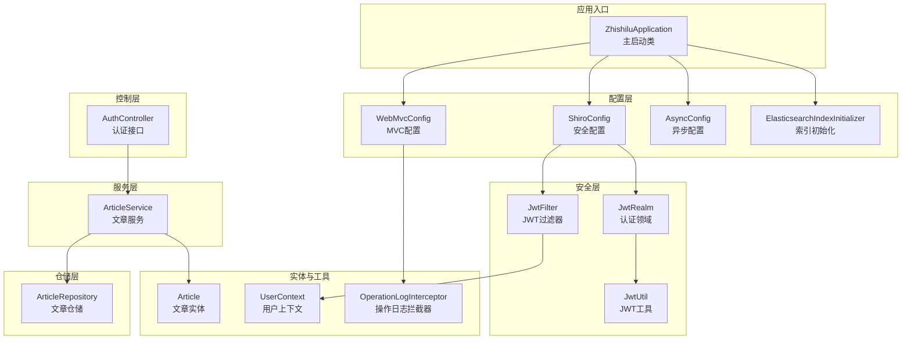
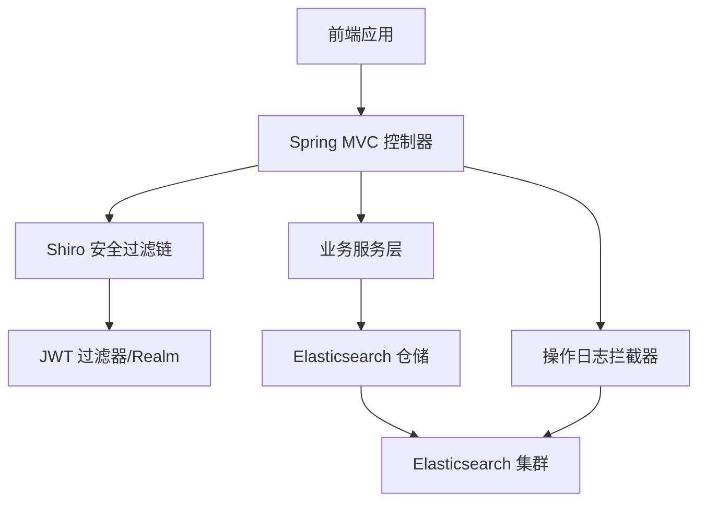
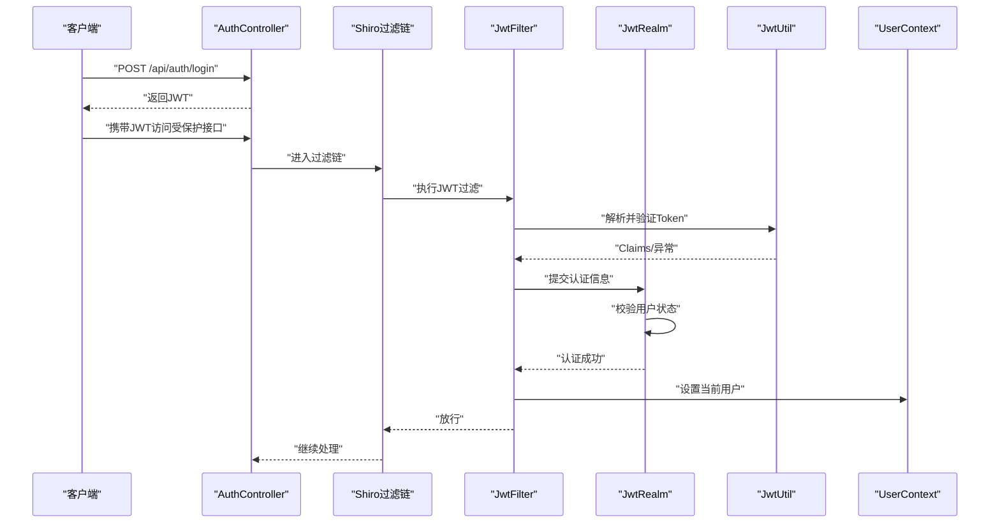
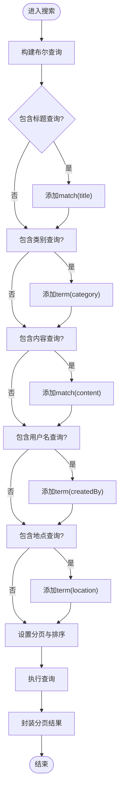
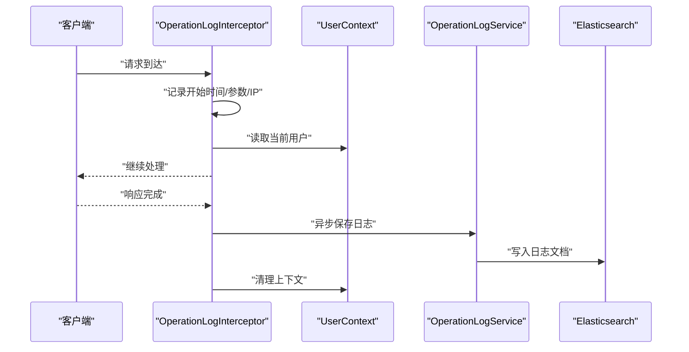
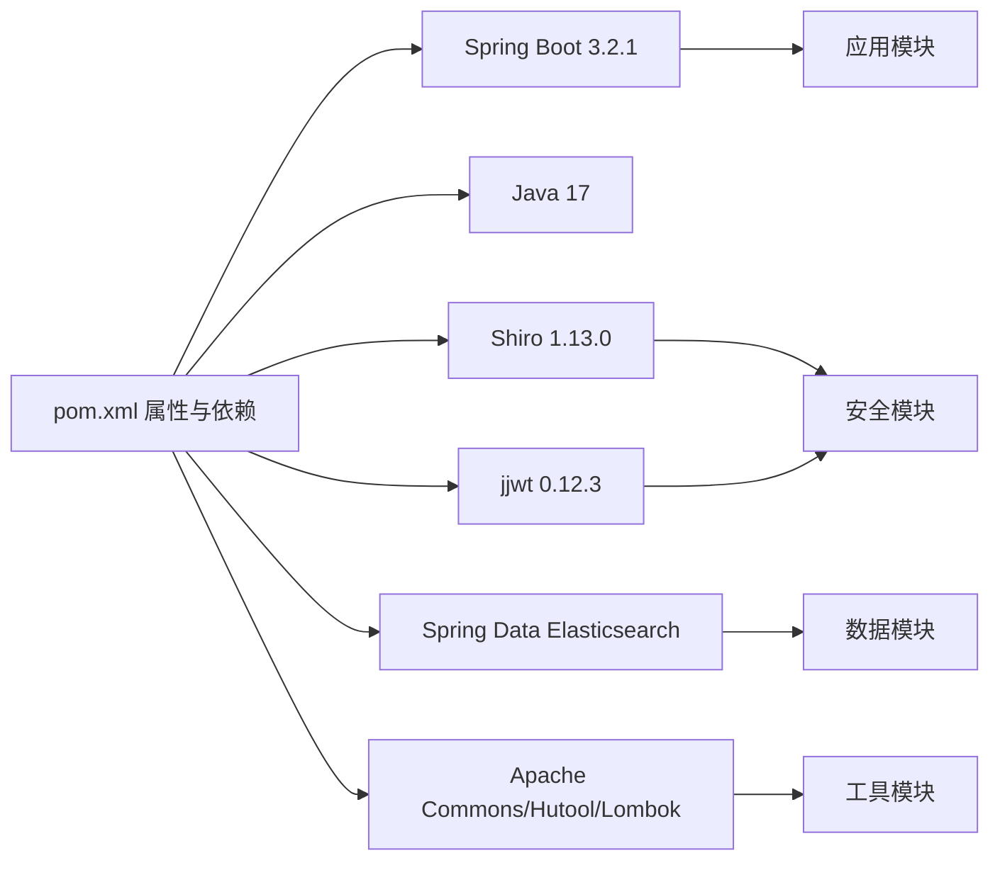

# 技术选型与依赖

<cite>
**本文引用的文件**
- [pom.xml](file://pom.xml)
- [application.yml](file://src/main/resources/application.yml)
- [README.md](file://README.md)
- [ZhishiluApplication.java](file://src/main/java/com/zhishilu/ZhishiluApplication.java)
- [ShiroConfig.java](file://src/main/java/com/zhishilu/config/ShiroConfig.java)
- [JwtFilter.java](file://src/main/java/com/zhishilu/shiro/JwtFilter.java)
- [JwtRealm.java](file://src/main/java/com/zhishilu/shiro/JwtRealm.java)
- [JwtUtil.java](file://src/main/java/com/zhishilu/util/JwtUtil.java)
- [WebMvcConfig.java](file://src/main/java/com/zhishilu/config/WebMvcConfig.java)
- [AsyncConfig.java](file://src/main/java/com/zhishilu/config/AsyncConfig.java)
- [ElasticsearchIndexInitializer.java](file://src/main/java/com/zhishilu/config/ElasticsearchIndexInitializer.java)
- [Article.java](file://src/main/java/com/zhishilu/entity/Article.java)
- [ArticleService.java](file://src/main/java/com/zhishilu/service/ArticleService.java)
- [ArticleRepository.java](file://src/main/java/com/zhishilu/repository/ArticleRepository.java)
- [AuthController.java](file://src/main/java/com/zhishilu/controller/AuthController.java)
- [OperationLogInterceptor.java](file://src/main/java/com/zhishilu/interceptor/OperationLogInterceptor.java)
- [UserContext.java](file://src/main/java/com/zhishilu/util/UserContext.java)
</cite>

## 目录
1. [简介](#简介)
2. [项目结构](#项目结构)
3. [核心组件](#核心组件)
4. [架构总览](#架构总览)
5. [详细组件分析](#详细组件分析)
6. [依赖关系分析](#依赖关系分析)
7. [性能考量](#性能考量)
8. [故障排查指南](#故障排查指南)
9. [结论](#结论)
10. [附录](#附录)

## 简介
本文件面向“知拾录”系统，系统目标是构建一个个人知识收藏与检索平台，围绕高并发、高效检索与安全认证展开。技术栈选择遵循以下原则：
- 使用 Spring Boot 3.2.1 提供企业级特性与现代化开发体验
- 使用 Java 17 以获得长期支持与性能提升
- 使用 Apache Shiro + JWT 构建无状态认证与统一鉴权
- 使用 Elasticsearch 8.x 提供全文检索与聚合分析能力
- 通过统一返回体、跨域与拦截器等基础设施保障可用性与可观测性

## 项目结构
项目采用按层次划分的结构，清晰分离配置、控制器、服务、仓储、实体与工具模块，并通过 Spring Boot 自动装配与 Starter 简化集成。

图表来源
- [ZhishiluApplication.java](file://src/main/java/com/zhishilu/ZhishiluApplication.java#L10-L15)
- [ShiroConfig.java](file://src/main/java/com/zhishilu/config/ShiroConfig.java#L20-L71)
- [JwtFilter.java](file://src/main/java/com/zhishilu/shiro/JwtFilter.java#L27-L108)
- [JwtRealm.java](file://src/main/java/com/zhishilu/shiro/JwtRealm.java#L18-L70)
- [JwtUtil.java](file://src/main/java/com/zhishilu/util/JwtUtil.java#L18-L98)
- [WebMvcConfig.java](file://src/main/java/com/zhishilu/config/WebMvcConfig.java#L14-L51)
- [AsyncConfig.java](file://src/main/java/com/zhishilu/config/AsyncConfig.java#L9-L12)
- [ElasticsearchIndexInitializer.java](file://src/main/java/com/zhishilu/config/ElasticsearchIndexInitializer.java#L16-L39)
- [AuthController.java](file://src/main/java/com/zhishilu/controller/AuthController.java#L17-L49)
- [ArticleService.java](file://src/main/java/com/zhishilu/service/ArticleService.java#L34-L198)
- [ArticleRepository.java](file://src/main/java/com/zhishilu/repository/ArticleRepository.java#L12-L29)
- [Article.java](file://src/main/java/com/zhishilu/entity/Article.java#L13-L80)
- [OperationLogInterceptor.java](file://src/main/java/com/zhishilu/interceptor/OperationLogInterceptor.java#L24-L127)
- [UserContext.java](file://src/main/java/com/zhishilu/util/UserContext.java#L8-L32)

章节来源
- [README.md](file://README.md#L9-L14)
- [pom.xml](file://pom.xml#L14-L25)

## 核心组件
- Spring Boot 3.2.1：提供自动配置、Starter、Actuator 等企业级能力，简化依赖与部署。
- Java 17：长期支持版本，具备更好的性能与安全性。
- Apache Shiro + JWT：基于 Shiro 的 Realm/Filter 体系实现无状态认证，JWT 负责令牌签发与解析。
- Elasticsearch 8.x：提供全文检索、聚合分析与高并发写入场景下的可扩展性。
- 统一返回体与拦截器：通过拦截器记录操作日志，结合异步配置提升吞吐。

章节来源
- [pom.xml](file://pom.xml#L14-L25)
- [application.yml](file://src/main/resources/application.yml#L1-L47)
- [README.md](file://README.md#L9-L14)

## 架构总览
系统采用前后端分离模式，后端通过 Spring MVC 暴露 REST 接口，使用 Shiro + JWT 实现无状态认证，Elasticsearch 存储与检索文章数据，日志通过拦截器异步落库。

图表来源
- [AuthController.java](file://src/main/java/com/zhishilu/controller/AuthController.java#L17-L49)
- [ShiroConfig.java](file://src/main/java/com/zhishilu/config/ShiroConfig.java#L44-L70)
- [JwtFilter.java](file://src/main/java/com/zhishilu/shiro/JwtFilter.java#L27-L108)
- [JwtRealm.java](file://src/main/java/com/zhishilu/shiro/JwtRealm.java#L18-L70)
- [ArticleService.java](file://src/main/java/com/zhishilu/service/ArticleService.java#L34-L198)
- [ElasticsearchIndexInitializer.java](file://src/main/java/com/zhishilu/config/ElasticsearchIndexInitializer.java#L16-L39)
- [OperationLogInterceptor.java](file://src/main/java/com/zhishilu/interceptor/OperationLogInterceptor.java#L24-L127)

## 详细组件分析

### 安全与认证：Shiro + JWT
- 安全管理器关闭 Shiro 自带 Session，配合 JWT 实现无状态会话。
- 过滤链对公开接口放行，其余接口强制 JWT 校验。
- JWT 过滤器负责从请求头或参数提取令牌，失败时返回统一错误格式。
- Realm 侧验证令牌有效性、查询用户并校验状态，成功后将用户信息写入上下文。

图表来源
- [ShiroConfig.java](file://src/main/java/com/zhishilu/config/ShiroConfig.java#L26-L70)
- [JwtFilter.java](file://src/main/java/com/zhishilu/shiro/JwtFilter.java#L39-L85)
- [JwtRealm.java](file://src/main/java/com/zhishilu/shiro/JwtRealm.java#L43-L69)
- [JwtUtil.java](file://src/main/java/com/zhishilu/util/JwtUtil.java#L47-L74)
- [UserContext.java](file://src/main/java/com/zhishilu/util/UserContext.java#L14-L24)

章节来源
- [ShiroConfig.java](file://src/main/java/com/zhishilu/config/ShiroConfig.java#L20-L71)
- [JwtFilter.java](file://src/main/java/com/zhishilu/shiro/JwtFilter.java#L27-L108)
- [JwtRealm.java](file://src/main/java/com/zhishilu/shiro/JwtRealm.java#L18-L70)
- [JwtUtil.java](file://src/main/java/com/zhishilu/util/JwtUtil.java#L18-L98)
- [UserContext.java](file://src/main/java/com/zhishilu/util/UserContext.java#L8-L32)

### 搜索与检索：Elasticsearch 8.x
- 文章实体映射到 ES 索引，使用 IK 分词器进行中文分词。
- 服务层通过布尔查询组合标题、类别、内容、用户名、地点等条件，支持分页与排序。
- 提供聚合查询，统计用户常用类别 Top N。
- 启动时自动创建索引与映射，确保首次运行可用。

图表来源
- [ArticleService.java](file://src/main/java/com/zhishilu/service/ArticleService.java#L116-L168)
- [Article.java](file://src/main/java/com/zhishilu/entity/Article.java#L14-L37)
- [ElasticsearchIndexInitializer.java](file://src/main/java/com/zhishilu/config/ElasticsearchIndexInitializer.java#L19-L38)

章节来源
- [ArticleService.java](file://src/main/java/com/zhishilu/service/ArticleService.java#L34-L198)
- [ArticleRepository.java](file://src/main/java/com/zhishilu/repository/ArticleRepository.java#L12-L29)
- [Article.java](file://src/main/java/com/zhishilu/entity/Article.java#L13-L80)
- [ElasticsearchIndexInitializer.java](file://src/main/java/com/zhishilu/config/ElasticsearchIndexInitializer.java#L16-L39)

### 日志与可观测性：拦截器与异步
- 拦截器在请求完成后收集路径、方法、参数、IP、状态码与耗时，并异步写入 ES。
- 通过线程上下文传递当前用户，避免跨线程丢失。
- Web 配置启用 CORS 与静态资源映射，便于前端联调与文件下载。

图表来源
- [OperationLogInterceptor.java](file://src/main/java/com/zhishilu/interceptor/OperationLogInterceptor.java#L32-L64)
- [UserContext.java](file://src/main/java/com/zhishilu/util/UserContext.java#L14-L31)
- [WebMvcConfig.java](file://src/main/java/com/zhishilu/config/WebMvcConfig.java#L23-L50)

章节来源
- [OperationLogInterceptor.java](file://src/main/java/com/zhishilu/interceptor/OperationLogInterceptor.java#L19-L127)
- [UserContext.java](file://src/main/java/com/zhishilu/util/UserContext.java#L8-L32)
- [WebMvcConfig.java](file://src/main/java/com/zhishilu/config/WebMvcConfig.java#L14-L51)

## 依赖关系分析
- Spring Boot 父工程统一版本与插件，保证依赖一致性。
- Shiro 与 JWT 版本由属性统一管理，便于升级与替换。
- Elasticsearch 使用 Spring Data Elasticsearch Starter，简化集成。
- 工具类与第三方库（Apache Commons、Hutool）提供便捷能力。

图表来源
- [pom.xml](file://pom.xml#L14-L102)
- [application.yml](file://src/main/resources/application.yml#L1-L47)

章节来源
- [pom.xml](file://pom.xml#L14-L102)
- [application.yml](file://src/main/resources/application.yml#L1-L47)

## 性能考量
- 并发与吞吐
  - 使用异步配置与拦截器异步写日志，降低请求路径延迟。
  - Shiro 关闭 Session，减少状态维护成本，适合水平扩展。
- 检索效率
  - 文章实体使用 IK 分词器，提升中文检索质量。
  - 查询采用布尔查询组合，结合分页与排序，避免全表扫描。
- 存储与索引
  - 启动时自动创建索引与映射，确保首次可用。
  - ES 连接超时与套接字超时配置，平衡稳定性与响应速度。

章节来源
- [AsyncConfig.java](file://src/main/java/com/zhishilu/config/AsyncConfig.java#L9-L12)
- [WebMvcConfig.java](file://src/main/java/com/zhishilu/config/WebMvcConfig.java#L23-L50)
- [Article.java](file://src/main/java/com/zhishilu/entity/Article.java#L24-L37)
- [ArticleService.java](file://src/main/java/com/zhishilu/service/ArticleService.java#L116-L168)
- [ElasticsearchIndexInitializer.java](file://src/main/java/com/zhishilu/config/ElasticsearchIndexInitializer.java#L19-L38)
- [application.yml](file://src/main/resources/application.yml#L13-L18)

## 故障排查指南
- 认证失败
  - 检查请求头是否包含正确的令牌前缀与头部名称。
  - 核对令牌签名密钥与过期时间配置，确认未过期。
- 搜索无结果
  - 确认 ES 索引已创建且映射正确。
  - 检查查询字段与分词器是否匹配。
- 日志未入库
  - 检查拦截器是否生效与异步任务是否执行。
  - 核对 ES 连接配置与网络连通性。
- 跨域问题
  - 确认 CORS 配置允许的来源、方法与头信息。

章节来源
- [JwtFilter.java](file://src/main/java/com/zhishilu/shiro/JwtFilter.java#L89-L97)
- [JwtUtil.java](file://src/main/java/com/zhishilu/util/JwtUtil.java#L47-L74)
- [ElasticsearchIndexInitializer.java](file://src/main/java/com/zhishilu/config/ElasticsearchIndexInitializer.java#L23-L38)
- [OperationLogInterceptor.java](file://src/main/java/com/zhishilu/interceptor/OperationLogInterceptor.java#L38-L64)
- [WebMvcConfig.java](file://src/main/java/com/zhishilu/config/WebMvcConfig.java#L23-L31)
- [application.yml](file://src/main/resources/application.yml#L13-L18)

## 结论
该技术栈组合满足“知拾录”的核心需求：
- Spring Boot 3.2.1 与 Java 17 提供稳定的企业级开发与运行环境；
- Shiro + JWT 实现无状态认证，易于扩展与分布式部署；
- Elasticsearch 8.x 提供高效的全文检索与聚合分析；
- 统一拦截器与异步配置提升可观测性与吞吐能力。

## 附录

### 依赖版本与兼容性
- Spring Boot 3.2.1：与 Java 17 完美兼容，提供 Actuator、Web、Validation、Elasticsearch Starter 等能力。
- Apache Shiro 1.13.0：与 Spring Boot Web 协同良好，提供丰富的 Realm 与过滤器生态。
- jjwt 0.12.3：提供完整的 JWT 签发与解析能力，与 Spring 集成顺畅。
- Elasticsearch 8.11.3：与 Spring Data Elasticsearch 适配良好，支持新版查询 DSL 与聚合。

章节来源
- [pom.xml](file://pom.xml#L14-L25)

### 社区支持与生态
- Spring 生态完善，文档与社区活跃，问题解决成本低。
- Shiro 社区成熟，示例丰富，适合快速落地认证与授权。
- Elasticsearch 社区庞大，中文生态与中文分词器（IK）完善。
- jjwt 社区活跃，版本迭代及时，安全更新频繁。

章节来源
- [README.md](file://README.md#L9-L14)
- [pom.xml](file://pom.xml#L23-L24)

### 升级策略与替代方案
- 升级策略
  - Spring Boot：建议按小版本逐步升级，关注破坏性变更与依赖冲突。
  - Java：优先升级至 LTS 版本，如 Java 21，评估编译与运行时差异。
  - Shiro：关注新版本对过滤器链与 Realm 的影响，必要时调整配置。
  - Elasticsearch：遵循向后兼容策略，先在测试环境验证再灰度上线。
- 替代方案
  - 认证：Spring Security + OAuth2/Spring Authorization Server 可替代 Shiro，适合更复杂的授权场景。
  - 检索：OpenSearch 或自建倒排索引方案可作为 ES 的替代，需评估迁移成本。
  - 日志：ELK/EFK 或云日志服务可替代本地 ES，需考虑网络与合规要求。

章节来源
- [pom.xml](file://pom.xml#L14-L25)
- [application.yml](file://src/main/resources/application.yml#L13-L18)