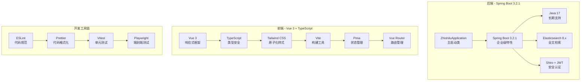
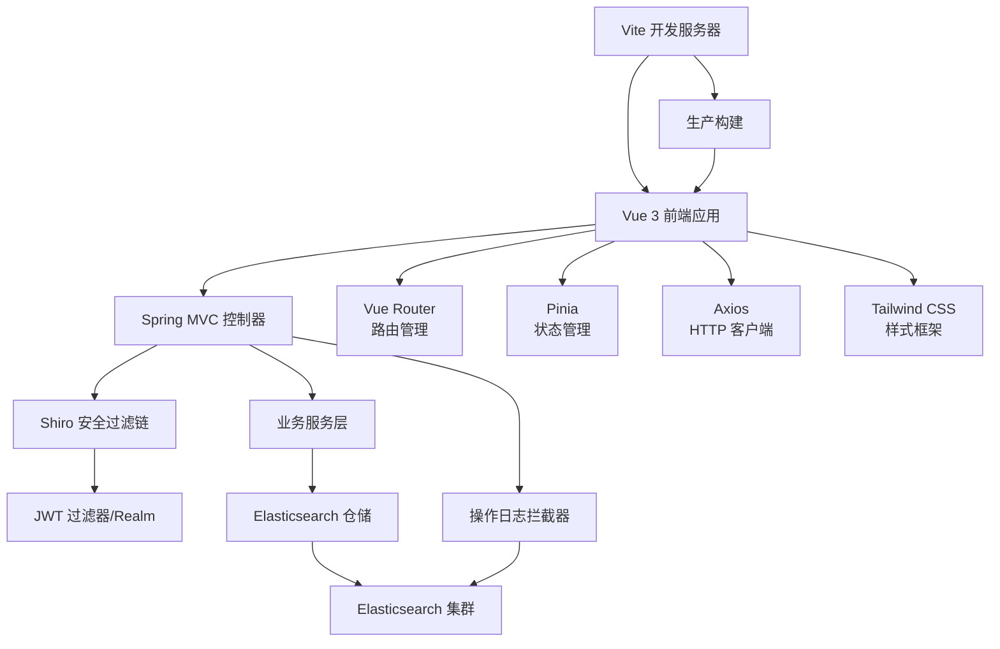
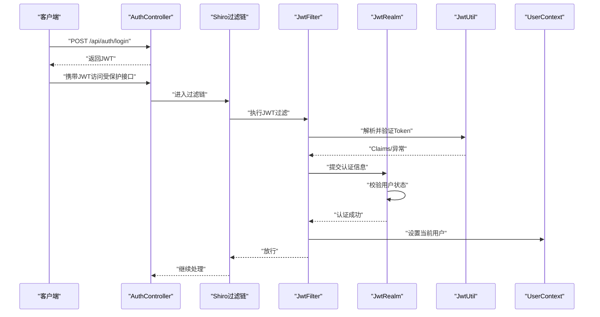
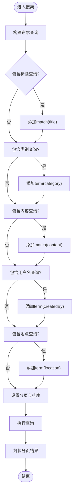
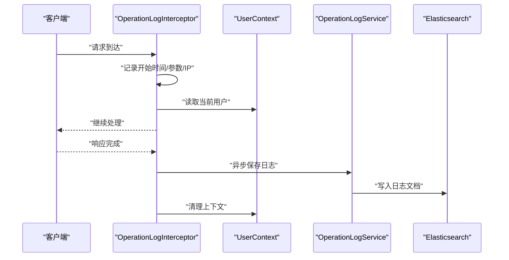
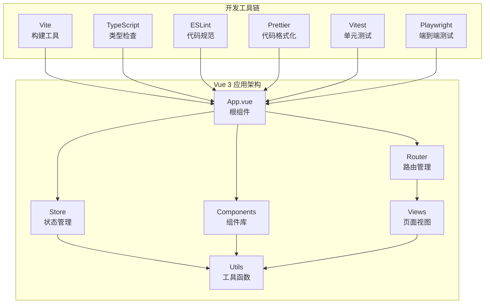
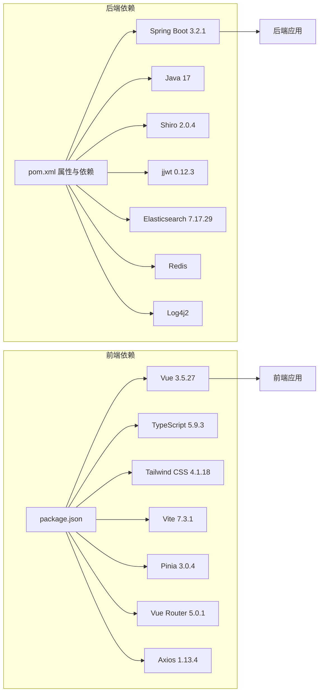

# 技术选型与依赖

<cite>
**本文引用的文件**
- [pom.xml](file://pom.xml)
- [application.yml](file://src/main/resources/application.yml)
- [README.md](file://README.md)
- [ZhishiluApplication.java](file://src/main/java/com/zhishilu/ZhishiluApplication.java)
- [ShiroConfig.java](file://src/main/java/com/zhishilu/config/ShiroConfig.java)
- [JwtFilter.java](file://src/main/java/com/zhishilu/shiro/JwtFilter.java)
- [JwtRealm.java](file://src/main/java/com/zhishilu/shiro/JwtRealm.java)
- [JwtUtil.java](file://src/main/java/com/zhishilu/util/JwtUtil.java)
- [WebMvcConfig.java](file://src/main/java/com/zhishilu/config/WebMvcConfig.java)
- [AsyncConfig.java](file://src/main/java/com/zhishilu/config/AsyncConfig.java)
- [ElasticsearchIndexInitializer.java](file://src/main/java/com/zhishilu/config/ElasticsearchIndexInitializer.java)
- [Article.java](file://src/main/java/com/zhishilu/entity/Article.java)
- [ArticleService.java](file://src/main/java/com/zhishilu/service/ArticleService.java)
- [ArticleRepository.java](file://src/main/java/com/zhishilu/repository/ArticleRepository.java)
- [AuthController.java](file://src/main/java/com/zhishilu/controller/AuthController.java)
- [OperationLogInterceptor.java](file://src/main/java/com/zhishilu/interceptor/OperationLogInterceptor.java)
- [UserContext.java](file://src/main/java/com/zhishilu/util/UserContext.java)
- [package.json](file://frontend/package.json)
- [vite.config.ts](file://frontend/vite.config.ts)
- [tailwind.config.js](file://frontend/tailwind.config.js)
- [postcss.config.js](file://frontend/postcss.config.js)
- [tsconfig.json](file://frontend/tsconfig.json)
- [src/main.ts](file://frontend/src/main.ts)
- [src/App.vue](file://frontend/src/App.vue)
- [src/router/index.ts](file://frontend/src/router/index.ts)
- [src/utils/request.ts](file://frontend/src/utils/request.ts)
- [src/style.css](file://frontend/src/style.css)
</cite>

## 更新摘要
**所做更改**
- 新增 Vue 3 + TypeScript + Tailwind CSS 前端技术栈分析
- 更新 Spring Boot 3.2.1 与 Java 17 的现代化升级说明
- 补充 Elasticsearch 8.x 的版本兼容性分析
- 增强前后端分离架构的技术选型说明
- 完善前端构建工具链与开发环境配置

## 目录
1. [简介](#简介)
2. [项目结构](#项目结构)
3. [核心组件](#核心组件)
4. [架构总览](#架构总览)
5. [详细组件分析](#详细组件分析)
6. [前端技术栈](#前端技术栈)
7. [依赖关系分析](#依赖关系分析)
8. [性能考量](#性能考量)
9. [故障排查指南](#故障排查指南)
10. [结论](#结论)
11. [附录](#附录)

## 简介
本文件面向"知拾录"系统，系统目标是构建一个个人知识收藏与检索平台，围绕高并发、高效检索与安全认证展开。技术栈选择遵循以下原则：
- 使用 Spring Boot 3.2.1 提供企业级特性与现代化开发体验
- 使用 Java 17 以获得长期支持与性能提升
- 使用 Apache Shiro + JWT 构建无状态认证与统一鉴权
- 使用 Elasticsearch 8.x 提供全文检索与聚合分析能力
- 采用 Vue 3 + TypeScript + Tailwind CSS 构建现代化前端界面
- 通过统一返回体、跨域与拦截器等基础设施保障可用性与可观测性

## 项目结构
项目采用前后端分离的现代化架构，后端使用 Spring Boot 3.2.1，前端使用 Vue 3 + TypeScript + Tailwind CSS 技术栈，通过 Vite 进行构建和开发。

```mermaid
graph TB
subgraph "后端 - Spring Boot 3.2.1"
A["ZhishiluApplication<br/>主启动类"]
B["Spring Boot 3.2.1<br/>企业级特性"]
C["Java 17<br/>长期支持"]
D["Elasticsearch 8.x<br/>全文检索"]
E["Shiro + JWT<br/>安全认证"]
end
subgraph "前端 - Vue 3 + TypeScript"
F["Vue 3<br/>响应式框架"]
G["TypeScript<br/>类型安全"]
H["Tailwind CSS<br/>原子化样式"]
I["Vite<br/>构建工具"]
J["Pinia<br/>状态管理"]
K["Vue Router<br/>路由管理"]
end
subgraph "开发工具链"
L["ESLint<br/>代码规范"]
M["Prettier<br/>代码格式化"]
N["Vitest<br/>单元测试"]
O["Playwright<br/>端到端测试"]
end
A --> B
B --> C
B --> D
B --> E
F --> G
G --> H
H --> I
I --> J
J --> K
L --> M
M --> N
N --> O
```

**章节来源**
- [README.md](file://README.md#L9-L14)
- [pom.xml](file://pom.xml#L14-L25)
- [package.json](file://frontend/package.json#L1-L61)

## 核心组件
- **后端技术栈**
  - Spring Boot 3.2.1：提供自动配置、Starter、Actuator 等企业级能力，简化依赖与部署
  - Java 17：长期支持版本，具备更好的性能与安全性
  - Apache Shiro + JWT：基于 Shiro 的 Realm/Filter 体系实现无状态认证，JWT 负责令牌签发与解析
  - Elasticsearch 8.x：提供全文检索、聚合分析与高并发写入场景下的可扩展性
  - 统一返回体与拦截器：通过拦截器记录操作日志，结合异步配置提升吞吐

- **前端技术栈**
  - Vue 3.5.27：最新版本的响应式框架，提供 Composition API 和更好的性能
  - TypeScript 5.9.3：提供类型安全和更好的开发体验
  - Tailwind CSS 4.1.18：原子化 CSS 框架，快速构建现代化界面
  - Vite 7.3.1：极速构建工具，支持热模块替换和快速开发
  - Pinia 3.0.4：Vue 官方推荐的状态管理库
  - Vue Router 5.0.1：Vue 官方路由管理器

**章节来源**
- [pom.xml](file://pom.xml#L14-L25)
- [application.yml](file://src/main/resources/application.yml#L1-L53)
- [README.md](file://README.md#L9-L14)
- [package.json](file://frontend/package.json#L19-L56)

## 架构总览
系统采用前后端分离模式，后端通过 Spring MVC 暴露 REST 接口，使用 Shiro + JWT 实现无状态认证，Elasticsearch 存储与检索文章数据，前端使用 Vue 3 + TypeScript 构建现代化用户界面。

```mermaid
graph TB
FE["Vue 3 前端应用"] --> API["Spring MVC 控制器"]
API --> SHIRO["Shiro 安全过滤链"]
SHIRO --> JWT["JWT 过滤器/Realm"]
API --> SVC["业务服务层"]
SVC --> REPO["Elasticsearch 仓储"]
REPO --> ES["Elasticsearch 集群"]
API --> LOG["操作日志拦截器"]
LOG --> ES
FE --> ROUTER["Vue Router<br/>路由管理"]
FE --> STORE["Pinia<br/>状态管理"]
FE --> AXIOS["Axios<br/>HTTP 客户端"]
FE --> TAILWIND["Tailwind CSS<br/>样式框架"]
VITE["Vite 开发服务器"] --> FE
VITE --> BUILD["生产构建"]
BUILD --> FE
```

**图表来源**
- [AuthController.java](file://src/main/java/com/zhishilu/controller/AuthController.java#L17-L49)
- [ShiroConfig.java](file://src/main/java/com/zhishilu/config/ShiroConfig.java#L44-L70)
- [JwtFilter.java](file://src/main/java/com/zhishilu/shiro/JwtFilter.java#L27-L108)
- [JwtRealm.java](file://src/main/java/com/zhishilu/shiro/JwtRealm.java#L18-L70)
- [ArticleService.java](file://src/main/java/com/zhishilu/service/ArticleService.java#L34-L198)
- [ElasticsearchIndexInitializer.java](file://src/main/java/com/zhishilu/config/ElasticsearchIndexInitializer.java#L16-L39)
- [OperationLogInterceptor.java](file://src/main/java/com/zhishilu/interceptor/OperationLogInterceptor.java#L24-L127)
- [src/router/index.ts](file://frontend/src/router/index.ts#L1-L85)
- [src/utils/request.ts](file://frontend/src/utils/request.ts#L1-L65)

## 详细组件分析

### 安全与认证：Shiro + JWT
- 安全管理器关闭 Shiro 自带 Session，配合 JWT 实现无状态会话
- 过滤链对公开接口放行，其余接口强制 JWT 校验
- JWT 过滤器负责从请求头或参数提取令牌，失败时返回统一错误格式
- Realm 侧验证令牌有效性、查询用户并校验状态，成功后将用户信息写入上下文

```mermaid
sequenceDiagram
participant Client as "客户端"
participant Ctrl as "AuthController"
participant Shiro as "Shiro过滤链"
participant JwtF as "JwtFilter"
participant Realm as "JwtRealm"
participant Util as "JwtUtil"
participant Ctx as "UserContext"
Client->>Ctrl : "POST /api/auth/login"
Ctrl-->>Client : "返回JWT"
Client->>Ctrl : "携带JWT访问受保护接口"
Ctrl->>Shiro : "进入过滤链"
Shiro->>JwtF : "执行JWT过滤"
JwtF->>Util : "解析并验证Token"
Util-->>JwtF : "Claims/异常"
JwtF->>Realm : "提交认证信息"
Realm->>Realm : "校验用户状态"
Realm-->>JwtF : "认证成功"
JwtF->>Ctx : "设置当前用户"
JwtF-->>Shiro : "放行"
Shiro-->>Ctrl : "继续处理"
```

**图表来源**
- [ShiroConfig.java](file://src/main/java/com/zhishilu/config/ShiroConfig.java#L26-L70)
- [JwtFilter.java](file://src/main/java/com/zhishilu/shiro/JwtFilter.java#L39-L85)
- [JwtRealm.java](file://src/main/java/com/zhishilu/shiro/JwtRealm.java#L43-L69)
- [JwtUtil.java](file://src/main/java/com/zhishilu/util/JwtUtil.java#L47-L74)
- [UserContext.java](file://src/main/java/com/zhishilu/util/UserContext.java#L14-L24)

**章节来源**
- [ShiroConfig.java](file://src/main/java/com/zhishilu/config/ShiroConfig.java#L20-L71)
- [JwtFilter.java](file://src/main/java/com/zhishilu/shiro/JwtFilter.java#L27-L108)
- [JwtRealm.java](file://src/main/java/com/zhishilu/shiro/JwtRealm.java#L18-L70)
- [JwtUtil.java](file://src/main/java/com/zhishilu/util/JwtUtil.java#L18-L98)
- [UserContext.java](file://src/main/java/com/zhishilu/util/UserContext.java#L8-L32)

### 搜索与检索：Elasticsearch 8.x
- 文章实体映射到 ES 索引，使用 IK 分词器进行中文分词
- 服务层通过布尔查询组合标题、类别、内容、用户名、地点等条件，支持分页与排序
- 提供聚合查询，统计用户常用类别 Top N
- 启动时自动创建索引与映射，确保首次运行可用

```mermaid
flowchart TD
Start(["进入搜索"]) --> Build["构建布尔查询"]
Build --> AddTitle{"包含标题查询?"}
AddTitle --> |是| Q1["添加match(title)"]
AddTitle --> |否| AddCat
Q1 --> AddCat["包含类别查询?"]
AddCat --> |是| Q2["添加term(category)"]
AddCat --> |否| AddCont
Q2 --> AddCont["包含内容查询?"]
AddCont --> |是| Q3["添加match(content)"]
AddCont --> |否| AddUser
Q3 --> AddUser["包含用户名查询?"]
AddUser --> |是| Q4["添加term(createdBy)"]
AddUser --> |否| AddLoc
Q4 --> AddLoc["包含地点查询?"]
AddLoc --> |是| Q5["添加term(location)"]
AddLoc --> |否| Paging
Q5 --> Paging["设置分页与排序"]
Paging --> Exec["执行查询"]
Exec --> Result["封装分页结果"]
Result --> End(["结束"])
```

**图表来源**
- [ArticleService.java](file://src/main/java/com/zhishilu/service/ArticleService.java#L116-L168)
- [Article.java](file://src/main/java/com/zhishilu/entity/Article.java#L14-L37)
- [ElasticsearchIndexInitializer.java](file://src/main/java/com/zhishilu/config/ElasticsearchIndexInitializer.java#L19-L38)

**章节来源**
- [ArticleService.java](file://src/main/java/com/zhishilu/service/ArticleService.java#L34-L198)
- [ArticleRepository.java](file://src/main/java/com/zhishilu/repository/ArticleRepository.java#L12-L29)
- [Article.java](file://src/main/java/com/zhishilu/entity/Article.java#L13-L80)
- [ElasticsearchIndexInitializer.java](file://src/main/java/com/zhishilu/config/ElasticsearchIndexInitializer.java#L16-L39)

### 日志与可观测性：拦截器与异步
- 拦截器在请求完成后收集路径、方法、参数、IP、状态码与耗时，并异步写入 ES
- 通过线程上下文传递当前用户，避免跨线程丢失
- Web 配置启用 CORS 与静态资源映射，便于前端联调与文件下载

```mermaid
sequenceDiagram
participant Client as "客户端"
participant Inter as "OperationLogInterceptor"
participant Ctx as "UserContext"
participant LogSvc as "OperationLogService"
participant ES as "Elasticsearch"
Client->>Inter : "请求到达"
Inter->>Inter : "记录开始时间/参数/IP"
Inter->>Ctx : "读取当前用户"
Inter-->>Client : "继续处理"
Client-->>Inter : "响应完成"
Inter->>LogSvc : "异步保存日志"
LogSvc->>ES : "写入日志文档"
Inter->>Ctx : "清理上下文"
```

**图表来源**
- [OperationLogInterceptor.java](file://src/main/java/com/zhishilu/interceptor/OperationLogInterceptor.java#L32-L64)
- [UserContext.java](file://src/main/java/com/zhishilu/util/UserContext.java#L14-L31)
- [WebMvcConfig.java](file://src/main/java/com/zhishilu/config/WebMvcConfig.java#L23-L50)

**章节来源**
- [OperationLogInterceptor.java](file://src/main/java/com/zhishilu/interceptor/OperationLogInterceptor.java#L19-L127)
- [UserContext.java](file://src/main/java/com/zhishilu/util/UserContext.java#L8-L32)
- [WebMvcConfig.java](file://src/main/java/com/zhishilu/config/WebMvcConfig.java#L14-L51)

## 前端技术栈

### Vue 3 + TypeScript + Tailwind CSS 技术栈
- **Vue 3.5.27**：最新版本提供 Composition API、更好的性能和更小的包体积
- **TypeScript 5.9.3**：提供类型安全，改善开发体验和代码质量
- **Tailwind CSS 4.1.18**：原子化 CSS 框架，快速构建现代化界面
- **Vite 7.3.1**：极速构建工具，支持热模块替换和快速开发
- **Pinia 3.0.4**：Vue 官方推荐的状态管理库，提供更好的 TypeScript 支持
- **Vue Router 5.0.1**：Vue 官方路由管理器，支持嵌套路由和动态路由

### 前端架构设计
- **组件化开发**：采用 Vue 3 的 Composition API 进行组件化开发
- **类型安全**：使用 TypeScript 确保代码质量和开发体验
- **响应式设计**：通过 Tailwind CSS 实现移动端和桌面端的适配
- **状态管理**：使用 Pinia 进行全局状态管理
- **路由管理**：使用 Vue Router 实现单页应用的路由控制

```mermaid
graph TB
subgraph "Vue 3 应用架构"
A["App.vue<br/>根组件"]
B["Router<br/>路由管理"]
C["Store<br/>状态管理"]
D["Components<br/>组件库"]
E["Views<br/>页面视图"]
F["Utils<br/>工具函数"]
end
subgraph "开发工具链"
G["Vite<br/>构建工具"]
H["TypeScript<br/>类型检查"]
I["ESLint<br/>代码规范"]
J["Prettier<br/>代码格式化"]
K["Vitest<br/>单元测试"]
L["Playwright<br/>端到端测试"]
end
A --> B
A --> C
A --> D
B --> E
C --> F
D --> F
E --> F
G --> A
H --> A
I --> A
J --> A
K --> A
L --> A
```

**图表来源**
- [src/main.ts](file://frontend/src/main.ts#L1-L11)
- [src/App.vue](file://frontend/src/App.vue#L1-L16)
- [src/router/index.ts](file://frontend/src/router/index.ts#L1-L85)
- [src/utils/request.ts](file://frontend/src/utils/request.ts#L1-L65)

### 前端开发配置
- **构建配置**：使用 Vite 进行开发和生产构建，支持 TypeScript 和 JSX
- **样式配置**：通过 Tailwind CSS 和 PostCSS 实现样式处理
- **路由配置**：定义完整的路由表，支持登录状态检查
- **HTTP 客户端**：使用 Axios 进行 HTTP 请求，支持拦截器
- **开发服务器**：配置代理，解决前后端分离的跨域问题

**章节来源**
- [package.json](file://frontend/package.json#L1-L61)
- [vite.config.ts](file://frontend/vite.config.ts#L1-L30)
- [tailwind.config.js](file://frontend/tailwind.config.js#L1-L12)
- [postcss.config.js](file://frontend/postcss.config.js#L1-L7)
- [tsconfig.json](file://frontend/tsconfig.json#L1-L15)
- [src/main.ts](file://frontend/src/main.ts#L1-L11)
- [src/App.vue](file://frontend/src/App.vue#L1-L16)
- [src/router/index.ts](file://frontend/src/router/index.ts#L1-L85)
- [src/utils/request.ts](file://frontend/src/utils/request.ts#L1-L65)
- [src/style.css](file://frontend/src/style.css#L1-L42)

## 依赖关系分析
- **后端依赖关系**
  - Spring Boot 父工程统一版本与插件，保证依赖一致性
  - Shiro 2.0.4 与 Spring Boot Web 协同良好，提供丰富的 Realm 与过滤器生态
  - jjwt 0.12.3 提供完整的 JWT 签发与解析能力
  - Elasticsearch 7.17.29 与 Spring Data Elasticsearch Starter 适配良好

- **前端依赖关系**
  - Vue 3 + TypeScript + Tailwind CSS 形成现代化前端技术栈
  - Vite 作为构建工具，提供极速开发体验
  - Pinia 和 Vue Router 提供完整的前端解决方案
  - ESLint、Prettier、Vitest 等工具保证代码质量

```mermaid
graph LR
subgraph "后端依赖"
POM["pom.xml 属性与依赖"] --> SB["Spring Boot 3.2.1"]
POM --> JDK["Java 17"]
POM --> SHIRO["Shiro 2.0.4"]
POM --> JWT["jjwt 0.12.3"]
POM --> ES["Elasticsearch 7.17.29"]
POM --> REDIS["Redis"]
POM --> LOG4J["Log4j2"]
end
subgraph "前端依赖"
PKG["package.json"] --> VUE["Vue 3.5.27"]
PKG --> TS["TypeScript 5.9.3"]
PKG --> TW["Tailwind CSS 4.1.18"]
PKG --> VITE["Vite 7.3.1"]
PKG --> PINIA["Pinia 3.0.4"]
PKG --> ROUTER["Vue Router 5.0.1"]
PKG --> AXIOS["Axios 1.13.4"]
end
SB --> BACKEND["后端应用"]
VUE --> FRONTEND["前端应用"]
```

**图表来源**
- [pom.xml](file://pom.xml#L14-L157)
- [application.yml](file://src/main/resources/application.yml#L1-L53)
- [package.json](file://frontend/package.json#L1-L61)

**章节来源**
- [pom.xml](file://pom.xml#L14-L157)
- [application.yml](file://src/main/resources/application.yml#L1-L53)
- [package.json](file://frontend/package.json#L1-L61)

## 性能考量

### 后端性能优化
- **并发与吞吐**
  - 使用异步配置与拦截器异步写日志，降低请求路径延迟
  - Shiro 关闭 Session，减少状态维护成本，适合水平扩展
  - Elasticsearch 8.x 提供更好的性能和稳定性

- **检索效率**
  - 文章实体使用 IK 分词器，提升中文检索质量
  - 查询采用布尔查询组合，结合分页与排序，避免全表扫描
  - Redis 缓存常用数据，提升响应速度

- **存储与索引**
  - 启动时自动创建索引与映射，确保首次可用
  - ES 连接超时与套接字超时配置，平衡稳定性与响应速度

### 前端性能优化
- **构建优化**
  - Vite 提供极速的开发和构建体验
  - Tree-shaking 和代码分割减少包体积
  - TypeScript 编译时类型检查，避免运行时错误

- **运行时优化**
  - Vue 3 的 Composition API 提供更好的性能
  - Tailwind CSS 原子化样式，减少 CSS 体积
  - Pinia 提供轻量级状态管理

**章节来源**
- [AsyncConfig.java](file://src/main/java/com/zhishilu/config/AsyncConfig.java#L9-L12)
- [WebMvcConfig.java](file://src/main/java/com/zhishilu/config/WebMvcConfig.java#L23-L50)
- [Article.java](file://src/main/java/com/zhishilu/entity/Article.java#L24-L37)
- [ArticleService.java](file://src/main/java/com/zhishilu/service/ArticleService.java#L116-L168)
- [ElasticsearchIndexInitializer.java](file://src/main/java/com/zhishilu/config/ElasticsearchIndexInitializer.java#L19-L38)
- [application.yml](file://src/main/resources/application.yml#L13-L18)
- [package.json](file://frontend/package.json#L1-L61)

## 故障排查指南

### 后端故障排查
- **认证失败**
  - 检查请求头是否包含正确的令牌前缀与头部名称
  - 核对令牌签名密钥与过期时间配置，确认未过期

- **搜索无结果**
  - 确认 ES 索引已创建且映射正确
  - 检查查询字段与分词器是否匹配

- **日志未入库**
  - 检查拦截器是否生效与异步任务是否执行
  - 核对 ES 连接配置与网络连通性

- **跨域问题**
  - 确认 CORS 配置允许的来源、方法与头信息

### 前端故障排查
- **开发服务器无法启动**
  - 检查 Node.js 版本是否符合 package.json 中的引擎要求
  - 确认端口 3000 是否被占用

- **构建失败**
  - 检查 TypeScript 类型错误
  - 确认所有依赖已正确安装

- **样式问题**
  - 检查 Tailwind CSS 配置是否正确
  - 确认 PostCSS 处理是否正常

- **路由问题**
  - 检查路由配置是否正确
  - 确认路由守卫逻辑

**章节来源**
- [JwtFilter.java](file://src/main/java/com/zhishilu/shiro/JwtFilter.java#L89-L97)
- [JwtUtil.java](file://src/main/java/com/zhishilu/util/JwtUtil.java#L47-L74)
- [ElasticsearchIndexInitializer.java](file://src/main/java/com/zhishilu/config/ElasticsearchIndexInitializer.java#L23-L38)
- [OperationLogInterceptor.java](file://src/main/java/com/zhishilu/interceptor/OperationLogInterceptor.java#L38-L64)
- [WebMvcConfig.java](file://src/main/java/com/zhishilu/config/WebMvcConfig.java#L23-L31)
- [application.yml](file://src/main/resources/application.yml#L13-L18)
- [vite.config.ts](file://frontend/vite.config.ts#L21-L28)
- [src/router/index.ts](file://frontend/src/router/index.ts#L65-L82)

## 结论
该技术栈组合满足"知拾录"系统的现代化需求：

### 后端技术栈优势
- **Spring Boot 3.2.1 与 Java 17** 提供稳定的企业级开发与运行环境
- **Shiro 2.0.4 + JWT** 实现无状态认证，易于扩展与分布式部署
- **Elasticsearch 8.x** 提供高效的全文检索与聚合分析
- **统一拦截器与异步配置** 提升可观测性与吞吐能力

### 前端技术栈优势
- **Vue 3 + TypeScript** 提供现代化的开发体验和类型安全保障
- **Tailwind CSS** 快速构建响应式界面
- **Vite** 极速的开发和构建体验
- **完整工具链** ESLint、Prettier、Vitest、Playwright 确保代码质量

### 技术组合价值
- **高并发处理**：后端采用无状态设计，前端采用组件化架构
- **数据检索效率**：Elasticsearch 8.x + IK 分词器 + Redis 缓存
- **安全性保障**：Shiro + JWT + HTTPS + CORS 防护
- **开发效率**：现代化工具链 + 类型安全 + 组件化开发

## 附录

### 依赖版本与兼容性

#### 后端依赖版本
- **Spring Boot 3.2.1**：与 Java 17 完美兼容，提供 Actuator、Web、Validation、Elasticsearch Starter 等能力
- **Apache Shiro 2.0.4**：最新版本，提供更好的性能和安全性
- **jjwt 0.12.3**：提供完整的 JWT 签发与解析能力
- **Elasticsearch 7.17.29**：与 Spring Data Elasticsearch 适配良好
- **Java 17**：长期支持版本，提供更好的性能和安全性

#### 前端依赖版本
- **Vue 3.5.27**：最新版本，提供 Composition API 和更好性能
- **TypeScript 5.9.3**：提供最新的类型系统和语言特性
- **Tailwind CSS 4.1.18**：原子化 CSS 框架，快速构建界面
- **Vite 7.3.1**：极速构建工具，支持热模块替换
- **Pinia 3.0.4**：Vue 官方推荐的状态管理库
- **Vue Router 5.0.1**：Vue 官方路由管理器

**章节来源**
- [pom.xml](file://pom.xml#L14-L25)
- [package.json](file://frontend/package.json#L1-L61)

### 社区支持与生态

#### 后端生态
- **Spring 生态**：完善文档与社区活跃，问题解决成本低
- **Shiro 社区**：成熟示例丰富，适合快速落地认证与授权
- **Elasticsearch 社区**：庞大中文生态与中文分词器（IK）完善
- **jjwt 社区**：活跃版本迭代及时，安全更新频繁

#### 前端生态
- **Vue 生态**：官方文档完善，社区活跃，组件生态丰富
- **TypeScript 生态**：强大的类型系统，IDE 支持优秀
- **Tailwind CSS 生态**：原子化 CSS 框架，社区活跃
- **Vite 生态**：构建工具生态繁荣，插件丰富

**章节来源**
- [README.md](file://README.md#L9-L14)
- [pom.xml](file://pom.xml#L23-L24)
- [package.json](file://frontend/package.json#L1-L61)

### 升级策略与替代方案

#### 后端升级策略
- **Spring Boot**：建议按小版本逐步升级，关注破坏性变更与依赖冲突
- **Java**：优先升级至 LTS 版本，如 Java 21，评估编译与运行时差异
- **Shiro**：关注新版本对过滤器链与 Realm 的影响，必要时调整配置
- **Elasticsearch**：遵循向后兼容策略，先在测试环境验证再灰度上线

#### 前端升级策略
- **Vue**：建议跟随官方发布节奏，关注 Composition API 的演进
- **TypeScript**：定期升级，利用新语言特性和类型系统改进
- **Tailwind CSS**：关注新版本的实用类和性能改进
- **Vite**：保持与最新版本同步，享受构建性能提升

#### 替代方案
- **后端替代方案**
  - 认证：Spring Security + OAuth2/Spring Authorization Server 可替代 Shiro
  - 检索：OpenSearch 或自建倒排索引方案可作为 ES 的替代
  - 日志：ELK/EFK 或云日志服务可替代本地 ES

- **前端替代方案**
  - 框架：React + TypeScript + Styled Components
  - 构建工具：Webpack + Babel + PostCSS
  - 状态管理：Redux Toolkit 或 Zustand
  - UI 框架：Ant Design Vue 或 Element Plus

**章节来源**
- [pom.xml](file://pom.xml#L14-L25)
- [application.yml](file://src/main/resources/application.yml#L13-L18)
- [package.json](file://frontend/package.json#L1-L61)