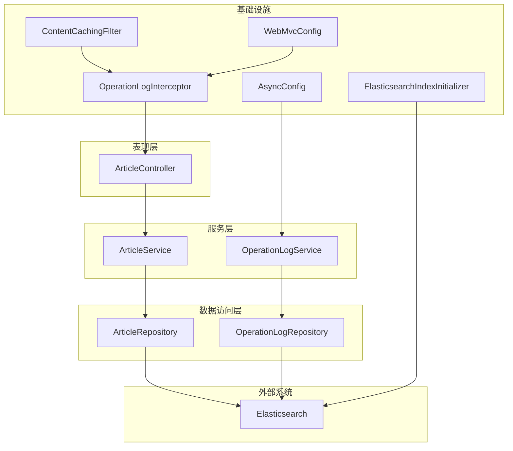
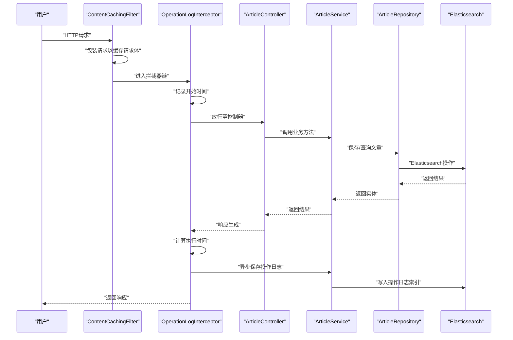
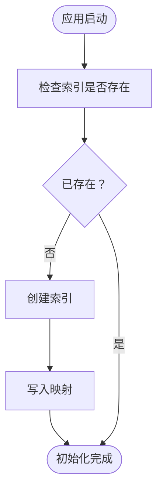
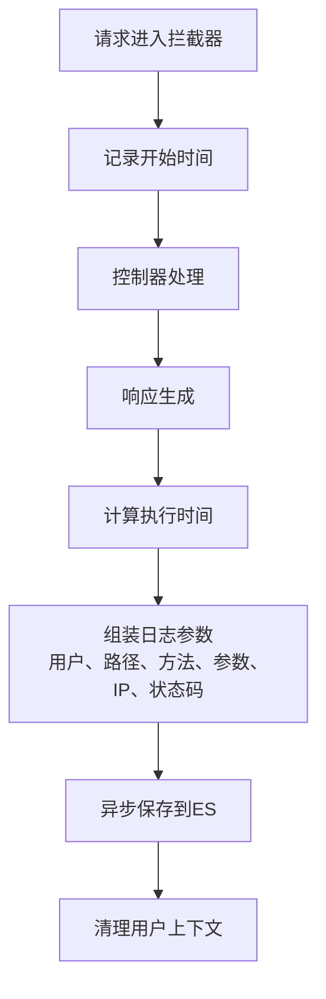
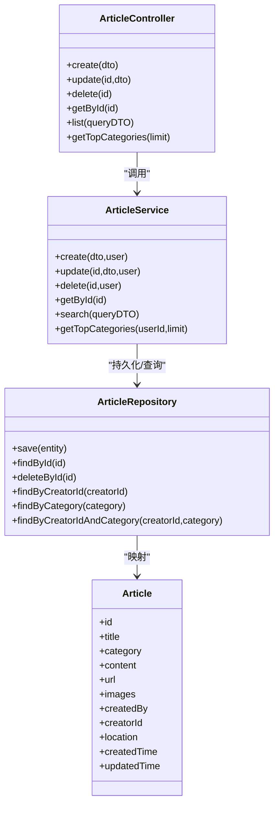
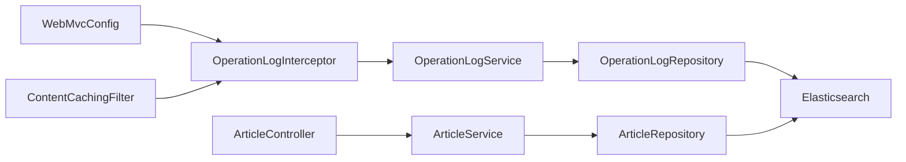

# 数据流与处理机制

<cite>
**本文引用的文件**
- [主应用启动类](file://src/main/java/com/zhishilu/ZhishiluApplication.java)
- [Elasticsearch索引初始化器](file://src/main/java/com/zhishilu/config/ElasticsearchIndexInitializer.java)
- [异步配置](file://src/main/java/com/zhishilu/config/AsyncConfig.java)
- [Web MVC配置](file://src/main/java/com/zhishilu/config/WebMvcConfig.java)
- [内容缓存过滤器](file://src/main/java/com/zhishilu/filter/ContentCachingFilter.java)
- [操作日志拦截器](file://src/main/java/com/zhishilu/interceptor/OperationLogInterceptor.java)
- [操作日志服务](file://src/main/java/com/zhishilu/service/OperationLogService.java)
- [操作日志仓储](file://src/main/java/com/zhishilu/repository/OperationLogRepository.java)
- [操作日志实体](file://src/main/java/com/zhishilu/entity/OperationLog.java)
- [文章控制器](file://src/main/java/com/zhishilu/controller/ArticleController.java)
- [文章服务](file://src/main/java/com/zhishilu/service/ArticleService.java)
- [文章仓储](file://src/main/java/com/zhishilu/repository/ArticleRepository.java)
- [文章实体](file://src/main/java/com/zhishilu/entity/Article.java)
- [应用配置](file://src/main/resources/application.yml)
- [项目说明文档](file://README.md)
</cite>

## 目录
1. [引言](#引言)
2. [项目结构](#项目结构)
3. [核心组件](#核心组件)
4. [架构总览](#架构总览)
5. [详细组件分析](#详细组件分析)
6. [依赖关系分析](#依赖关系分析)
7. [性能考量](#性能考量)
8. [故障排查指南](#故障排查指南)
9. [结论](#结论)
10. [附录](#附录)

## 引言
本文件聚焦“知拾录”系统的数据流与处理机制，覆盖从用户请求到数据库存储的完整路径；阐述Elasticsearch索引初始化与数据同步策略；解析操作日志拦截器的数据采集流程；说明内容缓存过滤器的性能优化手段；并给出异步处理、批处理与一致性保障的建议，以及性能监控指标与故障排查方法。

## 项目结构
系统采用分层架构：控制器层负责接收请求并返回统一响应；服务层封装业务逻辑；仓储层基于Spring Data Elasticsearch访问索引；配置层提供Web、Shiro、异步等基础设施；过滤器与拦截器在请求链路中注入缓存与日志能力；实体类映射Elasticsearch索引字段。

**图表来源**
- [文章控制器](file://src/main/java/com/zhishilu/controller/ArticleController.java#L22-L88)
- [文章服务](file://src/main/java/com/zhishilu/service/ArticleService.java#L34-L200)
- [操作日志服务](file://src/main/java/com/zhishilu/service/OperationLogService.java#L16-L49)
- [内容缓存过滤器](file://src/main/java/com/zhishilu/filter/ContentCachingFilter.java#L16-L34)
- [操作日志拦截器](file://src/main/java/com/zhishilu/interceptor/OperationLogInterceptor.java#L22-L128)
- [Web MVC配置](file://src/main/java/com/zhishilu/config/WebMvcConfig.java#L14-L52)
- [异步配置](file://src/main/java/com/zhishilu/config/AsyncConfig.java#L9-L13)
- [Elasticsearch索引初始化器](file://src/main/java/com/zhishilu/config/ElasticsearchIndexInitializer.java#L16-L40)

**章节来源**
- [主应用启动类](file://src/main/java/com/zhishilu/ZhishiluApplication.java#L10-L15)
- [应用配置](file://src/main/resources/application.yml#L1-L47)
- [项目说明文档](file://README.md#L1-L133)

## 核心组件
- Elasticsearch索引初始化器：启动时为文章、用户、操作日志实体创建索引并写入映射，确保系统可用性。
- 内容缓存过滤器：包装请求以缓存请求体，供拦截器在完成后读取原始请求体，避免重复消费导致不可用。
- 操作日志拦截器：在请求完成后收集用户信息、路径、方法、参数、IP、状态码、执行时间，并异步持久化。
- 异步配置：启用Spring异步执行，使日志落库不阻塞主线程。
- 文章服务与仓储：封装文章的增删改查、全文检索与聚合统计，使用Elasticsearch进行高性能检索。
- Web MVC配置：注册跨域、拦截器与静态资源映射。

**章节来源**
- [Elasticsearch索引初始化器](file://src/main/java/com/zhishilu/config/ElasticsearchIndexInitializer.java#L19-L39)
- [内容缓存过滤器](file://src/main/java/com/zhishilu/filter/ContentCachingFilter.java#L19-L33)
- [操作日志拦截器](file://src/main/java/com/zhishilu/interceptor/OperationLogInterceptor.java#L25-L127)
- [异步配置](file://src/main/java/com/zhishilu/config/AsyncConfig.java#L9-L12)
- [Web MVC配置](file://src/main/java/com/zhishilu/config/WebMvcConfig.java#L16-L52)
- [文章服务](file://src/main/java/com/zhishilu/service/ArticleService.java#L34-L200)
- [文章仓储](file://src/main/java/com/zhishilu/repository/ArticleRepository.java#L12-L29)

## 架构总览
下图展示一次典型请求从进入系统到落库的关键节点与数据流向。

**图表来源**
- [内容缓存过滤器](file://src/main/java/com/zhishilu/filter/ContentCachingFilter.java#L21-L32)
- [操作日志拦截器](file://src/main/java/com/zhishilu/interceptor/OperationLogInterceptor.java#L32-L64)
- [文章控制器](file://src/main/java/com/zhishilu/controller/ArticleController.java#L32-L75)
- [文章服务](file://src/main/java/com/zhishilu/service/ArticleService.java#L45-L103)
- [文章仓储](file://src/main/java/com/zhishilu/repository/ArticleRepository.java#L13-L13)
- [操作日志服务](file://src/main/java/com/zhishilu/service/OperationLogService.java#L26-L47)

## 详细组件分析

### Elasticsearch索引初始化与数据同步
- 初始化时机：实现CommandLineRunner，在应用启动阶段执行，确保索引存在且具备正确映射。
- 同步策略：通过ElasticsearchOperations的IndexOperations创建索引并写入映射；实体类上使用Document注解指定索引名称与分片副本设置。
- 数据同步：文章与操作日志均通过Spring Data Elasticsearch的Repository进行CRUD，底层由Elasticsearch集群维护数据一致性。

**图表来源**
- [Elasticsearch索引初始化器](file://src/main/java/com/zhishilu/config/ElasticsearchIndexInitializer.java#L23-L38)
- [文章实体](file://src/main/java/com/zhishilu/entity/Article.java#L14-L15)
- [操作日志实体](file://src/main/java/com/zhishilu/entity/OperationLog.java#L13-L14)

**章节来源**
- [Elasticsearch索引初始化器](file://src/main/java/com/zhishilu/config/ElasticsearchIndexInitializer.java#L19-L39)
- [文章实体](file://src/main/java/com/zhishilu/entity/Article.java#L13-L81)
- [操作日志实体](file://src/main/java/com/zhishilu/entity/OperationLog.java#L13-L74)

### 操作日志拦截器的数据收集流程
- 生命周期钩子：preHandle记录开始时间；afterCompletion在响应完成后收集指标。
- 参数采集：合并URL参数与请求体（经ContentCachingRequestWrapper缓存），并对超长请求体做截断保护。
- IP解析：支持多级代理头，取首个有效IP。
- 异步落库：调用OperationLogService.saveLog，内部异步执行并持久化到OperationLog索引。

**图表来源**
- [操作日志拦截器](file://src/main/java/com/zhishilu/interceptor/OperationLogInterceptor.java#L32-L64)
- [内容缓存过滤器](file://src/main/java/com/zhishilu/filter/ContentCachingFilter.java#L21-L32)
- [操作日志服务](file://src/main/java/com/zhishilu/service/OperationLogService.java#L26-L47)

**章节来源**
- [操作日志拦截器](file://src/main/java/com/zhishilu/interceptor/OperationLogInterceptor.java#L25-L127)
- [内容缓存过滤器](file://src/main/java/com/zhishilu/filter/ContentCachingFilter.java#L19-L33)
- [操作日志服务](file://src/main/java/com/zhishilu/service/OperationLogService.java#L19-L48)

### 内容缓存过滤器的性能优化策略
- 请求体复用：通过ContentCachingRequestWrapper在拦截器阶段即可读取请求体，避免后续处理器重复消费导致不可用。
- 全局生效：urlPatterns为“/*”，确保所有请求均被缓存，提升日志采集的可靠性。
- 低侵入：仅包装请求对象，不改变业务逻辑，减少额外开销。

**章节来源**
- [内容缓存过滤器](file://src/main/java/com/zhishilu/filter/ContentCachingFilter.java#L16-L34)

### 文章服务与查询处理
- 创建/更新/删除：基于ArticleRepository进行持久化，同时进行权限校验（仅创建者可修改/删除）。
- 查询与全文检索：使用Elasticsearch的BoolQuery组合多条件（标题匹配、类别精确、内容匹配、用户名、地点），并按创建时间倒序分页。
- 聚合统计：针对用户类别进行Terms聚合，返回最常用的类别及计数。

**图表来源**
- [文章控制器](file://src/main/java/com/zhishilu/controller/ArticleController.java#L22-L88)
- [文章服务](file://src/main/java/com/zhishilu/service/ArticleService.java#L34-L200)
- [文章仓储](file://src/main/java/com/zhishilu/repository/ArticleRepository.java#L12-L29)
- [文章实体](file://src/main/java/com/zhishilu/entity/Article.java#L13-L81)

**章节来源**
- [文章控制器](file://src/main/java/com/zhishilu/controller/ArticleController.java#L22-L88)
- [文章服务](file://src/main/java/com/zhishilu/service/ArticleService.java#L34-L200)
- [文章仓储](file://src/main/java/com/zhishilu/repository/ArticleRepository.java#L12-L29)
- [文章实体](file://src/main/java/com/zhishilu/entity/Article.java#L13-L81)

### 异步处理机制与批处理策略
- 异步落库：OperationLogService.saveLog标注@Async，配合AsyncConfig启用异步执行，避免日志写入阻塞请求线程。
- 批处理建议：当前未实现批量写入；可在日志服务中引入队列或批量缓冲，定期flush，降低ES写入压力。
- 一致性保障：日志写入采用最终一致；若需强一致，可考虑事务消息或双写策略（ES+关系型DB），但需评估延迟与复杂度。

**章节来源**
- [异步配置](file://src/main/java/com/zhishilu/config/AsyncConfig.java#L9-L12)
- [操作日志服务](file://src/main/java/com/zhishilu/service/OperationLogService.java#L26-L47)

## 依赖关系分析
- Web层依赖：WebMvcConfig注册拦截器与跨域；ContentCachingFilter在拦截器之前执行，确保请求体可读。
- 服务层依赖：ArticleService依赖ArticleRepository与ElasticsearchOperations；OperationLogService依赖OperationLogRepository。
- 配置层依赖：AsyncConfig启用异步；ElasticsearchIndexInitializer在启动时初始化索引。

**图表来源**
- [Web MVC配置](file://src/main/java/com/zhishilu/config/WebMvcConfig.java#L16-L52)
- [内容缓存过滤器](file://src/main/java/com/zhishilu/filter/ContentCachingFilter.java#L16-L34)
- [操作日志拦截器](file://src/main/java/com/zhishilu/interceptor/OperationLogInterceptor.java#L22-L128)
- [操作日志服务](file://src/main/java/com/zhishilu/service/OperationLogService.java#L16-L49)
- [操作日志仓储](file://src/main/java/com/zhishilu/repository/OperationLogRepository.java#L10-L12)
- [文章控制器](file://src/main/java/com/zhishilu/controller/ArticleController.java#L22-L88)
- [文章服务](file://src/main/java/com/zhishilu/service/ArticleService.java#L34-L200)
- [文章仓储](file://src/main/java/com/zhishilu/repository/ArticleRepository.java#L12-L29)

**章节来源**
- [Web MVC配置](file://src/main/java/com/zhishilu/config/WebMvcConfig.java#L16-L52)
- [内容缓存过滤器](file://src/main/java/com/zhishilu/filter/ContentCachingFilter.java#L16-L34)
- [操作日志拦截器](file://src/main/java/com/zhishilu/interceptor/OperationLogInterceptor.java#L22-L128)
- [操作日志服务](file://src/main/java/com/zhishilu/service/OperationLogService.java#L16-L49)
- [操作日志仓储](file://src/main/java/com/zhishilu/repository/OperationLogRepository.java#L10-L12)
- [文章控制器](file://src/main/java/com/zhishilu/controller/ArticleController.java#L22-L88)
- [文章服务](file://src/main/java/com/zhishilu/service/ArticleService.java#L34-L200)
- [文章仓储](file://src/main/java/com/zhishilu/repository/ArticleRepository.java#L12-L29)

## 性能考量
- 索引设计：文章与日志索引均设置为1分片0副本，适合开发/小规模场景；生产环境建议根据数据量与并发调整分片与副本。
- 查询优化：标题与内容使用中文分词器；布尔查询组合多条件；分页按创建时间倒序，避免深度分页。
- 日志异步：通过@Async异步写入，降低请求延迟；建议结合队列与批量刷新，进一步削峰填谷。
- 缓存与重试：当前未见专用缓存层；可考虑热点数据缓存与ES写入重试策略。
- 监控指标：建议采集QPS、P95/P99延迟、ES查询耗时、日志写入速率、异常率与队列积压。

[本节为通用性能建议，无需具体文件引用]

## 故障排查指南
- ES连接问题：检查application.yml中的uris、账号密码与超时配置；确认Elasticsearch服务可达。
- 索引未创建：确认ElasticsearchIndexInitializer是否执行；查看初始化日志输出。
- 日志未入库：检查AsyncConfig是否生效；确认OperationLogService.saveLog是否被调用；查看ES索引是否存在。
- 请求体为空：确认ContentCachingFilter是否在拦截器之前执行；检查拦截器对非HTTPServletRequest分支的处理。
- 权限错误：文章更新/删除需校验创建者ID，检查用户上下文与传入ID是否一致。

**章节来源**
- [应用配置](file://src/main/resources/application.yml#L13-L18)
- [Elasticsearch索引初始化器](file://src/main/java/com/zhishilu/config/ElasticsearchIndexInitializer.java#L23-L38)
- [操作日志服务](file://src/main/java/com/zhishilu/service/OperationLogService.java#L26-L47)
- [内容缓存过滤器](file://src/main/java/com/zhishilu/filter/ContentCachingFilter.java#L21-L32)
- [文章服务](file://src/main/java/com/zhishilu/service/ArticleService.java#68-L100)

## 结论
系统通过“请求缓存+拦截器+异步落库”的组合，实现了高可靠的操作日志采集；文章服务依托Elasticsearch实现全文检索与聚合统计。建议在生产环境中优化索引分片与副本、引入日志批量与重试、加强监控告警，并在需要强一致的场景下评估事务消息或双写策略。

[本节为总结性内容，无需具体文件引用]

## 附录
- 关键配置项参考：
  - Elasticsearch连接与超时
  - JWT密钥与过期时间
  - 文件上传大小与类型
  - 日志级别与控制台格式

**章节来源**
- [应用配置](file://src/main/resources/application.yml#L1-L47)
- [项目说明文档](file://README.md#L74-L98)