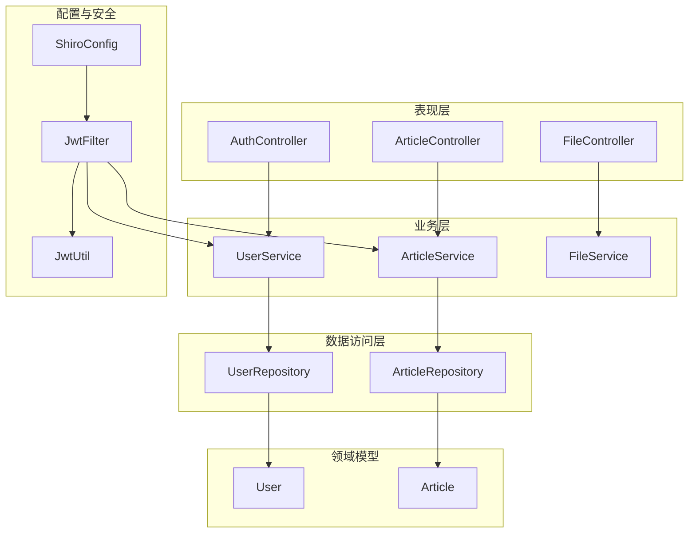
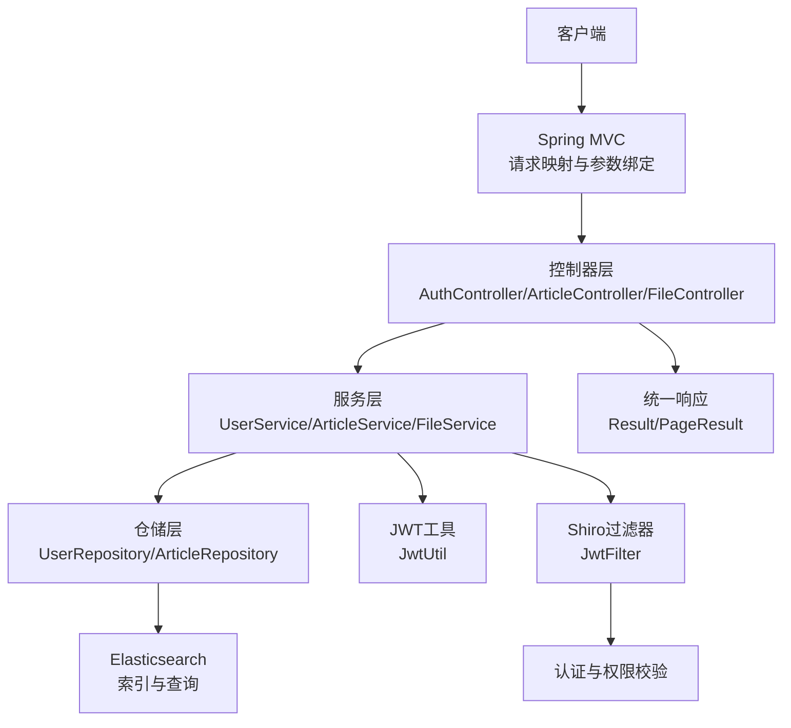
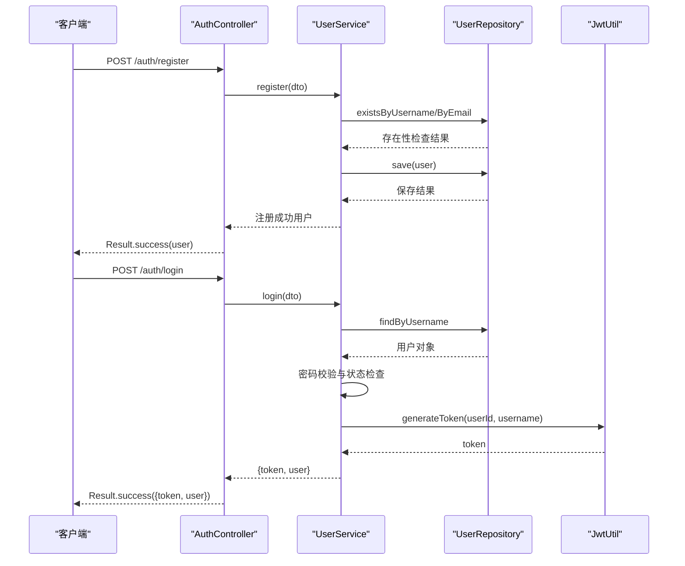
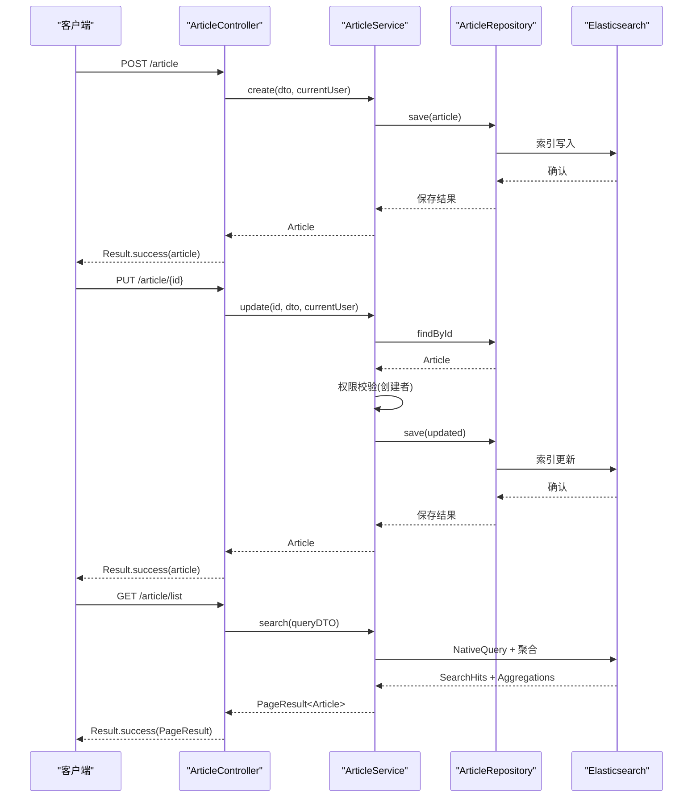
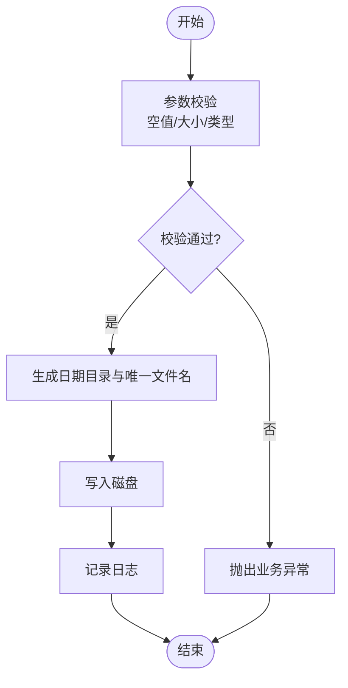
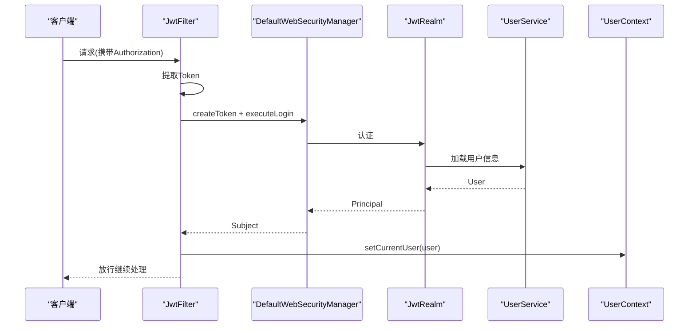
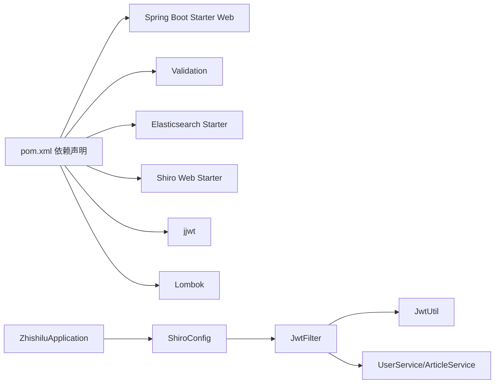

# 整体架构设计

<cite>
**本文档引用的文件**
- [README.md](file://README.md)
- [pom.xml](file://pom.xml)
- [application.yml](file://src/main/resources/application.yml)
- [ZhishiluApplication.java](file://src/main/java/com/zhishilu/ZhishiluApplication.java)
- [Result.java](file://src/main/java/com/zhishilu/common/Result.java)
- [PageResult.java](file://src/main/java/com/zhishilu/common/PageResult.java)
- [AuthController.java](file://src/main/java/com/zhishilu/controller/AuthController.java)
- [ArticleController.java](file://src/main/java/com/zhishilu/controller/ArticleController.java)
- [FileController.java](file://src/main/java/com/zhishilu/controller/FileController.java)
- [UserService.java](file://src/main/java/com/zhishilu/service/UserService.java)
- [ArticleService.java](file://src/main/java/com/zhishilu/service/ArticleService.java)
- [FileService.java](file://src/main/java/com/zhishilu/service/FileService.java)
- [UserRepository.java](file://src/main/java/com/zhishilu/repository/UserRepository.java)
- [ArticleRepository.java](file://src/main/java/com/zhishilu/repository/ArticleRepository.java)
- [User.java](file://src/main/java/com/zhishilu/entity/User.java)
- [Article.java](file://src/main/java/com/zhishilu/entity/Article.java)
- [JwtFilter.java](file://src/main/java/com/zhishilu/shiro/JwtFilter.java)
- [JwtUtil.java](file://src/main/java/com/zhishilu/util/JwtUtil.java)
- [ShiroConfig.java](file://src/main/java/com/zhishilu/config/ShiroConfig.java)
</cite>

## 目录
1. [引言](#引言)
2. [项目结构](#项目结构)
3. [核心组件](#核心组件)
4. [架构总览](#架构总览)
5. [详细组件分析](#详细组件分析)
6. [依赖关系分析](#依赖关系分析)
7. [性能考虑](#性能考虑)
8. [故障排除指南](#故障排除指南)
9. [结论](#结论)

## 引言
本项目为“知拾录”个人知识收藏管理系统，采用Spring Boot 3.2.1构建，结合Apache Shiro与JWT实现认证鉴权，使用Elasticsearch进行内容检索与存储，提供文章管理、用户认证、文件上传与下载、操作日志等能力。系统遵循分层架构模式（Controller-Service-Repository），通过统一返回封装、拦截器与过滤器实现横切关注点，具备良好的可扩展性与可维护性。

## 项目结构
系统采用按功能域分层的目录组织方式，主要分为以下层次：
- 表现层（Controller）：负责HTTP请求接入与响应封装
- 业务层（Service）：承载核心业务逻辑与领域模型编排
- 数据访问层（Repository）：基于Spring Data Elasticsearch的仓储接口
- 领域模型（Entity）：Elasticsearch文档映射实体
- 配置与安全（Config/Shiro）：Shiro过滤链与JWT集成
- 工具与通用类（Common/Util）：统一返回、分页结果、JWT工具、用户上下文

**图表来源**
- [AuthController.java](file://src/main/java/com/zhishilu/controller/AuthController.java#L1-L50)
- [ArticleController.java](file://src/main/java/com/zhishilu/controller/ArticleController.java#L1-L88)
- [FileController.java](file://src/main/java/com/zhishilu/controller/FileController.java#L1-L71)
- [UserService.java](file://src/main/java/com/zhishilu/service/UserService.java#L1-L128)
- [ArticleService.java](file://src/main/java/com/zhishilu/service/ArticleService.java#L1-L200)
- [FileService.java](file://src/main/java/com/zhishilu/service/FileService.java#L1-L108)
- [UserRepository.java](file://src/main/java/com/zhishilu/repository/UserRepository.java#L1-L35)
- [ArticleRepository.java](file://src/main/java/com/zhishilu/repository/ArticleRepository.java#L1-L30)
- [User.java](file://src/main/java/com/zhishilu/entity/User.java#L1-L68)
- [Article.java](file://src/main/java/com/zhishilu/entity/Article.java#L1-L81)
- [ShiroConfig.java](file://src/main/java/com/zhishilu/config/ShiroConfig.java#L1-L72)
- [JwtFilter.java](file://src/main/java/com/zhishilu/shiro/JwtFilter.java#L1-L109)
- [JwtUtil.java](file://src/main/java/com/zhishilu/util/JwtUtil.java#L1-L99)

**章节来源**
- [README.md](file://README.md#L1-L133)
- [pom.xml](file://pom.xml#L1-L129)
- [application.yml](file://src/main/resources/application.yml#L1-L47)

## 核心组件
- 统一返回封装：Result与PageResult提供标准化响应结构，简化控制器输出。
- 控制器层：AuthController、ArticleController、FileController分别处理认证、文章与文件相关接口。
- 服务层：UserService、ArticleService、FileService封装业务规则与跨域调用。
- 仓储层：UserRepository、ArticleRepository继承ElasticsearchRepository，提供CRUD与查询方法。
- 领域模型：User、Article映射到Elasticsearch索引，定义字段类型与分词策略。
- 安全框架：ShiroConfig配置过滤链，JwtFilter解析与验证Token，JwtUtil生成与解析JWT。
- 应用入口：ZhishiluApplication作为Spring Boot启动类。

**章节来源**
- [Result.java](file://src/main/java/com/zhishilu/common/Result.java#L1-L71)
- [PageResult.java](file://src/main/java/com/zhishilu/common/PageResult.java#L1-L52)
- [AuthController.java](file://src/main/java/com/zhishilu/controller/AuthController.java#L1-L50)
- [ArticleController.java](file://src/main/java/com/zhishilu/controller/ArticleController.java#L1-L88)
- [FileController.java](file://src/main/java/com/zhishilu/controller/FileController.java#L1-L71)
- [UserService.java](file://src/main/java/com/zhishilu/service/UserService.java#L1-L128)
- [ArticleService.java](file://src/main/java/com/zhishilu/service/ArticleService.java#L1-L200)
- [FileService.java](file://src/main/java/com/zhishilu/service/FileService.java#L1-L108)
- [UserRepository.java](file://src/main/java/com/zhishilu/repository/UserRepository.java#L1-L35)
- [ArticleRepository.java](file://src/main/java/com/zhishilu/repository/ArticleRepository.java#L1-L30)
- [User.java](file://src/main/java/com/zhishilu/entity/User.java#L1-L68)
- [Article.java](file://src/main/java/com/zhishilu/entity/Article.java#L1-L81)
- [ShiroConfig.java](file://src/main/java/com/zhishilu/config/ShiroConfig.java#L1-L72)
- [JwtFilter.java](file://src/main/java/com/zhishilu/shiro/JwtFilter.java#L1-L109)
- [JwtUtil.java](file://src/main/java/com/zhishilu/util/JwtUtil.java#L1-L99)
- [ZhishiluApplication.java](file://src/main/java/com/zhishilu/ZhishiluApplication.java#L1-L16)

## 架构总览
系统采用经典的三层架构（Controller-Service-Repository），配合安全过滤链与统一响应封装，形成清晰的职责边界与数据流：

**图表来源**
- [AuthController.java](file://src/main/java/com/zhishilu/controller/AuthController.java#L1-L50)
- [ArticleController.java](file://src/main/java/com/zhishilu/controller/ArticleController.java#L1-L88)
- [FileController.java](file://src/main/java/com/zhishilu/controller/FileController.java#L1-L71)
- [UserService.java](file://src/main/java/com/zhishilu/service/UserService.java#L1-L128)
- [ArticleService.java](file://src/main/java/com/zhishilu/service/ArticleService.java#L1-L200)
- [FileService.java](file://src/main/java/com/zhishilu/service/FileService.java#L1-L108)
- [UserRepository.java](file://src/main/java/com/zhishilu/repository/UserRepository.java#L1-L35)
- [ArticleRepository.java](file://src/main/java/com/zhishilu/repository/ArticleRepository.java#L1-L30)
- [JwtUtil.java](file://src/main/java/com/zhishilu/util/JwtUtil.java#L1-L99)
- [JwtFilter.java](file://src/main/java/com/zhishilu/shiro/JwtFilter.java#L1-L109)
- [Result.java](file://src/main/java/com/zhishilu/common/Result.java#L1-L71)
- [PageResult.java](file://src/main/java/com/zhishilu/common/PageResult.java#L1-L52)

## 详细组件分析

### 认证流程（登录/注册）
认证流程通过控制器接收请求，服务层完成业务处理，并使用JWT工具生成令牌，最终以统一响应返回。

**图表来源**
- [AuthController.java](file://src/main/java/com/zhishilu/controller/AuthController.java#L1-L50)
- [UserService.java](file://src/main/java/com/zhishilu/service/UserService.java#L1-L128)
- [UserRepository.java](file://src/main/java/com/zhishilu/repository/UserRepository.java#L1-L35)
- [JwtUtil.java](file://src/main/java/com/zhishilu/util/JwtUtil.java#L1-L99)
- [Result.java](file://src/main/java/com/zhishilu/common/Result.java#L1-L71)

**章节来源**
- [AuthController.java](file://src/main/java/com/zhishilu/controller/AuthController.java#L1-L50)
- [UserService.java](file://src/main/java/com/zhishilu/service/UserService.java#L1-L128)
- [UserRepository.java](file://src/main/java/com/zhishilu/repository/UserRepository.java#L1-L35)
- [JwtUtil.java](file://src/main/java/com/zhishilu/util/JwtUtil.java#L1-L99)
- [Result.java](file://src/main/java/com/zhishilu/common/Result.java#L1-L71)

### 文章管理流程（创建/更新/删除/查询）
文章管理涉及权限校验（仅创建者可修改/删除）、全文检索与聚合统计。

**图表来源**
- [ArticleController.java](file://src/main/java/com/zhishilu/controller/ArticleController.java#L1-L88)
- [ArticleService.java](file://src/main/java/com/zhishilu/service/ArticleService.java#L1-L200)
- [ArticleRepository.java](file://src/main/java/com/zhishilu/repository/ArticleRepository.java#L1-L30)

**章节来源**
- [ArticleController.java](file://src/main/java/com/zhishilu/controller/ArticleController.java#L1-L88)
- [ArticleService.java](file://src/main/java/com/zhishilu/service/ArticleService.java#L1-L200)
- [ArticleRepository.java](file://src/main/java/com/zhishilu/repository/ArticleRepository.java#L1-L30)

### 文件上传流程
文件上传采用本地存储，ES仅存路径，支持单文件与批量上传。

**图表来源**
- [FileController.java](file://src/main/java/com/zhishilu/controller/FileController.java#L1-L71)
- [FileService.java](file://src/main/java/com/zhishilu/service/FileService.java#L1-L108)

**章节来源**
- [FileController.java](file://src/main/java/com/zhishilu/controller/FileController.java#L1-L71)
- [FileService.java](file://src/main/java/com/zhishilu/service/FileService.java#L1-L108)

### 安全与权限控制
系统通过Shiro过滤链实现无状态认证，JWT过滤器解析请求头中的Token并交由Realm验证。

**图表来源**
- [ShiroConfig.java](file://src/main/java/com/zhishilu/config/ShiroConfig.java#L1-L72)
- [JwtFilter.java](file://src/main/java/com/zhishilu/shiro/JwtFilter.java#L1-L109)
- [JwtUtil.java](file://src/main/java/com/zhishilu/util/JwtUtil.java#L1-L99)
- [UserService.java](file://src/main/java/com/zhishilu/service/UserService.java#L1-L128)

**章节来源**
- [ShiroConfig.java](file://src/main/java/com/zhishilu/config/ShiroConfig.java#L1-L72)
- [JwtFilter.java](file://src/main/java/com/zhishilu/shiro/JwtFilter.java#L1-L109)
- [JwtUtil.java](file://src/main/java/com/zhishilu/util/JwtUtil.java#L1-L99)
- [UserService.java](file://src/main/java/com/zhishilu/service/UserService.java#L1-L128)

## 依赖关系分析
- 技术栈选择合理性：
  - Spring Boot 3.2.1 + Java 17：现代化运行时，稳定生态。
  - Spring MVC：标准Web层框架。
  - Spring Data Elasticsearch：与Elasticsearch无缝集成，简化查询DSL与聚合。
  - Apache Shiro + JWT：无状态认证，适合REST API。
  - Lombok：减少样板代码，提升开发效率。
- 组件耦合与内聚：
  - 控制器仅依赖服务接口，降低对具体实现的耦合。
  - 服务层依赖仓储接口，面向抽象编程。
  - 仓储层依赖Elasticsearch模板，隔离数据访问细节。
- 外部依赖与集成点：
  - Elasticsearch：作为主存储与搜索引擎。
  - JWT：令牌生成与解析。
  - Shiro：认证与权限控制。

**图表来源**
- [pom.xml](file://pom.xml#L1-L129)
- [ZhishiluApplication.java](file://src/main/java/com/zhishilu/ZhishiluApplication.java#L1-L16)
- [ShiroConfig.java](file://src/main/java/com/zhishilu/config/ShiroConfig.java#L1-L72)
- [JwtFilter.java](file://src/main/java/com/zhishilu/shiro/JwtFilter.java#L1-L109)
- [JwtUtil.java](file://src/main/java/com/zhishilu/util/JwtUtil.java#L1-L99)

**章节来源**
- [pom.xml](file://pom.xml#L1-L129)
- [application.yml](file://src/main/resources/application.yml#L1-L47)

## 性能考虑
- 查询优化：
  - 使用Elasticsearch的IK分词器对标题与正文进行中文分词，提升检索准确性。
  - 列表查询使用NativeQuery与排序，避免全表扫描。
  - 聚合查询统计常用类别，减少复杂计算开销。
- 存储策略：
  - 图片等二进制资源存储于本地文件系统，Elasticsearch仅存路径，降低索引体积。
  - 上传目录按日期分层，便于清理与管理。
- 并发与线程：
  - 使用异步配置（AsyncConfig）处理耗时任务（如日志写入），避免阻塞主线程。
- 缓存与索引：
  - Elasticsearch索引设置合理分片与副本，平衡查询与写入性能。
- 安全与鉴权：
  - 无状态JWT避免会话存储，降低服务器内存压力。
  - Shiro关闭Session，进一步降低状态管理成本。

[本节为通用性能建议，无需特定文件引用]

## 故障排除指南
- 认证失败：
  - 检查请求头Authorization格式是否符合Bearer前缀。
  - 确认JWT密钥与过期时间配置正确。
  - 查看Shiro过滤器是否正确拦截与放行。
- 业务异常：
  - 用户名重复、邮箱重复、权限不足、文章不存在等均抛出业务异常，需根据异常消息定位问题。
- 文件上传失败：
  - 检查上传目录权限、文件类型与大小限制、磁盘空间。
- Elasticsearch连接问题：
  - 校验application.yml中的ES连接参数（URI、用户名、密码、超时）。

**章节来源**
- [JwtFilter.java](file://src/main/java/com/zhishilu/shiro/JwtFilter.java#L1-L109)
- [JwtUtil.java](file://src/main/java/com/zhishilu/util/JwtUtil.java#L1-L99)
- [UserService.java](file://src/main/java/com/zhishilu/service/UserService.java#L1-L128)
- [FileService.java](file://src/main/java/com/zhishilu/service/FileService.java#L1-L108)
- [application.yml](file://src/main/resources/application.yml#L1-L47)

## 结论
“知拾录”系统通过清晰的分层架构与合理的外部依赖选择，实现了认证、内容管理、文件处理与全文检索的核心能力。统一响应封装与安全过滤链提升了系统的易用性与安全性；Elasticsearch的引入为内容检索提供了高性能基础。未来可在缓存策略、监控告警与可观测性方面进一步增强，以支撑更大规模的业务场景。