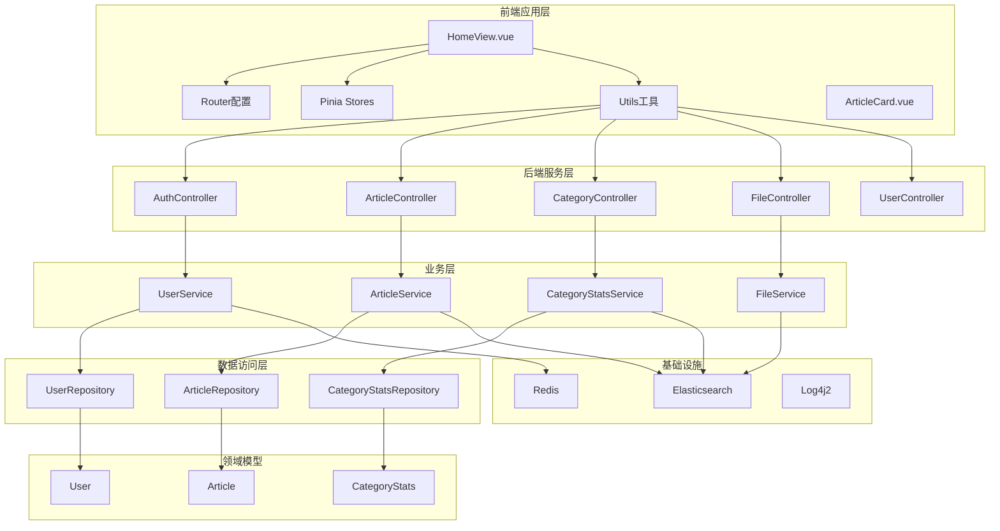
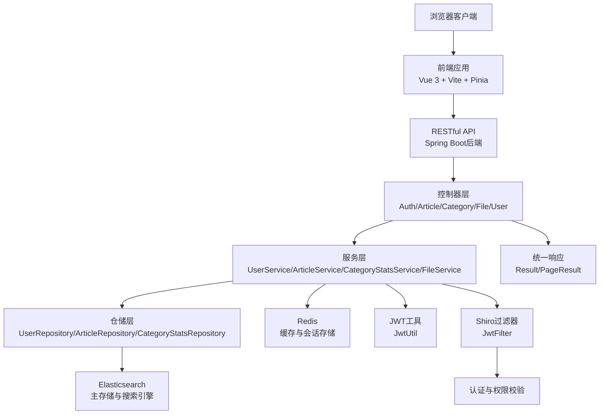
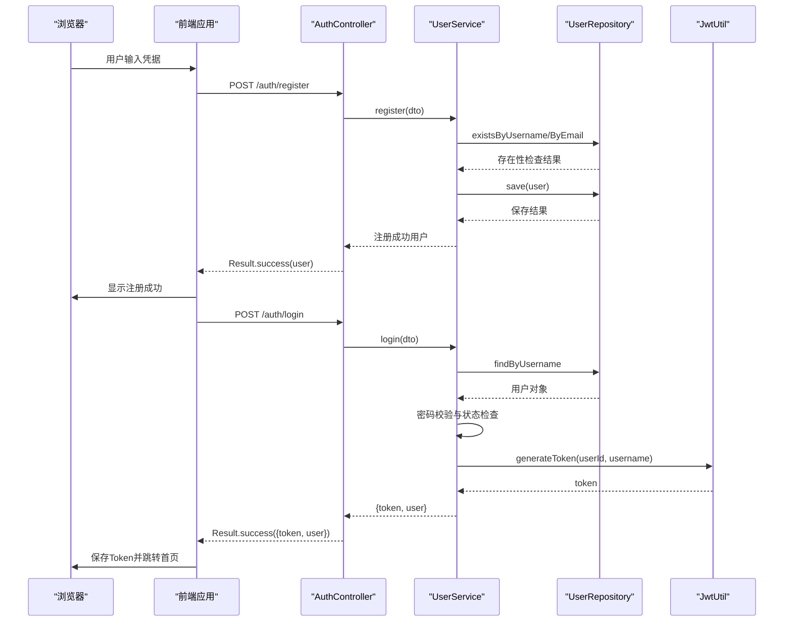
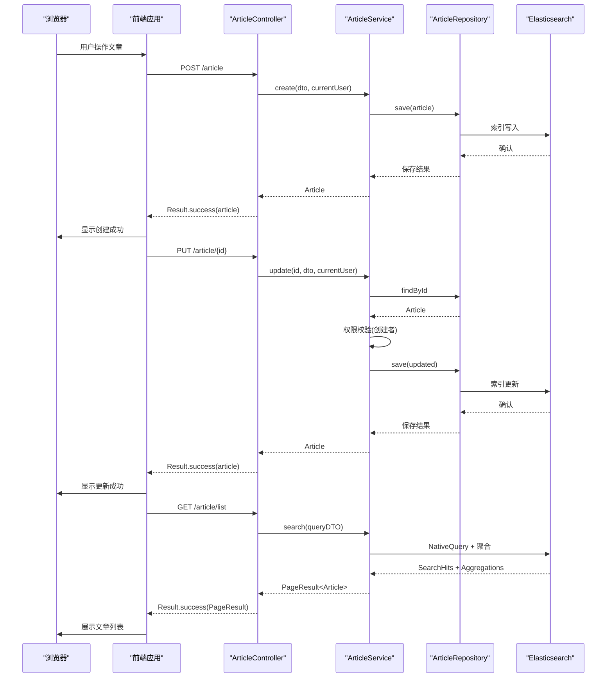
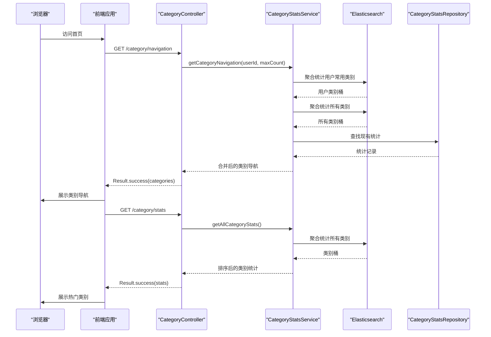
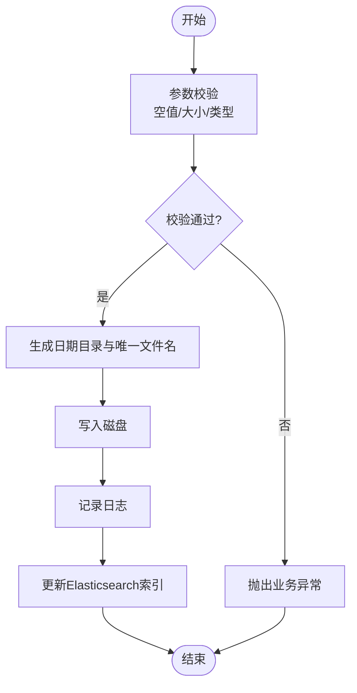
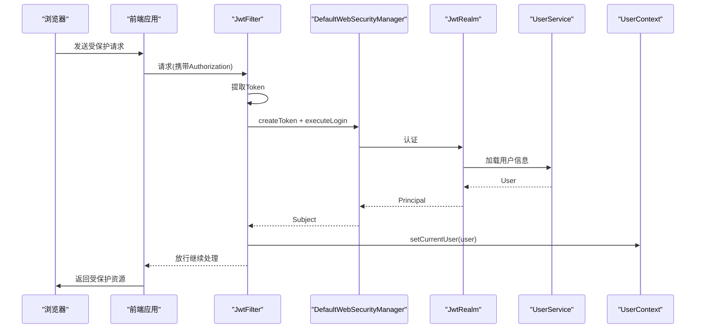
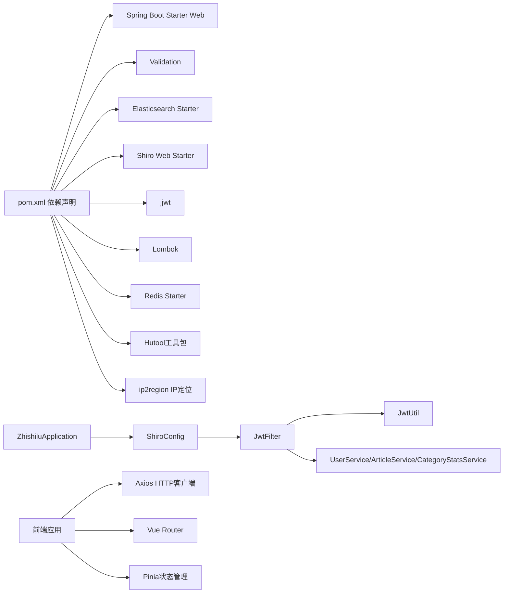

# 整体架构设计

<cite>
**本文档引用的文件**
- [pom.xml](file://pom.xml)
- [application.yml](file://src/main/resources/application.yml)
- [ZhishiluApplication.java](file://src/main/java/com/zhishilu/ZhishiluApplication.java)
- [Result.java](file://src/main/java/com/zhishilu/common/Result.java)
- [PageResult.java](file://src/main/java/com/zhishilu/common/PageResult.java)
- [AuthController.java](file://src/main/java/com/zhishilu/controller/AuthController.java)
- [ArticleController.java](file://src/main/java/com/zhishilu/controller/ArticleController.java)
- [CategoryController.java](file://src/main/java/com/zhishilu/controller/CategoryController.java)
- [FileController.java](file://src/main/java/com/zhishilu/controller/FileController.java)
- [UserController.java](file://src/main/java/com/zhishilu/controller/UserController.java)
- [UserService.java](file://src/main/java/com/zhishilu/service/UserService.java)
- [ArticleService.java](file://src/main/java/com/zhishilu/service/ArticleService.java)
- [CategoryStatsService.java](file://src/main/java/com/zhishilu/service/CategoryStatsService.java)
- [FileService.java](file://src/main/java/com/zhishilu/service/FileService.java)
- [UserRepository.java](file://src/main/java/com/zhishilu/repository/UserRepository.java)
- [ArticleRepository.java](file://src/main/java/com/zhishilu/repository/ArticleRepository.java)
- [CategoryStatsRepository.java](file://src/main/java/com/zhishilu/repository/CategoryStatsRepository.java)
- [User.java](file://src/main/java/com/zhishilu/entity/User.java)
- [Article.java](file://src/main/java/com/zhishilu/entity/Article.java)
- [CategoryStats.java](file://src/main/java/com/zhishilu/entity/CategoryStats.java)
- [JwtFilter.java](file://src/main/java/com/zhishilu/shiro/JwtFilter.java)
- [JwtUtil.java](file://src/main/java/com/zhishilu/util/JwtUtil.java)
- [ShiroConfig.java](file://src/main/java/com/zhishilu/config/ShiroConfig.java)
- [vite.config.ts](file://frontend/vite.config.ts)
- [package.json](file://frontend/package.json)
- [request.ts](file://frontend/src/utils/request.ts)
- [index.ts](file://frontend/src/router/index.ts)
- [HomeView.vue](file://frontend/src/views/HomeView.vue)
</cite>

## 更新摘要
**所做更改**
- 新增前后端分离架构章节，详细说明Vue 3 + Vite前端架构
- 新增微服务设计理念和现代化技术栈应用
- 更新架构总览图为前后端分离的完整系统架构
- 新增前端路由守卫和状态管理机制
- 更新依赖关系分析，包含Redis、Hutool等新依赖
- 新增性能优化和可扩展性考虑

## 目录
1. [引言](#引言)
2. [项目结构](#项目结构)
3. [核心组件](#核心组件)
4. [架构总览](#架构总览)
5. [详细组件分析](#详细组件分析)
6. [前后端分离架构](#前后端分离架构)
7. [微服务设计理念](#微服务设计理念)
8. [依赖关系分析](#依赖关系分析)
9. [性能考虑](#性能考虑)
10. [故障排除指南](#故障排除指南)
11. [结论](#结论)

## 引言
本项目为"知拾录"个人知识收藏管理系统，现已升级为完整的前后端分离架构。后端采用Spring Boot 3.2.1 + Java 17构建，结合Apache Shiro与JWT实现认证鉴权，使用Elasticsearch进行内容检索与存储，提供文章管理、用户认证、文件上传与下载、操作日志等能力。前端采用Vue 3 + Vite + Pinia + Vue Router构建现代化单页应用(SPA)，通过Axios进行API通信。系统遵循分层架构模式（Controller-Service-Repository），通过统一返回封装、拦截器与过滤器实现横切关注点，具备良好的可扩展性与可维护性。

## 项目结构
系统采用前后端分离的现代化项目结构，主要分为以下层次：

**后端服务层：**
- 表现层（Controller）：负责HTTP请求接入与响应封装
- 业务层（Service）：承载核心业务逻辑与领域模型编排
- 数据访问层（Repository）：基于Spring Data Elasticsearch的仓储接口
- 领域模型（Entity）：Elasticsearch文档映射实体
- 配置与安全（Config/Shiro）：Shiro过滤链与JWT集成
- 工具与通用类（Common/Util）：统一返回、分页结果、JWT工具、用户上下文

**前端应用层：**
- 视图层（Views）：Vue组件构成的用户界面
- 路由层（Router）：Vue Router实现的前端路由管理
- 状态管理层（Stores）：Pinia实现的状态管理
- 工具层（Utils）：Axios封装的API请求和工具函数
- 组件层（Components）：可复用的UI组件

```mermaid
graph TB
subgraph "前端应用层"
FV["HomeView.vue"]
FR["Router配置"]
FS["Pinia Stores"]
FU["Utils工具"]
FCOMP["ArticleCard.vue"]
end
subgraph "后端服务层"
AC["AuthController"]
ARCT["ArticleController"]
CC["CategoryController"]
FC["FileController"]
UC["UserController"]
end
subgraph "业务层"
US["UserService"]
AS["ArticleService"]
CSS["CategoryStatsService"]
FSVC["FileService"]
end
subgraph "数据访问层"
UR["UserRepository"]
ART["ArticleRepository"]
CSR["CategoryStatsRepository"]
end
subgraph "领域模型"
UE["User"]
AE["Article"]
CE["CategoryStats"]
end
subgraph "基础设施"
ES["Elasticsearch"]
RD["Redis"]
LOG["Log4j2"]
end
FV --> FR
FV --> FS
FV --> FU
FU --> AC
FU --> ARCT
FU --> CC
FU --> FC
FU --> UC
AC --> US
ARCT --> AS
CC --> CSS
FC --> FSVC
US --> UR
AS --> ART
CSS --> CSR
UR --> UE
ART --> AE
CSR --> CE
US --> RD
AS --> ES
CSS --> ES
FSVC --> ES
```

**图表来源**
- [HomeView.vue](file://frontend/src/views/HomeView.vue#L1-L893)
- [index.ts](file://frontend/src/router/index.ts#L1-L85)
- [request.ts](file://frontend/src/utils/request.ts#L1-L65)
- [AuthController.java](file://src/main/java/com/zhishilu/controller/AuthController.java#L1-L50)
- [ArticleController.java](file://src/main/java/com/zhishilu/controller/ArticleController.java#L1-L88)
- [CategoryController.java](file://src/main/java/com/zhishilu/controller/CategoryController.java#L1-L78)
- [UserService.java](file://src/main/java/com/zhishilu/service/UserService.java#L1-L128)
- [ArticleService.java](file://src/main/java/com/zhishilu/service/ArticleService.java#L1-L200)
- [CategoryStatsService.java](file://src/main/java/com/zhishilu/service/CategoryStatsService.java#L1-L300)

**章节来源**
- [pom.xml](file://pom.xml#L1-L157)
- [application.yml](file://src/main/resources/application.yml#L1-L53)
- [package.json](file://frontend/package.json#L1-L61)

## 核心组件
- **统一返回封装**：Result与PageResult提供标准化响应结构，简化控制器输出。
- **控制器层**：AuthController、ArticleController、CategoryController、FileController、UserController分别处理认证、文章、类别统计、文件与用户相关接口。
- **服务层**：UserService、ArticleService、CategoryStatsService、FileService封装业务规则与跨域调用。
- **仓储层**：UserRepository、ArticleRepository、CategoryStatsRepository继承ElasticsearchRepository，提供CRUD与查询方法。
- **领域模型**：User、Article、CategoryStats映射到Elasticsearch索引，定义字段类型与分词策略。
- **安全框架**：ShiroConfig配置过滤链，JwtFilter解析与验证Token，JwtUtil生成与解析JWT。
- **应用入口**：ZhishiluApplication作为Spring Boot启动类。
- **前端架构**：Vue 3 + Vite + Pinia + Vue Router + Axios构成的现代化前端应用。

**章节来源**
- [Result.java](file://src/main/java/com/zhishilu/common/Result.java#L1-L71)
- [PageResult.java](file://src/main/java/com/zhishilu/common/PageResult.java#L1-L52)
- [CategoryController.java](file://src/main/java/com/zhishilu/controller/CategoryController.java#L1-L78)
- [CategoryStatsService.java](file://src/main/java/com/zhishilu/service/CategoryStatsService.java#L1-L300)
- [CategoryStatsRepository.java](file://src/main/java/com/zhishilu/repository/CategoryStatsRepository.java#L1-L20)
- [CategoryStats.java](file://src/main/java/com/zhishilu/entity/CategoryStats.java#L1-L40)
- [HomeView.vue](file://frontend/src/views/HomeView.vue#L1-L893)
- [request.ts](file://frontend/src/utils/request.ts#L1-L65)

## 架构总览
系统采用前后端分离的三层架构模式，后端提供RESTful API服务，前端通过Axios进行HTTP通信。系统通过统一响应封装、拦截器与过滤器实现横切关注点，具备良好的可扩展性与可维护性：

```mermaid
graph TB
Client["浏览器客户端"] --> Frontend["前端应用<br/>Vue 3 + Vite + Pinia"]
Frontend --> API["RESTful API<br/>Spring Boot后端"]
API --> Controller["控制器层<br/>Auth/Article/Category/File/User"]
Controller --> Service["服务层<br/>UserService/ArticleService/CategoryStatsService/FileService"]
Service --> Repository["仓储层<br/>UserRepository/ArticleRepository/CategoryStatsRepository"]
Repository --> ES["Elasticsearch<br/>主存储与搜索引擎"]
Service --> Redis["Redis<br/>缓存与会话存储"]
Service --> JWT["JWT工具<br/>JwtUtil"]
Service --> Shiro["Shiro过滤器<br/>JwtFilter"]
Shiro --> Auth["认证与权限校验"]
Controller --> Response["统一响应<br/>Result/PageResult"]
```

**图表来源**
- [HomeView.vue](file://frontend/src/views/HomeView.vue#L1-L893)
- [request.ts](file://frontend/src/utils/request.ts#L1-L65)
- [AuthController.java](file://src/main/java/com/zhishilu/controller/AuthController.java#L1-L50)
- [ArticleController.java](file://src/main/java/com/zhishilu/controller/ArticleController.java#L1-L88)
- [CategoryController.java](file://src/main/java/com/zhishilu/controller/CategoryController.java#L1-L78)
- [UserService.java](file://src/main/java/com/zhishilu/service/UserService.java#L1-L128)
- [ArticleService.java](file://src/main/java/com/zhishilu/service/ArticleService.java#L1-L200)
- [CategoryStatsService.java](file://src/main/java/com/zhishilu/service/CategoryStatsService.java#L1-L300)
- [JwtUtil.java](file://src/main/java/com/zhishilu/util/JwtUtil.java#L1-L99)
- [JwtFilter.java](file://src/main/java/com/zhishilu/shiro/JwtFilter.java#L1-L109)

## 详细组件分析

### 认证流程（登录/注册）
认证流程通过前端发送请求，后端控制器接收请求，服务层完成业务处理，并使用JWT工具生成令牌，最终以统一响应返回。

```mermaid
sequenceDiagram
participant Browser as "浏览器"
participant Frontend as "前端应用"
participant AC as "AuthController"
participant US as "UserService"
participant UR as "UserRepository"
participant JU as "JwtUtil"
Browser->>Frontend : 用户输入凭据
Frontend->>AC : POST /auth/register
AC->>US : register(dto)
US->>UR : existsByUsername/ByEmail
UR-->>US : 存在性检查结果
US->>UR : save(user)
UR-->>US : 保存结果
US-->>AC : 注册成功用户
AC-->>Frontend : Result.success(user)
Frontend->>Browser : 显示注册成功
Frontend->>AC : POST /auth/login
AC->>US : login(dto)
US->>UR : findByUsername
UR-->>US : 用户对象
US->>US : 密码校验与状态检查
US->>JU : generateToken(userId, username)
JU-->>US : token
US-->>AC : {token, user}
AC-->>Frontend : Result.success({token, user})
Frontend->>Browser : 保存Token并跳转首页
```

**图表来源**
- [HomeView.vue](file://frontend/src/views/HomeView.vue#L797-L800)
- [request.ts](file://frontend/src/utils/request.ts#L15-L26)
- [AuthController.java](file://src/main/java/com/zhishilu/controller/AuthController.java#L1-L50)
- [UserService.java](file://src/main/java/com/zhishilu/service/UserService.java#L1-L128)
- [JwtUtil.java](file://src/main/java/com/zhishilu/util/JwtUtil.java#L1-L99)

**章节来源**
- [AuthController.java](file://src/main/java/com/zhishilu/controller/AuthController.java#L1-L50)
- [UserService.java](file://src/main/java/com/zhishilu/service/UserService.java#L1-L128)
- [JwtUtil.java](file://src/main/java/com/zhishilu/util/JwtUtil.java#L1-L99)
- [HomeView.vue](file://frontend/src/views/HomeView.vue#L797-L800)
- [request.ts](file://frontend/src/utils/request.ts#L15-L26)

### 文章管理流程（创建/更新/删除/查询）
文章管理涉及权限校验（仅创建者可修改/删除）、全文检索与聚合统计。

```mermaid
sequenceDiagram
participant Browser as "浏览器"
participant Frontend as "前端应用"
participant ARCT as "ArticleController"
participant AS as "ArticleService"
participant ART as "ArticleRepository"
participant ES as "Elasticsearch"
Browser->>Frontend : 用户操作文章
Frontend->>ARCT : POST /article
ARCT->>AS : create(dto, currentUser)
AS->>ART : save(article)
ART->>ES : 索引写入
ES-->>ART : 确认
ART-->>AS : 保存结果
AS-->>ARCT : Article
ARCT-->>Frontend : Result.success(article)
Frontend->>Browser : 显示创建成功
Frontend->>ARCT : PUT /article/{id}
ARCT->>AS : update(id, dto, currentUser)
AS->>ART : findById
ART-->>AS : Article
AS->>AS : 权限校验(创建者)
AS->>ART : save(updated)
ART->>ES : 索引更新
ES-->>ART : 确认
ART-->>AS : 保存结果
AS-->>ARCT : Article
ARCT-->>Frontend : Result.success(article)
Frontend->>Browser : 显示更新成功
Frontend->>ARCT : GET /article/list
ARCT->>AS : search(queryDTO)
AS->>ES : NativeQuery + 聚合
ES-->>AS : SearchHits + Aggregations
AS-->>ARCT : PageResult<Article>
ARCT-->>Frontend : Result.success(PageResult)
Frontend->>Browser : 展示文章列表
```

**图表来源**
- [ArticleController.java](file://src/main/java/com/zhishilu/controller/ArticleController.java#L1-L88)
- [ArticleService.java](file://src/main/java/com/zhishilu/service/ArticleService.java#L1-L200)
- [HomeView.vue](file://frontend/src/views/HomeView.vue#L560-L611)

**章节来源**
- [ArticleController.java](file://src/main/java/com/zhishilu/controller/ArticleController.java#L1-L88)
- [ArticleService.java](file://src/main/java/com/zhishilu/service/ArticleService.java#L1-L200)
- [HomeView.vue](file://frontend/src/views/HomeView.vue#L560-L611)

### 类别统计流程
类别统计服务提供热门类别导航、用户常用类别统计等功能。

```mermaid
sequenceDiagram
participant Browser as "浏览器"
participant Frontend as "前端应用"
participant CC as "CategoryController"
participant CSS as "CategoryStatsService"
participant ES as "Elasticsearch"
participant CSR as "CategoryStatsRepository"
Browser->>Frontend : 访问首页
Frontend->>CC : GET /category/navigation
CC->>CSS : getCategoryNavigation(userId, maxCount)
CSS->>ES : 聚合统计用户常用类别
ES-->>CSS : 用户类别桶
CSS->>ES : 聚合统计所有类别
ES-->>CSS : 所有类别桶
CSS->>CSR : 查找现有统计
CSR-->>CSS : 统计记录
CSS-->>CC : 合并后的类别导航
CC-->>Frontend : Result.success(categories)
Frontend->>Browser : 展示类别导航
Frontend->>CC : GET /category/stats
CC->>CSS : getAllCategoryStats()
CSS->>ES : 聚合统计所有类别
ES-->>CSS : 类别桶
CSS-->>CC : 排序后的类别统计
CC-->>Frontend : Result.success(stats)
Frontend->>Browser : 展示热门类别
```

**图表来源**
- [CategoryController.java](file://src/main/java/com/zhishilu/controller/CategoryController.java#L1-L78)
- [CategoryStatsService.java](file://src/main/java/com/zhishilu/service/CategoryStatsService.java#L1-L300)
- [HomeView.vue](file://frontend/src/views/HomeView.vue#L545-L558)

**章节来源**
- [CategoryController.java](file://src/main/java/com/zhishilu/controller/CategoryController.java#L1-L78)
- [CategoryStatsService.java](file://src/main/java/com/zhishilu/service/CategoryStatsService.java#L1-L300)
- [HomeView.vue](file://frontend/src/views/HomeView.vue#L545-L558)

### 文件上传流程
文件上传采用本地存储，ES仅存路径，支持单文件与批量上传。

```mermaid
flowchart TD
Start(["开始"]) --> Validate["参数校验<br/>空值/大小/类型"]
Validate --> Valid{"校验通过?"}
Valid --> |否| Err["抛出业务异常"]
Valid --> |是| BuildPath["生成日期目录与唯一文件名"]
BuildPath --> Save["写入磁盘"]
Save --> Log["记录日志"]
Log --> ESIndex["更新Elasticsearch索引"]
ESIndex --> Done(["结束"])
Err --> Done
```

**图表来源**
- [FileController.java](file://src/main/java/com/zhishilu/controller/FileController.java#L1-L71)
- [FileService.java](file://src/main/java/com/zhishilu/service/FileService.java#L1-L108)

**章节来源**
- [FileController.java](file://src/main/java/com/zhishilu/controller/FileController.java#L1-L71)
- [FileService.java](file://src/main/java/com/zhishilu/service/FileService.java#L1-L108)

### 安全与权限控制
系统通过Shiro过滤链实现无状态认证，JWT过滤器解析请求头中的Token并交由Realm验证。

```mermaid
sequenceDiagram
participant Browser as "浏览器"
participant Frontend as "前端应用"
participant F as "JwtFilter"
participant SM as "DefaultWebSecurityManager"
participant R as "JwtRealm"
participant U as "UserService"
participant UC as "UserContext"
Browser->>Frontend : 发送受保护请求
Frontend->>F : 请求(携带Authorization)
F->>F : 提取Token
F->>SM : createToken + executeLogin
SM->>R : 认证
R->>U : 加载用户信息
U-->>R : User
R-->>SM : Principal
SM-->>F : Subject
F->>UC : setCurrentUser(user)
F-->>Frontend : 放行继续处理
Frontend->>Browser : 返回受保护资源
```

**图表来源**
- [ShiroConfig.java](file://src/main/java/com/zhishilu/config/ShiroConfig.java#L1-L72)
- [JwtFilter.java](file://src/main/java/com/zhishilu/shiro/JwtFilter.java#L1-L109)
- [JwtUtil.java](file://src/main/java/com/zhishilu/util/JwtUtil.java#L1-L99)
- [request.ts](file://frontend/src/utils/request.ts#L15-L26)

**章节来源**
- [ShiroConfig.java](file://src/main/java/com/zhishilu/config/ShiroConfig.java#L1-L72)
- [JwtFilter.java](file://src/main/java/com/zhishilu/shiro/JwtFilter.java#L1-L109)
- [JwtUtil.java](file://src/main/java/com/zhishilu/util/JwtUtil.java#L1-L99)
- [request.ts](file://frontend/src/utils/request.ts#L15-L26)

## 前后端分离架构

### 前端架构设计
前端采用Vue 3 + Vite + Pinia + Vue Router + Axios的现代化技术栈：

**技术栈选择：**
- Vue 3：最新版本的渐进式JavaScript框架，提供更好的性能和开发体验
- Vite：快速的构建工具，提供即时的热重载和更快的冷启动
- Pinia：Vue官方推荐的状态管理库，比Vuex更轻量级
- Vue Router：官方路由管理器，支持嵌套路由和懒加载
- Axios：功能强大的HTTP客户端，支持拦截器和请求/响应转换

**架构特点：**
- 单页应用(SPA)：通过Vue Router实现前端路由，避免页面刷新
- 组件化设计：可复用的UI组件和业务组件分离
- 状态管理：使用Pinia管理全局状态，支持持久化存储
- API通信：通过Axios封装统一的API请求和响应处理

**章节来源**
- [package.json](file://frontend/package.json#L1-L61)
- [vite.config.ts](file://frontend/vite.config.ts#L1-L30)
- [index.ts](file://frontend/src/router/index.ts#L1-L85)
- [request.ts](file://frontend/src/utils/request.ts#L1-L65)

### 前端路由与状态管理
前端应用通过Vue Router实现路由管理，通过Pinia实现状态管理：

**路由配置：**
- 支持登录状态检查的路由守卫
- 不同页面的认证需求标识
- 登录后跳转回原页面的功能

**状态管理：**
- 用户认证状态管理
- 文章列表和搜索状态
- 全局配置和主题状态

**章节来源**
- [index.ts](file://frontend/src/router/index.ts#L65-L82)
- [HomeView.vue](file://frontend/src/views/HomeView.vue#L449-L470)

### 前端组件架构
前端应用采用组件化的架构设计：

**视图组件：**
- HomeView：首页展示，包含搜索、分类导航、文章列表
- 登录/注册组件：用户认证界面
- 文章编辑组件：文章创建和编辑界面

**通用组件：**
- ArticleCard：文章卡片组件
- ConfirmationModal：确认对话框组件

**工具组件：**
- 图片处理工具
- API请求封装

**章节来源**
- [HomeView.vue](file://frontend/src/views/HomeView.vue#L1-L893)
- [request.ts](file://frontend/src/utils/request.ts#L1-L65)

## 微服务设计理念

### 服务拆分策略
系统采用微服务设计理念，将功能模块化：

**核心服务：**
- 用户服务：用户注册、登录、个人信息管理
- 内容服务：文章管理、类别统计、搜索建议
- 文件服务：文件上传、图片处理、存储管理
- 权限服务：基于JWT的认证授权

**服务边界：**
- 每个服务独立部署和扩展
- 通过RESTful API进行服务间通信
- 数据库按服务隔离

### 现代化技术栈应用
系统采用最新的技术栈确保系统的先进性和可维护性：

**后端技术栈：**
- Spring Boot 3.2.1：提供现代化的企业级应用开发框架
- Java 17：长期支持版本，提供更好的性能和安全性
- Elasticsearch 7.17.29：企业级搜索引擎，支持复杂的全文检索
- Redis：高性能缓存和会话存储
- Log4j2：企业级日志框架

**前端技术栈：**
- Vue 3.5.27：最新版本的响应式前端框架
- TypeScript 5.9.3：提供静态类型检查和更好的开发体验
- Tailwind CSS 4.1.18：实用优先的CSS框架
- Vite 7.3.1：下一代前端构建工具

**章节来源**
- [pom.xml](file://pom.xml#L21-L25)
- [application.yml](file://src/main/resources/application.yml#L1-L53)
- [package.json](file://frontend/package.json#L19-L56)

## 依赖关系分析
- **技术栈选择合理性：**
  - Spring Boot 3.2.1 + Java 17：现代化运行时，稳定生态
  - Spring MVC：标准Web层框架
  - Spring Data Elasticsearch：与Elasticsearch无缝集成，简化查询DSL与聚合
  - Apache Shiro + JWT：无状态认证，适合REST API
  - Lombok：减少样板代码，提升开发效率
  - **新增**：Redis提供缓存支持，Hutool工具包简化开发
- **组件耦合与内聚：**
  - 控制器仅依赖服务接口，降低对具体实现的耦合
  - 服务层依赖仓储接口，面向抽象编程
  - 仓储层依赖Elasticsearch模板，隔离数据访问细节
  - **新增**：前端通过Axios与后端API解耦
- **外部依赖与集成点：**
  - Elasticsearch：作为主存储与搜索引擎
  - Redis：缓存和会话存储
  - JWT：令牌生成与解析
  - Shiro：认证与权限控制
  - **新增**：Log4j2：企业级日志记录

```mermaid
graph LR
POM["pom.xml 依赖声明"] --> SB["Spring Boot Starter Web"]
POM --> VAL["Validation"]
POM --> ES["Elasticsearch Starter"]
POM --> SHIRO["Shiro Web Starter"]
POM --> JWT["jjwt"]
POM --> LOMBOK["Lombok"]
POM --> REDIS["Redis Starter"]
POM --> HUTOOL["Hutool工具包"]
POM --> IP2REGION["ip2region IP定位"]
APP["ZhishiluApplication"] --> CFG["ShiroConfig"]
CFG --> F["JwtFilter"]
F --> UTL["JwtUtil"]
F --> SVC["UserService/ArticleService/CategoryStatsService"]
FRONT["前端应用"] --> AXIOS["Axios HTTP客户端"]
FRONT --> ROUTER["Vue Router"]
FRONT --> PINIA["Pinia状态管理"]
```

**图表来源**
- [pom.xml](file://pom.xml#L27-L139)
- [application.yml](file://src/main/resources/application.yml#L6-L52)
- [package.json](file://frontend/package.json#L19-L56)

**章节来源**
- [pom.xml](file://pom.xml#L1-L157)
- [application.yml](file://src/main/resources/application.yml#L1-L53)
- [package.json](file://frontend/package.json#L1-L61)

## 性能考虑
- **查询优化：**
  - 使用Elasticsearch的IK分词器对标题与正文进行中文分词，提升检索准确性
  - 列表查询使用NativeQuery与排序，避免全表扫描
  - 聚合查询统计常用类别，减少复杂计算开销
  - **新增**：Redis缓存热门数据和用户会话信息
- **存储策略：**
  - 图片等二进制资源存储于本地文件系统，Elasticsearch仅存路径，降低索引体积
  - 上传目录按日期分层，便于清理与管理
  - **新增**：Redis缓存热点数据，减少数据库压力
- **并发与线程：**
  - 使用异步配置（AsyncConfig）处理耗时任务（如日志写入），避免阻塞主线程
  - **新增**：Redis连接池配置，提高缓存访问性能
- **缓存策略：**
  - **新增**：Redis作为多级缓存，包括用户会话缓存和热点数据缓存
  - 缓存失效策略和一致性保证
- **前端性能：**
  - **新增**：Vue 3的Composition API提供更好的性能
  - **新增**：Vite的快速热重载和按需编译
  - **新增**：组件懒加载和代码分割
- **可扩展性：**
  - **新增**：微服务架构支持水平扩展
  - **新增**：容器化部署支持弹性伸缩

## 故障排除指南
- **认证失败：**
  - 检查请求头Authorization格式是否符合Bearer前缀
  - 确认JWT密钥与过期时间配置正确
  - 查看Shiro过滤器是否正确拦截与放行
  - **新增**：检查前端Axios拦截器是否正确添加Token
- **业务异常：**
  - 用户名重复、邮箱重复、权限不足、文章不存在等均抛出业务异常，需根据异常消息定位问题
- **文件上传失败：**
  - 检查上传目录权限、文件类型与大小限制、磁盘空间
- **Elasticsearch连接问题：**
  - 校验application.yml中的ES连接参数（URI、用户名、密码、超时）
- **Redis连接问题：**
  - **新增**：检查Redis连接配置和连接池设置
- **前端路由问题：**
  - **新增**：检查Vue Router配置和路由守卫逻辑
- **API通信问题：**
  - **新增**：检查CORS配置和代理设置

**章节来源**
- [JwtFilter.java](file://src/main/java/com/zhishilu/shiro/JwtFilter.java#L1-L109)
- [JwtUtil.java](file://src/main/java/com/zhishilu/util/JwtUtil.java#L1-L99)
- [request.ts](file://frontend/src/utils/request.ts#L1-L65)
- [index.ts](file://frontend/src/router/index.ts#L65-L82)
- [application.yml](file://src/main/resources/application.yml#L13-L30)

## 结论
"知拾录"系统通过前后端分离的现代化架构设计，实现了从简单原型到完整个人知识管理系统的重大升级。系统采用Vue 3 + Spring Boot的全栈技术栈，结合微服务设计理念，提供了完整的认证授权、内容管理、文件处理与全文检索能力。

**架构优势：**
- **前后端分离**：前端SPA提供优秀的用户体验，后端API提供稳定的业务逻辑
- **微服务架构**：模块化设计支持独立部署和扩展
- **现代化技术栈**：采用最新版本的技术确保系统先进性和可维护性
- **性能优化**：Elasticsearch + Redis的组合提供高性能的数据存储和缓存
- **安全可靠**：JWT + Shiro的安全体系保障系统安全

**未来发展：**
系统具备良好的可扩展性，未来可以在以下方面进一步增强：
- **监控告警**：集成Prometheus + Grafana实现全面的系统监控
- **分布式追踪**：使用OpenTelemetry实现全链路性能追踪
- **容器化部署**：Docker + Kubernetes实现自动化部署和扩缩容
- **API网关**：引入API Gateway统一管理服务路由和安全策略
- **消息队列**：引入RabbitMQ/Kafka处理异步任务和事件驱动架构

通过持续的技术演进和架构优化，"知拾录"系统将能够支撑更大规模的业务场景，为用户提供更加优质的知识管理服务。