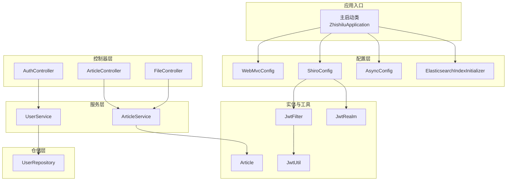
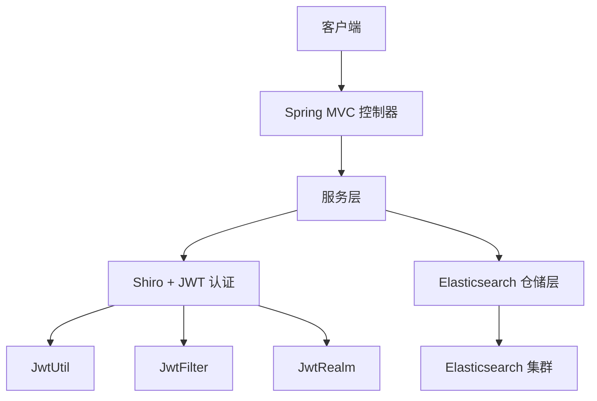
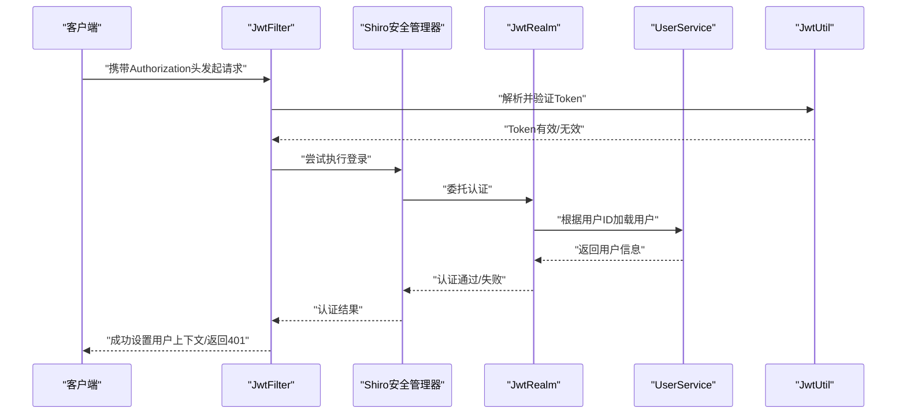
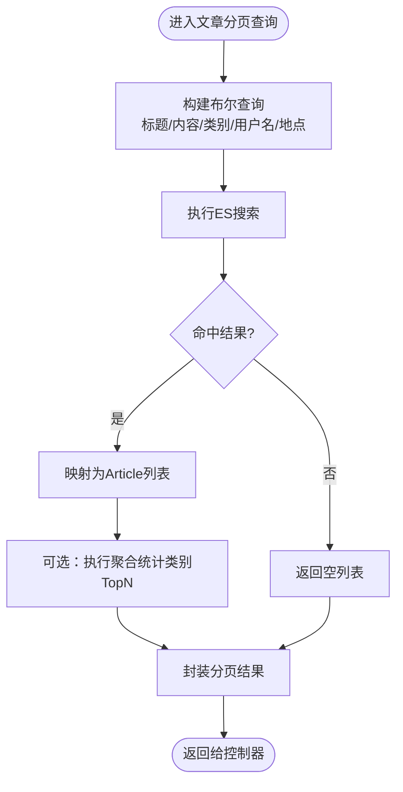
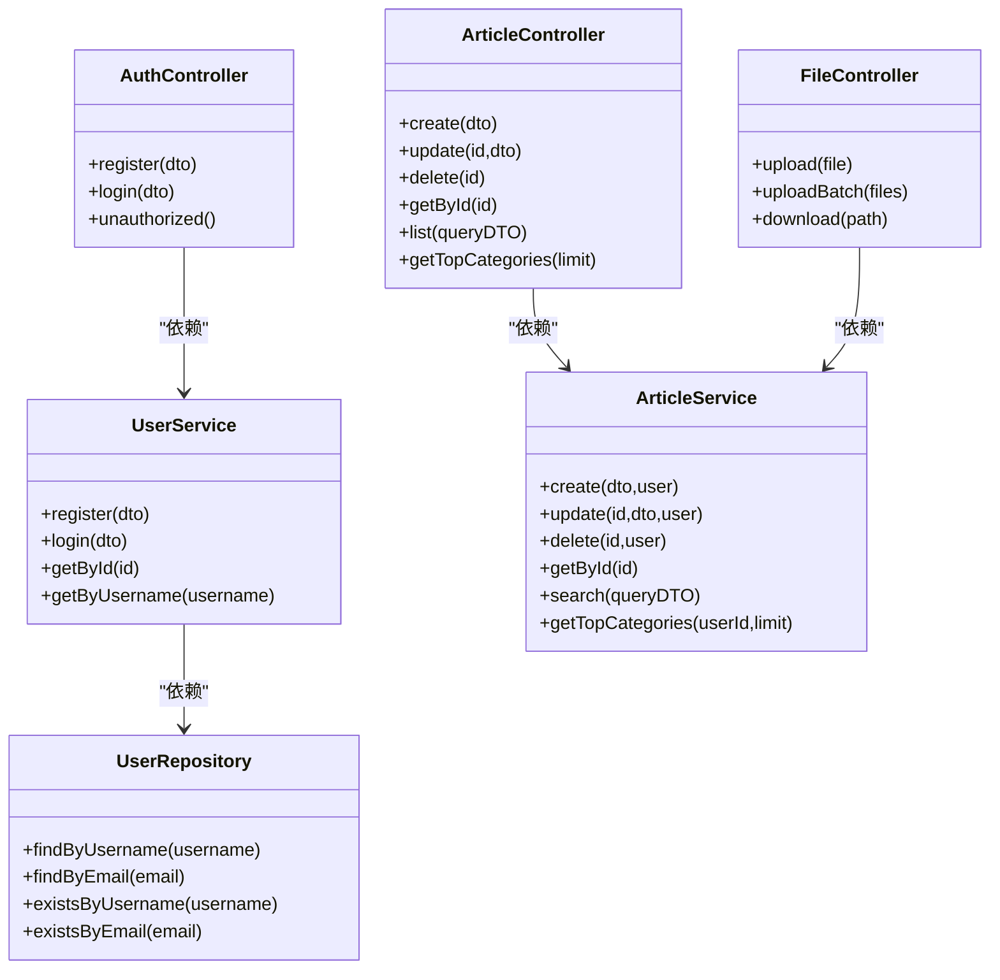
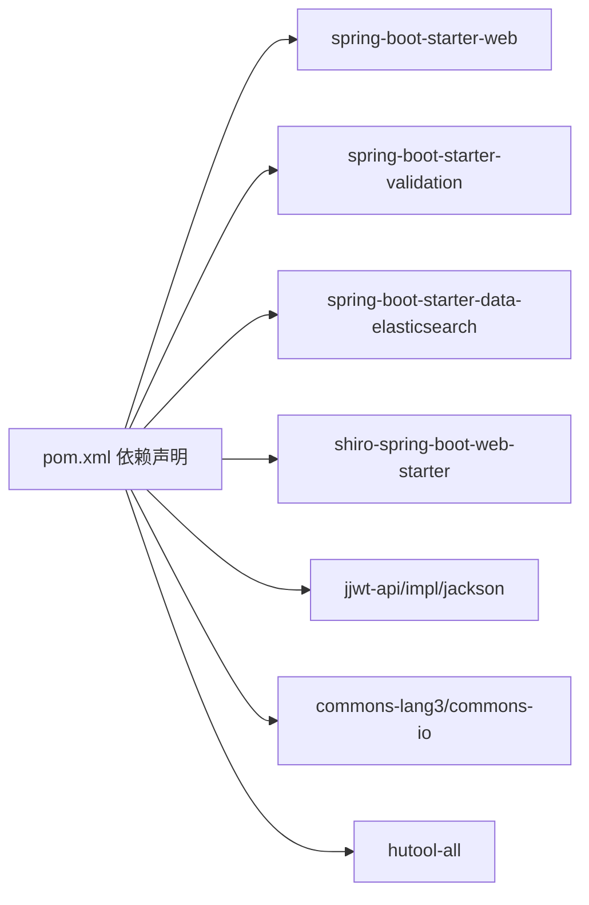

# 系统架构

<cite>
**本文引用的文件**
- [README.md](file://README.md)
- [pom.xml](file://pom.xml)
- [application.yml](file://src/main/resources/application.yml)
- [ZhishiluApplication.java](file://src/main/java/com/zhishilu/ZhishiluApplication.java)
- [WebMvcConfig.java](file://src/main/java/com/zhishilu/config/WebMvcConfig.java)
- [ShiroConfig.java](file://src/main/java/com/zhishilu/config/ShiroConfig.java)
- [AsyncConfig.java](file://src/main/java/com/zhishilu/config/AsyncConfig.java)
- [ElasticsearchIndexInitializer.java](file://src/main/java/com/zhishilu/config/ElasticsearchIndexInitializer.java)
- [AuthController.java](file://src/main/java/com/zhishilu/controller/AuthController.java)
- [ArticleController.java](file://src/main/java/com/zhishilu/controller/ArticleController.java)
- [FileController.java](file://src/main/java/com/zhishilu/controller/FileController.java)
- [UserService.java](file://src/main/java/com/zhishilu/service/UserService.java)
- [ArticleService.java](file://src/main/java/com/zhishilu/service/ArticleService.java)
- [JwtUtil.java](file://src/main/java/com/zhishilu/util/JwtUtil.java)
- [JwtFilter.java](file://src/main/java/com/zhishilu/shiro/JwtFilter.java)
- [JwtRealm.java](file://src/main/java/com/zhishilu/shiro/JwtRealm.java)
- [UserRepository.java](file://src/main/java/com/zhishilu/repository/UserRepository.java)
- [Article.java](file://src/main/java/com/zhishilu/entity/Article.java)
</cite>

## 目录
1. [引言](#引言)
2. [项目结构](#项目结构)
3. [核心组件](#核心组件)
4. [架构总览](#架构总览)
5. [详细组件分析](#详细组件分析)
6. [依赖分析](#依赖分析)
7. [性能考虑](#性能考虑)
8. [故障排查指南](#故障排查指南)
9. [结论](#结论)
10. [附录](#附录)

## 引言
本项目“知拾录”是一个个人知识收藏与管理系统，提供用户认证、内容创建与检索、文件上传下载、操作日志等能力。系统采用分层架构（Controller-Service-Repository），结合 Spring Boot、Elasticsearch、Apache Shiro 与 JWT，实现现代化的企业级应用设计。

## 项目结构
项目采用标准的 Spring Boot 多模块分层组织方式，按职责划分为：
- config：全局配置（Web、Shiro、异步、ES索引初始化）
- controller：REST 控制器层
- service：业务服务层
- repository：基于 Spring Data Elasticsearch 的仓储层
- entity/dto：数据模型与传输对象
- shiro：安全框架集成（JWT + Realm + 过滤器）
- util：工具类（JWT、用户上下文）
- exception/filter/interceptor：异常处理、过滤器、拦截器
- resources：配置文件 application.yml

图示来源
- [ZhishiluApplication.java](file://src/main/java/com/zhishilu/ZhishiluApplication.java#L10-L15)
- [WebMvcConfig.java](file://src/main/java/com/zhishilu/config/WebMvcConfig.java#L14-L51)
- [ShiroConfig.java](file://src/main/java/com/zhishilu/config/ShiroConfig.java#L20-L71)
- [AsyncConfig.java](file://src/main/java/com/zhishilu/config/AsyncConfig.java#L9-L12)
- [ElasticsearchIndexInitializer.java](file://src/main/java/com/zhishilu/config/ElasticsearchIndexInitializer.java#L16-L39)
- [AuthController.java](file://src/main/java/com/zhishilu/controller/AuthController.java#L17-L49)
- [ArticleController.java](file://src/main/java/com/zhishilu/controller/ArticleController.java#L22-L87)
- [FileController.java](file://src/main/java/com/zhishilu/controller/FileController.java#L23-L70)
- [UserService.java](file://src/main/java/com/zhishilu/service/UserService.java#L22-L127)
- [ArticleService.java](file://src/main/java/com/zhishilu/service/ArticleService.java#L34-L199)
- [UserRepository.java](file://src/main/java/com/zhishilu/repository/UserRepository.java#L12-L34)
- [Article.java](file://src/main/java/com/zhishilu/entity/Article.java#L13-L80)
- [JwtUtil.java](file://src/main/java/com/zhishilu/util/JwtUtil.java#L18-L98)
- [JwtFilter.java](file://src/main/java/com/zhishilu/shiro/JwtFilter.java#L27-L108)
- [JwtRealm.java](file://src/main/java/com/zhishilu/shiro/JwtRealm.java#L18-L70)

章节来源
- [README.md](file://README.md#L99-L133)
- [pom.xml](file://pom.xml#L21-L109)
- [application.yml](file://src/main/resources/application.yml#L1-L47)

## 核心组件
- 应用入口与配置
  - 主启动类负责应用引导与组件扫描
  - WebMvcConfig 提供跨域、拦截器与静态资源映射
  - ShiroConfig 配置安全管理器、过滤链与无状态 JWT 认证
  - AsyncConfig 启用异步执行能力
  - ElasticsearchIndexInitializer 在启动时创建并映射 ES 索引
- 控制器层
  - AuthController：注册、登录、未授权提示
  - ArticleController：文章增删改查、分页查询、类别推荐
  - FileController：单/批量上传、下载
- 服务层
  - UserService：用户注册、登录、密码加密、敏感信息清理
  - ArticleService：文章创建、更新、删除、全文检索、聚合统计
- 安全与认证
  - JwtUtil：Token 生成、解析、校验、载荷读取
  - JwtFilter：从请求头/参数提取 Token，统一认证失败响应
  - JwtRealm：基于 Token 的认证流程与用户状态校验
- 仓储与实体
  - UserRepository：基于 ES 的用户数据访问
  - Article：文章实体，定义字段类型与分词器，映射到 ES 索引

章节来源
- [ZhishiluApplication.java](file://src/main/java/com/zhishilu/ZhishiluApplication.java#L10-L15)
- [WebMvcConfig.java](file://src/main/java/com/zhishilu/config/WebMvcConfig.java#L14-L51)
- [ShiroConfig.java](file://src/main/java/com/zhishilu/config/ShiroConfig.java#L20-L71)
- [AsyncConfig.java](file://src/main/java/com/zhishilu/config/AsyncConfig.java#L9-L12)
- [ElasticsearchIndexInitializer.java](file://src/main/java/com/zhishilu/config/ElasticsearchIndexInitializer.java#L16-L39)
- [AuthController.java](file://src/main/java/com/zhishilu/controller/AuthController.java#L17-L49)
- [ArticleController.java](file://src/main/java/com/zhishilu/controller/ArticleController.java#L22-L87)
- [FileController.java](file://src/main/java/com/zhishilu/controller/FileController.java#L23-L70)
- [UserService.java](file://src/main/java/com/zhishilu/service/UserService.java#L22-L127)
- [ArticleService.java](file://src/main/java/com/zhishilu/service/ArticleService.java#L34-L199)
- [JwtUtil.java](file://src/main/java/com/zhishilu/util/JwtUtil.java#L18-L98)
- [JwtFilter.java](file://src/main/java/com/zhishilu/shiro/JwtFilter.java#L27-L108)
- [JwtRealm.java](file://src/main/java/com/zhishilu/shiro/JwtRealm.java#L18-L70)
- [UserRepository.java](file://src/main/java/com/zhishilu/repository/UserRepository.java#L12-L34)
- [Article.java](file://src/main/java/com/zhishilu/entity/Article.java#L13-L80)

## 架构总览
系统采用分层架构与清晰的职责分离：
- 表现层：Spring MVC 控制器接收请求，返回统一结果包装
- 领域层：服务层封装业务逻辑，执行权限校验与聚合统计
- 基础设施层：Elasticsearch 作为搜索引擎与持久化载体；Shiro + JWT 实现无状态认证与授权
- 配置与横切：跨域、拦截器、异步、ES 索引初始化

图示来源
- [WebMvcConfig.java](file://src/main/java/com/zhishilu/config/WebMvcConfig.java#L14-L51)
- [ShiroConfig.java](file://src/main/java/com/zhishilu/config/ShiroConfig.java#L20-L71)
- [JwtUtil.java](file://src/main/java/com/zhishilu/util/JwtUtil.java#L18-L98)
- [JwtFilter.java](file://src/main/java/com/zhishilu/shiro/JwtFilter.java#L27-L108)
- [JwtRealm.java](file://src/main/java/com/zhishilu/shiro/JwtRealm.java#L18-L70)
- [ArticleService.java](file://src/main/java/com/zhishilu/service/ArticleService.java#L34-L199)
- [UserRepository.java](file://src/main/java/com/zhishilu/repository/UserRepository.java#L12-L34)

## 详细组件分析

### 认证与授权流程（序列图）

图示来源
- [JwtFilter.java](file://src/main/java/com/zhishilu/shiro/JwtFilter.java#L39-L85)
- [JwtRealm.java](file://src/main/java/com/zhishilu/shiro/JwtRealm.java#L43-L69)
- [JwtUtil.java](file://src/main/java/com/zhishilu/util/JwtUtil.java#L47-L74)
- [UserService.java](file://src/main/java/com/zhishilu/service/UserService.java#L92-L103)

章节来源
- [ShiroConfig.java](file://src/main/java/com/zhishilu/config/ShiroConfig.java#L26-L69)
- [JwtFilter.java](file://src/main/java/com/zhishilu/shiro/JwtFilter.java#L27-L108)
- [JwtRealm.java](file://src/main/java/com/zhishilu/shiro/JwtRealm.java#L18-L70)
- [JwtUtil.java](file://src/main/java/com/zhishilu/util/JwtUtil.java#L18-L98)

### 文章检索与聚合（流程图）

图示来源
- [ArticleService.java](file://src/main/java/com/zhishilu/service/ArticleService.java#L116-L168)
- [ArticleService.java](file://src/main/java/com/zhishilu/service/ArticleService.java#L173-L198)

章节来源
- [ArticleService.java](file://src/main/java/com/zhishilu/service/ArticleService.java#L34-L199)
- [Article.java](file://src/main/java/com/zhishilu/entity/Article.java#L13-L80)

### 控制器-服务-仓储交互（类图）

图示来源
- [AuthController.java](file://src/main/java/com/zhishilu/controller/AuthController.java#L17-L49)
- [ArticleController.java](file://src/main/java/com/zhishilu/controller/ArticleController.java#L22-L87)
- [FileController.java](file://src/main/java/com/zhishilu/controller/FileController.java#L23-L70)
- [UserService.java](file://src/main/java/com/zhishilu/service/UserService.java#L22-L127)
- [ArticleService.java](file://src/main/java/com/zhishilu/service/ArticleService.java#L34-L199)
- [UserRepository.java](file://src/main/java/com/zhishilu/repository/UserRepository.java#L12-L34)

章节来源
- [AuthController.java](file://src/main/java/com/zhishilu/controller/AuthController.java#L17-L49)
- [ArticleController.java](file://src/main/java/com/zhishilu/controller/ArticleController.java#L22-L87)
- [FileController.java](file://src/main/java/com/zhishilu/controller/FileController.java#L23-L70)
- [UserService.java](file://src/main/java/com/zhishilu/service/UserService.java#L22-L127)
- [ArticleService.java](file://src/main/java/com/zhishilu/service/ArticleService.java#L34-L199)
- [UserRepository.java](file://src/main/java/com/zhishilu/repository/UserRepository.java#L12-L34)

### 安全架构设计
- 无状态认证：使用 JWT 实现无 Session 的认证，避免会话存储与扩展瓶颈
- 统一认证入口：JwtFilter 从请求头或参数提取 Token，并在认证失败时返回统一错误格式
- 用户上下文：认证成功后将用户信息写入线程上下文，供业务层使用
- 权限控制：当前实现以登录认证为主，授权信息为空，便于后续扩展细粒度权限

章节来源
- [ShiroConfig.java](file://src/main/java/com/zhishilu/config/ShiroConfig.java#L26-L69)
- [JwtFilter.java](file://src/main/java/com/zhishilu/shiro/JwtFilter.java#L69-L75)
- [JwtRealm.java](file://src/main/java/com/zhishilu/shiro/JwtRealm.java#L34-L69)
- [JwtUtil.java](file://src/main/java/com/zhishilu/util/JwtUtil.java#L18-L98)

### 异步处理机制
- 通过 @EnableAsync 开启异步执行，适用于耗时但非阻塞的任务（如日志写入、通知发送等），提升接口响应性能
- 建议将耗时操作（如文件处理、ES 批量写入）放入异步任务队列，避免阻塞主线程

章节来源
- [AsyncConfig.java](file://src/main/java/com/zhishilu/config/AsyncConfig.java#L9-L12)

### 配置管理策略
- 应用端口、上下文路径、文件上传大小限制、ES 连接参数、Shiro 与 JWT 参数、日志级别均集中于 application.yml
- 建议生产环境使用外部化配置（环境变量/配置中心），并区分开发/测试/生产环境 profile

章节来源
- [application.yml](file://src/main/resources/application.yml#L1-L47)

### 数据流向与集成模式
- 控制器接收请求，调用服务层；服务层通过仓储层与 Elasticsearch 交互；安全层在过滤器阶段完成认证
- 文件上传采用本地磁盘存储，ES 存储文件路径，降低 ES 负载并提高吞吐

章节来源
- [WebMvcConfig.java](file://src/main/java/com/zhishilu/config/WebMvcConfig.java#L46-L50)
- [FileController.java](file://src/main/java/com/zhishilu/controller/FileController.java#L33-L69)
- [ArticleService.java](file://src/main/java/com/zhishilu/service/ArticleService.java#L45-L59)

## 依赖分析
- 技术栈与版本
  - Java 17、Spring Boot 3.2.1、Spring MVC、Spring Data Elasticsearch
  - Apache Shiro 1.13.0 + JWT（jjwt）
  - Elasticsearch 8.x
- 依赖关系
  - 控制器依赖服务层；服务层依赖仓储与工具；安全组件贯穿请求链路
  - ES 索引初始化在应用启动时执行，确保实体映射可用

图示来源
- [pom.xml](file://pom.xml#L27-L109)

章节来源
- [pom.xml](file://pom.xml#L21-L109)

## 性能考虑
- 搜索性能
  - 使用 IK 分词器对标题与正文进行分词，提升中文检索效果
  - 通过布尔查询组合多条件检索，减少不必要的全表扫描
- 写入与聚合
  - 聚合统计使用 ES Terms Aggregation，避免二次扫描
  - 建议对高频查询字段建立合适映射与分片副本策略
- 并发与异步
  - 使用 @EnableAsync 将非关键路径异步化，降低延迟
  - 文件上传采用本地存储 + ES 路径索引，减轻 ES 压力
- 缓存与限流
  - 可引入 Redis 缓存热点用户信息与 Token 校验结果
  - 结合网关或过滤器实现限流与熔断，保障稳定性

## 故障排查指南
- 认证失败
  - 检查请求头 Authorization 是否包含正确的 Bearer 前缀
  - 核对 JWT 密钥与过期时间配置，确认 Token 未过期
- 权限不足
  - 确认文章更新/删除操作仅允许创建者执行
  - 检查用户状态是否被禁用
- 搜索无结果
  - 核对 ES 索引是否存在且映射正确
  - 检查查询条件与分词器是否匹配
- 文件下载失败
  - 确认上传目录与静态资源映射路径一致
  - 检查文件是否存在与可读权限

章节来源
- [JwtFilter.java](file://src/main/java/com/zhishilu/shiro/JwtFilter.java#L90-L97)
- [JwtUtil.java](file://src/main/java/com/zhishilu/util/JwtUtil.java#L67-L74)
- [ArticleService.java](file://src/main/java/com/zhishilu/service/ArticleService.java#L64-L103)
- [ElasticsearchIndexInitializer.java](file://src/main/java/com/zhishilu/config/ElasticsearchIndexInitializer.java#L23-L38)
- [WebMvcConfig.java](file://src/main/java/com/zhishilu/config/WebMvcConfig.java#L46-L50)

## 结论
本系统以 Spring Boot 为基础，结合 Shiro + JWT 实现无状态认证，以 Elasticsearch 为核心实现内容检索与日志存储，采用分层架构与清晰的职责划分，具备良好的可扩展性与可维护性。建议在生产环境中完善配置中心、缓存与限流、监控与告警体系，并持续优化 ES 索引与查询策略以满足更高性能需求。

## 附录
- API 接口概览
  - 认证：注册、登录、未授权提示
  - 文章：创建、更新、删除、详情、分页列表、类别推荐
  - 文件：单/批量上传、下载
- 环境要求与运行
  - JDK 17+、Maven 3.6+、Elasticsearch 8.x
  - 修改 application.yml 中 ES 连接参数后启动应用

章节来源
- [README.md](file://README.md#L49-L98)
- [application.yml](file://src/main/resources/application.yml#L13-L18)