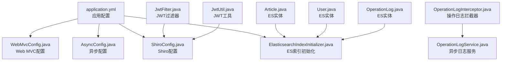
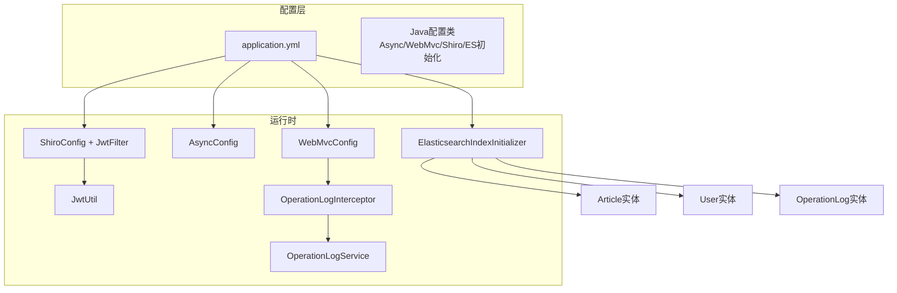
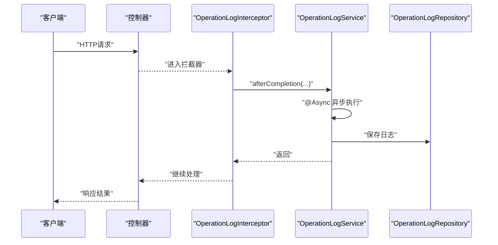
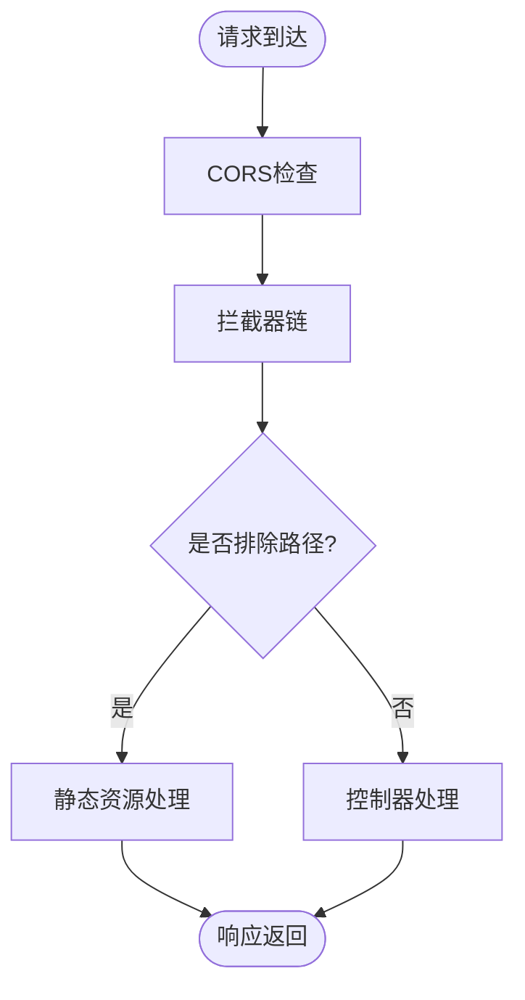
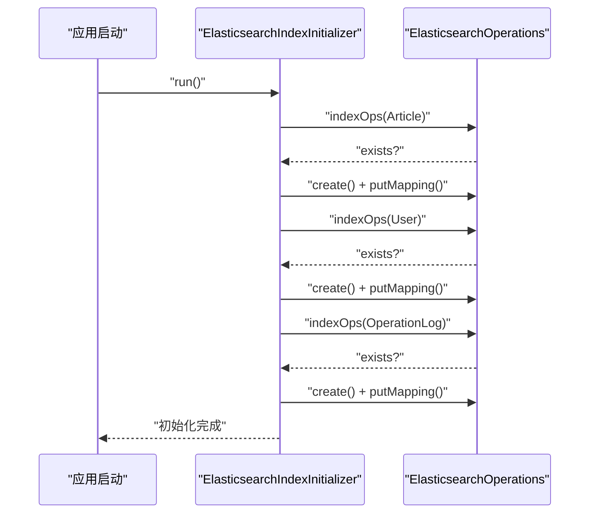
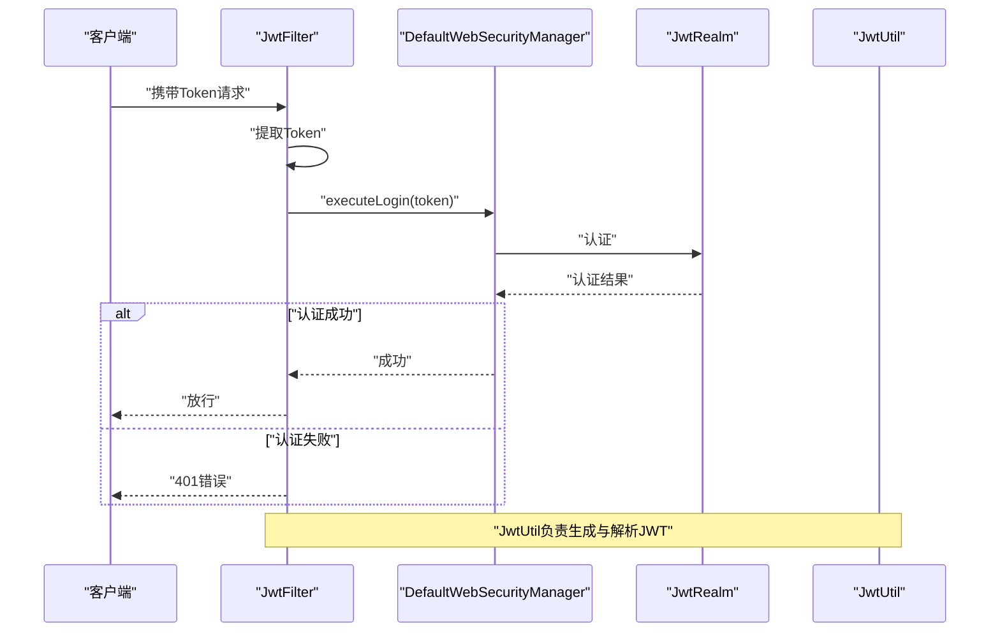
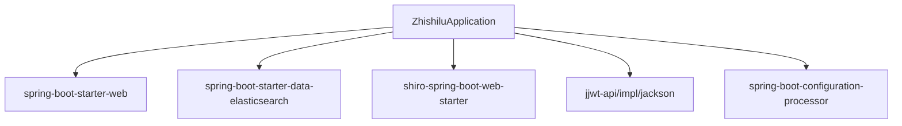

# 配置管理策略

<cite>
**本文引用的文件**
- [application.yml](file://src/main/resources/application.yml)
- [AsyncConfig.java](file://src/main/java/com/zhishilu/config/AsyncConfig.java)
- [WebMvcConfig.java](file://src/main/java/com/zhishilu/config/WebMvcConfig.java)
- [ElasticsearchIndexInitializer.java](file://src/main/java/com/zhishilu/config/ElasticsearchIndexInitializer.java)
- [ShiroConfig.java](file://src/main/java/com/zhishilu/config/ShiroConfig.java)
- [JwtFilter.java](file://src/main/java/com/zhishilu/shiro/JwtFilter.java)
- [JwtUtil.java](file://src/main/java/com/zhishilu/util/JwtUtil.java)
- [OperationLogInterceptor.java](file://src/main/java/com/zhishilu/interceptor/OperationLogInterceptor.java)
- [OperationLogService.java](file://src/main/java/com/zhishilu/service/OperationLogService.java)
- [Article.java](file://src/main/java/com/zhishilu/entity/Article.java)
- [User.java](file://src/main/java/com/zhishilu/entity/User.java)
- [OperationLog.java](file://src/main/java/com/zhishilu/entity/OperationLog.java)
- [pom.xml](file://pom.xml)
- [ZhishiluApplication.java](file://src/main/java/com/zhishilu/ZhishiluApplication.java)
</cite>

## 目录
1. [简介](#简介)
2. [项目结构](#项目结构)
3. [核心组件](#核心组件)
4. [架构总览](#架构总览)
5. [详细组件分析](#详细组件分析)
6. [依赖关系分析](#依赖关系分析)
7. [性能考量](#性能考量)
8. [故障排查指南](#故障排查指南)
9. [结论](#结论)
10. [附录](#附录)

## 简介
本文件面向“知拾录”系统的配置管理策略，系统基于 Spring Boot 3.2.1 构建，采用 YAML 配置文件与 Java 配置类相结合的方式进行配置管理。本文重点阐述以下方面：
- application.yml 的配置项说明、环境变量覆盖机制与配置文件优先级
- 异步配置、Web MVC 配置与 Elasticsearch 连接配置的具体实现
- 配置分类管理、敏感信息保护与配置热更新机制
- 配置模板、最佳实践与常见问题解决方案
- 配置验证方法与配置变更影响评估

## 项目结构
项目采用标准的 Spring Boot 结构，配置相关的核心位置如下：
- application.yml：应用主配置文件，包含服务器、文件上传、Elasticsearch、Shiro、JWT、日志等配置
- config 包：Java 配置类，负责异步、Web MVC、Shiro、ES 索引初始化等
- shiro/util：与安全与认证相关的配置与工具类
- entity：与 Elasticsearch 索引映射相关的实体类
- service/interceptor：与异步日志记录相关的服务与拦截器
- pom.xml：依赖声明，包含 Elasticsearch、Shiro、JWT 等

图表来源
- [application.yml](file://src/main/resources/application.yml#L1-L47)
- [WebMvcConfig.java](file://src/main/java/com/zhishilu/config/WebMvcConfig.java#L1-L52)
- [AsyncConfig.java](file://src/main/java/com/zhishilu/config/AsyncConfig.java#L1-L13)
- [ShiroConfig.java](file://src/main/java/com/zhishilu/config/ShiroConfig.java#L1-L72)
- [ElasticsearchIndexInitializer.java](file://src/main/java/com/zhishilu/config/ElasticsearchIndexInitializer.java#L1-L40)
- [JwtFilter.java](file://src/main/java/com/zhishilu/shiro/JwtFilter.java#L1-L109)
- [JwtUtil.java](file://src/main/java/com/zhishilu/util/JwtUtil.java#L1-L99)
- [OperationLogInterceptor.java](file://src/main/java/com/zhishilu/interceptor/OperationLogInterceptor.java#L1-L128)
- [OperationLogService.java](file://src/main/java/com/zhishilu/service/OperationLogService.java#L1-L49)
- [Article.java](file://src/main/java/com/zhishilu/entity/Article.java#L1-L80)
- [User.java](file://src/main/java/com/zhishilu/entity/User.java#L1-L67)
- [OperationLog.java](file://src/main/java/com/zhishilu/entity/OperationLog.java#L1-L73)

章节来源
- [application.yml](file://src/main/resources/application.yml#L1-L47)
- [pom.xml](file://pom.xml#L1-L129)

## 核心组件
本节对关键配置组件进行深入解析，涵盖配置项含义、实现方式与注意事项。

- 服务器与静态资源
  - server.port、server.servlet.context-path：控制服务端口与上下文路径
  - spring.servlet.multipart.*：限制上传文件大小，避免内存溢出
  - WebMvcConfig.addResourceHandlers：将 /uploads/** 映射到本地文件系统目录，便于静态资源访问

- Elasticsearch 连接与索引
  - spring.elasticsearch.uris、username、password：连接 ES 集群的凭据
  - spring.elasticsearch.connection-timeout、spring.elasticsearch.socket-timeout：连接与读写超时
  - ElasticsearchIndexInitializer：启动时为 Article、User、OperationLog 实体创建索引并设置映射

- 安全与认证
  - shiro.loginUrl、successUrl、unauthorizedUrl：Shiro 认证相关 URL
  - jwt.secret、expiration、header、prefix：JWT 密钥、过期时间与头部前缀
  - JwtFilter：从请求头或参数提取 Token，执行认证与异常处理
  - JwtUtil：生成与解析 JWT，校验有效性

- 异步与日志
  - AsyncConfig：启用异步执行
  - OperationLogInterceptor：在请求完成后收集参数、IP、耗时等信息
  - OperationLogService.saveLog：使用 @Async 异步持久化日志

- 日志级别与格式
  - logging.level.*：根日志级别与包级别日志级别
  - logging.pattern.console：控制台日志输出格式

章节来源
- [application.yml](file://src/main/resources/application.yml#L1-L47)
- [WebMvcConfig.java](file://src/main/java/com/zhishilu/config/WebMvcConfig.java#L1-L52)
- [ElasticsearchIndexInitializer.java](file://src/main/java/com/zhishilu/config/ElasticsearchIndexInitializer.java#L1-L40)
- [ShiroConfig.java](file://src/main/java/com/zhishilu/config/ShiroConfig.java#L1-L72)
- [JwtFilter.java](file://src/main/java/com/zhishilu/shiro/JwtFilter.java#L1-L109)
- [JwtUtil.java](file://src/main/java/com/zhishilu/util/JwtUtil.java#L1-L99)
- [OperationLogInterceptor.java](file://src/main/java/com/zhishilu/interceptor/OperationLogInterceptor.java#L1-L128)
- [OperationLogService.java](file://src/main/java/com/zhishilu/service/OperationLogService.java#L1-L49)

## 架构总览
下图展示配置在系统中的作用与交互关系：

图表来源
- [application.yml](file://src/main/resources/application.yml#L1-L47)
- [WebMvcConfig.java](file://src/main/java/com/zhishilu/config/WebMvcConfig.java#L1-L52)
- [AsyncConfig.java](file://src/main/java/com/zhishilu/config/AsyncConfig.java#L1-L13)
- [ShiroConfig.java](file://src/main/java/com/zhishilu/config/ShiroConfig.java#L1-L72)
- [JwtFilter.java](file://src/main/java/com/zhishilu/shiro/JwtFilter.java#L1-L109)
- [JwtUtil.java](file://src/main/java/com/zhishilu/util/JwtUtil.java#L1-L99)
- [OperationLogInterceptor.java](file://src/main/java/com/zhishilu/interceptor/OperationLogInterceptor.java#L1-L128)
- [OperationLogService.java](file://src/main/java/com/zhishilu/service/OperationLogService.java#L1-L49)
- [ElasticsearchIndexInitializer.java](file://src/main/java/com/zhishilu/config/ElasticsearchIndexInitializer.java#L1-L40)
- [Article.java](file://src/main/java/com/zhishilu/entity/Article.java#L1-L80)
- [User.java](file://src/main/java/com/zhishilu/entity/User.java#L1-L67)
- [OperationLog.java](file://src/main/java/com/zhishilu/entity/OperationLog.java#L1-L73)

## 详细组件分析

### 异步配置
- 启用方式：通过 @EnableAsync 在 AsyncConfig 中开启异步支持
- 使用场景：OperationLogService.saveLog 使用 @Async 异步保存日志，避免阻塞主线程
- 注意事项：确保线程池配置满足业务并发；异步方法内部异常不会影响调用方线程

图表来源
- [OperationLogInterceptor.java](file://src/main/java/com/zhishilu/interceptor/OperationLogInterceptor.java#L38-L64)
- [OperationLogService.java](file://src/main/java/com/zhishilu/service/OperationLogService.java#L26-L47)

章节来源
- [AsyncConfig.java](file://src/main/java/com/zhishilu/config/AsyncConfig.java#L1-L13)
- [OperationLogService.java](file://src/main/java/com/zhishilu/service/OperationLogService.java#L1-L49)

### Web MVC 配置
- CORS：允许任意来源、方法与头部，并支持凭据
- 拦截器：注册 OperationLogInterceptor，排除错误页与 Swagger 接口
- 静态资源：将 /uploads/** 映射到本地文件系统，便于图片等资源访问

图表来源
- [WebMvcConfig.java](file://src/main/java/com/zhishilu/config/WebMvcConfig.java#L23-L50)
- [OperationLogInterceptor.java](file://src/main/java/com/zhishilu/interceptor/OperationLogInterceptor.java#L36-L41)

章节来源
- [WebMvcConfig.java](file://src/main/java/com/zhishilu/config/WebMvcConfig.java#L1-L52)

### Elasticsearch 连接与索引初始化
- 连接配置：spring.elasticsearch.uris、username、password、连接与套接字超时
- 索引初始化：启动时为 Article、User、OperationLog 创建索引并设置映射
- 实体注解：@Document、@Setting、@Field 等用于定义索引名称、分片副本与字段类型

图表来源
- [ElasticsearchIndexInitializer.java](file://src/main/java/com/zhishilu/config/ElasticsearchIndexInitializer.java#L23-L38)
- [Article.java](file://src/main/java/com/zhishilu/entity/Article.java#L13-L15)
- [User.java](file://src/main/java/com/zhishilu/entity/User.java#L12-L14)
- [OperationLog.java](file://src/main/java/com/zhishilu/entity/OperationLog.java#L12-L14)

章节来源
- [application.yml](file://src/main/resources/application.yml#L13-L18)
- [ElasticsearchIndexInitializer.java](file://src/main/java/com/zhishilu/config/ElasticsearchIndexInitializer.java#L1-L40)
- [Article.java](file://src/main/java/com/zhishilu/entity/Article.java#L1-L80)
- [User.java](file://src/main/java/com/zhishilu/entity/User.java#L1-L67)
- [OperationLog.java](file://src/main/java/com/zhishilu/entity/OperationLog.java#L1-L73)

### 安全与认证配置
- ShiroConfig：配置 DefaultWebSecurityManager，关闭 Session，注册自定义 JwtFilter，设置过滤链
- JwtFilter：从请求头或参数提取 Token，处理 OPTIONS 预检请求，认证失败返回统一错误
- JwtUtil：基于 @Value 注入 jwt.secret 与 jwt.expiration，生成与解析 JWT

图表来源
- [ShiroConfig.java](file://src/main/java/com/zhishilu/config/ShiroConfig.java#L26-L69)
- [JwtFilter.java](file://src/main/java/com/zhishilu/shiro/JwtFilter.java#L39-L85)
- [JwtUtil.java](file://src/main/java/com/zhishilu/util/JwtUtil.java#L22-L43)

章节来源
- [application.yml](file://src/main/resources/application.yml#L20-L31)
- [ShiroConfig.java](file://src/main/java/com/zhishilu/config/ShiroConfig.java#L1-L72)
- [JwtFilter.java](file://src/main/java/com/zhishilu/shiro/JwtFilter.java#L1-L109)
- [JwtUtil.java](file://src/main/java/com/zhishilu/util/JwtUtil.java#L1-L99)

### 配置分类管理
- 服务器与上传：server、spring.servlet.multipart.*
- 安全与认证：shiro、jwt
- 存储与搜索引擎：spring.elasticsearch.*
- 日志：logging.level、logging.pattern
- 静态资源：WebMvcConfig.addResourceHandlers

章节来源
- [application.yml](file://src/main/resources/application.yml#L1-L47)
- [WebMvcConfig.java](file://src/main/java/com/zhishilu/config/WebMvcConfig.java#L46-L50)

### 敏感信息保护
- JWT 密钥与凭据：通过 @Value 注入，建议使用环境变量或外部配置中心覆盖
- 密码字段：User.password 标记为不可索引，降低泄露风险
- 日志脱敏：拦截器对请求体做长度限制与截断，避免敏感信息落库

章节来源
- [application.yml](file://src/main/resources/application.yml#L26-L31)
- [JwtFilter.java](file://src/main/java/com/zhishilu/shiro/JwtFilter.java#L31-L35)
- [JwtUtil.java](file://src/main/java/com/zhishilu/util/JwtUtil.java#L22-L26)
- [User.java](file://src/main/java/com/zhishilu/entity/User.java#L28-L30)
- [OperationLogInterceptor.java](file://src/main/java/com/zhishilu/interceptor/OperationLogInterceptor.java#L86-L91)

### 配置热更新机制
- Spring Boot 默认不支持运行时热更新配置，可通过 Actuator 或外部配置中心（如 Nacos、Consul）实现
- 对于非敏感配置（如日志级别），可结合日志框架动态调整
- 对于连接参数（如 Elasticsearch 凭据），建议重启以确保一致性

章节来源
- [application.yml](file://src/main/resources/application.yml#L13-L18)
- [pom.xml](file://pom.xml#L97-L102)

## 依赖关系分析
- 应用启动入口：ZhishiluApplication
- 依赖声明：spring-boot-starter-web、spring-boot-starter-data-elasticsearch、shiro-spring-boot-web-starter、jjwt 等
- 配置处理器：spring-boot-configuration-processor 提升配置元数据体验

图表来源
- [ZhishiluApplication.java](file://src/main/java/com/zhishilu/ZhishiluApplication.java#L10-L15)
- [pom.xml](file://pom.xml#L27-L110)

章节来源
- [pom.xml](file://pom.xml#L1-L129)
- [ZhishiluApplication.java](file://src/main/java/com/zhishilu/ZhishiluApplication.java#L1-L16)

## 性能考量
- 异步日志：通过 @Async 将日志持久化与请求处理解耦，降低延迟
- 文件上传限制：合理设置最大文件与请求大小，防止内存压力
- Elasticsearch 超时：根据网络与集群性能调整连接与套接字超时
- CORS 放宽：生产环境建议缩小允许来源与方法范围，减少跨域风险

章节来源
- [OperationLogService.java](file://src/main/java/com/zhishilu/service/OperationLogService.java#L26-L47)
- [application.yml](file://src/main/resources/application.yml#L10-L12)
- [application.yml](file://src/main/resources/application.yml#L17-L18)
- [WebMvcConfig.java](file://src/main/java/com/zhishilu/config/WebMvcConfig.java#L24-L30)

## 故障排查指南
- Elasticsearch 连接失败
  - 检查 spring.elasticsearch.uris、username、password 是否正确
  - 查看连接与套接字超时配置是否合理
  - 确认 ES 集群可达且索引初始化成功

- JWT 认证失败
  - 检查 jwt.header 与 jwt.prefix 是否与前端一致
  - 确认 jwt.secret 与 jwt.expiration 配置正确
  - 观察 JwtFilter 的错误响应与日志

- 静态资源无法访问
  - 确认 WebMvcConfig.addResourceHandlers 已生效
  - 检查 uploads 目录是否存在且权限正确

- 日志未落库
  - 确认 OperationLogService.saveLog 已被异步执行
  - 检查日志级别与数据库连接

章节来源
- [application.yml](file://src/main/resources/application.yml#L13-L31)
- [JwtFilter.java](file://src/main/java/com/zhishilu/shiro/JwtFilter.java#L31-L35)
- [WebMvcConfig.java](file://src/main/java/com/zhishilu/config/WebMvcConfig.java#L46-L50)
- [OperationLogService.java](file://src/main/java/com/zhishilu/service/OperationLogService.java#L26-L47)

## 结论
本项目的配置体系以 application.yml 为主，辅以 Java 配置类实现细粒度控制。通过合理的异步、安全与存储配置，系统在可用性与安全性之间取得平衡。建议在生产环境中引入外部配置中心与完善的监控告警，进一步提升配置治理能力与可观测性。

## 附录

### 配置模板（示例）
- 服务器与上传
  - server.port、server.servlet.context-path、spring.servlet.multipart.max-file-size、spring.servlet.multipart.max-request-size
- Elasticsearch
  - spring.elasticsearch.uris、username、password、connection-timeout、socket-timeout
- 安全与认证
  - shiro.loginUrl、successUrl、unauthorizedUrl、jwt.secret、jwt.expiration、jwt.header、jwt.prefix
- 日志
  - logging.level.root、logging.level.com.zhishilu、logging.pattern.console

章节来源
- [application.yml](file://src/main/resources/application.yml#L1-L47)

### 最佳实践
- 使用环境变量或配置中心覆盖敏感配置
- 生产环境收紧 CORS 策略
- 合理设置文件上传大小与超时时间
- 对日志与请求体进行脱敏处理
- 为 ES 索引设置合适的分片与副本数

### 常见配置问题与解决
- CORS 无效：确认 WebMvcConfig 已注册且未被其他配置覆盖
- ES 索引未创建：检查 ElasticsearchIndexInitializer 是否执行以及实体注解是否正确
- JWT 401：核对前端请求头与后端配置的一致性

### 配置验证方法
- 启动日志：观察 ES 索引初始化完成日志
- 接口测试：验证静态资源访问、JWT 认证与日志记录功能
- 监控指标：结合日志与性能指标评估配置效果

### 配置变更影响评估
- 服务器与上传：影响请求处理与文件上传稳定性
- 安全与认证：影响用户登录与接口访问行为
- 存储与搜索引擎：影响数据检索与持久化性能
- 日志：影响可观测性与磁盘占用