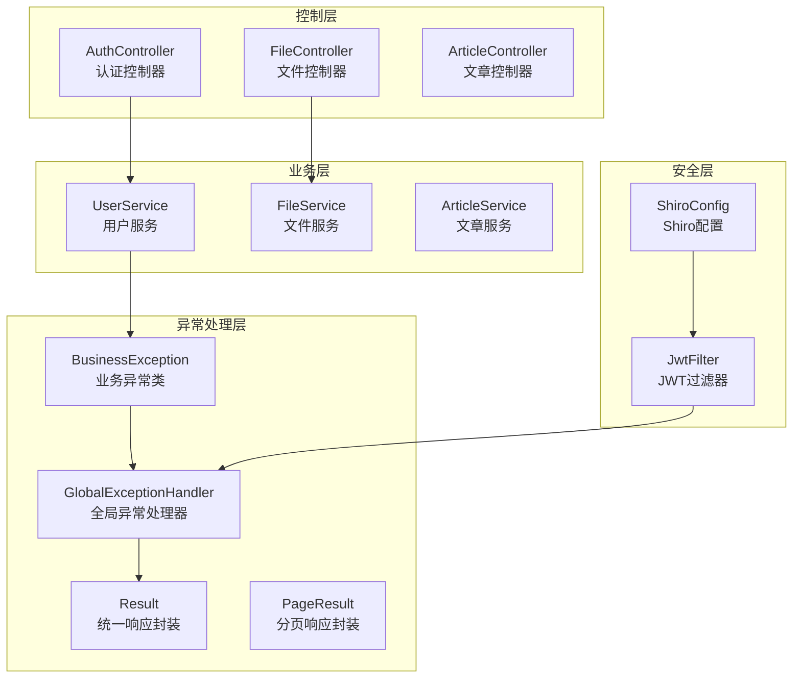
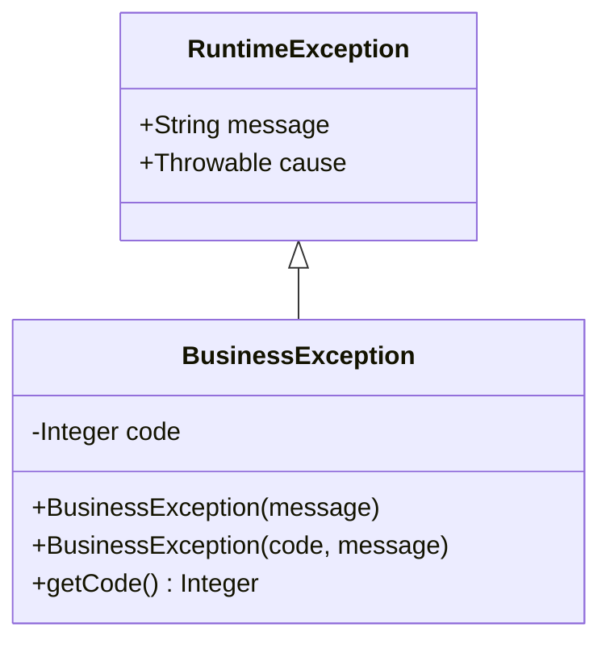
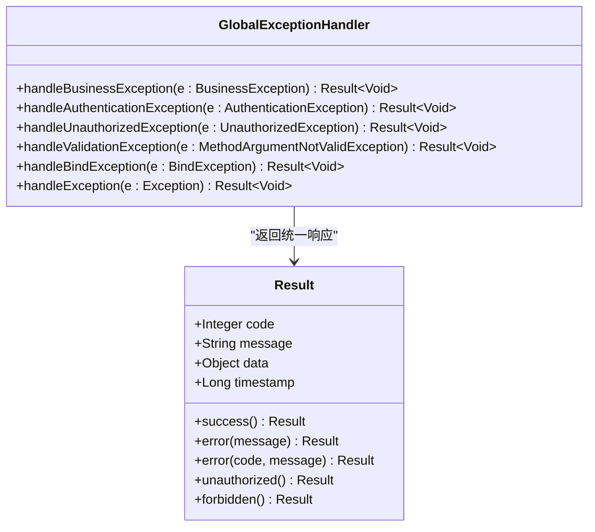
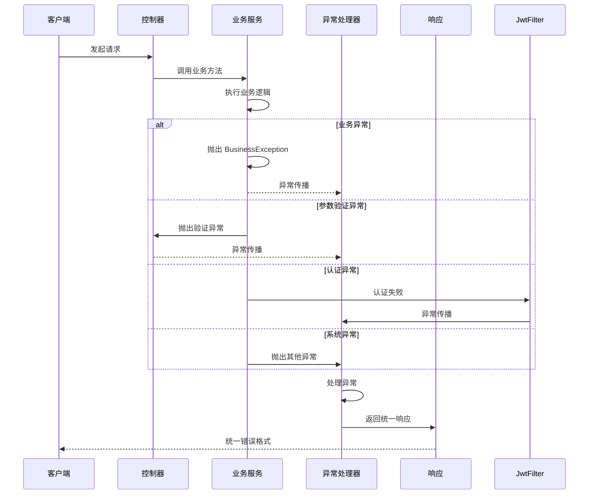
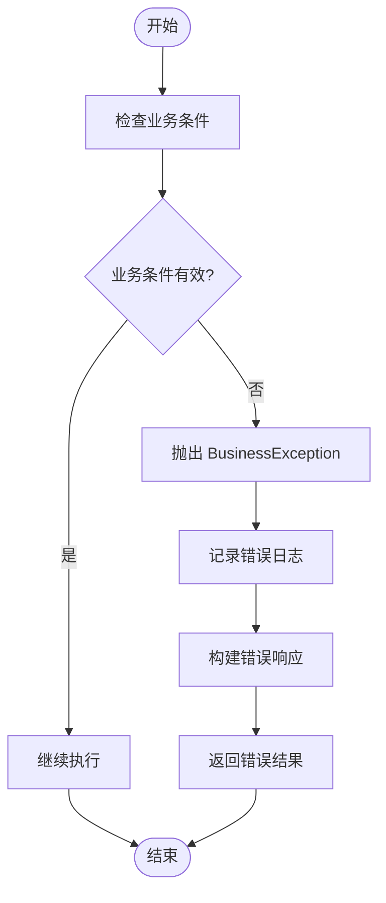
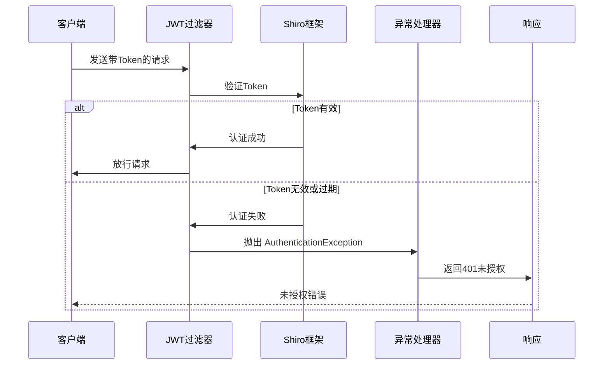
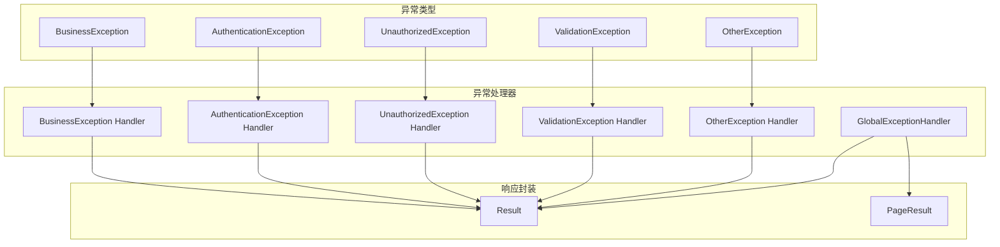

# 异常处理机制

<cite>
**本文档引用的文件**
- [BusinessException.java](file://src/main/java/com/zhishilu/exception/BusinessException.java)
- [GlobalExceptionHandler.java](file://src/main/java/com/zhishilu/exception/GlobalExceptionHandler.java)
- [Result.java](file://src/main/java/com/zhishilu/common/Result.java)
- [PageResult.java](file://src/main/java/com/zhishilu/common/PageResult.java)
- [UserService.java](file://src/main/java/com/zhishilu/service/UserService.java)
- [JwtFilter.java](file://src/main/java/com/zhishilu/shiro/JwtFilter.java)
- [ShiroConfig.java](file://src/main/java/com/zhishilu/config/ShiroConfig.java)
- [AuthController.java](file://src/main/java/com/zhishilu/controller/AuthController.java)
- [FileController.java](file://src/main/java/com/zhishilu/controller/FileController.java)
- [LoginDTO.java](file://src/main/java/com/zhishilu/dto/LoginDTO.java)
- [RegisterDTO.java](file://src/main/java/com/zhishilu/dto/RegisterDTO.java)
- [application.yml](file://src/main/resources/application.yml)
</cite>

## 目录
1. [简介](#简介)
2. [项目结构](#项目结构)
3. [核心组件](#核心组件)
4. [架构概览](#架构概览)
5. [详细组件分析](#详细组件分析)
6. [依赖关系分析](#依赖关系分析)
7. [性能考量](#性能考量)
8. [故障排除指南](#故障排除指南)
9. [结论](#结论)

## 简介

本项目实现了统一的异常处理机制，通过自定义业务异常类和全局异常处理器，为整个应用程序提供了标准化的错误处理方案。该机制涵盖了业务异常、参数验证异常、认证异常、授权异常和系统异常的统一处理，确保了用户友好的错误提示和开发者的调试便利。

## 项目结构

异常处理机制在项目中的组织结构如下：

**图表来源**
- [BusinessException.java](file://src/main/java/com/zhishilu/exception/BusinessException.java#L1-L23)
- [GlobalExceptionHandler.java](file://src/main/java/com/zhishilu/exception/GlobalExceptionHandler.java#L1-L87)
- [Result.java](file://src/main/java/com/zhishilu/common/Result.java#L1-L71)

**章节来源**
- [BusinessException.java](file://src/main/java/com/zhishilu/exception/BusinessException.java#L1-L23)
- [GlobalExceptionHandler.java](file://src/main/java/com/zhishilu/exception/GlobalExceptionHandler.java#L1-L87)
- [Result.java](file://src/main/java/com/zhishilu/common/Result.java#L1-L71)

## 核心组件

### BusinessException 业务异常类

BusinessException 是项目自定义的业务异常基类，继承自 RuntimeException，提供了灵活的异常码和消息处理能力。

**图表来源**
- [BusinessException.java](file://src/main/java/com/zhishilu/exception/BusinessException.java#L8-L22)

**章节来源**
- [BusinessException.java](file://src/main/java/com/zhishilu/exception/BusinessException.java#L8-L22)

### GlobalExceptionHandler 全局异常处理器

GlobalExceptionHandler 使用 Spring MVC 的 @RestControllerAdvice 注解，提供了统一的异常处理机制，覆盖了多种异常类型：

**图表来源**
- [GlobalExceptionHandler.java](file://src/main/java/com/zhishilu/exception/GlobalExceptionHandler.java#L20-L86)
- [Result.java](file://src/main/java/com/zhishilu/common/Result.java#L8-L70)

**章节来源**
- [GlobalExceptionHandler.java](file://src/main/java/com/zhishilu/exception/GlobalExceptionHandler.java#L20-L86)
- [Result.java](file://src/main/java/com/zhishilu/common/Result.java#L8-L70)

### Result 统一响应封装

Result 类提供了统一的响应格式，确保所有 API 调用都返回一致的数据结构：

**章节来源**
- [Result.java](file://src/main/java/com/zhishilu/common/Result.java#L8-L70)

## 架构概览

异常处理机制的整体架构如下：

**图表来源**
- [GlobalExceptionHandler.java](file://src/main/java/com/zhishilu/exception/GlobalExceptionHandler.java#L27-L85)
- [JwtFilter.java](file://src/main/java/com/zhishilu/shiro/JwtFilter.java#L78-L85)

## 详细组件分析

### 业务异常处理流程

业务异常是项目中最常用的异常类型，主要用于处理业务逻辑中的错误情况：

**图表来源**
- [UserService.java](file://src/main/java/com/zhishilu/service/UserService.java#L35-L73)
- [BusinessException.java](file://src/main/java/com/zhishilu/exception/BusinessException.java#L13-L21)

**章节来源**
- [UserService.java](file://src/main/java/com/zhishilu/service/UserService.java#L35-L73)

### 参数验证异常处理

Spring Validation 提供了强大的参数验证功能，结合全局异常处理器实现统一的验证错误处理：

**章节来源**
- [LoginDTO.java](file://src/main/java/com/zhishilu/dto/LoginDTO.java#L10-L17)
- [RegisterDTO.java](file://src/main/java/com/zhishilu/dto/RegisterDTO.java#L12-L27)

### 认证和授权异常处理

基于 Apache Shiro 的认证和授权机制，提供了完善的异常处理方案：

**图表来源**
- [JwtFilter.java](file://src/main/java/com/zhishilu/shiro/JwtFilter.java#L58-L85)
- [GlobalExceptionHandler.java](file://src/main/java/com/zhishilu/exception/GlobalExceptionHandler.java#L36-L41)

**章节来源**
- [JwtFilter.java](file://src/main/java/com/zhishilu/shiro/JwtFilter.java#L58-L85)
- [ShiroConfig.java](file://src/main/java/com/zhishilu/config/ShiroConfig.java#L44-L69)

### 全局异常处理器实现

全局异常处理器根据不同类型的异常采用不同的处理策略：

**章节来源**
- [GlobalExceptionHandler.java](file://src/main/java/com/zhishilu/exception/GlobalExceptionHandler.java#L27-L85)

## 依赖关系分析

异常处理机制的依赖关系如下：

**图表来源**
- [GlobalExceptionHandler.java](file://src/main/java/com/zhishilu/exception/GlobalExceptionHandler.java#L27-L85)
- [Result.java](file://src/main/java/com/zhishilu/common/Result.java#L8-L70)

**章节来源**
- [GlobalExceptionHandler.java](file://src/main/java/com/zhishilu/exception/GlobalExceptionHandler.java#L27-L85)
- [Result.java](file://src/main/java/com/zhishilu/common/Result.java#L8-L70)

## 性能考量

异常处理机制在性能方面的考虑：

1. **日志记录优化**：使用 SLF4J 进行异步日志记录，避免阻塞主线程
2. **异常栈追踪**：仅在必要时记录完整的异常栈信息，减少日志体积
3. **响应格式化**：统一的 JSON 响应格式，减少序列化开销
4. **缓存策略**：对于频繁出现的业务异常，可以考虑缓存错误消息

## 故障排除指南

### 常见问题及解决方案

1. **业务异常未被捕获**
   - 检查是否正确抛出了 BusinessException
   - 确认异常处理类的包扫描范围

2. **参数验证异常未显示具体字段**
   - 确保 DTO 字段上添加了正确的验证注解
   - 检查控制器方法上的 @Valid 注解

3. **认证异常处理失效**
   - 验证 JWT 过滤器的配置
   - 检查 Shiro 过滤链的配置

4. **响应格式不符合预期**
   - 确认 Result 类的使用方式
   - 检查全局异常处理器的返回值

**章节来源**
- [GlobalExceptionHandler.java](file://src/main/java/com/zhishilu/exception/GlobalExceptionHandler.java#L27-L85)
- [Result.java](file://src/main/java/com/zhishilu/common/Result.java#L43-L69)

## 结论

本项目的异常处理机制通过以下特点实现了统一和标准化：

1. **层次化设计**：业务异常、系统异常、参数验证异常等不同类型有明确的处理策略
2. **统一响应格式**：所有异常最终都转换为统一的 Result 格式
3. **安全考虑**：敏感信息在异常处理中得到适当保护
4. **可扩展性**：新的异常类型可以轻松添加到现有的处理框架中

该机制为开发者提供了清晰的异常处理标准，既保证了用户体验的一致性，又便于系统的维护和扩展。