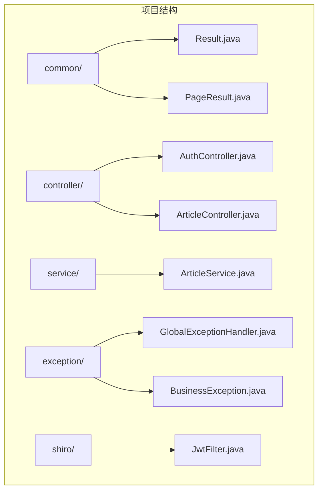
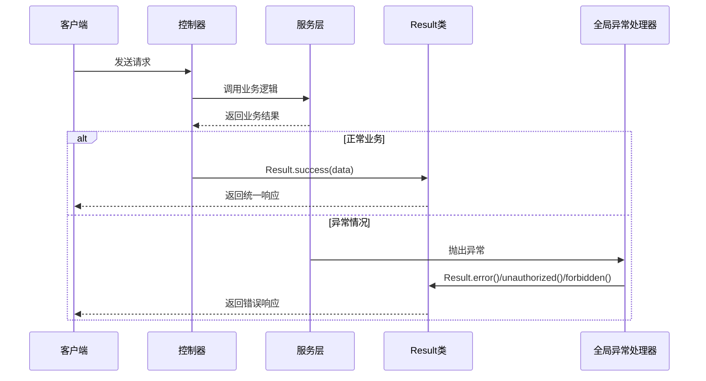
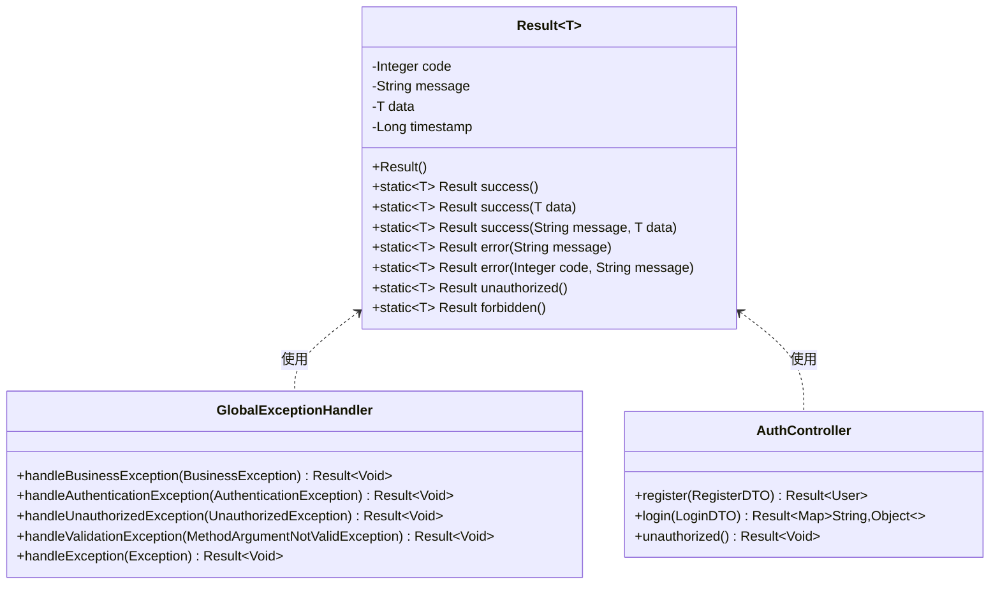
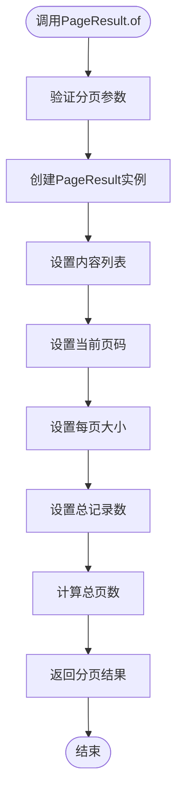
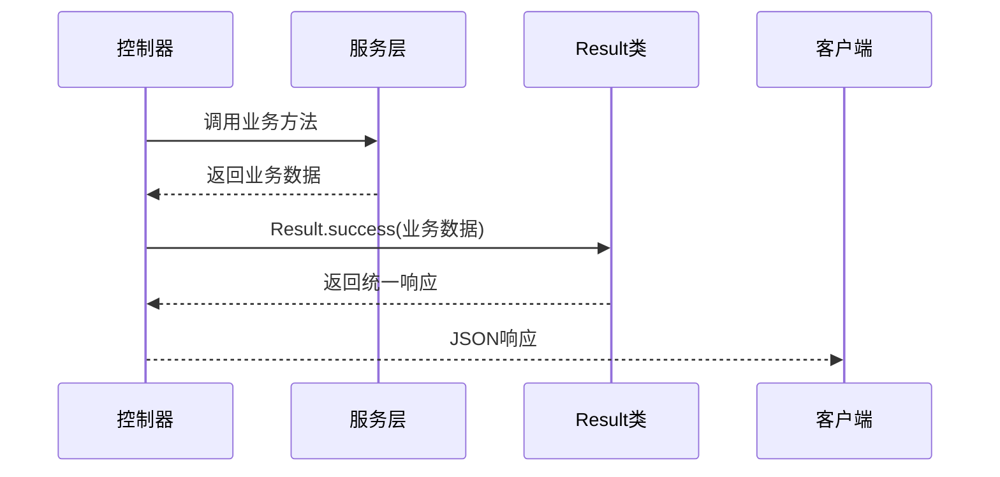
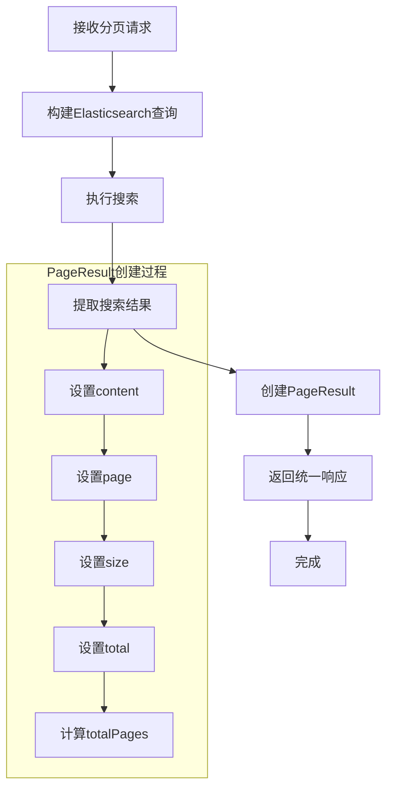
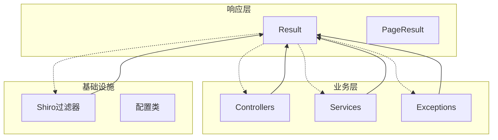

# 统一响应格式

<cite>
**本文引用的文件**
- [Result.java](file://src/main/java/com/zhishilu/common/Result.java)
- [PageResult.java](file://src/main/java/com/zhishilu/common/PageResult.java)
- [GlobalExceptionHandler.java](file://src/main/java/com/zhishilu/exception/GlobalExceptionHandler.java)
- [BusinessException.java](file://src/main/java/com/zhishilu/exception/BusinessException.java)
- [AuthController.java](file://src/main/java/com/zhishilu/controller/AuthController.java)
- [ArticleController.java](file://src/main/java/com/zhishilu/controller/ArticleController.java)
- [ArticleService.java](file://src/main/java/com/zhishilu/service/ArticleService.java)
- [JwtFilter.java](file://src/main/java/com/zhishilu/shiro/JwtFilter.java)
- [README.md](file://README.md)
</cite>

## 目录
1. [简介](#简介)
2. [项目结构](#项目结构)
3. [核心组件](#核心组件)
4. [架构概览](#架构概览)
5. [详细组件分析](#详细组件分析)
6. [依赖关系分析](#依赖关系分析)
7. [性能考虑](#性能考虑)
8. [故障排除指南](#故障排除指南)
9. [结论](#结论)
10. [附录](#附录)

## 简介

本项目采用统一响应格式设计，通过Result泛型类和PageResult分页结果类实现标准化的API响应结构。该设计确保了所有接口返回一致的数据格式，便于前端处理和错误统一管理。

统一响应格式包含以下核心要素：
- 标准化的响应结构（状态码、消息、数据、时间戳）
- 泛型支持，允许不同类型的数据封装
- 预定义的成功、错误、权限相关的响应模板
- 分页查询的专门结果封装

## 项目结构

项目采用标准的Spring Boot目录结构，统一响应格式位于common包中：



**图表来源**
- [Result.java](file://src/main/java/com/zhishilu/common/Result.java#L1-L71)
- [PageResult.java](file://src/main/java/com/zhishilu/common/PageResult.java#L1-L52)

**章节来源**
- [README.md](file://README.md#L100-L133)

## 核心组件

### Result泛型类设计理念

Result类采用泛型设计，提供了类型安全的响应封装机制：

- **泛型支持**：通过`<T>`泛型参数支持任意类型的响应数据
- **统一字段**：包含code、message、data、timestamp四个核心字段
- **静态工厂方法**：提供多种便捷的响应构建方式
- **Lombok注解**：自动生成getter、setter、toString等方法

### PageResult分页结果类设计

PageResult专门用于处理分页查询结果：

- **内容封装**：content字段存储分页数据列表
- **分页参数**：page、size字段记录当前页码和每页大小
- **统计信息**：total、totalPages字段提供总数和总页数
- **计算逻辑**：自动计算总页数，基于总记录数和每页大小

**章节来源**
- [Result.java](file://src/main/java/com/zhishilu/common/Result.java#L8-L18)
- [PageResult.java](file://src/main/java/com/zhishilu/common/PageResult.java#L12-L15)

## 架构概览

统一响应格式在整个应用中的工作流程如下：



**图表来源**
- [AuthController.java](file://src/main/java/com/zhishilu/controller/AuthController.java#L27-L40)
- [ArticleController.java](file://src/main/java/com/zhishilu/controller/ArticleController.java#L33-L66)
- [GlobalExceptionHandler.java](file://src/main/java/com/zhishilu/exception/GlobalExceptionHandler.java#L27-L51)

## 详细组件分析

### Result类详细分析

#### 设计模式与实现

Result类采用了静态工厂方法模式，提供了多种便捷的响应构建方式：



**图表来源**
- [Result.java](file://src/main/java/com/zhishilu/common/Result.java#L9-L70)
- [GlobalExceptionHandler.java](file://src/main/java/com/zhishilu/exception/GlobalExceptionHandler.java#L22-L86)
- [AuthController.java](file://src/main/java/com/zhishilu/controller/AuthController.java#L20-L49)

#### success()静态方法重载详解

Result类提供了三种success()静态方法重载：

1. **无参成功响应** (`success()`)
   - 状态码：200
   - 默认消息："操作成功"
   - 适用于不需要返回额外数据的简单操作

2. **带数据的成功响应** (`success(T data)`)
   - 状态码：200
   - 默认消息："操作成功"
   - 将传入数据封装到data字段

3. **自定义消息的成功响应** (`success(String message, T data)`)
   - 状态码：200
   - 自定义消息
   - 将传入数据封装到data字段

#### error()静态方法实现

Result类提供了两种error()静态方法重载：

1. **默认错误响应** (`error(String message)`)
   - 状态码：500
   - 自定义错误消息
   - 适用于一般性业务错误

2. **自定义错误码的错误响应** (`error(Integer code, String message)`)
   - 自定义状态码
   - 自定义错误消息
   - 适用于需要特定HTTP状态码的场景

#### 权限控制相关方法

Result类还提供了专门的权限控制响应方法：

1. **unauthorized()方法**
   - 状态码：401
   - 消息："未授权，请先登录"
   - 用于处理认证失败的情况

2. **forbidden()方法**
   - 状态码：403
   - 消息："没有权限执行此操作"
   - 用于处理授权失败的情况

**章节来源**
- [Result.java](file://src/main/java/com/zhishilu/common/Result.java#L20-L69)

### PageResult分页结果类分析

#### 分页参数处理

PageResult类提供了静态工厂方法`of()`来创建分页结果：



**图表来源**
- [PageResult.java](file://src/main/java/com/zhishilu/common/PageResult.java#L42-L50)

#### 数据封装策略

PageResult类的字段设计体现了清晰的数据分离：

- **content**：实际的分页数据列表
- **page**：当前页码（从0开始）
- **size**：每页记录数
- **total**：总记录数
- **totalPages**：总页数（自动计算）

#### 页码计算逻辑

PageResult使用数学公式自动计算总页数：
```
totalPages = ceil(total / size)
```

这种计算方式确保了即使最后一页不满员也能正确显示为独立页面。

**章节来源**
- [PageResult.java](file://src/main/java/com/zhishilu/common/PageResult.java#L15-L51)

### 使用示例与最佳实践

#### 控制器中的响应格式化

在控制器中，统一使用Result类进行响应：



**图表来源**
- [AuthController.java](file://src/main/java/com/zhishilu/controller/AuthController.java#L28-L39)
- [ArticleController.java](file://src/main/java/com/zhishilu/controller/ArticleController.java#L36-L66)

#### 分页查询的完整流程

分页查询展示了PageResult的完整使用流程：



**图表来源**
- [ArticleService.java](file://src/main/java/com/zhishilu/service/ArticleService.java#L116-L168)

**章节来源**
- [AuthController.java](file://src/main/java/com/zhishilu/controller/AuthController.java#L27-L40)
- [ArticleController.java](file://src/main/java/com/zhishilu/controller/ArticleController.java#L72-L75)
- [ArticleService.java](file://src/main/java/com/zhishilu/service/ArticleService.java#L166-L168)

## 依赖关系分析

### 组件耦合度分析

统一响应格式的设计体现了良好的内聚性和低耦合：



**图表来源**
- [Result.java](file://src/main/java/com/zhishilu/common/Result.java#L1-L71)
- [GlobalExceptionHandler.java](file://src/main/java/com/zhishilu/exception/GlobalExceptionHandler.java#L1-L87)
- [JwtFilter.java](file://src/main/java/com/zhishilu/shiro/JwtFilter.java#L1-L109)

### 关键依赖关系

1. **控制器依赖Result类**：所有控制器都依赖Result类进行响应封装
2. **服务层依赖Result类**：服务层在需要时返回Result对象
3. **全局异常处理器依赖Result类**：异常处理器使用Result类生成标准化错误响应
4. **Shiro过滤器依赖Result类**：JWT过滤器在认证失败时使用Result类返回错误

**章节来源**
- [GlobalExceptionHandler.java](file://src/main/java/com/zhishilu/exception/GlobalExceptionHandler.java#L3-L31)
- [JwtFilter.java](file://src/main/java/com/zhishilu/shiro/JwtFilter.java#L102-L107)

## 性能考虑

### 时间复杂度分析

- **Result类构造**：O(1) - 简单的对象创建和字段赋值
- **PageResult.of方法**：O(n) - n为分页数据列表长度，主要消耗在数据提取
- **分页计算**：O(1) - 简单的数学运算

### 内存使用优化

- **泛型类型安全**：避免了不必要的类型转换开销
- **Lombok注解**：减少了样板代码，降低了内存占用
- **静态工厂方法**：复用相同的响应模板，减少对象创建开销

### 缓存策略建议

对于频繁访问的查询结果，建议：
1. 在服务层添加适当的缓存机制
2. 对热点数据进行缓存预热
3. 设置合理的缓存过期时间

## 故障排除指南

### 常见问题及解决方案

#### 1. 响应格式不一致

**问题描述**：某些接口返回的数据格式与其他接口不一致

**解决方案**：
- 确保所有控制器方法都使用Result类进行响应
- 检查是否存在直接返回原始对象的代码
- 使用IDE重构功能统一替换

#### 2. 分页结果异常

**问题描述**：分页查询返回的totalPages计算错误

**排查步骤**：
1. 检查PageResult.of方法的参数传递
2. 验证total参数是否正确
3. 确认size参数大于0

#### 3. 异常处理失效

**问题描述**：业务异常没有被全局异常处理器捕获

**排查步骤**：
1. 确认BusinessException类的继承关系
2. 检查GlobalExceptionHandler的方法签名
3. 验证@RestControllerAdvice注解的扫描范围

**章节来源**
- [BusinessException.java](file://src/main/java/com/zhishilu/exception/BusinessException.java#L8-L22)
- [GlobalExceptionHandler.java](file://src/main/java/com/zhishilu/exception/GlobalExceptionHandler.java#L27-L51)

### 调试技巧

1. **启用详细日志**：在开发环境中启用Spring Boot的详细日志输出
2. **使用Postman测试**：通过API测试工具验证响应格式
3. **检查HTTP状态码**：确保错误响应使用正确的HTTP状态码

## 结论

统一响应格式设计成功实现了以下目标：

1. **一致性**：所有API接口返回统一的JSON格式
2. **可维护性**：通过Result和PageResult类集中处理响应逻辑
3. **扩展性**：泛型设计支持不同类型的数据封装
4. **易用性**：丰富的静态工厂方法简化了响应构建

该设计为后续的功能扩展奠定了良好的基础，开发者可以轻松地在现有框架上添加新的响应类型和处理逻辑。

## 附录

### API响应格式规范

#### 成功响应格式
```json
{
  "code": 200,
  "message": "操作成功",
  "data": {},
  "timestamp": 1640995200000
}
```

#### 错误响应格式
```json
{
  "code": 500,
  "message": "系统异常，请稍后重试",
  "data": null,
  "timestamp": 1640995200000
}
```

#### 分页响应格式
```json
{
  "code": 200,
  "message": "操作成功",
  "data": {
    "content": [],
    "page": 0,
    "size": 10,
    "total": 0,
    "totalPages": 0
  },
  "timestamp": 1640995200000
}
```

### 开发最佳实践

1. **始终使用Result类**：不要直接返回原始对象
2. **合理使用分页**：对于大量数据的查询使用PageResult
3. **保持消息一致性**：使用Result类提供的预定义消息
4. **异常处理规范化**：通过BusinessException抛出自定义业务异常