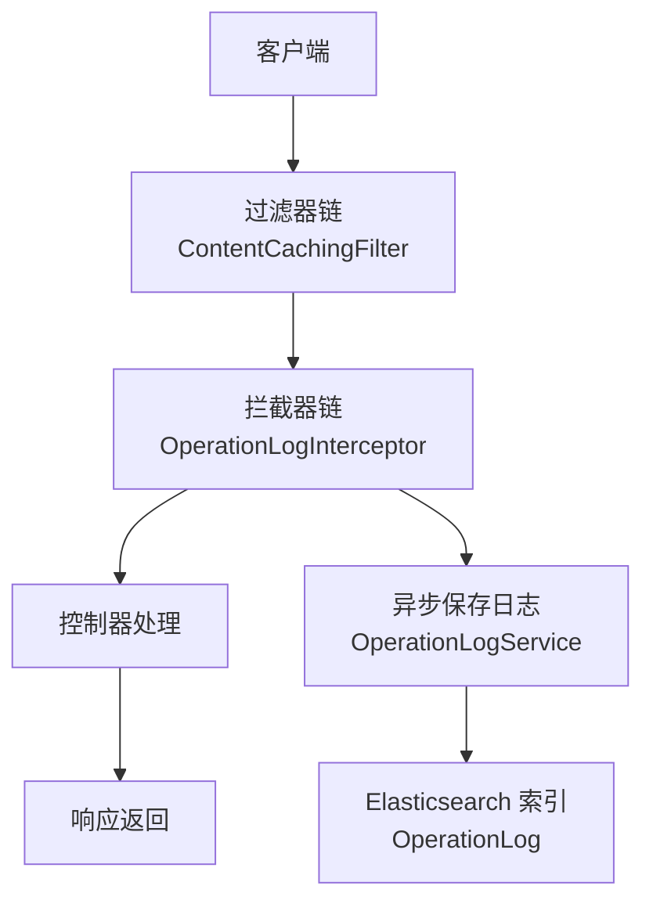
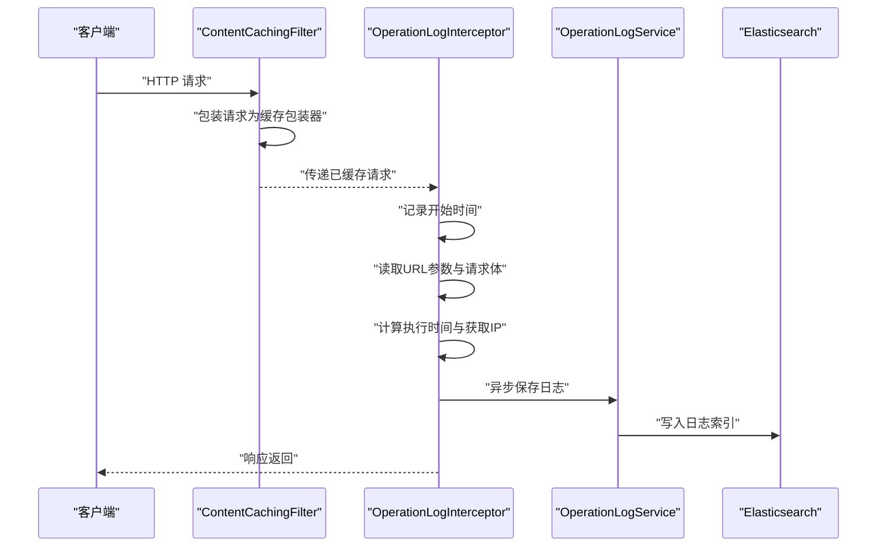
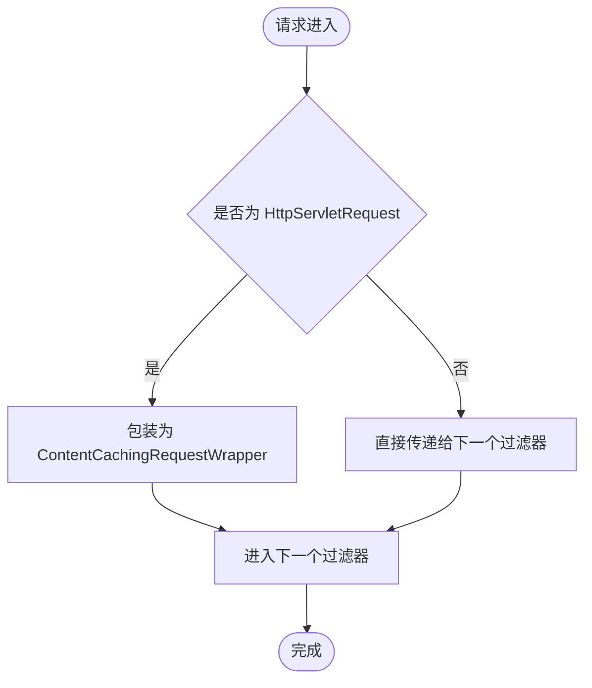
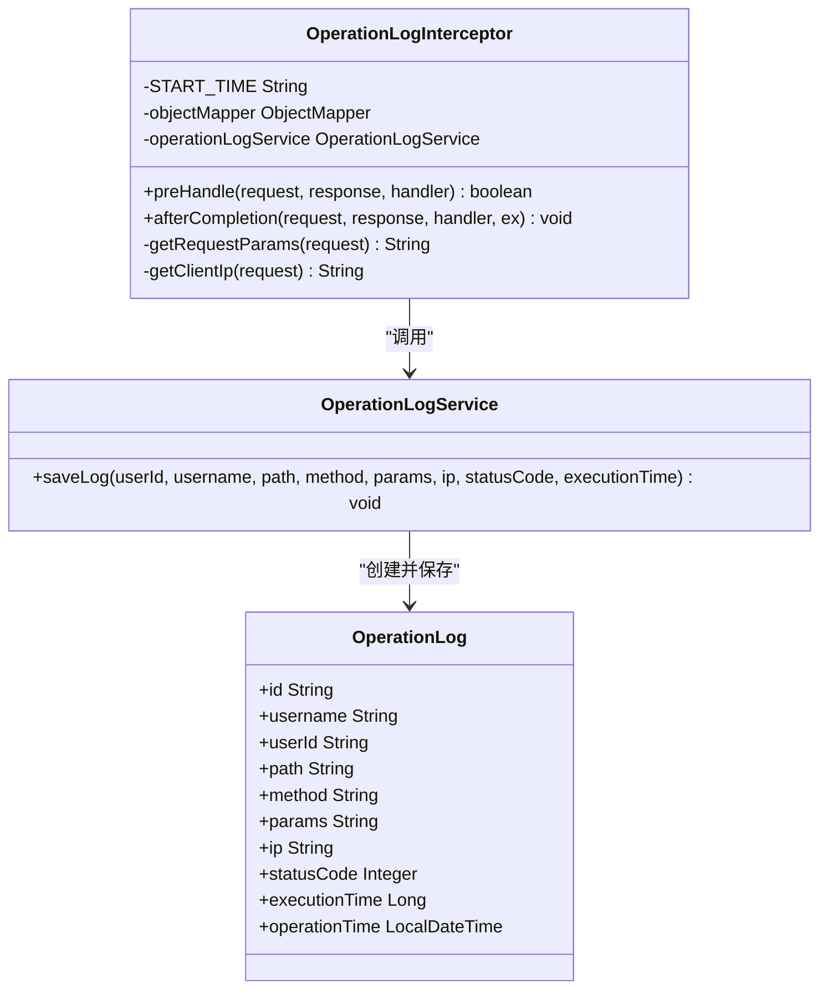
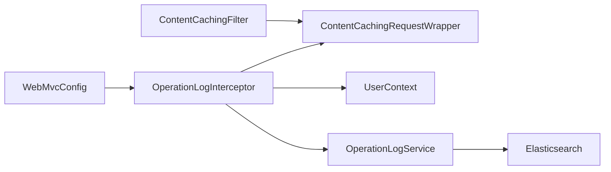

# 请求过滤器

<cite>
**本文引用的文件**
- [ContentCachingFilter.java](file://src/main/java/com/zhishilu/filter/ContentCachingFilter.java)
- [OperationLogInterceptor.java](file://src/main/java/com/zhishilu/interceptor/OperationLogInterceptor.java)
- [WebMvcConfig.java](file://src/main/java/com/zhishilu/config/WebMvcConfig.java)
- [OperationLog.java](file://src/main/java/com/zhishilu/entity/OperationLog.java)
- [OperationLogService.java](file://src/main/java/com/zhishilu/service/OperationLogService.java)
- [UserContext.java](file://src/main/java/com/zhishilu/util/UserContext.java)
- [application.yml](file://src/main/resources/application.yml)
- [README.md](file://README.md)
</cite>

## 目录
1. [引言](#引言)
2. [项目结构](#项目结构)
3. [核心组件](#核心组件)
4. [架构总览](#架构总览)
5. [详细组件分析](#详细组件分析)
6. [依赖关系分析](#依赖关系分析)
7. [性能考量](#性能考量)
8. [故障排查指南](#故障排查指南)
9. [结论](#结论)
10. [附录](#附录)

## 引言
本技术文档围绕请求过滤器展开，重点解析 ContentCachingFilter 的设计目的与实现原理，以及其与 OperationLogInterceptor 的协作机制。内容涵盖：
- 请求内容缓存机制与响应阶段的数据读取
- 调试信息的采集与输出（请求参数、响应状态、执行时间等）
- 过滤器工作流程与过滤器链配置
- 在系统调试与日志记录中的作用
- 性能影响与优化建议

## 项目结构
该项目采用 Spring Boot 3 + Spring MVC 架构，请求从进入过滤器链到最终被拦截器记录日志，再到异步持久化至 Elasticsearch。ContentCachingFilter 作为第一个过滤器负责缓存请求体，供后续拦截器读取。

图表来源
- [ContentCachingFilter.java](file://src/main/java/com/zhishilu/filter/ContentCachingFilter.java#L16-L32)
- [OperationLogInterceptor.java](file://src/main/java/com/zhishilu/interceptor/OperationLogInterceptor.java#L32-L64)
- [WebMvcConfig.java](file://src/main/java/com/zhishilu/config/WebMvcConfig.java#L36-L41)
- [OperationLogService.java](file://src/main/java/com/zhishilu/service/OperationLogService.java#L26-L47)
- [OperationLog.java](file://src/main/java/com/zhishilu/entity/OperationLog.java#L13-L72)

章节来源
- [README.md](file://README.md#L1-L133)

## 核心组件
- ContentCachingFilter：在请求进入时包装为 ContentCachingRequestWrapper，确保请求体可重复读取，便于后续日志拦截器读取。
- OperationLogInterceptor：在请求完成后收集请求参数、响应状态、执行时间、客户端 IP 等信息，并异步写入 Elasticsearch。
- WebMvcConfig：注册拦截器并设置拦截范围与排除路径。
- OperationLogService：异步保存日志实体，避免阻塞主线程。
- OperationLog：日志实体模型，映射到 Elasticsearch 索引。
- UserContext：线程本地存储当前用户信息，供拦截器读取。

章节来源
- [ContentCachingFilter.java](file://src/main/java/com/zhishilu/filter/ContentCachingFilter.java#L16-L32)
- [OperationLogInterceptor.java](file://src/main/java/com/zhishilu/interceptor/OperationLogInterceptor.java#L25-L99)
- [WebMvcConfig.java](file://src/main/java/com/zhishilu/config/WebMvcConfig.java#L36-L41)
- [OperationLogService.java](file://src/main/java/com/zhishilu/service/OperationLogService.java#L19-L47)
- [OperationLog.java](file://src/main/java/com/zhishilu/entity/OperationLog.java#L15-L72)
- [UserContext.java](file://src/main/java/com/zhishilu/util/UserContext.java#L8-L31)

## 架构总览
ContentCachingFilter 位于过滤器链的首位，负责缓存请求体；随后进入拦截器链，由 OperationLogInterceptor 完成参数采集与日志记录；最后通过异步任务将日志持久化到 Elasticsearch。

图表来源
- [ContentCachingFilter.java](file://src/main/java/com/zhishilu/filter/ContentCachingFilter.java#L21-L32)
- [OperationLogInterceptor.java](file://src/main/java/com/zhishilu/interceptor/OperationLogInterceptor.java#L32-L99)
- [OperationLogService.java](file://src/main/java/com/zhishilu/service/OperationLogService.java#L26-L47)

## 详细组件分析

### ContentCachingFilter 设计与实现
- 设计目的
  - 缓存请求体，使后续组件（如拦截器）能够读取原始请求体，而不受流一次性消费的限制。
  - 提供统一的请求包装，便于调试与日志记录。
- 关键点
  - 使用注解声明为 Web 过滤器，匹配所有路径。
  - 设置优先级为最高（Order=1），确保最先执行。
  - 对 HttpServletRequest 进行 ContentCachingRequestWrapper 包装，再继续过滤器链。
- 适用场景
  - 需要记录请求体内容的日志系统。
  - 需要在拦截器中多次读取请求体的场景。

图表来源
- [ContentCachingFilter.java](file://src/main/java/com/zhishilu/filter/ContentCachingFilter.java#L21-L32)

章节来源
- [ContentCachingFilter.java](file://src/main/java/com/zhishilu/filter/ContentCachingFilter.java#L12-L32)

### OperationLogInterceptor 参数采集与日志记录
- 参数采集
  - URL 查询参数：遍历参数名集合，逐项读取。
  - 请求体：当请求为 ContentCachingRequestWrapper 时，读取缓存字节数组并转换为字符串，限制最大长度以避免日志过大。
- 调试信息
  - 用户信息：从 UserContext 获取当前用户 ID 与用户名。
  - 请求信息：路径、方法、客户端 IP（支持多代理头）。
  - 响应信息：状态码。
  - 性能信息：执行时间（毫秒）。
- 异步持久化
  - 使用 @Async 将日志保存交给异步线程池，避免阻塞主线程。
  - 日志实体包含字段：用户名、用户ID、路径、方法、参数、IP、状态码、执行时间、操作时间。

图表来源
- [OperationLogInterceptor.java](file://src/main/java/com/zhishilu/interceptor/OperationLogInterceptor.java#L25-L99)
- [OperationLogService.java](file://src/main/java/com/zhishilu/service/OperationLogService.java#L19-L47)
- [OperationLog.java](file://src/main/java/com/zhishilu/entity/OperationLog.java#L15-L72)

章节来源
- [OperationLogInterceptor.java](file://src/main/java/com/zhishilu/interceptor/OperationLogInterceptor.java#L32-L99)
- [OperationLogService.java](file://src/main/java/com/zhishilu/service/OperationLogService.java#L26-L47)
- [OperationLog.java](file://src/main/java/com/zhishilu/entity/OperationLog.java#L13-L72)

### WebMvcConfig 拦截器配置
- 注册拦截器：将 OperationLogInterceptor 注册到拦截器链。
- 拦截范围：对所有路径生效。
- 排除路径：排除错误页面与 Swagger 文档路径，减少非业务请求的日志开销。

章节来源
- [WebMvcConfig.java](file://src/main/java/com/zhishilu/config/WebMvcConfig.java#L36-L41)

### UserContext 用户上下文
- 线程本地存储当前用户，拦截器通过该工具读取用户信息，便于记录操作人。
- 在 afterCompletion 中清理线程变量，避免内存泄漏。

章节来源
- [UserContext.java](file://src/main/java/com/zhishilu/util/UserContext.java#L8-L31)
- [OperationLogInterceptor.java](file://src/main/java/com/zhishilu/interceptor/OperationLogInterceptor.java#L39-L64)

## 依赖关系分析
- ContentCachingFilter 依赖 Spring Web 的 ContentCachingRequestWrapper，确保请求体可重复读取。
- OperationLogInterceptor 依赖：
  - Spring MVC 的 HandlerInterceptor 接口生命周期（preHandle、afterCompletion）。
  - ContentCachingRequestWrapper 以读取请求体。
  - UserContext 读取当前用户。
  - OperationLogService 异步保存日志。
- WebMvcConfig 注册拦截器并设置拦截范围。
- OperationLogService 依赖 OperationLogRepository 将日志写入 Elasticsearch。

图表来源
- [ContentCachingFilter.java](file://src/main/java/com/zhishilu/filter/ContentCachingFilter.java#L21-L32)
- [OperationLogInterceptor.java](file://src/main/java/com/zhishilu/interceptor/OperationLogInterceptor.java#L25-L64)
- [WebMvcConfig.java](file://src/main/java/com/zhishilu/config/WebMvcConfig.java#L36-L41)
- [OperationLogService.java](file://src/main/java/com/zhishilu/service/OperationLogService.java#L26-L47)

章节来源
- [ContentCachingFilter.java](file://src/main/java/com/zhishilu/filter/ContentCachingFilter.java#L16-L32)
- [OperationLogInterceptor.java](file://src/main/java/com/zhishilu/interceptor/OperationLogInterceptor.java#L25-L64)
- [WebMvcConfig.java](file://src/main/java/com/zhishilu/config/WebMvcConfig.java#L36-L41)
- [OperationLogService.java](file://src/main/java/com/zhishilu/service/OperationLogService.java#L26-L47)

## 性能考量
- 请求体缓存成本
  - ContentCachingRequestWrapper 会将请求体缓存到内存或临时缓冲区，大请求体可能增加内存占用与 GC 压力。
  - 建议：对超大请求体进行限流或拒绝策略，避免内存溢出。
- 日志记录开销
  - 拦截器在 afterCompletion 中读取请求体并序列化为 JSON 字符串，注意长度限制与字符集编码。
  - 异步保存日志避免阻塞主线程，但需合理配置线程池大小与队列容量，防止积压。
- IP 解析与异常处理
  - 多代理头解析存在多次字符串判断，建议在网关层统一处理 X-Forwarded-For，减少重复解析。
- 配置建议
  - 合理设置日志级别与输出格式，避免过多冗余信息。
  - 对 Swagger、静态资源等非业务路径进行排除，降低日志量。
  - Elasticsearch 写入建议开启批量刷新策略与合理的副本数，平衡写入吞吐与查询性能。

章节来源
- [OperationLogInterceptor.java](file://src/main/java/com/zhishilu/interceptor/OperationLogInterceptor.java#L80-L99)
- [OperationLogService.java](file://src/main/java/com/zhishilu/service/OperationLogService.java#L26-L47)
- [application.yml](file://src/main/resources/application.yml#L40-L47)

## 故障排查指南
- 请求体为空
  - 确认 ContentCachingFilter 是否正确包装请求（检查过滤器顺序与路径匹配）。
  - 检查请求是否为 ContentCachingRequestWrapper 类型后再读取缓存字节。
- 日志未入库
  - 检查 OperationLogService 的异步线程池配置与任务队列是否正常。
  - 查看 Elasticsearch 连接配置与索引映射是否正确。
- IP 显示异常
  - 确认网关或代理是否正确设置 X-Forwarded-For 头，避免多个代理导致的逗号分隔问题。
- 性能抖动
  - 观察日志中执行时间分布，定位慢接口；检查请求体大小与序列化开销。
  - 调整日志级别与排除路径，减少不必要的日志输出。

章节来源
- [ContentCachingFilter.java](file://src/main/java/com/zhishilu/filter/ContentCachingFilter.java#L21-L32)
- [OperationLogInterceptor.java](file://src/main/java/com/zhishilu/interceptor/OperationLogInterceptor.java#L101-L126)
- [OperationLogService.java](file://src/main/java/com/zhishilu/service/OperationLogService.java#L26-L47)
- [application.yml](file://src/main/resources/application.yml#L13-L18)

## 结论
ContentCachingFilter 通过请求体缓存，为 OperationLogInterceptor 提供了可靠的参数采集能力，结合异步日志服务与 Elasticsearch 存储，实现了完整的系统调试与审计能力。在保证功能的前提下，应关注内存占用、序列化成本与异步写入的稳定性，通过合理的配置与优化策略提升整体性能与可靠性。

## 附录

### 过滤器与拦截器配置要点
- 过滤器链
  - ContentCachingFilter：匹配所有路径，优先级最高。
  - 可根据需要添加其他过滤器（如 CORS、安全过滤器等）。
- 拦截器链
  - OperationLogInterceptor：对所有路径生效，排除错误与文档路径。
  - 可扩展更多拦截器（如权限校验、速率限制等）。

章节来源
- [ContentCachingFilter.java](file://src/main/java/com/zhishilu/filter/ContentCachingFilter.java#L17-L18)
- [WebMvcConfig.java](file://src/main/java/com/zhishilu/config/WebMvcConfig.java#L36-L41)

### 调试信息输出控制
- 日志级别
  - 根据需要调整根日志级别与包级别日志输出，避免过度打印。
- 输出格式
  - 控制台格式可按需调整，确保关键信息清晰可见。
- Elasticsearch 索引
  - 索引名称与字段映射需与实体一致，便于检索与分析。

章节来源
- [application.yml](file://src/main/resources/application.yml#L40-L47)
- [OperationLog.java](file://src/main/java/com/zhishilu/entity/OperationLog.java#L13-L14)