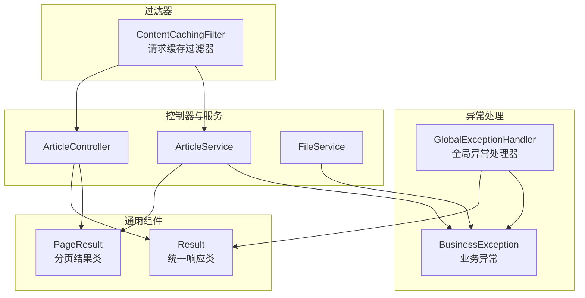
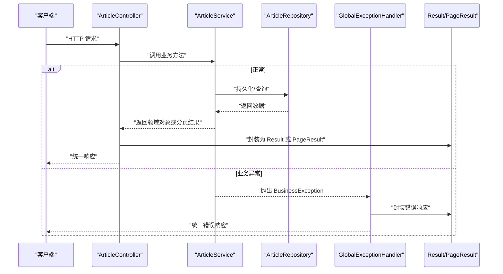
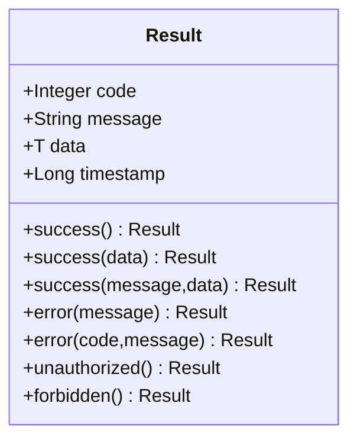
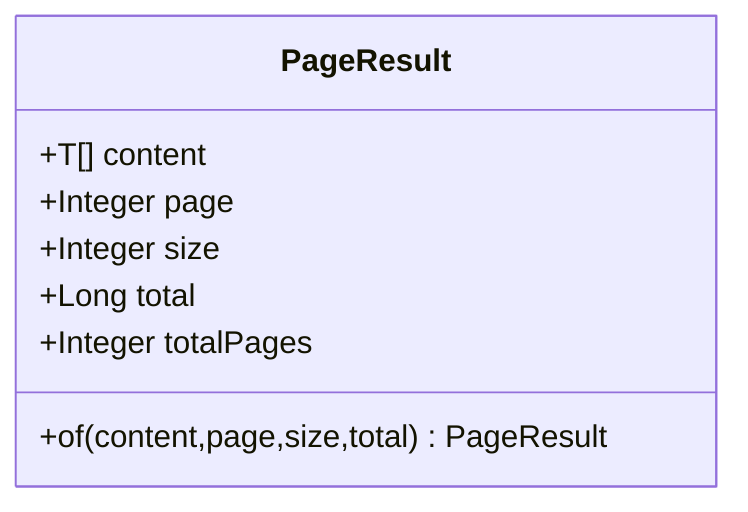
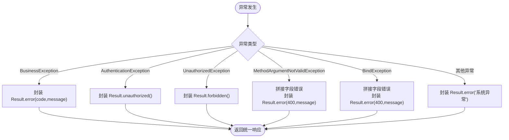
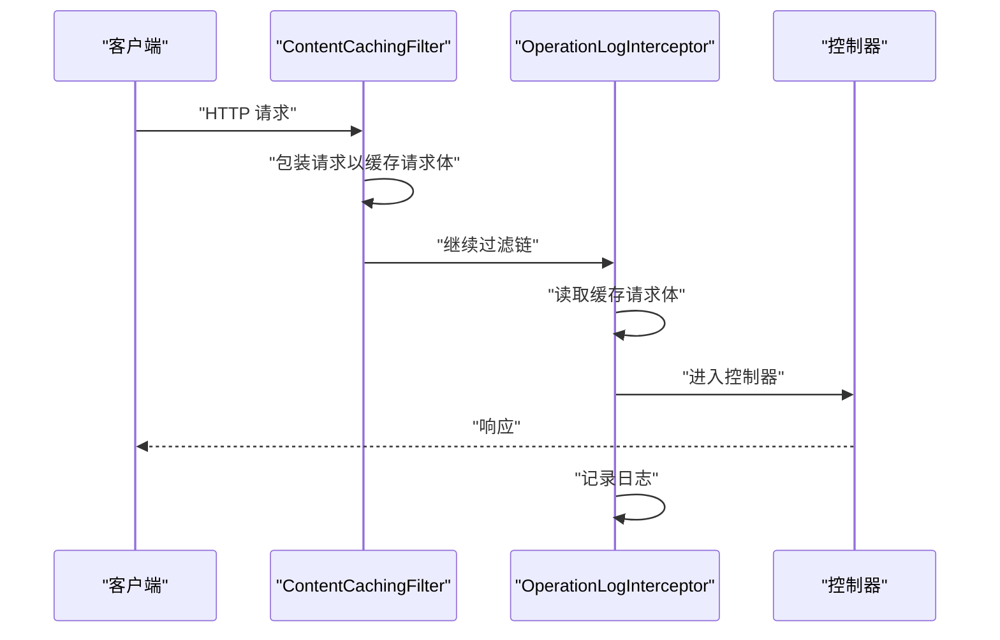
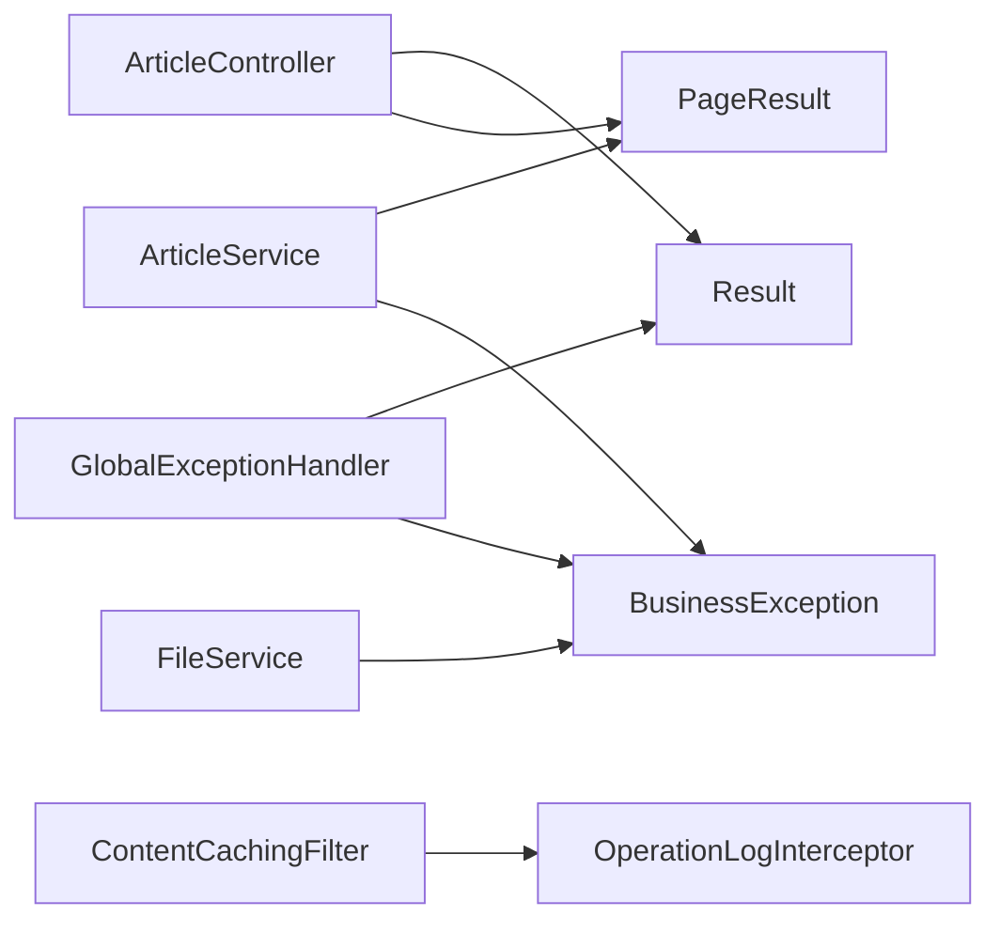

# 通用组件

<cite>
**本文引用的文件**
- [Result.java](file://src/main/java/com/zhishilu/common/Result.java)
- [PageResult.java](file://src/main/java/com/zhishilu/common/PageResult.java)
- [BusinessException.java](file://src/main/java/com/zhishilu/exception/BusinessException.java)
- [GlobalExceptionHandler.java](file://src/main/java/com/zhishilu/exception/GlobalExceptionHandler.java)
- [ContentCachingFilter.java](file://src/main/java/com/zhishilu/filter/ContentCachingFilter.java)
- [ArticleController.java](file://src/main/java/com/zhishilu/controller/ArticleController.java)
- [ArticleService.java](file://src/main/java/com/zhishilu/service/ArticleService.java)
- [FileService.java](file://src/main/java/com/zhishilu/service/FileService.java)
- [OperationLogInterceptor.java](file://src/main/java/com/zhishilu/interceptor/OperationLogInterceptor.java)
- [application.yml](file://src/main/resources/application.yml)
- [README.md](file://README.md)
</cite>

## 目录
1. [引言](#引言)
2. [项目结构](#项目结构)
3. [核心组件](#核心组件)
4. [架构总览](#架构总览)
5. [详细组件分析](#详细组件分析)
6. [依赖关系分析](#依赖关系分析)
7. [性能考虑](#性能考虑)
8. [故障排查指南](#故障排查指南)
9. [结论](#结论)
10. [附录](#附录)

## 引言
本文件聚焦于通用组件的设计与实现，覆盖统一响应类、分页结果类、全局异常处理以及请求缓存过滤器等关键模块。目标是为开发者提供一套统一的响应格式与异常处理标准，并通过清晰的架构图与流程图帮助快速理解与扩展。

## 项目结构
通用组件位于 common 包中，异常处理位于 exception 包中，请求缓存过滤器位于 filter 包中。这些组件被控制器与服务层广泛使用，形成统一的对外输出与错误处理规范。

图表来源
- [Result.java](file://src/main/java/com/zhishilu/common/Result.java#L1-L71)
- [PageResult.java](file://src/main/java/com/zhishilu/common/PageResult.java#L1-L52)
- [BusinessException.java](file://src/main/java/com/zhishilu/exception/BusinessException.java#L1-L23)
- [GlobalExceptionHandler.java](file://src/main/java/com/zhishilu/exception/GlobalExceptionHandler.java#L1-L87)
- [ContentCachingFilter.java](file://src/main/java/com/zhishilu/filter/ContentCachingFilter.java#L1-L34)
- [ArticleController.java](file://src/main/java/com/zhishilu/controller/ArticleController.java#L1-L88)
- [ArticleService.java](file://src/main/java/com/zhishilu/service/ArticleService.java#L1-L200)
- [FileService.java](file://src/main/java/com/zhishilu/service/FileService.java#L1-L108)

章节来源
- [README.md](file://README.md#L1-L133)

## 核心组件
- 统一响应类 Result：提供静态工厂方法，统一返回 code、message、data、timestamp 字段，便于前端统一解析与展示。
- 分页结果类 PageResult：封装 content、page、size、total、totalPages 等字段，简化分页场景的数据封装。
- 全局异常处理 GlobalExceptionHandler：集中处理业务异常、认证/授权异常、参数校验异常、绑定异常与通用异常，统一返回 Result 格式。
- 业务异常 BusinessException：继承 RuntimeException，携带业务 code 与 message，便于异常分类与处理。
- 请求缓存过滤器 ContentCachingFilter：包装请求以缓存请求体，供后续日志拦截器读取请求体内容。

章节来源
- [Result.java](file://src/main/java/com/zhishilu/common/Result.java#L1-L71)
- [PageResult.java](file://src/main/java/com/zhishilu/common/PageResult.java#L1-L52)
- [BusinessException.java](file://src/main/java/com/zhishilu/exception/BusinessException.java#L1-L23)
- [GlobalExceptionHandler.java](file://src/main/java/com/zhishilu/exception/GlobalExceptionHandler.java#L1-L87)
- [ContentCachingFilter.java](file://src/main/java/com/zhishilu/filter/ContentCachingFilter.java#L1-L34)

## 架构总览
下图展示了请求从控制器到服务层再到异常处理的整体流程，以及统一响应与分页结果的使用位置。

图表来源
- [ArticleController.java](file://src/main/java/com/zhishilu/controller/ArticleController.java#L1-L88)
- [ArticleService.java](file://src/main/java/com/zhishilu/service/ArticleService.java#L1-L200)
- [GlobalExceptionHandler.java](file://src/main/java/com/zhishilu/exception/GlobalExceptionHandler.java#L1-L87)
- [Result.java](file://src/main/java/com/zhishilu/common/Result.java#L1-L71)
- [PageResult.java](file://src/main/java/com/zhishilu/common/PageResult.java#L1-L52)

## 详细组件分析

### 统一响应类 Result 设计与实现
- 设计要点
  - 使用泛型 T 表示 data 的类型，支持无数据、单对象、列表等多种返回形态。
  - 提供 success/error/unauthorized/forbidden 等静态工厂方法，语义明确、易于使用。
  - 自动填充 timestamp，便于前后端对齐时间。
- 数据封装策略
  - 成功场景：code=200，message 默认“操作成功”，可自定义 message；data 可选。
  - 错误场景：默认 code=500，可指定自定义 code；message 为错误描述。
  - 特殊状态：未授权与禁止访问分别对应 401 与 403。
- 错误信息处理
  - 业务异常通过 GlobalExceptionHandler 转换为 Result，保持统一格式。
  - 参数校验与绑定异常统一转换为 400 错误，message 由字段错误拼接。
- 使用示例
  - 控制器返回单个对象：Result.success("创建成功", article)
  - 控制器返回分页结果：Result.success(pageResult)
  - 控制器返回空数据：Result.success()

图表来源
- [Result.java](file://src/main/java/com/zhishilu/common/Result.java#L1-L71)

章节来源
- [Result.java](file://src/main/java/com/zhishilu/common/Result.java#L1-L71)
- [ArticleController.java](file://src/main/java/com/zhishilu/controller/ArticleController.java#L1-L88)

### 分页结果类 PageResult 功能与使用
- 字段设计
  - content：当前页数据列表
  - page/size：当前页码与每页大小
  - total：总记录数
  - totalPages：总页数（基于 total 与 size 计算）
- 封装策略
  - 提供 of 工厂方法，一次性设置所有字段，避免分散赋值。
  - totalPages 采用向上取整计算，确保边界正确。
- 使用方式
  - 服务层构建 PageResult.of(...) 并返回给控制器。
  - 控制器直接将 PageResult 包装为 Result.success(...) 输出。
- 示例
  - 服务层：PageResult.of(articles, queryDTO.getPage(), queryDTO.getSize(), totalHits)
  - 控制器：Result.success(pageResult)

图表来源
- [PageResult.java](file://src/main/java/com/zhishilu/common/PageResult.java#L1-L52)

章节来源
- [PageResult.java](file://src/main/java/com/zhishilu/common/PageResult.java#L1-L52)
- [ArticleService.java](file://src/main/java/com/zhishilu/service/ArticleService.java#L116-L168)
- [ArticleController.java](file://src/main/java/com/zhishilu/controller/ArticleController.java#L72-L75)

### 全局异常处理机制
- 异常分类与处理
  - 业务异常 BusinessException：返回 Result.error(code, message)，由服务层抛出。
  - 认证异常 AuthenticationException：返回 Result.unauthorized()，状态码 401。
  - 授权异常 UnauthorizedException：返回 Result.forbidden()，状态码 403。
  - 参数校验异常 MethodArgumentNotValidException：拼接字段错误 message，返回 Result.error(400, message)。
  - 绑定异常 BindException：拼接字段错误 message，返回 Result.error(400, message)。
  - 其他异常 Exception：返回 Result.error("系统异常，请稍后重试")，状态码 500。
- 日志记录
  - 对各类异常进行 log.error 记录，便于问题追踪与审计。
- 统一输出
  - 所有异常最终都转换为 Result 格式，保证前后端一致的错误结构。

图表来源
- [GlobalExceptionHandler.java](file://src/main/java/com/zhishilu/exception/GlobalExceptionHandler.java#L1-L87)
- [BusinessException.java](file://src/main/java/com/zhishilu/exception/BusinessException.java#L1-L23)
- [Result.java](file://src/main/java/com/zhishilu/common/Result.java#L1-L71)

章节来源
- [GlobalExceptionHandler.java](file://src/main/java/com/zhishilu/exception/GlobalExceptionHandler.java#L1-L87)
- [BusinessException.java](file://src/main/java/com/zhishilu/exception/BusinessException.java#L1-L23)

### 请求缓存过滤器 ContentCachingFilter
- 作用
  - 在请求进入控制器之前，包装 HttpServletRequest 以缓存请求体，供后续日志拦截器读取。
  - 通过 ContentCachingRequestWrapper 获取原始请求体字节数组，避免流被消费导致无法再次读取。
- 实现要点
  - 使用 @WebFilter 注解对所有路径生效，@Order(1) 确保优先级。
  - 仅对 HttpServletRequest 进行包装，非 HTTP 请求直接透传。
- 与日志拦截器的配合
  - 拦截器在 afterCompletion 中读取缓存的请求体，结合 URL 参数、IP、状态码、耗时等信息异步记录操作日志。

图表来源
- [ContentCachingFilter.java](file://src/main/java/com/zhishilu/filter/ContentCachingFilter.java#L1-L34)
- [OperationLogInterceptor.java](file://src/main/java/com/zhishilu/interceptor/OperationLogInterceptor.java#L1-L128)

章节来源
- [ContentCachingFilter.java](file://src/main/java/com/zhishilu/filter/ContentCachingFilter.java#L1-L34)
- [OperationLogInterceptor.java](file://src/main/java/com/zhishilu/interceptor/OperationLogInterceptor.java#L1-L128)

### 使用示例与扩展方法
- 统一响应使用
  - 单对象返回：Result.success("消息", data)
  - 列表/分页返回：Result.success(pageResult)
  - 空数据返回：Result.success()
  - 错误返回：Result.error("错误消息") 或 Result.error(400, "参数错误")
- 分页结果使用
  - 服务层：PageResult.of(content, page, size, total)
  - 控制器：Result.success(pageResult)
- 业务异常抛出
  - 业务错误：throw new BusinessException("消息")
  - 自定义错误码：throw new BusinessException(403, "权限不足")
- 全局异常处理
  - 无需在控制器中重复 try/catch，异常自动转为 Result 格式
- 请求缓存与日志
  - ContentCachingFilter 自动缓存请求体，OperationLogInterceptor 自动记录日志

章节来源
- [ArticleController.java](file://src/main/java/com/zhishilu/controller/ArticleController.java#L1-L88)
- [ArticleService.java](file://src/main/java/com/zhishilu/service/ArticleService.java#L1-L200)
- [FileService.java](file://src/main/java/com/zhishilu/service/FileService.java#L1-L108)
- [GlobalExceptionHandler.java](file://src/main/java/com/zhishilu/exception/GlobalExceptionHandler.java#L1-L87)
- [ContentCachingFilter.java](file://src/main/java/com/zhishilu/filter/ContentCachingFilter.java#L1-L34)
- [OperationLogInterceptor.java](file://src/main/java/com/zhishilu/interceptor/OperationLogInterceptor.java#L1-L128)

## 依赖关系分析
- Result 与 PageResult：控制器与服务层共同依赖，Result 负责统一响应，PageResult 负责分页封装。
- BusinessException：服务层在业务校验失败时抛出，由 GlobalExceptionHandler 捕获并统一返回。
- GlobalExceptionHandler：作为@RestControllerAdvice，对全站异常进行统一处理，返回 Result 格式。
- ContentCachingFilter：在过滤链早期包装请求，为 OperationLogInterceptor 提供请求体缓存能力。
- 应用配置：application.yml 提供上传路径、允许类型、最大大小等配置，影响 FileService 的行为。

图表来源
- [ArticleController.java](file://src/main/java/com/zhishilu/controller/ArticleController.java#L1-L88)
- [ArticleService.java](file://src/main/java/com/zhishilu/service/ArticleService.java#L1-L200)
- [FileService.java](file://src/main/java/com/zhishilu/service/FileService.java#L1-L108)
- [GlobalExceptionHandler.java](file://src/main/java/com/zhishilu/exception/GlobalExceptionHandler.java#L1-L87)
- [Result.java](file://src/main/java/com/zhishilu/common/Result.java#L1-L71)
- [PageResult.java](file://src/main/java/com/zhishilu/common/PageResult.java#L1-L52)
- [BusinessException.java](file://src/main/java/com/zhishilu/exception/BusinessException.java#L1-L23)
- [ContentCachingFilter.java](file://src/main/java/com/zhishilu/filter/ContentCachingFilter.java#L1-L34)
- [OperationLogInterceptor.java](file://src/main/java/com/zhishilu/interceptor/OperationLogInterceptor.java#L1-L128)

章节来源
- [application.yml](file://src/main/resources/application.yml#L1-L47)

## 性能考虑
- 统一响应与异常处理
  - Result 与 GlobalExceptionHandler 降低重复编码，减少异常处理分支，提升开发效率与一致性。
- 分页结果
  - PageResult.of 计算 totalPages，避免前端重复计算；注意合理设置 page/size，避免超大分页导致内存压力。
- 请求缓存
  - ContentCachingFilter 仅包装请求体，避免重复读取；日志拦截器对请求体长度进行限制，防止日志过大影响性能。
- 文件上传
  - application.yml 中配置了最大文件大小与类型白名单，FileService 在上传前进行校验，避免无效 IO 开销。

## 故障排查指南
- 统一响应格式不一致
  - 检查控制器是否使用 Result.success()/Result.error() 包装返回值。
  - 确认 GlobalExceptionHandler 是否正确捕获并转换异常。
- 分页结果异常
  - 确认 PageResult.of 的 total 参数是否来自查询总条数；检查 page/size 合理性。
- 业务异常未被捕获
  - 确认服务层是否抛出 BusinessException；确认 GlobalExceptionHandler 是否扫描到该异常类型。
- 请求日志缺失
  - 检查 ContentCachingFilter 是否生效；确认 OperationLogInterceptor 是否正确读取缓存请求体。
- 文件上传失败
  - 检查 application.yml 中 upload 配置；确认 FileService 的校验逻辑是否触发 BusinessException。

章节来源
- [GlobalExceptionHandler.java](file://src/main/java/com/zhishilu/exception/GlobalExceptionHandler.java#L1-L87)
- [ContentCachingFilter.java](file://src/main/java/com/zhishilu/filter/ContentCachingFilter.java#L1-L34)
- [OperationLogInterceptor.java](file://src/main/java/com/zhishilu/interceptor/OperationLogInterceptor.java#L1-L128)
- [FileService.java](file://src/main/java/com/zhishilu/service/FileService.java#L1-L108)
- [application.yml](file://src/main/resources/application.yml#L33-L37)

## 结论
本通用组件通过 Result、PageResult、BusinessException、GlobalExceptionHandler 与 ContentCachingFilter 形成了统一的响应格式、分页封装、异常处理与请求缓存体系。它们在控制器与服务层之间提供了清晰的契约与一致的输出，显著提升了系统的可维护性与可观测性。建议在新功能开发中遵循现有模式，确保风格一致与扩展便捷。

## 附录
- 关键配置项
  - 上传路径：upload.path
  - 允许类型：upload.allowed-types
  - 最大大小：upload.max-size
- 常见扩展方向
  - 在 Result 中增加 traceId、requestId 等链路追踪字段
  - 在 PageResult 中增加排序、筛选条件等元信息
  - 在 GlobalExceptionHandler 中增加敏感信息脱敏与告警通知

章节来源
- [application.yml](file://src/main/resources/application.yml#L33-L37)
- [Result.java](file://src/main/java/com/zhishilu/common/Result.java#L1-L71)
- [PageResult.java](file://src/main/java/com/zhishilu/common/PageResult.java#L1-L52)
- [GlobalExceptionHandler.java](file://src/main/java/com/zhishilu/exception/GlobalExceptionHandler.java#L1-L87)