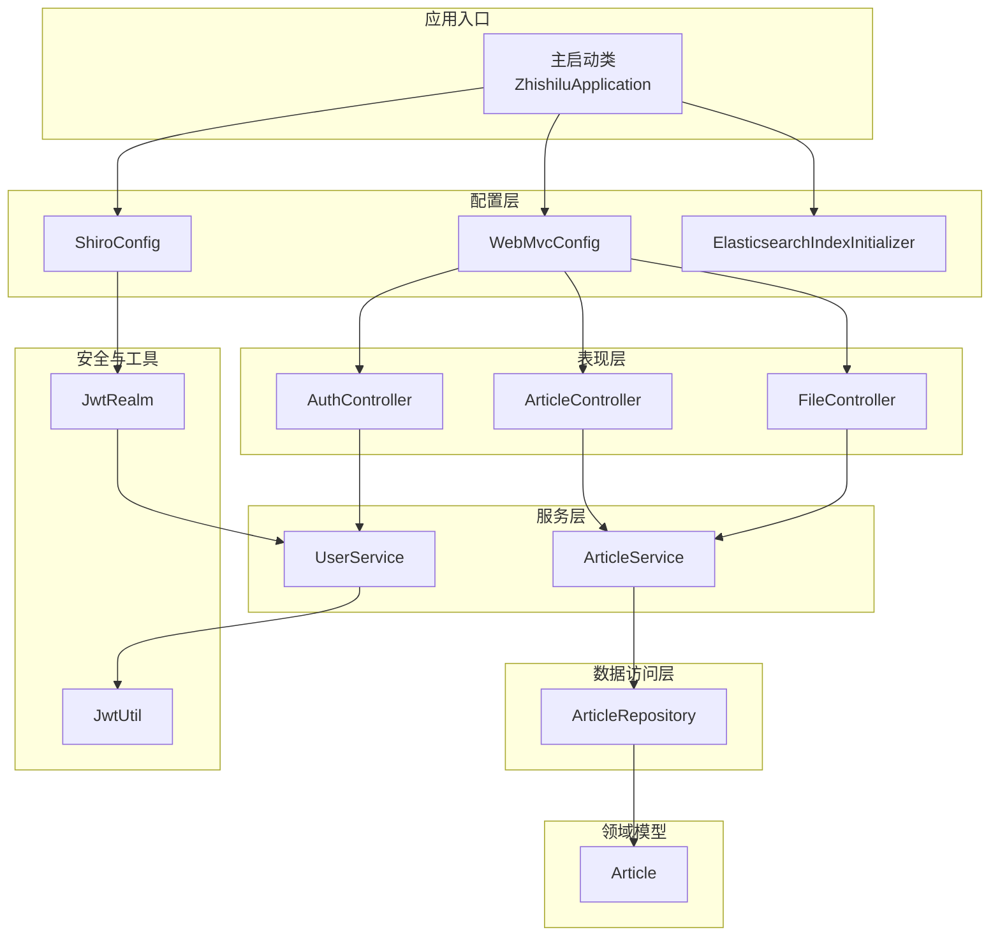
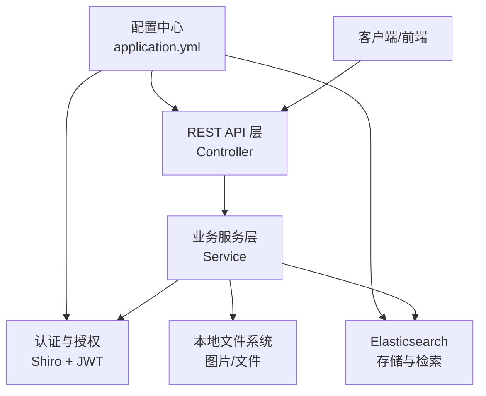
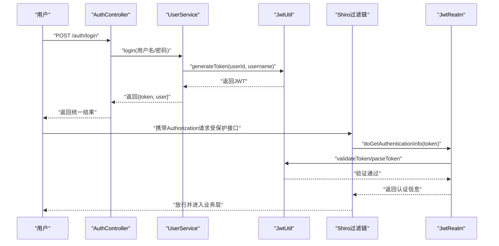
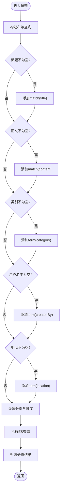
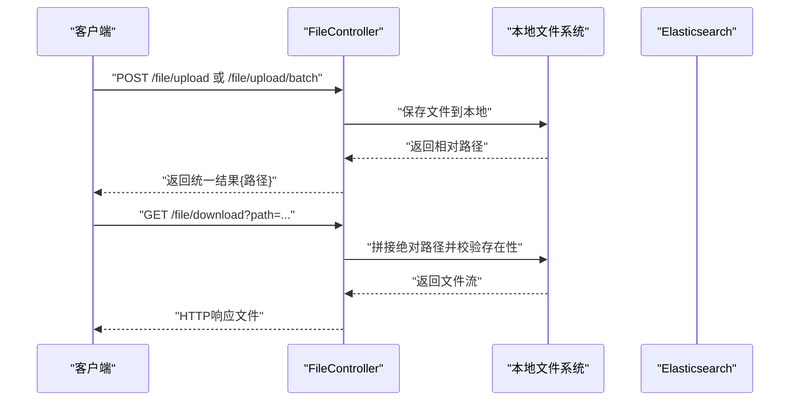
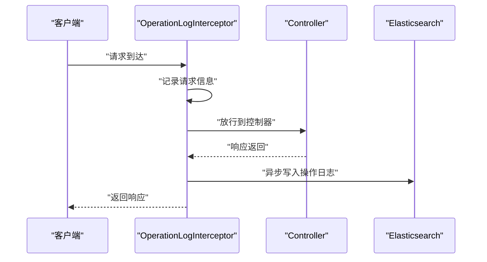
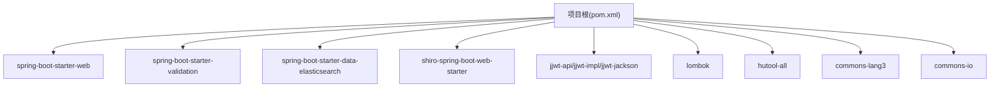

# 项目概述

<cite>
**本文引用的文件**
- [README.md](file://README.md)
- [pom.xml](file://pom.xml)
- [application.yml](file://src/main/resources/application.yml)
- [ZhishiluApplication.java](file://src/main/java/com/zhishilu/ZhishiluApplication.java)
- [ShiroConfig.java](file://src/main/java/com/zhishilu/config/ShiroConfig.java)
- [WebMvcConfig.java](file://src/main/java/com/zhishilu/config/WebMvcConfig.java)
- [ElasticsearchIndexInitializer.java](file://src/main/java/com/zhishilu/config/ElasticsearchIndexInitializer.java)
- [Result.java](file://src/main/java/com/zhishilu/common/Result.java)
- [PageResult.java](file://src/main/java/com/zhishilu/common/PageResult.java)
- [AuthController.java](file://src/main/java/com/zhishilu/controller/AuthController.java)
- [ArticleController.java](file://src/main/java/com/zhishilu/controller/ArticleController.java)
- [FileController.java](file://src/main/java/com/zhishilu/controller/FileController.java)
- [UserService.java](file://src/main/java/com/zhishilu/service/UserService.java)
- [ArticleService.java](file://src/main/java/com/zhishilu/service/ArticleService.java)
- [JwtRealm.java](file://src/main/java/com/zhishilu/shiro/JwtRealm.java)
- [JwtUtil.java](file://src/main/java/com/zhishilu/util/JwtUtil.java)
- [ArticleRepository.java](file://src/main/java/com/zhishilu/repository/ArticleRepository.java)
- [Article.java](file://src/main/java/com/zhishilu/entity/Article.java)
- [GlobalExceptionHandler.java](file://src/main/java/com/zhishilu/exception/GlobalExceptionHandler.java)
</cite>

## 目录
1. [引言](#引言)
2. [项目结构](#项目结构)
3. [核心组件](#核心组件)
4. [架构总览](#架构总览)
5. [详细组件分析](#详细组件分析)
6. [依赖分析](#依赖分析)
7. [性能考虑](#性能考虑)
8. [故障排查指南](#故障排查指南)
9. [结论](#结论)
10. [附录](#附录)

## 引言
知拾录是一个面向个人的知识收藏与管理系统，旨在帮助用户高效地记录、分类、检索和管理文章、网站、图片、视频等多样化内容。项目以“轻量、易用、可扩展”为目标，通过统一的认证体系、全文检索能力、文件上传与下载、以及自动化的操作日志，构建完整的个人知识资产管理闭环。

业务价值与应用场景：
- 个人知识资产沉淀：支持多类型内容的结构化存储与快速检索。
- 协作与分享：基于用户维度隔离内容，便于个人内部分享与回溯。
- 开发与运维友好：采用现代化技术栈与标准分层架构，便于二次开发与集成。

## 项目结构
项目采用标准的 Spring Boot 分层架构，按功能域组织代码，职责清晰、层次分明：
- common：统一响应封装与分页模型
- config：安全、Web、异步、ES索引初始化等配置
- controller：REST API 控制器
- dto：请求/响应数据传输对象
- entity：ES 文档实体
- repository：ES 仓库接口
- service：业务服务层
- shiro：基于 JWT 的认证与授权
- util：工具类（JWT、用户上下文）
- exception：全局异常处理

图表来源
- [ZhishiluApplication.java](file://src/main/java/com/zhishilu/ZhishiluApplication.java#L10-L15)
- [ShiroConfig.java](file://src/main/java/com/zhishilu/config/ShiroConfig.java#L20-L71)
- [WebMvcConfig.java](file://src/main/java/com/zhishilu/config/WebMvcConfig.java#L14-L51)
- [ElasticsearchIndexInitializer.java](file://src/main/java/com/zhishilu/config/ElasticsearchIndexInitializer.java#L16-L39)
- [AuthController.java](file://src/main/java/com/zhishilu/controller/AuthController.java#L17-L49)
- [ArticleController.java](file://src/main/java/com/zhishilu/controller/ArticleController.java#L22-L87)
- [FileController.java](file://src/main/java/com/zhishilu/controller/FileController.java#L23-L70)
- [UserService.java](file://src/main/java/com/zhishilu/service/UserService.java#L22-L127)
- [ArticleService.java](file://src/main/java/com/zhishilu/service/ArticleService.java#L34-L199)
- [ArticleRepository.java](file://src/main/java/com/zhishilu/repository/ArticleRepository.java#L12-L29)
- [Article.java](file://src/main/java/com/zhishilu/entity/Article.java#L14-L80)
- [JwtRealm.java](file://src/main/java/com/zhishilu/shiro/JwtRealm.java#L21-L70)
- [JwtUtil.java](file://src/main/java/com/zhishilu/util/JwtUtil.java#L20-L98)

章节来源
- [README.md](file://README.md#L99-L132)
- [pom.xml](file://pom.xml#L21-L110)

## 核心组件
- 统一响应与分页：Result、PageResult 提供一致的接口返回格式与分页结构，简化前端对接。
- 安全与认证：基于 Apache Shiro + JWT 的无状态认证方案，支持匿名与受保护接口的灵活路由。
- 内容管理：文章的增删改查、全文检索、类别推荐，均通过 Elasticsearch 实现高性能查询。
- 文件上传：支持单文件与批量上传，图片存储于本地，ES 存储相对路径，降低存储成本。
- 操作日志：通过拦截器自动记录接口调用信息，统一写入 Elasticsearch，便于审计与追踪。

章节来源
- [Result.java](file://src/main/java/com/zhishilu/common/Result.java#L8-L70)
- [PageResult.java](file://src/main/java/com/zhishilu/common/PageResult.java#L12-L51)
- [ShiroConfig.java](file://src/main/java/com/zhishilu/config/ShiroConfig.java#L20-L71)
- [WebMvcConfig.java](file://src/main/java/com/zhishilu/config/WebMvcConfig.java#L14-L51)
- [ArticleService.java](file://src/main/java/com/zhishilu/service/ArticleService.java#L116-L168)
- [FileController.java](file://src/main/java/com/zhishilu/controller/FileController.java#L23-L70)
- [GlobalExceptionHandler.java](file://src/main/java/com/zhishilu/exception/GlobalExceptionHandler.java#L20-L86)

## 架构总览
整体采用前后端分离的微服务风格，后端以 Spring Boot 为核心，通过 Shiro + JWT 实现无状态认证，使用 Spring Data Elasticsearch 进行内容存储与检索，结合拦截器实现统一日志采集。

图表来源
- [application.yml](file://src/main/resources/application.yml#L1-L47)
- [ShiroConfig.java](file://src/main/java/com/zhishilu/config/ShiroConfig.java#L20-L71)
- [WebMvcConfig.java](file://src/main/java/com/zhishilu/config/WebMvcConfig.java#L14-L51)
- [ArticleService.java](file://src/main/java/com/zhishilu/service/ArticleService.java#L34-L199)

## 详细组件分析

### 认证与授权（Shiro + JWT）
- 认证流程：用户登录成功后生成 JWT，后续请求携带在请求头中；JwtFilter 将请求交由 JwtRealm 进行解析与校验；JwtRealm 通过 JwtUtil 验证 Token 并加载用户信息，再由 Shiro 完成 Subject 绑定。
- 授权策略：当前实现为最小权限模型，所有业务接口默认需要认证，公开接口（如登录、下载）通过过滤链配置放行。
- 安全配置：关闭 Shiro 自带 Session，完全依赖 JWT 无状态会话。

图表来源
- [AuthController.java](file://src/main/java/com/zhishilu/controller/AuthController.java#L27-L40)
- [UserService.java](file://src/main/java/com/zhishilu/service/UserService.java#L61-L87)
- [JwtUtil.java](file://src/main/java/com/zhishilu/util/JwtUtil.java#L31-L74)
- [ShiroConfig.java](file://src/main/java/com/zhishilu/config/ShiroConfig.java#L44-L69)
- [JwtRealm.java](file://src/main/java/com/zhishilu/shiro/JwtRealm.java#L44-L69)

章节来源
- [ShiroConfig.java](file://src/main/java/com/zhishilu/config/ShiroConfig.java#L20-L71)
- [JwtRealm.java](file://src/main/java/com/zhishilu/shiro/JwtRealm.java#L18-L70)
- [JwtUtil.java](file://src/main/java/com/zhishilu/util/JwtUtil.java#L18-L98)
- [UserService.java](file://src/main/java/com/zhishilu/service/UserService.java#L22-L127)

### 内容管理与全文检索
- 文章实体：Article 使用注解映射到 ES 索引，字段包含标题、正文、类别、来源链接、图片路径、创建者、地点、时间戳等，并配置中文分词器以提升检索效果。
- 查询能力：ArticleService 基于布尔查询组合标题匹配、正文匹配、类别精确匹配、用户名与地点精确匹配，并按创建时间倒序分页返回。
- 类别推荐：通过聚合查询统计用户最常用的前 N 个类别，辅助内容分类与标签优化。

图表来源
- [ArticleService.java](file://src/main/java/com/zhishilu/service/ArticleService.java#L116-L168)
- [Article.java](file://src/main/java/com/zhishilu/entity/Article.java#L14-L80)

章节来源
- [ArticleService.java](file://src/main/java/com/zhishilu/service/ArticleService.java#L34-L199)
- [ArticleRepository.java](file://src/main/java/com/zhishilu/repository/ArticleRepository.java#L12-L29)
- [Article.java](file://src/main/java/com/zhishilu/entity/Article.java#L14-L80)

### 文件上传与下载
- 上传：支持单文件与批量上传，服务端进行类型与大小限制，返回保存后的相对路径。
- 下载：通过静态资源映射与下载接口结合，根据路径拼接绝对路径并返回文件流。
- 存储：图片等媒体文件保存在本地目录，ES 中仅存储路径，降低索引体积与查询成本。

图表来源
- [FileController.java](file://src/main/java/com/zhishilu/controller/FileController.java#L33-L69)
- [WebMvcConfig.java](file://src/main/java/com/zhishilu/config/WebMvcConfig.java#L46-L50)

章节来源
- [FileController.java](file://src/main/java/com/zhishilu/controller/FileController.java#L23-L70)
- [WebMvcConfig.java](file://src/main/java/com/zhishilu/config/WebMvcConfig.java#L14-L51)

### 操作日志与拦截器
- 拦截器：OperationLogInterceptor 对所有受管接口进行前置与后置处理，收集接口路径、时间戳、参数、用户名等信息。
- 存储：日志统一写入 Elasticsearch，便于后续审计与分析。
- 配置：排除错误页面与 Swagger 文档接口，避免噪音日志。

图表来源
- [WebMvcConfig.java](file://src/main/java/com/zhishilu/config/WebMvcConfig.java#L36-L41)
- [GlobalExceptionHandler.java](file://src/main/java/com/zhishilu/exception/GlobalExceptionHandler.java#L20-L86)

章节来源
- [WebMvcConfig.java](file://src/main/java/com/zhishilu/config/WebMvcConfig.java#L14-L51)
- [GlobalExceptionHandler.java](file://src/main/java/com/zhishilu/exception/GlobalExceptionHandler.java#L20-L86)

### 统一异常处理
- 业务异常：捕获业务异常并返回统一错误码与消息。
- 认证/授权异常：分别映射为未授权与禁止访问。
- 参数校验异常：聚合字段错误信息，返回给前端。
- 其他异常：兜底返回系统异常提示。

章节来源
- [GlobalExceptionHandler.java](file://src/main/java/com/zhishilu/exception/GlobalExceptionHandler.java#L20-L86)

## 依赖分析
- 技术栈：Java 17、Spring Boot 3.2.1、Spring MVC、Apache Shiro + JWT、Elasticsearch 8.x、Lombok、Hutool、Commons Lang/IO。
- 关键依赖：Web 启动器、验证、Elasticsearch 客户端、Shiro Web Starter、JWT、Lombok、Hutool、Apache Commons。

图表来源
- [pom.xml](file://pom.xml#L27-L110)

章节来源
- [pom.xml](file://pom.xml#L21-L110)

## 性能考虑
- 检索性能：为标题与正文配置中文分词器，提升中文检索召回率；合理使用布尔查询与精确匹配，减少不必要的高开销查询。
- 存储成本：媒体文件落地本地，ES 仅存路径，降低索引体积与查询成本。
- 并发与异步：可结合异步配置与线程池优化日志写入与文件处理。
- 缓存策略：可引入本地缓存（如 Guava/Caffeine）缓存热点用户与热门类别，进一步降低查询延迟。

## 故障排查指南
- 认证失败：检查 JWT 密钥、过期时间与请求头格式；确认 Shiro 过滤链配置是否正确放行公开接口。
- 搜索无结果：确认 ES 索引是否存在且映射正确；检查中文分词器是否生效；核对查询条件与字段类型。
- 文件上传失败：检查上传目录权限、文件类型与大小限制；确认静态资源映射路径正确。
- 日志缺失：确认拦截器注册与排除规则；检查日志级别与 ES 连接配置。

章节来源
- [ShiroConfig.java](file://src/main/java/com/zhishilu/config/ShiroConfig.java#L44-L69)
- [ElasticsearchIndexInitializer.java](file://src/main/java/com/zhishilu/config/ElasticsearchIndexInitializer.java#L19-L39)
- [application.yml](file://src/main/resources/application.yml#L33-L47)
- [WebMvcConfig.java](file://src/main/java/com/zhishilu/config/WebMvcConfig.java#L36-L41)

## 结论
知拾录以简洁的架构与明确的职责划分，提供了从认证、内容管理、全文检索到文件存储与日志审计的完整能力。依托 Elasticsearch 的高性能检索与 JWT 的无状态认证，系统在个人知识管理场景下具备良好的可用性与扩展性。建议在生产环境中进一步完善缓存策略、监控告警与备份机制，以提升稳定性与可观测性。

## 附录
- 快速开始：安装 JDK 17+、Maven 3.6+、Elasticsearch 8.x，修改配置文件中的 ES 连接信息，运行 Spring Boot 应用后即可访问 API。
- API 示例：注册、登录、文章 CRUD、文件上传/下载、常用类别查询等接口均可在 README 中找到示例与说明。

章节来源
- [README.md](file://README.md#L74-L98)
- [application.yml](file://src/main/resources/application.yml#L1-L47)